<!-- Source: 101_05_Welcome_to_vLEI_Training_-_101.md -->
# Welcome to vLEI Training - 101

This collection of Notebooks is designed to guide you through the foundational concepts of the [Key Event Receipt Infrastructure](https://trustoverip.github.io/tswg-keri-specification/) (KERI) and [Authentic Chained Data Containers](https://trustoverip.github.io/tswg-acdc-specification/) (ACDC) protocols, followed by the workings of the [verifiable Legal Entity Identifier](https://www.gleif.org/en/organizational-identity/introducing-the-verifiable-lei-vlei/introducing-the-vlei-ecosystem-governance-framework) (vLEI) ecosystem. We aim to equip you with the knowledge needed to build applications leveraging this powerful identity technology.

After completing this training, you will:
- Understand the KERI protocol
- Understand the ACDC protocol
- Understand the vLEI ecosystem
- Have the basis to develop your own vLEI POC


## Prerequisites

The training aims to be accessible, but having background knowledge will certainly smooth your learning journey.

1.  **Command-Line Interface (CLI) Familiarity:** The training will involve using the KERI Command Line Interface (KLI). Therefore, having prior experience working with a terminal or command prompt (like Bash, Zsh, PowerShell, or Windows CMD) is highly beneficial. 

2.  **Conceptual Understanding of Digital Identity:** A general awareness of digital identity concepts and some understanding of the limitations of traditional systems will provide useful context for understanding KERI's purpose.

3.  **Basic Cryptography Concepts:** Having a basic understanding of what public and private keys are and the general idea behind digital signatures and hash functions will give you a head start.

4.  **Python Programming:** The training includes several Python scripts.

5.  **TypeScript Programming:** Code snippets from the 102 module notebooks utilize TypeScript code. 

6.  **Docker Basics:** For setting up and troubleshooting more complex KERI environments or running components like witnesses or agents, a basic understanding of Docker concepts (containers, images, `docker-compose`) will be useful.

## Understanding Your Learning Environment

This training series utilizes Jupyter Notebooks to provide an interactive and hands-on learning experience. Jupyter Notebooks allow for a mix of explanatory text, and live, executable code cells, creating a dynamic way to understand complex topics like KERI, ACDCs, and the vLEI ecosystem.

### Notebook Philosophy

Each notebook in this series is designed to be largely **stand-alone for the concepts it introduces**, building upon the knowledge from previous notebooks. While conceptual links are strong, the code examples within a specific notebook are generally self-contained or rely on a clearly defined setup at the beginning of that notebook.

Crucially, **cells within a single notebook are meant to be executed in sequence from top to bottom.** Variables, states, and environments created in earlier cells are often prerequisites for later cells to function correctly. Running cells out of order, or skipping cells, will likely lead to errors or unexpected behavior.

### Navigating Large Notebooks

For longer notebooks, navigating can be made easier using the **Table of Contents (ToC)** feature. In Jupyter Lab, you can find this in the left sidebar.
* Look for an icon that resembles a list or a document outline. Clicking this will open a navigable ToC based on the Markdown headings (H1, H2, H3, etc.) in the notebook.
* This allows you to quickly jump to specific sections of the notebook, which is especially helpful when reviewing material or looking for particular topics.

### Interacting with Notebook Cells

Jupyter Notebooks are composed of different types of cells, primarily:

* **Markdown Cells:** These cells contain explanatory text, like the one you are reading now. They are formatted using Markdown syntax, which allows for rich text formatting, images, and links. You do not "run" Markdown cells in the same way as code cells, but they are rendered to display the formatted text.
* **Code Cells:** These cells contain executable code. In this training series, you will encounter:
    * Shell commands (for `kli`): Prefixed with an exclamation mark (`!`), e.g., `!kli status`.
    * Python code: For scripting, examples, and utility functions.
    * TypeScript code: In the 102 module notebooks for `signify-ts` examples.

**Running Code Cells:**
To execute a code cell:
1.  Select the cell by clicking on it.
2.  Press `Shift + Enter` to run the current cell and automatically select the next cell.
3.  Alternatively, you can click the "Run" button (a play icon ▶️) in the toolbar.

When a code cell is running, an asterisk (`[*]`) will appear in the brackets to its left. Once execution is complete, a number (e.g., `[1]`) will replace the asterisk, indicating the order of execution. Any output from the code (text, errors, etc.) will be displayed directly below the cell.

**Running All Cells:**
If you want to run all cells in a notebook from top to bottom, especially after restarting the kernel or opening the notebook fresh, you can use the "Restart Kernel and Run All Cells" option.
* In Jupyter Lab, this is found in the "Kernel" menu (`Kernel > Restart Kernel and Run All Cells...`) or as a button in the toolbar (represented by a double play icon ⏩).
* This is a convenient way to ensure the entire notebook is executed in the correct order.

<div class="alert alert-info">
<b>💡 TIP</b><hr>
If you see `In [*]:` next to a cell for a long time, it means the code is still running. Some operations, especially those involving network communication or complex cryptographic processes, might take a few moments to complete.
</div>

### Managing the Notebook Kernel

Each active notebook is connected to a "kernel," which is the computational engine that executes the code in the notebook's cells.

* **Restarting the Kernel:** If you encounter persistent errors, or if you want to reset the notebook's state and start fresh (e.g., clear all variables), you can restart the kernel.
    * In Jupyter Lab, this is done via the "Kernel" menu: `Kernel > Restart Kernel...`.
    * Restarting the kernel will require you to re-run cells from the beginning to redefine variables and recreate the necessary state (or use "Restart Kernel and Run All Cells").
* **Interrupting the Kernel:** If a cell is taking too long to execute or you suspect it's stuck in an infinite loop, you can interrupt the kernel.
    * In Jupyter Lab, use `Kernel > Interrupt Kernel`.
    * You can also use the **Stop button** (A square ⏹️ icon) in the toolbar to interrupt the currently running cell.

### Clearing Output

You can clear the output of a single cell or all cells in a notebook:
* **Current Cell:** `Edit > Clear Output` (or right-click the cell).
* **All Cells:** `Edit > Clear All Outputs`.

This can be useful for decluttering the view or before re-running a notebook from scratch.


## Software Versions

This material was created and tested to work with:

- **[weboftrust/keri:1.2.6](https://github.com/WebOfTrust/keripy/releases/tag/1.2.6)**
- **[gleif/keria:0.3.0](https://github.com/GLEIF-IT/keria/releases/tag/0.3.0)**
- **[weboftrust/signify-ts:0.3.0-rc1](https://www.npmjs.com/package/signify-ts)**
- **[weboftrust/vlei:1.0.0](https://github.com/WebOfTrust/vLEI/releases/tag/1.0.0)**

<div class="alert alert-info">
  <b>🧩 DID YOU KNOW?</b><hr>
KERI, ACDC, and the vLEI ecosystem offer a strong foundation for secure digital interactions. However, achieving truly strong security requires additional effort. Real-world safety depends on proper implementation and security practices. Even the best technology can be weakened by things like losing control of private keys, or people being tricked into giving away their access (social engineering). Achieving real security is about combining strong technology with sound operational security measures.
</div>


[<- Prev (TOC)](000_Table_of_Contents.ipynb) | [Next (Intro) ->](101_07_Introduction_to-KERI_ACDC_and_vLEI.ipynb)

<!-- Source: 101_07_Introduction_to-KERI_ACDC_and_vLEI.md -->
# Foundations: KERI, ACDC, and the vLEI Ecosystem

<div class="alert alert-prymary">
  <b>🎯 OBJECTIVE</b><hr>
Provide a high-level overview of the three foundational concepts we'll be covering during this training: 
<li>The KERI protocol for secure identifiers
<li>The ACDC protocol for verifiable credentials
<li>The GLEIF vLEI ecosystem, which applies these technologies to organizational identity.
<br><br>
Consider this a starting point; we'll dive into the details, practical examples, and specific commands in the notebooks that follow.
</div>

## The KERI Protocol

**KERI** stands for **Key Event Receipt Infrastructure**, invented by [Dr. Samuel Smith](https://keri.one/131-2/). It's a decentralized key management infrastructure (DKMI) that aims to provide a secure and decentralized identity layer for the internet, focusing on establishing trust through cryptographic proof rather than relying solely on centralized authorities. It is a "never trust, always verify" security model with no share secrets, meaning no shared passwords, keys, or other types of cryptographic secrets. This means that KERI is a signed-everything model, meaning every communication between components is signed so that trust in each transmission can be verified by verifying its signature or by verifying the anchoring of data to a key event log (KEL).

Core Ideas:

* **Self Addressing Identifiers (SAIDs):** [Self addressing identifiers](https://trustoverip.github.io/tswg-keri-specification/#term:said) are a special type of content-addressable identifier where the identifier is based on and embedded within the data it refers to, making it self referential. The embedding happens after computing the digest in a two step digest and embedding process. See the [spec reference](https://trustoverip.github.io/tswg-said-specification/draft-ssmith-said.html).
* **Autonomic Identifiers (AIDs):** KERI's foundation is built on [self-certifying identifiers](https://trustoverip.github.io/tswg-keri-specification/#self-certifying-identifier-scid) called AIDs. These identifiers are generated from and cryptographically bound to key pairs controlled by an entity, eliminating the need for a central registration authority for the identifier itself. An AID is a SAID derived from the first event (inception event) in a key event log (KEL).
* **Key Event Logs (KELs):** Each AID has an associated KEL, which is a secure, append-only log of signed "key events" (like identifier creation, key rotation, etc.). This log provides a verifiable key history, or provenance, of the control over the AID. Anyone can verify the current authoritative keys for an AID by processing its KEL.
* **End-Verifiability:** KERI emphasizes that identifier control and key events can be verified by anyone, anywhere, using only the KEL, without trusting intermediaries.
* **Witnesses:** For high availability and resilience, the person controlling of keys for an AID (controller) can designate witnesses who receive, verify, and store key events. This both allows the controller to set security thresholds for event signing and also makes the KEL accessible when the controller is offline.
* **And more:** KERI has many other advanced features, but we'll focus on the fundamentals in this introduction.

## The ACDC Protocol

**ACDC** stands for **Authentic Chained Data Container**. It is KERI's native format for Verifiable Credentials (VCs), designed to work within KERI-based ecosystems.

**Core Ideas:**

* **Verifiable Credentials:** ACDCs are digital containers for claims or attributes (like a name, role, or authorization) that are issued by one identifier (AID) to another.
* **Built on KERI:** ACDCs leverage AIDs for identifying issuers and issues. The validity and status (issued, revoked) of an ACDC are anchored to the issuer's Key Event Log (KEL) through a secondary log called a Transaction Event Log (TEL).
* **Schemas & SAIDs:** Each ACDC conforms to a specific Schema, which defines its structure and data types. Both the schema and the ACDC instance itself are identified using SAIDs (Self-Addressing Identifiers), making them tamper-evident.
* **Chaining (Edges):** ACDCs can be cryptographically linked together using "edges," forming verifiable chains or graphs of evidence (e.g., an approval credential linking back to the request credential).
* **Rules:** ACDCs can optionally include embedded machine-readable rules or legal prose (like Ricardian Contracts).
* **IPEX (Issuance and Presentation Exchange):** a [credential exchange protocol](https://trustoverip.github.io/tswg-acdc-specification/#issuance-and-presentation-exchange-ipex) defining a mechanism and workflow for how ACDCs are issued between parties and how they are presented for verification in a securely attributable way. This protocol also defines a workflow for [graduated disclosure](https://trustoverip.github.io/tswg-acdc-specification/#graduated-disclosure), a variant of selective disclosure that allows for progressive, selective unblinding of claims or attributes after an agreement has been negotiated between the discloser (holder) and the receiver (disclosee) of an ACDC.

## The GLEIF vLEI Ecosystem

The **verifiable Legal Entity Identifier (vLEI)** is a system pioneered by the Global Legal Entity Identifier Foundation (GLEIF) to create a secure, digitized version of the traditional LEI used for organizational identity. It aims to enable automated authentication and verification of organizations globally.

**Core Ideas:**

* **Digital Counterpart to LEI:** The vLEI acts as a digitally verifiable representation of an organization's LEI code, enabling automated, machine-readable verification.
* **Built on KERI/ACDC:** The vLEI infrastructure is built using the KERI protocol and represents vLEI credentials as ACDCs. This leverages KERI's security and ACDC's verifiable credential format.
* **Trust Chain / Ecosystem:** The vLEI system establishes a chain of trust:
    * **GLEIF (Root of Trust):** GLEIF operates as the root of the ecosystem; its AID and KEL serve as the ultimate anchor for verifying the authority of QVIs. The root of trust uses **identifier delegation** to establish an authorization chain from the Root of Trust to the QVI through delegation chained KELs.
    * **Qualified vLEI Issuers (QVIs):** GLEIF uses its KERI identity to issue QVI credentials to a trusted network of QVIs. This means that both identifier delegation and credential issuance are used to delegate authority from GLEIF to QVIs for the purpose of allowing QVIs to issue vLEI credentials.
    * **Organizations:** QVIs are qualified to issue vLEI credentials, which represent the organization's identity, to legal entities.
    * **Organizational Role:** An organization holding a vLEI can then issue specific **vLEI Role Credentials** to individuals representing the organization in official or functional capacities (e.g., CEO, authorized signatory, supplier). These role credentials cryptographically bind the person's identity in that role to the organization's vLEI.
        * **Official Organizational Role (OOR) Credential:** A person representing a legal entity may be issued an OOR credential that indicates their official role in an organization. The rules for OOR credential issuance must follow the ISO 5009 Official Organization Role standard for official role names.
        * **Engagement Context Role (ECR) Credential:** An ECR credential indicates a person performs a given role for a company-defined context. It is a more permissive credential type where the name of the role is legal-entity specific.
* **QVI Workflow:** The workflow centrally involves the QVIs. GLEIF qualifies these issuers. A QVI interacts with an organization to verify its identity information (linked to its traditional LEI) and then uses its verifiable delegated authority from GLEIF to issue the organization its primary vLEI credential. This QVI issuance step is crucial for establishing the organization's verifiable digital identity within the ecosystem.

The vLEI ecosystem uses KERI and ACDC to extend the existing LEI system into the digital realm, creating a globally verifiable system for organizational identity that incorporates the roles individuals hold within an organization organizations, all anchored back to GLEIF as the root of trust.

<div class="alert alert-prymary">
  <b>📝 SUMMARY</b><hr>
KERI provides the secure identifier layer, ACDC provides the credential format on top of KERI, and vLEI is a specific application of both for organizational identity.
</div>


[<- Prev (Welcome)](101_05_Welcome_to_vLEI_Training_-_101.ipynb) | [Next (KERI Command Line Interface - KLI) ->](101_10_KERI_Command_Line_Interface.ipynb)

<!-- Source: 101_10_KERI_Command_Line_Interface.md -->
# Understanding the KERI Command Line Interface (KLI)

<div class="alert alert-primary">
  <b>🎯 OBJECTIVE</b><hr>
Introduce the KERI Command Line Interface (KLI) and demonstrate some of its basic utility commands.
</div>

## Using KLI in Notebooks

Throughout these notebooks, you will interact with the KERI protocol using the **KLI**. The KLI is the standard text-based tool for managing identifiers and infrastructure directly from your computer's terminal. 

Since you are working within Jupyter notebooks, the KLI commands are written with an exclamation mark prefix (`!`). This tells the notebook environment to run the command in the underlying system shell, rather than as Python code. So, you'll frequently see commands structured like this:

`!kli <command> [options]`  

**What can you do with KLI?**

The KLI provides a wide range of functionalities. Key capabilities include:
- **Identifier management**: Management and creation of keystores and identifiers
- **Utility functions**: Functions to facilitate KERI-related operations for debugging and troubleshooting.
- **Credential management**: Creation of credentials
- **Comunication operations**: Establishing connections between AIDs
- **IPEX actions**: To issue and present credentials
- **Run witness**: Start a witness process in order to receipt key events
- **Others**: The KLI provides commands for most of the features available in the KERI and ACDC protocol implementations.


<div class="alert alert-info">
  <b>ℹ️ NOTE</b><hr>
    There are UI based methods to manage Identifiers, known as wallets, but for the purpose of this training, the KLI offers a good compromise between ease of use and visibility of technical details. 
</div>

## Overview of Basic Utilities

Let's explore some helpful commands available in the **KERI Command Line Interface (KLI)**.

This isn't a complete list of every command, but it covers some essential utilities that you'll find useful as you work with KERI.

**KERI library version**


```python
!kli version
```

    Library version: 1.2.8


**Generate a salt**: Create a new random salt (or seed) in the fully-qualified [CESR](https://trustoverip.github.io/tswg-cesr-specification/) format. A salt is a random value used as an input when generating cryptographic key pairs to help ensure their uniqueness and security.

What it means to be fully qualified is that the bytes in the cryptographic salt are ordered according to the CESR protocol. This ordering will be explained in a later training when CESR is introduced and explained. For now just think of CESR as a custom file format for KERI and ACDC data.


```python
# This will output a qualified base64 string representing the salt
!kli salt
```

    0ABdmqt5MYGW0yLvEmGDGKee


**Generate a passcode**: The passcode is used to encrypt your keystore, providing an additional layer of protection.


```python
# This will output a random string suitable for use as an encryption passcode
!kli passcode generate
```

    ZukOBMQb8ii82Ktrm4rFO


**Print a timestamp**: Timestamps are typically used in operations involving multiple signers with what are called multi-signature (or "multisig") groups.


```python
!kli time
```

    2025-06-24T18:38:44.236144+00:00


**Display help menu**


```python
!kli -h
```

    usage: kli [-h] command ...
    
    options:
      -h, --help       show this help message and exit
    
    subcommands:
    
      command
        aid            Print the AID for a given alias
        challenge
        clean          Cleans and migrates a database and keystore
        contacts
        decrypt        Decrypt arbitrary data for AIDs with Ed25519 p ...
        delegate
        did
        ends
        escrow
        event          Print an event from an AID, or specific values ...
        export         Export key events in CESR stream format
        incept         Initialize a prefix
        init           Create a database and keystore
        interact       Create and publish an interaction event
        introduce      Send an rpy /introduce message to recipient wi ...
        ipex
        kevers         Poll events at controller for prefix
        list           List existing identifiers
        local
        location
        mailbox
        migrate
        multisig
        nonce          Print a new random nonce
        notifications
        oobi
        passcode
        query          Request KEL from Witness
        rename         Change the alias for a local identifier
        rollback       Revert an unpublished interaction event at the ...
        rotate         Rotate keys
        saidify        Saidify a JSON file.
        salt           Print a new random passcode
        sign           Sign an arbitrary string
        ssh
        status         View status of a local AID
        time           Print a new time
        vc
        verify         Verify signature(s) on arbitrary data
        version        Print version of KLI
        watcher
        witness


Additional commands will be introduced as they are used in upcoming trainings.

[<- Prev (Intro)](101_07_Introduction_to-KERI_ACDC_and_vLEI.ipynb) | [Next (Controllers and Identifiers) ->](101_15_Controllers_and_Identifiers.ipynb)

<!-- Source: 101_15_Controllers_and_Identifiers.md -->
# KERI Core: Controllers, Identifiers, and Key Event Logs

<div class="alert alert-prymary">
  <b>🎯 OBJECTIVE</b><hr>
Explain the fundamental KERI concepts of Autonomic Identifiers (AIDs), the Controller entity, and the Key Event Log (KEL).
</div>

Before we dive into creating identifiers and doing operations with the KLI, let's understand two fundamental concepts: **Identifiers** and the **Controller**.

## Autonomic Identifiers (AIDs)

Identifiers are a generic term; they exist in many forms, but here we are concerned with digital identifiers. In a general sense, an identifier is a name, label, or sequence of characters used to uniquely identify something within a given context. Identifiers are useful to assign claims to something or to locate a resource. Common examples of identifiers are domain names, an email, an ID Number, and so on. 

KERI identifiers are called **Autonomic Identifiers (AIDs)**. They have properties that give them additional capabilities compared to traditional digital identifiers. Their most important attribute is to maintain a stable identifier over time while their controlling keys may be rotated to keep the identifier secure.

There are many different properties of AIDs:
- **Universally Unique:** Like standard UUIDs, AIDs are designed to be globally unique without needing a central issuing authority, thanks to their cryptographic foundation.  
- **Provide asymmetric cryptography features:** Beyond being an identifier, AIDs provide signing and verification capabilities due to being build on public and private key pairs.
- **Cryptographically Bound Control:** AIDs are bound to a set of cryptographic key pairs at time of creation, called the **inception event**, and later key pairs from a **rotation event**; this binding forms the basis of their security and allows the holder of the private key(s) to control the identifier and prove that control through digital signatures and a key event log (KEL).
- - **Control Over Time:** AIDs are designed for persistent control. The identifier's control history and current authoritative keys are maintained in a verifiable **key event log (KEL)**, allowing anyone to determine the current authoritative keys and verify the control history. This enables keys to be rotated (changed) securely over time without abandoning the identifier itself, even if old keys are compromised.
- **Self-Managed:** Unlike traditional identifiers (like usernames or domain names) that rely on central administrators or registries, an AID is managed directly by its owner(s) — known as the Controller — through cryptographic means (specifically, their private keys). This makes AIDs maximally decentralized, durectly controlled by end-users. 
- **Self-Certifying:** An AID inherently proves its own authenticity. Its validity stems directly from its cryptographic link to its controlling keys, established at its creation, not from an external authority vouching for it.
- **Authenticates & Authorizes:** The cryptographic nature of an AID allows its Controller to directly prove their control (authenticate) and grant permissions (authorize actions or access related to the AID) without needing a third-party identity system.
- **Multi-Signature Control (Multisig):** An AID does not have to be controlled by only one Controller. KERI supports configurations requiring multiple identifiers, using key pairs held by one or more Controllers, to cooperatively authorize actions. This can involve needing a specific number of signatures (e.g., 3 out of 5) or advanced weighted threshold multi-signature schemes.   
- **Secure Key Rotation (Pre-rotation):** When keys controlling an AID need to be changed (rotated), KERI uses a highly secure [pre-rotation](https://trustoverip.github.io/tswg-keri-specification/#key-rotationpre-rotation) method. In each rotation event, a secure commitment is made to the next set of rotation keys that hides the actual next public keys by using a digest of each next key. This means the private keys for the next rotation remain unexposed and secure until they are actually needed, protecting the rotation process itself from attack.   
- **Identifier Delegation:** A Controller of one AID can securely grant specific, often limited or revokable, authority as a delegator to another AID, the delegate. This is an important capability for scaling signing operations by using many delegated identifiers in parallel.

Don't worry if these features raise many questions right now. We will explain the "how" behind them gradually in the sections to come.

## The Controller Role

In KERI, the Controller is the entity that holds the private cryptographic key(s) associated with an Autonomic Identifier and is therefore responsible for managing it. This possession of the private key(s) is the source of its authority and control over the AID.  

So, a Controller is an entity managing their identifiers and the key pairs for those identifiers. Some controller scenarios include:
- Personal identity - An individual managing their own digital identity.
- Organizational identity - An organization managing its official identifier.
- Agentic identity - An autonomous piece of software or device managing its own identifier.
- Delegated agentic identity - An autonomous piece of software acting on behalf of a person or organization.   
- Multisignature identity - A group managing a shared identifier via multi-signature schemes. Participants could be people, organizations, or AI agents.

The most important aspect is an entity has direct access to the private keys the AID is derived from.

While the Controller holds authority over the AID it relies on software to operate and maintain it. In this training, you will first be using the KLI as the Controller’s tool for interacting with and managing AIDs. Later trainings will include using the Signify and KERIA tooling to interact with AIDs.

## Key Event Logs (KELs) - Never Trust, Always Verify

The Controller's authority more than a trusted assertion, it is proven using cryptography through a verification process. Remember, KERI is a "never trust, always verify" protocol. No matter what statements a Controller makes they cannot be relied upon unless they can be cryptographically verified. KERI is a "signed everything" architecture with no shared secrets. This means no bearer tokens like JWT and OAuth have. Instead KERI uses cryptographic signature to create trust.

The basis of this trust comes from Controllers signing statements with their private key pairs. This means Controllers possess the private keys associated with their AID. They use these keys to sign messages and authorize actions. 

The association between key pairs and an AID is initially formed by what is called the **inception event**, the first event in a **Key Event Log (KEL)**. Every significant action taken by a Controller regarding their AID, like creating the identifier (inception), changing its keys (rotation), or other interactions, is recorded as a **Key Event** in the KEL.

These Key Events are stored sequentially in a **Key Event Log (KEL)**. Think of the KEL as the official history book for an AID. Like a blockchain, a KEL is a hash chained data structure.

### Key Event Log diagram

```mermaid
graph RL
    %% Define event nodes
    ICP["Inception 🔑"]
    ROT1["Rotation 1 🔑"]
    ROT2["Rotation 2 🔑"]
    IXN1["Interaction 1 ⚓"]

    %% Define backward chaining
    ROT1 -->  ICP
    ROT2 --> ROT1
    IXN1 --> ROT2

    %% Optional node styling for UML appearance
    classDef eventBox fill:#f5f5f5,stroke:#000,stroke-width:1px,rx:5px,ry:5px,font-size:14px;
    class ICP,ROT1,ROT2,IXN1, eventBox;
```


Here are some details about the KEL

* It starts with the AID's "birth certificate" – the **Inception Event**.
* Every subsequent authorized change (like a key rotation) is added as a new entry, cryptographically linked to the previous one. Each new event is signed by the keys referred to in the last rotation event, or from the inception event if no rotations have occurred yet.
* Anyone can potentially view the KEL to verify the AID's history and current state, but only the Controller(s) can add new, valid events to it.
* There may be multiple copies of a KEL; they can be distributed across a network of witnesses, a concept we will dive deeper into later.

## Advanced Control Mechanisms

Control in KERI can be quite nuanced including single signature, multiple signature (multisig), and delegation in any given AID. While the Controller ultimately holds authority, they can sometimes grant specific permissions to others through delegation. Furthermore, the Controller responsibility may be shared across multiple controlling parties in a multisig AID.

* **Signing vs. Rotation Authority**: A Controller might keep the power to change the AID's keys (rotation authority) but allow another entity (a "custodian") to perform more routine actions like signing messages (signing authority).
* **Delegation**: A Controller can grant some level of authority to a completely separate Delegated Identifier. This allows for creating scalable signing infrastructure with delegation hierarchies that can model complex organizational or authority structures.

We'll explore these advanced concepts like delegation and multisig configurations in later sections.

# Types of Autonomic Identifiers

## Transferable AID

A transferable AID may rotate keys and thus may have inception, rotation, and interaction events in its key event log. Most controllers that are not witnesses will use transferable AIDs. Any AID that issues credentials will be a transferable AID.

- Example transferable AID: `EIkO4CUmYXukX4auGU9yaFoQaIicfVZkazQ0A3IO5biT`
  - Notice the 'E' at the start.

## Non-transferable AID

A non-transferable AID cannot rotate keys and only ever has one event, the inception event, in its key event log. Use cases for non-transferable AIDs include witnesses, IoT devices, ephemeral identifiers, or anywhere that signing capabilities are needed where rotation capabilities are not.

You can visually see the difference between a non-transferable AID and a transferable AID because a non-transferable AID starts with the "B" character as shown here:
- `BBilc4-L3tFUnfM_wJr4S4OJanAv_VmF_dJNN6vkf2Ha`
  - Notice the 'B' at the start.

<div class="alert alert-prymary">
  <b>📝 SUMMARY</b><hr>
<p>Fundamental KERI concepts:</p>
<ul>
    <li><strong>Autonomic Identifiers (AIDs):</strong> These are KERI's unique, self-managing digital identifiers. Unlike traditional IDs, they are cryptographically bound to key pairs from creation, are self-certifying (requiring no central authority), and support features like secure key rotation (pre-rotation), multi-signature control, and delegation.</li>
    <li><strong>Controller:</strong> The entity (person, organization, software), or entities in the case of multisig, holding the private key(s) for an AID, giving it the authority to manage the identifier and authorize actions.</li>
    <li><strong>Key Event Log (KEL):</strong> The secure, append-only, hash chained data structure serving as a verifiable key history for an AID. It records all significant actions (like creation and key rotations) signed by the Controller, allowing anyone to track the identifier's control provenance. A KEL may also store interaction events for anchoring arbitrary data to a KEL, sort of like anchoring data to a blockchain. We will explore this deeply in a future lesson.</li>
</ul>
<p>In essence, Controllers use their private keys to manage AIDs, and all authoritative actions are recorded in the KEL.</p>
</div>

[<- Prev (Controllers and Identifiers)](101_10_KERI_Command_Line_Interface.ipynb) | [Next (Working with Keystores and AIDs with the KLI) ->](101_20_Working_with_Keystores_and_AIDs_via_KLI.ipynb)

<!-- Source: 101_20_Working_with_Keystores_and_AIDs_via_KLI.md -->
# KLI Operations: Managing Keystores and Identifiers

<div class="alert alert-primary">
  <b>🎯 OBJECTIVE</b><hr>
    Demonstrate how to create a KERI keystore and then manage identifiers within it using the <code>kli init</code>, <code>kli incept</code>, and <code>kli list</code> commands.
</div>

## Initializing Keystores

Before you can create identifiers or perform many other actions with KLI, you need a keystore. The keystore is an encrypted data store that holds the keys for your identifiers. To initialize a keystore, you give it a name, protect it with a passcode, and provide a salt for generating the keys.

The command to do this is `kli init`. Here's an example:


<div class="alert alert-info">
  <b>💡 TIP</b><hr>
    <li>If you run <code>clear_keri()</code>, the keystore directories are deleted.</li>  
    <li>This function is provided as a utility to clean your data and re-run the notebooks.</li>
    <li>It will be called at the beginning of each notebook.</li>
</div>


```python
# Imports and Utility functions
from scripts.utils import clear_keri
clear_keri()
```

    Proceeding with deletion of '/usr/local/var/keri/' without confirmation.
    ✅ Successfully removed: /usr/local/var/keri/


```python
# Choose a name for your keystore
keystore_name="my-first-key-store"
# Use a strong, randomly generated passcode (using a predefined one here, but can be created with 'kli passcode generate')
keystore_passcode="xSLg286d4iWiRg2mzGYca"
# Use a random salt (using a predefined one here, but can be created with 'kli salt')
keystore_salt="0ABeuT2dErMrqFE5Dmrnc2Bq"

!kli init --name {keystore_name} \
    --passcode {keystore_passcode} \
    --salt {keystore_salt}
```

    KERI Keystore created at: /usr/local/var/keri/ks/my-first-key-store
    KERI Database created at: /usr/local/var/keri/db/my-first-key-store
    KERI Credential Store created at: /usr/local/var/keri/reg/my-first-key-store
      aeid: BD-1udeJaXFzKbSUFb6nhmndaLlMj-pdlNvNoN562h3z


The command sets up the necessary file structures for your keystore, so once executed, it's ready for you to create and manage Identifiers within it.


<div class="alert alert-info">
  <b>ℹ️ NOTE</b><hr>
<ul>
    <li>In the example, predefined <code>--passcode</code> and <code>--salt</code> are used for convenience, but randomly generated values can be obtained using the <code>kli passcode generate</code> and <code>kli salt</code>
    <li>You can initialize multiple keystores as long as they have different names 
</ul>
</div>

## Creating Identifiers (Inception)

Now that your keystore is set, you can create your first identifier (AID) within it using the `kli incept` command. You'll need to provide: 
- `--name` and `--passcode`: Think of it as the keystore access credentials `keystore_name` and `keystore_passcode`
- `--alias`: It will be difficult to recall an AID by its value. A human-readable `alias` is assigned using this parameter 
- `--icount` and `--isith`: the number of signing keys and the signing threshold, respectively. 
- Other parameters such as `--ncount`, `--nsith`, and `--toad` will be explained later. 

Executing `kli incept` will create the AID and output the prefix. This also means that the command will add the first event to the AID KEL, the inception event.

Proceed and create your first AID:
 


```python
# Choose a human-readable alias for your identifier within this keystore
aid_alias = "my-first-aid"

# Create (incept) the identifier
!kli incept --name {keystore_name} \
    --passcode {keystore_passcode} \
    --alias {aid_alias} \
    --icount 1 \
    --isith 1 \
    --ncount 0 \
    --nsith 0 \
    --toad 0
```

    Prefix  BHt9Kw8oUgfB2kiyoj65B2VE5fZLr87S5MJP3l4JeRwC
      Public key 1:  BHt9Kw8oUgfB2kiyoj65B2VE5fZLr87S5MJP3l4JeRwC
    


## Understanding Prefixes

The `kli incept` command generated an AID, which is represented by a unique string, e.g., `BHt9Kw8oUgfB2kiyoj65B2VE5fZLr87S5MJP3l4JeRwC`, known as the Prefix. While closely related, they represent different aspects of the identifier:

- AID: This is the formal concept of the self-governing identifier, representing the entity and its control.
- Prefix: This is the practical, usable string representation of the AID. It's derived directly from the AID's initial cryptographic keys and is constructed by combining:
    - A Derivation Code: Indicates the cryptographic suite (key type, signature algorithm, hashing algorithm) used.
    - The Encoded Public Key: The public portion of the initially generated key pair associated with the AID.

**Prefix Self-Certification:**  
KERI AIDs are [self-certifying](https://trustoverip.github.io/tswg-keri-specification/#self-certifying-identifier-scid) in the sense that an AID does not rely on a trusted entity and instead relies only on the keys its identifier is derived from to provide verifiability for statements made (signed) by the controller of an AID. 

This works because:
1. The identifier's prefix is derived from the set of public keys that are included in the inception event. The prefix is the self addressing identifier (SAID), a kind of digest, of the inception event. This provides a strong cryptographic binding between the AID prefix and the keys used to generate the inception event.
2. The inception event and initial keypairs, together with the key event log and any successive keypairs resulting from rotations, are sufficient to verify any signed statement made by the AID controller.

Because of this relationship between keypairs, the inception event, and the key event log, anyone who has the prefix and the KEL can cryptographically verify signatures made by a given AID with the matching private key from any given point in the history of a KEL. This verifiability establishes authenticity for all actions taken by an AID without needing to check with outside authorities or registries, meaning they are self-certifying. 

### Security precaution for live transactions

**Keep in mind, as a security precaution**, signature verification with a prefix and a KEL is most securely done with the most recent key that is currently authorized for the AID, as in the latest set of keys given the inception and all rotations. Key rotation changes the authorized key, requiring reference to the AID's KEL for up-to-date verification. Historical signatures may still be verified, yet to ensure proper security during a live transaction the latest controlling keypairs should always be used for signature verification. 

This means signatures from old keypairs, during a live transaction, should always be rejected when verifying signatures of an in-progress transaction. Such an approach is appropriate because there is no way to know if an attacker has compromised old keypairs and is using old keys to sign the new transaction events. To adopt the highest security posture then usage of the latest keypair according to the KEL should **always** be required.

<div class="alert alert-prymary">
  <b>📝 SUMMARY</b><hr>
    <li>The AID is the secure, self-managed identifier</li>
    <li>The prefix is the actual text string you use to represent that AID, whose structure makes the AID's self-certifying property work</li>
    <li>The alias (<code>my-first-aid</code> in our example) is just a <b>local</b> nickname within your keystore to easily refer to the prefix</li>
    <li>The terms AID, identifier, prefix, and alias tend to be used interchangeably</li>
</div>

<div class="alert alert-info">
  <b>ℹ️ NOTE</b><hr>
    As you may have figured out, most of the <code>kli</code> commands require a keystore. Assume from now on that <code>--name</code> and <code>--passcode</code> refer to the keystore access.  
</div>

## Displaying Identifier Status
You can check the status of the identifier you just created using `kli status` and its `alias`. This command will show details about the AID's current state, including its Alias, prefix, sequence number, public keys, and additional information. More details on what all this data means will be explained later


```python
# Check the status of the AID using its alias
!kli status --name {keystore_name} \
    --passcode {keystore_passcode} \
    --alias {aid_alias}
```

    Alias: 	my-first-aid
    Identifier: BHt9Kw8oUgfB2kiyoj65B2VE5fZLr87S5MJP3l4JeRwC
    Seq No:	0
    
    Witnesses:
    Count:		0
    Receipts:	0
    Threshold:	0
    
    Public Keys:	
      1. BHt9Kw8oUgfB2kiyoj65B2VE5fZLr87S5MJP3l4JeRwC
    


## Displaying Key Event Logs (KELs)
You can use `kli status` with the `--verbose` parameter to show the key event log.


```python
!kli status --name {keystore_name} \
    --passcode {keystore_passcode} \
    --alias {aid_alias} \
    --verbose
```

    Alias: 	my-first-aid
    Identifier: BHt9Kw8oUgfB2kiyoj65B2VE5fZLr87S5MJP3l4JeRwC
    Seq No:	0
    
    Witnesses:
    Count:		0
    Receipts:	0
    Threshold:	0
    
    Public Keys:	
      1. BHt9Kw8oUgfB2kiyoj65B2VE5fZLr87S5MJP3l4JeRwC
    
    
    Witnesses:	
    
    {
     "v": "KERI10JSON0000fd_",
     "t": "icp",
     "d": "EG23dnLAUA4ywPcu2qbokplb2cb1XlIOw24iIKYtR3v4",
     "i": "BHt9Kw8oUgfB2kiyoj65B2VE5fZLr87S5MJP3l4JeRwC",
     "s": "0",
     "kt": "1",
     "k": [
      "BHt9Kw8oUgfB2kiyoj65B2VE5fZLr87S5MJP3l4JeRwC"
     ],
     "nt": "0",
     "n": [],
     "bt": "0",
     "b": [],
     "c": [],
     "a": []
    }
    


Here are some descriptions of the KEL fields (see the [spec](https://trustoverip.github.io/tswg-keri-specification/#keri-data-structures-and-labels)):
- `v`: Version String
- `t`: Message type (`icp` means inception)
- `i`: AID Prefix that created the event ("issuer" of the event)
- `s`: sequence number of the event, always zero for the inception event since it is the first event
- `kt`: Keys Signing Threshold (the `isith` value used in `kli inception`)
- `k`: List of public keys that are Signing Keys (You get as many keys as defined by the `icount` value used in `kli inception`)
- `nt`: Next Signing Threshold (rotation signing threshold), zero in this case. This will be explored in an upcoming lesson.
- `n`: List of public key **digests** that are rotation keys authorized to perform rotations. Since there are no rotation keys specified here then this identifier may never rotate and may be considered to have rotated to "null" on its first event, meaning it can only ever be used for signing.
- `bt`: Backer (witness) Threshold - the number of backer (witness) receipts the event must have in order to be considered accepted by the controller and valid.
- `b`: Backer (witness) list - the AID prefixes of the backers (witnesses) that are authorized by the controller to generate witness receipts for this event and any after it, until changed by a rotation event.
- `c`: configuration traits - not used here
- `a`: anchors (seals) - list of field maps used to anchor data in a key event

<div class="alert alert-info">
  <b>📚 REFERENCE</b><hr>
    To see the full details of the key event fields, refer to <a href="https://trustoverip.github.io/tswg-keri-specification/#keri-data-structures-and-labels" target="_blank">KERI Data Structures and Labels</a> 
</div>

## Listing Identifiers in a Keystore

You can also list all the identifiers managed within this keystore. To illustrate this, let's create an additional Identifier


```python
!kli incept --name {keystore_name} \
    --passcode {keystore_passcode} \
    --alias "my-second-aid" \
    --icount 1 \
    --isith 1 \
    --ncount 0 \
    --nsith 0 \
    --toad 0
```

    Prefix  BBuVNJvbJD2WNduQ0JUGRVGb6uKYrF5bO5T4gdGt_ezO
      Public key 1:  BBuVNJvbJD2WNduQ0JUGRVGb6uKYrF5bO5T4gdGt_ezO
    


Now use `kli list` to list all the identifiers managed by the keystore


```python
# List all Identifiers in the keystore
!kli list --name {keystore_name} --passcode {keystore_passcode}
```

    my-second-aid (BBuVNJvbJD2WNduQ0JUGRVGb6uKYrF5bO5T4gdGt_ezO)
    my-first-aid (BHt9Kw8oUgfB2kiyoj65B2VE5fZLr87S5MJP3l4JeRwC)


<div class="alert alert-primary">
  <b>📝 SUMMARY</b><hr>
<p>The basics of managing KERI identifiers using the KLI:</p>
<ul>
    <li><strong>Keystore Creation:</strong> A keystore, essential for managing identifiers, is created using <code>kli init</code>, requiring a name, passcode, and salt</li>
    <li><strong>Identifier Inception:</strong> New identifiers (AIDs) are created within a named keystore using <code>kli incept</code>, which also starts their Key Event Log (KEL)</li>
    <li><strong>Key Event Log (KEL):</strong> The KEL tracks an AID's history with fields like version (<code>v</code>), event type (<code>t</code>), identifier prefix (<code>i</code>), signing threshold (<code>kt</code>), and keys (<code>k</code>)</li>
    <li><strong>Displaying identifiers:</strong><code>kli status</code> displays an AID information and the KEL </li>
    <li><strong>Listing Identifiers:</strong> The <code>kli list</code> command displays all identifiers managed within a specific keystore</li>
</ul>
</div>

[<- Prev (Controllers and Identifiers)](101_15_Controllers_and_Identifiers.ipynb) | [Next (Signatures) ->](101_25_Signatures.ipynb)

<!-- Source: 101_25_Signatures.md -->
# Digital Signatures in KERI

<div class="alert alert-primary">
  <b>🎯 OBJECTIVE</b><hr>
    Explain digital signatures, how to verify a digital signature using the KLI verify command, and understand how tampering affects signature validity.
</div>


## Fundamentals of Digital Signatures

Having explored KERI Identifiers (AIDs) and their management, we now focus on digital signatures. This section explains what digital signatures are, their crucial properties, and how they operate within KERI.

A digital signature is a cryptographic mechanism used to provide assurance about the authenticity and integrity of digital data. It serves a similar purpose to a handwritten signature but offers significantly stronger guarantees through cryptography.

The process generally involves three stages:

1.  **Signing:**
    * The signer (e.g., an AID Controller) takes the information they want to sign.
    * They create a condensed representation of the information, known as a digest, by using a hash function.
      * A note on terminology: While "hash" is commonly used to refer to both the function and its output, for clarity in this text, we will use "hash function" to refer to the algorithm itself and "digest" to refer to its output.
    * Using their unique private signing key, they apply a signing algorithm to the digest generated from the raw data. Signing means encrypting the digest of the raw data with the private key. The result is a digital signature of the digest.
    * Only someone possessing the private key can generate a valid signature (digest) for that key.
2.  **Attaching:**
    * The generated signature is typically attached to the original information. In the case of KERI this signature is encoded in the [Composable Event Streaming Representation](https://trustoverip.github.io/tswg-cesr-specification/) (CESR) encoding format.
3.  **Verification:**
    * Anyone receiving the information and signature can verify its validity using the signer's corresponding public key.
    * The verifier applies a verification algorithm using the original information, the signature, and the corresponding public key from the correct point in history of a KEL.
    * This algorithm is the complement of the signing process. It uses the public key to mathematically check the signature against the digest of the raw information. This means using the public key to decrypt the signature to get back to the original digest. Then the digest from the decrypted signature is compared to the digest of the raw data. If the digests match then the verification succeeds and fails otherwise.
    * **Outcome:**
        * **Valid Signature:** If the signature verification succeeds, the verifier has high confidence in the information's authenticity, integrity, and non-repudiability and can trust the data and its originator.
        * **Invalid Signature:** If the signature fails verification the information may have been tampered with, the signature might be corrupt, or the legitimate holder of the private key didn't generate it. Thus the verifier should not trust the data.

Successful verification confirms:

* **Authenticity:** The information originated from the owner of the key pair.
* **Integrity:** The information has not been altered since it was signed.
* **non-repudiability**: The signer cannot successfully deny signing the information. Because generating the signature requires the private key (which should be kept secret by the owner), a valid signature serves as strong evidence of the signer's action.

## Verification Process in KERI

In KERI, digital signatures are fundamental for establishing trust and verifying the authenticity of Key Events and other interactions associated with an AID. They cryptographically link actions and data back to the identifier's controlling keys.

While the verification algorithm is standard, the key challenge for a Verifier is obtaining the correct public key(s) that were authoritative for the AID when the information was signed.

The Verifier must perform these steps:

1.  **Identify the Authoritative Public Key(s):**
    * For an AID's inception event, the AID prefix is derived from the initial public key(s) (leveraging KERI's self-certifying nature).
    * For subsequent events (like rotations or interactions), the Verifier must consult the AID's Key Event Log to get the most up to date controlling key pair(s). The KEL provides the history of key changes, allowing the Verifier to determine which public key(s) were valid at the specific point in time the event or message was signed.

2.  **Perform Cryptographic Verification:**
    * Once the correct public key(s) are identified, the Verifier uses them, along with the received data and signature, in the standard cryptographic verification algorithm (as described earlier).

This reliance on the KEL to track key state over time is crucial for maintaining the security of interactions with KERI identifiers long after their initial creation.

<div class="alert alert-info">
  <b>ℹ️ NOTE</b><hr>
    There's a subtle difference between a <b>Verifier</b> (who checks cryptographic correctness according to KERI rules) and a <b>Validator</b> (who might perform broader checks, including business logic, and broader trust policies in addition to verification). In KERI discussions, "Verifier" typically emphasizes the cryptographic checks.
</div>

## KLI Examples: Signing and Verifying

Let's see how signing and verification work using the KLI commands.

### Initial Setup

First, create a keystore and an identifier.


```python
# Imports and Utility functions
from scripts.utils import clear_keri
clear_keri()

keystore_name="signature-keystore"
passcode="xSLg286d4iWiRg2mzGYca"
salt="0ABeuT2dErMrqFE5Dmrnc2Bq"
aid_alias = "aid-signature"

!kli init --name {keystore_name} \
    --passcode {passcode} \
    --salt {salt}

!kli incept --name {keystore_name} \
    --passcode {passcode} \
    --alias {aid_alias} \
    --icount 1 \
    --isith 1 \
    --ncount 0 \
    --nsith 0 \
    --toad 0
```

    Proceeding with deletion of '/usr/local/var/keri/' without confirmation.
    ✅ Successfully removed: /usr/local/var/keri/


    KERI Keystore created at: /usr/local/var/keri/ks/signature-keystore
    KERI Database created at: /usr/local/var/keri/db/signature-keystore
    KERI Credential Store created at: /usr/local/var/keri/reg/signature-keystore
      aeid: BD-1udeJaXFzKbSUFb6nhmndaLlMj-pdlNvNoN562h3z


    Prefix  BCtRkWLNdWNRvB8L5gYMaLkanJQWi8wGbmmAtEw9XSWw
      Public key 1:  BCtRkWLNdWNRvB8L5gYMaLkanJQWi8wGbmmAtEw9XSWw
    


### Signing Data

Now, sign a simple text message using the private key associated with the `aid-signature` identifier. To do so use the command `kli sign` presented below:


```python
!kli sign --name {keystore_name} \
    --passcode {passcode} \
    --alias {aid_alias} \
    --text "hello world"
```

    1. AABjrlljacVpT8kDsvzv3qCVR1iiwJ-XPaAiKDURCH_vdrkgJgLK4i9h2Qv-xxmT2UxCSif0C-Ovvx-xp2vVDJUB


The output is the digital signature generated for the text "hello world" using the private key of the AID. This digital signature is encoded in text format with the CESR encoding protocol, the core cryptographic primitive, text, and binary encoding protocol used in the KERI and ACDC protocols.

### Verifying a Valid Signature

You can now use the `kli verify` command to check if the signature is valid for the given message and identifier (prefix). The relevant parameters here are:
- `--prefix`: The prefix of the signer
- `--text`: original text
- `--signature`: signature to verify


```python
!kli verify --name {keystore_name} \
    --passcode {passcode} \
    --alias {aid_alias} \
    --prefix BCtRkWLNdWNRvB8L5gYMaLkanJQWi8wGbmmAtEw9XSWw \
    --text "hello world" \
    --signature AABjrlljacVpT8kDsvzv3qCVR1iiwJ-XPaAiKDURCH_vdrkgJgLK4i9h2Qv-xxmT2UxCSif0C-Ovvx-xp2vVDJUB

```

    Signature 1 is valid.


The command confirms the signature is valid. It used the public key associated with the prefix to verify the signature against the provided text.

### Impact of Tampering

What happens if the signature is altered even slightly? The next command has the last character of the signature modified from "B" to "C" which will cause verification to fail.

Try to verify again.


```python
!kli verify --name {keystore_name} \
    --passcode {passcode} \
    --alias {aid_alias} \
    --prefix BCtRkWLNdWNRvB8L5gYMaLkanJQWi8wGbmmAtEw9XSWw \
    --text "hello world" \
    --signature AABjrlljacVpT8kDsvzv3qCVR1iiwJ-XPaAiKDURCH_vdrkgJgLK4i9h2Qv-xxmT2UxCSif0C-Ovvx-xp2vVDJUC # Tampered last character
```

    ERR: Signature 1 is invalid.


As expected, the verification fails. Even a tiny change invalidates the signature, demonstrating the integrity protection it provides.

<div class="alert alert-prymary">
<b>📝 SUMMARY</b><hr>
<ul>
<li><strong>Digital Signature Process:</strong> Data is signed by first creating a condensed representation (a digest) using a hash function, and then encrypting that digest with a private key. The resulting encrypted digest is the digital signature.</li>
<li><strong>Verification:</strong> To verify, a recipient uses the signer's public key to decrypt the signature, revealing the original digest. They then independently compute the digest of the received data. If the two digests match, the signature is valid.</li>
<li><strong>Core Guarantees:</strong> A valid digital signature confirms <strong>authenticity</strong> (the message came from the key owner), <strong>integrity</strong> (the message wasn't altered), and <strong>non-repudiability</strong> (the signer cannot deny their action).</li>
<li><strong>KERI's Key Management:</strong> In KERI, the crucial step for a verifier is finding the correct public key that was authoritative at the time of signing. This is accomplished by consulting the identifier's <strong>Key Event Log (KEL)</strong>, which provides the secure, verifiable history of key changes.</li>
<li><strong>Practical Demonstration:</strong> The <code>kli sign</code> command generates a signature, while <code>kli verify</code> checks it. Even a minor alteration to the signature or the original data will cause the verification to fail, demonstrating the cryptographic security of the process.</li>
</ul>
</div>

[<- Prev (Working with Keystores and AIDs via KLI)](101_20_Working_with_Keystores_and_AIDs_via_KLI.ipynb) | [Next (Rotation) ->](101_30_Key_Rotation.ipynb)

<!-- Source: 101_30_Key_Rotation.md -->
# Key Rotation and Pre-rotation

<div class="alert alert-primary">
  <b>🎯 OBJECTIVE</b><hr>
    Understand the importance of key rotation, learn about the pre-rotation mechanism, and see how to execute and verify a rotation using KLI commands.
</div>

## Importance of Key Rotation

Key rotation in a scalable identity system while the identifier remains stable is the hard problem from cryptography and distributed systems that KERI solves. The need to rotate keys guided the entire design of KERI and deeply impacted the vLEI system architecture. This is because securing identity and data involves more than just signing data; robust long-term security for an identity and any data it signs relies on key rotation. The ability to rotate keys is a fundamental security practice that involves changing over time the cryptographic keys associated with an identifier.

Rotating keys is not just about changing them arbitrarily; it's a crucial practice for several reasons:

- **Security Hygiene and Limiting Exposure:** Keys used frequently are more exposed to potential compromise (e.g., residing in memory). Regularly rotating to new keys limits the time window an attacker has if they manage to steal a current key
- **Cryptographic Agility:** Cryptographic algorithms evolve. Vulnerabilities are found in older ones, and stronger new ones emerge (like post-quantum algorithms). Key rotation allows an identifier to smoothly transition to updated cryptography without changing the identifier itself
- **Recovery and Delegation:** You might need to recover control of an identifier if the current keys are lost or compromised, or delegate authority to another entity. Both scenarios typically involve establishing new keys, which is achieved through rotation events


## Understanding Establishment Events

Before diving into key rotation, it's helpful to explain Establishment Events. Not all events recorded in a KEL are the same. Some events specifically define or change the set of cryptographic keys that are authorized to control an identifier (AID) at a particular point in time. These crucial events are called Establishment Events. The two primary types are:   
- **Inception Event (icp):** The very first event that creates the AID and establishes its initial controlling keys
- **Rotation Event (rot):** An event that changes the controlling keys from the set established by the previous Establishment Event to a new set

These Establishment Events form the backbone of an AID's security history, allowing anyone to verify which keys had control at what time. Other event types exist (like interaction events), but they rely on the authority defined by the latest Establishment Event. Interaction events rely on the signing authority of the keys referenced in the latest establishment event. 

## The Pre-Rotation Mechanism

KERI utilizes a strategy called pre-rotation, which decouples the act of key rotation from the preparation for it. With pre-rotation, the cryptographic commitment (a digest of the public keys) for the next key set is embedded within the current key establishment event. This means the next keys can be generated and secured in advance, separate from the currently active operational keys. This pre-commitment acts as a safeguard, as the active private key doesn't grant an attacker the ability to perform the next rotation, as they won't have the corresponding pre-committed private key.

<div class="alert alert-info">
  <b>ℹ️ NOTE</b><hr>
A potential question arises: "If the next keys are kept in the same place as the active operational keys, doesn't that defeat the purpose?" Pre-rotation enables stronger security by decoupling preparation from rotation, but realizing this benefit depends on sound operational practices. Specifically, the pre-committed keys must be stored more securely than the active ones. KERI provides the mechanism; effective key management brings it to life.
</div>

## Performing Key Rotation with KLI

Next, you will complete a key rotation example. Start by setting up a keystore and an identifier.


```python
# Imports and Utility functions
from scripts.utils import clear_keri
clear_keri()

keystore_name="rotation-keystore"
keystore_passcode="xSLg286d4iWiRg2mzGYca"
salt="0ABeuT2dErMrqFE5Dmrnc2Bq"

# Alias for non-transferable AID
aid_alias_non_transferable = "aid-non-transferable"

# Initialize the keystore
!kli init --name {keystore_name} --passcode {keystore_passcode} --salt {salt}

# Incept the AID
!kli incept --name {keystore_name} \
    --passcode {keystore_passcode} \
    --alias {aid_alias_non_transferable} \
    --icount 1 \
    --isith 1 \
    --ncount 1 \
    --nsith 1 \
    --toad 0
```

    Proceeding with deletion of '/usr/local/var/keri/' without confirmation.
    ✅ Successfully removed: /usr/local/var/keri/


    KERI Keystore created at: /usr/local/var/keri/ks/rotation-keystore
    KERI Database created at: /usr/local/var/keri/db/rotation-keystore
    KERI Credential Store created at: /usr/local/var/keri/reg/rotation-keystore
      aeid: BD-1udeJaXFzKbSUFb6nhmndaLlMj-pdlNvNoN562h3z


    Prefix  BEG5uWt6xB94bIkdGUCjYcBf_ryDgPa7t1GUtVc7lerw
      Public key 1:  BEG5uWt6xB94bIkdGUCjYcBf_ryDgPa7t1GUtVc7lerw
    


Now, attempt to rotate the keys for this AID, using the command `kli rotate`.
You will see an error message


```python
!kli rotate --name {keystore_name} --alias {aid_alias_non_transferable} --passcode {keystore_passcode}
```

    ERR: Attempt to rotate nontransferable pre=BEG5uWt6xB94bIkdGUCjYcBf_ryDgPa7t1GUtVc7lerw.


The error message says we tried to rotate a nontransferable prefix. What does this mean?

### Transferable vs. Non-Transferable AIDs  

Not all KERI identifiers are designed to have their keys rotated. By default, `kli incept` creates a non-transferable identifier. Here is the difference:

**Non-Transferable AID:**
- Key rotation is not possible. Think of it as a fixed set of keys for an identifier.
- Its control is permanently bound to the initial set of keys established at inception.
- The prefix is derived from these initial keys.
- As a special case, when only a single key pair was used to create a non-transferable AID the public key is directly derivable from the AID prefix itself.
  - This is useful for use cases where you want to avoid sending KELs of non-transferable AIDs and instead infer the one-event KEL and associated public key from the AID.

**Transferable AID:**
- Key rotation is possible. 
- Its control can be transferred (rotated) to new sets of keys over time.
- It uses the pre-rotation mechanism, committing to the next set of keys in each rotation event.
- The prefix is derived from the initial keys. Although authoritative keys will change upon each rotation the prefix will remain the same. This allows the identifier to remain stable even as its underlying controlling keys change.

How does KERI know the difference?

The difference lies in the parameters set during the AID's inception event. Let's look at the inception event data for the non-transferable AID we just created:


```python
!kli status --name {keystore_name} --alias {aid_alias_non_transferable} --passcode {keystore_passcode} --verbose
```

    Alias: 	aid-non-transferable
    Identifier: BEG5uWt6xB94bIkdGUCjYcBf_ryDgPa7t1GUtVc7lerw
    Seq No:	0
    
    Witnesses:
    Count:		0
    Receipts:	0
    Threshold:	0
    
    Public Keys:	
      1. BEG5uWt6xB94bIkdGUCjYcBf_ryDgPa7t1GUtVc7lerw
    
    
    Witnesses:	
    
    {
     "v": "KERI10JSON0000fd_",
     "t": "icp",
     "d": "EC8pCWrNEdrLD64K1Z7qlYQp7mp6Dq7n30Ze6ElP49pO",
     "i": "BEG5uWt6xB94bIkdGUCjYcBf_ryDgPa7t1GUtVc7lerw",
     "s": "0",
     "kt": "1",
     "k": [
      "BEG5uWt6xB94bIkdGUCjYcBf_ryDgPa7t1GUtVc7lerw"
     ],
     "nt": "0",
     "n": [],
     "bt": "0",
     "b": [],
     "c": [],
     "a": []
    }
    


Look closely at the JSON output at the end (representing the inception event). You'll find these key fields:
- `"nt": "0"`: The threshold required to authorize the next key set is zero.
- `"n": []`: The list of digests for the next public keys is empty.

These two fields mark the AID as non-transferable. No commitment to future keys was made.

### Incepting and Rotating a Transferable Identifier

To enable key rotation, we need to explicitly create a transferable AID using the `--transferable` option during inception and using `--ncount` and `--nsith` equal to 1 (or greater). This tells KLI to:

- Generate not just the initial keys, but also the next set of keys (pre-rotated keys).
- Set the appropriate nt (Next Key Signing Threshold, defined by `nsith`) in the inception event.
- Include the digests of the next public keys in the n field of the inception event.
  
Now create a transferable AID:


```python
# Alias for our transferable AID
aid_alias_transferable = "aid-transferable"

# Create the identifier WITH the --transferable flag
!kli incept --name {keystore_name} \
    --passcode {keystore_passcode} \
    --alias {aid_alias_transferable} \
    --icount 1 \
    --isith 1 \
    --ncount 1 \
    --nsith 1 \
    --toad 0 \
    --transferable
```

    Prefix  EAv3ajpSbn807a-HSPuDZm0PFzr6jn58m306dibjrxwM
      Public key 1:  DOdymqdtGJzeoRRSL9C8Suni6ebPaSqQfuEUM_JFkPQx
    


Now, check its status and inception event:


```python
!kli status --name {keystore_name} \
    --passcode {keystore_passcode} \
    --alias {aid_alias_transferable} \
    --verbose
```

    Alias: 	aid-transferable
    Identifier: EAv3ajpSbn807a-HSPuDZm0PFzr6jn58m306dibjrxwM
    Seq No:	0
    
    Witnesses:
    Count:		0
    Receipts:	0
    Threshold:	0
    
    Public Keys:	
      1. DOdymqdtGJzeoRRSL9C8Suni6ebPaSqQfuEUM_JFkPQx
    
    
    Witnesses:	
    
    {
     "v": "KERI10JSON00012b_",
     "t": "icp",
     "d": "EAv3ajpSbn807a-HSPuDZm0PFzr6jn58m306dibjrxwM",
     "i": "EAv3ajpSbn807a-HSPuDZm0PFzr6jn58m306dibjrxwM",
     "s": "0",
     "kt": "1",
     "k": [
      "DOdymqdtGJzeoRRSL9C8Suni6ebPaSqQfuEUM_JFkPQx"
     ],
     "nt": "1",
     "n": [
      "EO95Pwm8WYG_dIS2-H6LGoXmzOEEnbRljeIjy-Hd7aVx"
     ],
     "bt": "0",
     "b": [],
     "c": [],
     "a": []
    }
    


Compare the JSON output for this transferable AID's inception event with the previous one. You'll notice key differences:
- `"nt": "1"` the next Key Signing Threshold is now 1
- `"n": ["EO95Pwm8WYG_dIS2-H6LGoXmzOEEnbRljeIjy-Hd7aVx"]` The presence of a key digest means that this AID is transferable and has pre-rotated keys ready.


### Performing the Rotation

With the commitment to the next keys in place, we can now successfully rotate the key of the transferable AID. 


```python
!kli rotate --name {keystore_name} \
    --passcode {keystore_passcode} \
    --alias {aid_alias_transferable} 
```

    Prefix  EAv3ajpSbn807a-HSPuDZm0PFzr6jn58m306dibjrxwM
    New Sequence No.  1
      Public key 1:  DOkM4enfZoc7w8oVdkXzRaVoCdz8f9aAm2u4kA5CHNcQ


### Examining the Rotation (rot) Event

The kli rotate command performed the key rotation by creating and signing a new establishment event of type `rot`. Let's examine the state of the AID after the rotation:


```python
!kli status --name {keystore_name} \
    --passcode {keystore_passcode} \
    --alias {aid_alias_transferable} \
    --verbose
```

    Alias: 	aid-transferable
    Identifier: EAv3ajpSbn807a-HSPuDZm0PFzr6jn58m306dibjrxwM
    Seq No:	1
    
    Witnesses:
    Count:		0
    Receipts:	0
    Threshold:	0
    
    Public Keys:	
      1. DOkM4enfZoc7w8oVdkXzRaVoCdz8f9aAm2u4kA5CHNcQ
    
    
    Witnesses:	
    
    {
     "v": "KERI10JSON00012b_",
     "t": "icp",
     "d": "EAv3ajpSbn807a-HSPuDZm0PFzr6jn58m306dibjrxwM",
     "i": "EAv3ajpSbn807a-HSPuDZm0PFzr6jn58m306dibjrxwM",
     "s": "0",
     "kt": "1",
     "k": [
      "DOdymqdtGJzeoRRSL9C8Suni6ebPaSqQfuEUM_JFkPQx"
     ],
     "nt": "1",
     "n": [
      "EO95Pwm8WYG_dIS2-H6LGoXmzOEEnbRljeIjy-Hd7aVx"
     ],
     "bt": "0",
     "b": [],
     "c": [],
     "a": []
    }
    
    {
     "v": "KERI10JSON000160_",
     "t": "rot",
     "d": "EMZIjwx8mBQpTbKa4q-daoxu0Rv5oX-KR0Q3JbQOJG3Z",
     "i": "EAv3ajpSbn807a-HSPuDZm0PFzr6jn58m306dibjrxwM",
     "s": "1",
     "p": "EAv3ajpSbn807a-HSPuDZm0PFzr6jn58m306dibjrxwM",
     "kt": "1",
     "k": [
      "DOkM4enfZoc7w8oVdkXzRaVoCdz8f9aAm2u4kA5CHNcQ"
     ],
     "nt": "1",
     "n": [
      "EJ9DtlVWW6TKPU0AcXBhx3YYDR5FuF9zXqJQqmqJngU8"
     ],
     "bt": "0",
     "br": [],
     "ba": [],
     "a": []
    }
    


Observe the following changes in the output:

- **Event Type (t):** The latest event shows `"t": "rot"`, indicating it's a rotation event.
- **Digest said (d):** This is the digest of the event block.
- **Sequence Number (s):** The `s` value in the latest event has incremented (from "0" to "1"). Each rotation event increases the sequence number.
- **Current Keys (k):** The public key(s) listed in the `k` field of the latest event have changed. They are revealed as public keys instead of the digest previously listed in the `n` field of the inception event. The previously committed pre-rotated keys are now the active signing keys.
- **Next Keys Signing Threshold (nt):** Is 1, as defined by the `--nsith` parameter during inception
- **New Next Keys (n):** The `n` field in the rotation event contains a new key digest. The rotation process automatically generated the next set of keys for the next potential rotation and committed them.
- **Prefix (i):** has not changed. 

**Understanding the rot Event**

- A `rot` event is an Establishment Event. Like the inception (`icp`) event, it defines the authoritative key state of an AID at a specific point in its history (sequence number).
- Its primary function is to change the key state. It transitions control from the keys established in the previous establishment event to the keys that were pre-rotated (committed to via the n field) in that previous event.
- It simultaneously establishes the commitment (n field and nt threshold) for the next rotation cycle.
- This chaining of events (icp -> rot -> rot -> ...) forms the Key Event Log, and the ability to verify this log using receipts from witnesses is a fundamental concept within KERI.

You have now successfully rotated the keys for a transferable KERI identifier!

<div class="alert alert-primary">
  <b>📝 SUMMARY</b><hr>
<p>
Key rotation is essential for security hygiene, cryptographic agility, and enabling recovery or delegation. KERI uses a "pre-rotation" strategy where the commitment (digest) for the next set of keys is included in the current key establishment event (`icp` or `rot`). This secures the rotation process even if the currently active key is compromised. 
</p>
Performing a rotation (<code>kli rotate</code>) creates a rot event, increments the sequence number, activates the previously pre-rotated keys (revealing them in the k field), and commits to a new set of keys (digest in the n field), all while keeping the AID prefix unchanged. This chained process forms part of the Key Event Log (KEL).
</div>

[<- Prev (Signatures)](101_25_Signatures.ipynb) | [Next (Modes, OOBIs, and Witnesses) ->](101_35_Modes_oobis_and_witnesses.ipynb)

<!-- Source: 101_35_Modes_oobis_and_witnesses.md -->
# KERI Infrastructure: Modes, OOBIs, and Witnesses

<div class="alert alert-primary">
  <b>🎯 OBJECTIVE</b><hr>
Explain KERI's Direct and Indirect modes and the key components enabling Indirect Mode: Out-of-Band Introductions (OOBIs) for discovery, Mailboxes for asynchronous communication, Witnesses for availability and consistency, and the Threshold of Accountable Duplicity (TOAD) for defining signing thresholds.
</div>

## Operational Modes: Direct and Indirect
KERI provides a secure way to manage identifiers and track control using verifiable logs of key events (KEL). How these logs are shared and verified between the controller and someone verifying that identifier depends on one of the two operational modes: Direct and Indirect.


### Direct Mode

Direct Mode is a controller-to-controller communication approach, similar to a direct conversation, or like making an HTTP request from a client to a server.

In this mode the source controller shares their Key Event Log directly with a destination controller through an HTTP or TCP request. Thedestination controlleracts as a validator by verifying the KEL events and their signatures to ensure integrity. 

The destination controller can choose to establish trust based solely on verifying the signatures of the source controller on its KEL. This is a lower security posture than relying on a watcher network, yet may be an appropriate choice for a use case. It is also a simple way to start using KERI and allows quick bootstrapping of nodes in a system because validators directly receive and verifies the KEL.

This mode is an option for interactions where both parties can connect directly, even if only occasionally, and need to be online to exchange new events or updates. 

<div class="alert alert-info">
    <b>🧩 DID YOU KNOW?</b><hr>
    <h4>Future Note: Watcher Networks for Direct Mode Verification Thresholds</h4>
    While watchers are not yet widely used in the KREI ecosystem landscape, using a watcher network
    to set a verification threshold is one way to increase the security of a direct mode installation. 
    A watcher or watcher network may be used by the validating controller to compare the KEL being
    received from the source controller with the view of the KEL that the watcher network has. 
    This is similar to how verifier nodes in distributed consensus systems, like a blockchain, 
    will verify block history with multiple nodes prior to accepting a new block.
</div>

#### Example of Direct Mode

The vLEI Reporting API component called [sally](https://github.com/GLEIF-IT/sally) is a direct mode validator component that receives credential presentations in the vLEI ecosystem. It receives KELs, ACDCs (credentials) directly from a presenter, verifies them, and validates them.

#### Direct Mode Wrap up

Although we haven't done any interaction so far, all the things we have done until this point fit within the direct mode approach.

### Indirect Mode

Indirect Mode is the asyncronous approach leveraging mailboxes for communication and witnesses for highly-available KELs, similar to using a public bulletin board instead of direct messaging.

It’s for scenarios where the controller may be sometimes offline or needs to serve many validators at once. Rather than relying on direct communication, it introduces infrastructure to both allow a controller to receive messages while offline, the mailbox, and to make the KEL reliably accessible from witnesses.

Verifiability extends beyond the controller’s signature to signed event receipts produced by witnesses, called witness receipts. This additional verification capability relies on a network of Witnesses, chosen by the controller, that verify, return signed receits of, and store key events. When combined with the two factor authentication (2FA) capability then witnesses increase the security of an AID.

This mode is ideal for public identifiers used from mobile devices and web browsers, one-to-many interactions, or any situation where the controller can’t be constantly online. 

#### Indirect Mode Wrap Up

Most elements of the KERI ecosystem use indirect mode. Unless you know you need direct mode then you should be using indirect mode as your default.

## OOBIs: Discovery Mechanism

When an AID controller is operating in either mode, you need a way to tell others where they can find information about it, like its Key Event Log (KEL) or the schema of an ACDC. This is where Out-of-Band Introductions (OOBIs) come in. They function as an address of the way to communicate with a controller or to retrieve a resource.

**What is an OOBI?**

An OOBI is a **discovery mechanism** used in KERI used to discover controllers or resources. Its primary uses are to link a specific KERI AID to a network location (a URL or URI) where information about that identifier can potentially be found and also to declare the location a resource is hosted such as a JSON Schema document for an ACDC or a CESR stream for a well-known credential.

### Example OOBI

The simplest form of an OOBI pairs a SAID, either an AID or the SAID of a document, with a URL. For example:

`("http://8.8.5.6:8080/oobi", "EaU6JR2nmwyZ-i0d8JZAoTNZH3ULvYAfSVPzhzS6b5CM", "controller")`

This OOBI suggests that controller information related to the AID `EaU6JR2nmwyZ-i0d8JZAoTNZH3ULvYAfSVPzhzS6b5CM` might be available at the service endpoint `http://8.8.5.6:8080/oobi`.

The URL representation may be one of any of the following:

Blind OOBI (no AID at the end) interpreted as a controller OOBI: 
- `http://8.8.5.6:8080/oobi`

Controller OOBI with no role:
- `http://8.8.5.6:8080/oobi/EaU6JR2nmwyZ-i0d8JZAoTNZH3ULvYAfSVPzhzS6b5CM`

Controller OOBI with the specific role at the end:
- (`http://8.8.5.6:8080/oobi/EaU6JR2nmwyZ-i0d8JZAoTNZH3ULvYAfSVPzhzS6b5CM/controller`

### Kinds of OOBIs

There are four similar kinds of OOBIs, controller OOBIs, witness OOBIs, agent OOBIs, and data OOBIs. For controller OOBIs there are three variants, the blind OOBI, the no-role OOBI, and the full OOBI.

#### Controller OOBI

A controller OOBI is a service endpoint that a controller uses to advertise where its KEL may be retrieved from and where it may receive data. This is typically used by a witness or a direct mode agent. When witnesses are declared in an inception event they will typically have had their controller OOBI resolved

Examples:
- Blind OOBI: `http://8.8.5.6:8080/oobi`
- AID and no role: `http://8.8.5.6:8080/oobi/EaU6JR2nmwyZ-i0d8JZAoTNZH3ULvYAfSVPzhzS6b5CM`
- AID and role: `http://10.0.0.1:9823/oobi/ECLwKe5b33BaV20x7HZWYi_KUXgY91S41fRL2uCaf4WQ/controller`

#### Witness OOBI

A witness OOBI is a service endpoint authorized and used by a controller to designate a witness as a mailbox for a given controller. It means that the witness runs a mailbox that receives messages on behalf of a controller so that the controller may poll for and receive messages when it comes back online.

They look like this: 
- `http://10.0.0.1:5645/oobi/EA69Z5sR2kr-05QmZ7v3VuMq8MdhVupve3caHXbhom0D/witness/BM35JN8XeJSEfpxopjn5jr7tAHCE5749f0OobhMLCorE`

This OOBI means that the controller with AID `EA69Z5sR2kr-05QmZ7v3VuMq8MdhVupve3caHXbhom0D` is using the witness with AID `BM35JN8XeJSEfpxopjn5jr7tAHCE5749f0OobhMLCorE` as its mailbox.

#### Agent OOBIs

An Agent OOBI, used in the KERIA multitenant agent server, is similar to a witness OOBI in that it is a service endpoint authorized and used by a controller to designate an agent as a mailbox for a controller. Where an Agent OOBI differs from a witness OOBI is that an agent OOBI also indicates which specific agent was authorized to act as an agent for a given Signify Controller.

It looks like this:
- `http://keria2:3902/oobi/ECls3BaUOAtZNO3Ejb4zCv-fybh_hk3iNQMZJVdItr5W/agent/EAueTIcNo9FYqBvtT2QSH-zKFW3TMJGrxEETuIyW2CLF`

#### Data OOBIs

A data OOBI shows a location to resolve what is typically either a JSON file or a CESR stream, though may be any resource identified by a self-addressing identifier (SAID). Data OOBIs are usually used for ACDC credential schemas, which are JSON files, or CESR streams for well-known ACDC credentials in order to speed up credential verification by hosting common parts of a verification chain in well-known locations.

For example, the QVI JSON schema identified with the SAID `EBfdlu8R27Fbx-ehrqwImnK-8Cm79sqbAQ4MmvEAYqao` is made available at the following URL on the `10.0.0.1` host.

- `http://10.0.0.1:7723/oobi/EBfdlu8R27Fbx-ehrqwImnK-8Cm79sqbAQ4MmvEAYqao`

### Role of the Service at an OOBI Endpoint

What an OOBI means is that a controller has designated and cryptographically authorized a particular service endpoint (web URL) as the location that controller will receive requests at whether for OOBI resolution, key state requests, or for direct CESR stream transmissions.

**Key Points**

- OOBIs Facilitate Discovery (Out-of-Band): They may use existing internet infrastructure (web servers, QR codes, etc.) to share potential (url, aid) links. This happens outside of KERI's core trust guarantees.
- OOBIs Themselves Are NOT Trusted: Receiving an OOBI does not guarantee the URL-AID link is valid or that the data at the URL is legitimate.
- Trust Requires KERI Verification (In-Band): After using an OOBI URL to retrieve data (like a Key Event Log), you must use KERI's standard cryptographic verification methods (checking signatures, verifying event history) to establish trust.

In short, OOBIs help you find potential information; verification ensures you can trust it.

## Mailboxes

Mailboxes are a simple store and forward mechanism where one controller receives messages on behalf of another. As the primary enabler of indirect mode, mailboxes are the always online presence that continues to receive messages for a controller while that controller is offline or unavailable.

<div class="alert alert-info">
    <b>ℹ️ NOTE</b><hr>
    Currently mailboxes are <b>combined with witnesses</b> in the KERIpy implementation of witnesses. 
    When a transferable identifier <em>declares a witness</em> in the inception event then that <b><u>witness 
    will also be used as a mailbox</u></b> for the controller to receive messages from other controllers.
    <br/>
    Similarly, KERIA agents also serve as mailboxes for Signify Controllers.
</div>

To receive messages from mailboxes a controller polls all of its witness mailboxes. Polling all of the mailboxes is currently necessary because when messages are sent from a source controller to a destination controller then one witness is selected at random from the list of witnesses that the source controller has for the destination controller. The message is not sent to every mailbox for the destination. Thus, every mailbox must be polled in order to discover new messages.

<div class="alert alert-info">
    <b>ℹ️ NOTE</b><hr>
    When separate mailboxes are completed and supported in the KERIpy reference implementation then a controller may declare and use only one mailbox. 
    This will simplify mailbox management for controllers that use more than one witness as there will be then only one mailbox and it will be deployed separately from the witness.
</div>


## Role of Witnesses

Witnesses are entities designated by the controller within their AID key event log, acting much like trusted notaries. Their role is to receive key events directly from the controller, verify the controller’s signature, and check that each event aligns with the event history they have recorded for that AID.

Once a witness confirms an event is valid and encounters it for the first time, it generates a **receipt** by signing the event (Witnesses also have their own AID). The witness then stores both the original event and its receipt, alongside receipts from other witnesses, in a local copy of the KEL known as the **Key Event Receipt Log (KERL)**.

Witnesses play a critical role in ensuring the system’s reliability and integrity. They provide availability by forming a distributed service that validators can query to access the KEL of a given prefix, even if the controller itself is unavailable. Additionally, they help ensure consistency: since honest witnesses only sign the first valid version of an event at a given sequence number they observe, it becomes significantly harder for a controller to present conflicting log versions (**duplicity**).

It's important to note that witnesses are software components. For the system to improve security and availability, the witness should be deployed independently, ideally operated by different entities, on different infrastructure, from both the controller and each other.

## TOAD: Ensuring Accountability

A key challenge in maintaining the integrity of an identifier's history is preventing the controller from presenting conflicting versions of events. This situation, known as **duplicity**, occurs if a controller improperly signs two or more different key events purporting to be at the same sequence number in their Key Event Log (KEL) – for example, signing two different rotation events both claiming to be sequence number 3. Such conflicting statements undermine trust in the identifier's true state and control. 

Reasons for duplicity may be due to malicious intent or operational errors. KERI addresses this partly through the behavior of witnesses, which only sign the first valid event they see per sequence number, and partially through watchers which keep a duplicate copy of a KEL for a given controller so they may detect when a malicious controller tries to change history by changing a key event at a given sequence number that has already occurred.

KERI assigns *accountability* for an event, and thus any potential duplicity (change of history), based on a signing threshold of witnesses for a given event, called the **Threshold of Accountable Duplicity (TOAD)**. This signing threshold quantifies the level of agreement needed to assign accountability to a controller for a given event, and thus any potential duplicity. The TOAD is specified in the inception event for an AID and can be changed in each rotation event.

We have seen this parameter before when calling `kli incept`. The `toad` value represents the minimum number of unique witness receipts the controller considers sufficient to accept accountability for a key event.

By gathering receipts that meet or exceed this controller-defined threshold (`toad`), validators gain assurance that the event history they are watching is the one the controller stands behind and is broadly agreed upon by the witness network. Crucially, while the `toad` defines the controller's threshold for their accountability, a validator may independently establish its own, often higher, threshold watchers that must agree on the history of a KEL to accept an event as fully validated according to its trust policy. These two threshold mechanisms, the TOAD for a signing threshold and a watcher threshold, allowing for distinct controller accountability and validator trust levels, are key to KERI's robust security model and fault tolerance, helping distinguish between minor issues and significant, actionable inconsistencies.

<div class="alert alert-prymary">
<b>📝 SUMMARY</b><hr>
KERI provides two operational modes for sharing Key Event Logs (KELs).
<ul>
<li><strong>Direct Mode:</strong> A synchronous, controller-to-controller connection for sharing KELs, suitable for when both parties are online.</li>
<li><strong>Indirect Mode:</strong> An asynchronous approach using key infrastructure, designed for high availability and for controllers that may be offline.</li>
</ul>
</li>

Key Infrastructure for Indirect Mode:
<ul>
<li><strong>Witnesses:</strong> Designated AIDs that enhance reliability and help prevent duplicity by receiving, receipting, and storing a controller's key events in a Key Event Receipt Log (KERL).</li>
<li><strong>Mailboxes:</strong> A store-and-forward service, often coupled with a witness, that accepts messages on behalf of an offline controller.</li>
<li><strong>OOBIs (Out-of-Band Introductions):</strong> An untrusted discovery mechanism that links an AID to a network URL. OOBIs help locate KELs and other resources, which must then be cryptographically verified.</li>
</ul>
</li>

Accountability and Trust:
<ul>
<li><strong>TOAD (Threshold of Accountable Duplicity):</strong> A controller-set threshold defining the minimum number of witness receipts required to hold the controller accountable for an event.</li>
<li><strong>Validator Trust Policy:</strong> A validator can enforce its own, separate trust policy, potentially requiring a higher threshold of verification (e.g., from watchers) than the controller's TOAD.</li>
</ul>
</li>
</ul>
</div>

[<- Prev (Key Rotation)](101_30_Key_Rotation.ipynb) | [Next (Witnesses) ->](101_40_Witnesses.ipynb)

<!-- Source: 101_40_Witnesses.md -->
# KLI Operations: Configuring AID Witnesses

<div class="alert alert-primary">
  <b>🎯 OBJECTIVE</b><hr>
Demonstrate how to configure witnesses and the Threshold of Accountable Duplicity (TOAD) in a configuration file and use it to create an AID 
</div>

## Verifying the Demo Witness Network

Now that you understand Witnesses and oobis, let's see some practical usage.

Within the deployment of these notebooks, we have included a demo witness network. It is composed of three witnesses: 
- `http://witness-demo:5642/oobi/BBilc4-L3tFUnfM_wJr4S4OJanAv_VmF_dJNN6vkf2Ha`
- `http://witness-demo:5643/oobi/BLskRTInXnMxWaGqcpSyMgo0nYbalW99cGZESrz3zapM`
- `http://witness-demo:5644/oobi/BIKKuvBwpmDVA4Ds-EpL5bt9OqPzWPja2LigFYZN2YfX`

(These witnesses are predefined (**[wan.json](config/witness-demo-docker/wan.json), [wes.json](config/witness-demo-docker/wes.json), [wil.json](config/witness-demo-docker/wil.json)**); that's why we know the prefixes beforehand) 

To verify the witness network is working, let's query the KEL of one of them using its oobi and `curl`. 

<div class="alert alert-info">
    <b>ℹ️ NOTE</b><hr>
    You can include request parameters on the end of an OOBI and when it is resolved they will be added as contact information for the controller whose OOBI is being resolved, like the <code>?name=Wan&tag=witness</code> section in the OOBI.
    <br/>
    <code>"http://witness-demo:5642/oobi/BBilc4-L3tFUnfM_wJr4S4OJanAv_VmF_dJNN6vkf2Ha/controller?name=Wan&tag=witness"</code>
    <br/>
    This will add the following properties to the contact data for the OOBI:
    <ul>
    <li>name as "Wan"</li>
    <li>tag as "witness"</li>
    </ul>
    This is a useful technique for enriching a contact in your contact database with human-friendly attributes.
</div>


```python
!curl -s http://witness-demo:5642/oobi/BBilc4-L3tFUnfM_wJr4S4OJanAv_VmF_dJNN6vkf2Ha
```

    {"v":"KERI10JSON0000fd_","t":"icp","d":"EIkO4CUmYXukX4auGU9yaFoQaIicfVZkazQ0A3IO5biT","i":"BBilc4-L3tFUnfM_wJr4S4OJanAv_VmF_dJNN6vkf2Ha","s":"0","kt":"1","k":["BBilc4-L3tFUnfM_wJr4S4OJanAv_VmF_dJNN6vkf2Ha"],"nt":"0","n":[],"bt":"0","b":[],"c":[],"a":[]}-VAn-AABAAAMlb78gUo1_gPDwxbXyERk2sW8B0mtiNuACutAygnY78PHYUjbPj1fSY1jyid8fl4-TXgLXPnDmeoUs1UO-H0A-EAB0AAAAAAAAAAAAAAAAAAAAAAA1AAG2025-06-24T18c27c46d027047p00c00{"v":"KERI10JSON0000fd_","t":"rpy","d":"EHkrUtl8Nt7nZjJ8mApuG80us9E_td3oa4V-oW2clB2K","dt":"2024-12-31T14:06:30.123456+00:00","r":"/loc/scheme","a":{"eid":"BBilc4-L3tFUnfM_wJr4S4OJanAv_VmF_dJNN6vkf2Ha","scheme":"http","url":"http://witness-demo:5642/"}}-VAi-CABBBilc4-L3tFUnfM_wJr4S4OJanAv_VmF_dJNN6vkf2Ha0BDkVOk5p25Rhim3LkhYXmDNNiUcZkgCp_BWvEB45q6f_pKJBYYlpUABpci5DMzBNXlz4RvK8ImKVc_cH-0D8Q8D{"v":"KERI10JSON0000fb_","t":"rpy","d":"EDSjg0HilC3L4I_eI53C3_6lW9I6pPbR4SWGgoOmDhMb","dt":"2024-12-31T14:06:30.123456+00:00","r":"/loc/scheme","a":{"eid":"BBilc4-L3tFUnfM_wJr4S4OJanAv_VmF_dJNN6vkf2Ha","scheme":"tcp","url":"tcp://witness-demo:5632/"}}-VAi-CABBBilc4-L3tFUnfM_wJr4S4OJanAv_VmF_dJNN6vkf2Ha0BDLG3-HNp-kclaNamqIRI46rNcAhpIEQBDON2HO28r9zO-6S53_w7AA_Q4Weg4eAjvTGiXiNExhO86elrIEd74F{"v":"KERI10JSON000116_","t":"rpy","d":"EBBDzl8D5gFgFkVXaB-XNQlCem-4y5JywPcueWAMRfCp","dt":"2024-12-31T14:06:30.123456+00:00","r":"/end/role/add","a":{"cid":"BBilc4-L3tFUnfM_wJr4S4OJanAv_VmF_dJNN6vkf2Ha","role":"controller","eid":"BBilc4-L3tFUnfM_wJr4S4OJanAv_VmF_dJNN6vkf2Ha"}}-VAi-CABBBilc4-L3tFUnfM_wJr4S4OJanAv_VmF_dJNN6vkf2Ha0BDt7alD1tA9x_9vVMKxY1Ne113qJ-xDdCyThnAh6_c13Rsrb9WW5HlKyQxyW5DVXWJjQ65yzME5kCLBiJWYBKEL

The command should have returned a KEL; you should be able to recognize part of it. It starts with `{"v": "KERI10JSON0000fd_", "t": "icp"...`. If so, the witness network is up and running. 

You will see that the response contains JSON and a cryptic text format that looks like `-VAn-AABAAAMl`. This is a CESR string, something we will get into in a later training.

## Keystore Initialization with Witness Configuration

Let's continue with the example. As usual, we need to create a keystore, but this time we are going to do something different. We are going to use a configuration file to provide the OOBIs of the witnesses to the keystore.

The content of the configuration file can be seen here: **[Keystore configuration file](config/keri/cf/keystore_init_config.json)**


```python
# Imports and Utility functions
from scripts.utils import clear_keri
clear_keri()

keystore_name="tests-keystore"

keystore_passcode="xSLg286d4iWiRg2mzGYca"

salt="0ABeuT2dErMrqFE5Dmrnc2Bq"

!kli init --name {keystore_name} --passcode {keystore_passcode} --salt {salt} \
    --config-dir ./config \
    --config-file keystore_init_config.json

```

    Proceeding with deletion of '/usr/local/var/keri/' without confirmation.
    ✅ Successfully removed: /usr/local/var/keri/


    KERI Keystore created at: /usr/local/var/keri/ks/tests-keystore
    KERI Database created at: /usr/local/var/keri/db/tests-keystore
    KERI Credential Store created at: /usr/local/var/keri/reg/tests-keystore
      aeid: BD-1udeJaXFzKbSUFb6nhmndaLlMj-pdlNvNoN562h3z
    
    Loading 3 OOBIs...


    http://witness-demo:5642/oobi/BBilc4-L3tFUnfM_wJr4S4OJanAv_VmF_dJNN6vkf2Ha/controller?name=Wan&tag=witness succeeded
    http://witness-demo:5643/oobi/BLskRTInXnMxWaGqcpSyMgo0nYbalW99cGZESrz3zapM/controller?name=Wes&tag=witness succeeded
    http://witness-demo:5644/oobi/BIKKuvBwpmDVA4Ds-EpL5bt9OqPzWPja2LigFYZN2YfX/controller?name=Wil&tag=witness succeeded


## Listing keystore contacts
As you can see, the initialization has loaded the oobis. You can also check the loaded witness information by calling the `kli contact list` command  


```python
!kli contacts list --name {keystore_name} --passcode {keystore_passcode}
```

    {
      "id": "BBilc4-L3tFUnfM_wJr4S4OJanAv_VmF_dJNN6vkf2Ha",
      "alias": "Wan",
      "oobi": "http://witness-demo:5642/oobi/BBilc4-L3tFUnfM_wJr4S4OJanAv_VmF_dJNN6vkf2Ha/controller?name=Wan&tag=witness",
      "challenges": [],
      "wellKnowns": []
    }
    {
      "id": "BIKKuvBwpmDVA4Ds-EpL5bt9OqPzWPja2LigFYZN2YfX",
      "alias": "Wil",
      "oobi": "http://witness-demo:5644/oobi/BIKKuvBwpmDVA4Ds-EpL5bt9OqPzWPja2LigFYZN2YfX/controller?name=Wil&tag=witness",
      "challenges": [],
      "wellKnowns": []
    }
    {
      "id": "BLskRTInXnMxWaGqcpSyMgo0nYbalW99cGZESrz3zapM",
      "alias": "Wes",
      "oobi": "http://witness-demo:5643/oobi/BLskRTInXnMxWaGqcpSyMgo0nYbalW99cGZESrz3zapM/controller?name=Wes&tag=witness",
      "challenges": [],
      "wellKnowns": []
    }


## Incepting an AID with Witness Configuration

Next, you can incept a new AID. Use a configuration file again.

The content of the configuration file (**[aid configuration file](config/aid_inception_config.json)**) can be seen here: 

```json
{
    "transferable": true,
    "wits": ["BBilc4-L3tFUnfM_wJr4S4OJanAv_VmF_dJNN6vkf2Ha","BLskRTInXnMxWaGqcpSyMgo0nYbalW99cGZESrz3zapM"],
    "toad": 1,
    "icount": 1,
    "ncount": 1,
    "isith": "1",
    "nsith": "1"
}
```

Notable highlights in this configuration are the inclusion of the witnesses' prefixes and the `toad` set to 1

Here is the `incept` command:


```python
aid_alias_transferable = "aid-transferable"

!kli incept --name {keystore_name} --alias {aid_alias_transferable} --passcode {keystore_passcode} \
    --file ./config/aid_inception_config.json
```

    Waiting for witness receipts...


    Prefix  EJq-DYl9EQVlY1lShETUWLQuDEcVdRkWXfkkGBNDugjZ
      Public key 1:  DOdymqdtGJzeoRRSL9C8Suni6ebPaSqQfuEUM_JFkPQx
    


Check the status of the AID using `kli status`


```python
!kli status --name {keystore_name} --alias {aid_alias_transferable} --passcode {keystore_passcode} --verbose
```

    Alias: 	aid-transferable
    Identifier: EJq-DYl9EQVlY1lShETUWLQuDEcVdRkWXfkkGBNDugjZ
    Seq No:	0
    
    Witnesses:
    Count:		2
    Receipts:	2
    Threshold:	1
    
    Public Keys:	
      1. DOdymqdtGJzeoRRSL9C8Suni6ebPaSqQfuEUM_JFkPQx
    
    
    Witnesses:	
      1. BBilc4-L3tFUnfM_wJr4S4OJanAv_VmF_dJNN6vkf2Ha
      2. BLskRTInXnMxWaGqcpSyMgo0nYbalW99cGZESrz3zapM
    
    {
     "v": "KERI10JSON000188_",
     "t": "icp",
     "d": "EJq-DYl9EQVlY1lShETUWLQuDEcVdRkWXfkkGBNDugjZ",
     "i": "EJq-DYl9EQVlY1lShETUWLQuDEcVdRkWXfkkGBNDugjZ",
     "s": "0",
     "kt": "1",
     "k": [
      "DOdymqdtGJzeoRRSL9C8Suni6ebPaSqQfuEUM_JFkPQx"
     ],
     "nt": "1",
     "n": [
      "EO95Pwm8WYG_dIS2-H6LGoXmzOEEnbRljeIjy-Hd7aVx"
     ],
     "bt": "1",
     "b": [
      "BBilc4-L3tFUnfM_wJr4S4OJanAv_VmF_dJNN6vkf2Ha",
      "BLskRTInXnMxWaGqcpSyMgo0nYbalW99cGZESrz3zapM"
     ],
     "c": [],
     "a": []
    }
    


In this status, you will find a few new things:
- The witnesses section has a count of 2 and mentions two receipts and a threshold of 1
- The KEL has the `b` field populated with the witnesses' prefixes
- The `bt` threshold is set to 1 (toad)

Guidance for setting the proper threshold, "toad," for the number of witnesses may be found in the KERI Algorithm for Witness Agreement ([KAWA](https://trustoverip.github.io/tswg-keri-specification/#keris-algorithm-for-witness-agreement-kawa)). Generally this means having roughly between 2/3 and 3/4 of witness nodes available, though the equation and table shown below give a precise definition of how to calculate TOAD.

In the below chart N = the number of witnessess and M = the number that TOAD should be set to in order to have a strong guarantee of witness agreement even in the face of faulty witnesses.


<div class="alert alert-primary">
<b>📝 SUMMARY</b><hr>
We used the demo witness network to provide receipts for the inception event of an identifier.
<br/>
Witnesses are specified during AID inception using a configuration file by listing their AID prefixes in the <code>wits</code> property of the inception configuration and by setting the Threshold of Accountable Duplicity <code>toad</code> property to a non-zero number. The <code>kli incept</code> command utilizes this file to create the AID, embedding the witness information into the inception event. Checking the AID status with <code>kli status ... --verbose</code> reveals the witness prefixes in the <code>b</code> field, the TOAD in the <code>bt</code> field, and any received witness receipts.
<br/>
The table listed above may be used as guidance for setting the TOAD to ensure a strong guarantee of witness agreement. 
</div>

<!-- Source: 101_45_Connecting_controllers.md -->
# KLI Operations: Connecting Controllers

<div class="alert alert-primary">
  <b>🎯 OBJECTIVE</b><hr>
Explain how to establish a secure, mutually authenticated connection between two KERI controllers using Out-of-Band Introductions (OOBIs) and challenge/response protocol to enhance trust.
</div>

## Initial Controller Setup

So far, we have only done basic operations with AIDs in an isolated way. That has limited use in practical applications; after all, establishing identity verification only becomes meaningful when interacting with others. In KERI, this interaction starts with controllers needing to discover and securely connect with each other.

In our context, this means we need to establish connections between controllers. We've already seen a similar process when pairing transferable AIDs with witnesses. Now, let's explore how two controllers (a and b) can connect using Out-of-Band Introductions (OOBIs) and enhance trust with **challenge/response**.

### Keystore Initialization
For the example, you need to use two different keystores called `keystore-a` and `keystore-b`, both initialized using the `keystore_init_config.json` configuration. This means they will both load the same initial set of three witness contacts, providing witness endpoints where each controller's KEL (and thus key state) can be published and retrieved when identifiers are created using inception later.


```python
# Imports and Utility functions
from scripts.utils import clear_keri
clear_keri()

keystore_a_name="keystore_a"
keystore_a_passcode="xSLg286d4iWiRg2mzGYca"
salt_a="0ABeuT2dErMrqFE5Dmrnc2Bq"

!kli init --name {keystore_a_name} --passcode {keystore_a_passcode} --salt {salt_a} \
    --config-dir ./config \
    --config-file keystore_init_config.json

```

    Proceeding with deletion of '/usr/local/var/keri/' without confirmation.
    ✅ Successfully removed: /usr/local/var/keri/


    KERI Keystore created at: /usr/local/var/keri/ks/keystore_a
    KERI Database created at: /usr/local/var/keri/db/keystore_a
    KERI Credential Store created at: /usr/local/var/keri/reg/keystore_a
      aeid: BD-1udeJaXFzKbSUFb6nhmndaLlMj-pdlNvNoN562h3z
    
    Loading 3 OOBIs...


    http://witness-demo:5642/oobi/BBilc4-L3tFUnfM_wJr4S4OJanAv_VmF_dJNN6vkf2Ha/controller?name=Wan&tag=witness succeeded
    http://witness-demo:5643/oobi/BLskRTInXnMxWaGqcpSyMgo0nYbalW99cGZESrz3zapM/controller?name=Wes&tag=witness succeeded
    http://witness-demo:5644/oobi/BIKKuvBwpmDVA4Ds-EpL5bt9OqPzWPja2LigFYZN2YfX/controller?name=Wil&tag=witness succeeded


```python
keystore_b_name="keystore_b"

keystore_b_passcode="LLF1NYii5L7jTMvw4gDar"

salt_b="0ADzG7sbUyw-MYIoUyQe5wxB"

!kli init --name {keystore_b_name} --passcode {keystore_b_passcode} --salt {salt_b} \
    --config-dir ./config \
    --config-file keystore_init_config.json
```

    KERI Keystore created at: /usr/local/var/keri/ks/keystore_b
    KERI Database created at: /usr/local/var/keri/db/keystore_b
    KERI Credential Store created at: /usr/local/var/keri/reg/keystore_b
      aeid: BPJYwdaLcdcbB6pTpRal-IhbV_Vb8bD6vq_qiMFojHNG
    
    Loading 3 OOBIs...


    http://witness-demo:5642/oobi/BBilc4-L3tFUnfM_wJr4S4OJanAv_VmF_dJNN6vkf2Ha/controller?name=Wan&tag=witness succeeded
    http://witness-demo:5643/oobi/BLskRTInXnMxWaGqcpSyMgo0nYbalW99cGZESrz3zapM/controller?name=Wes&tag=witness succeeded
    http://witness-demo:5644/oobi/BIKKuvBwpmDVA4Ds-EpL5bt9OqPzWPja2LigFYZN2YfX/controller?name=Wil&tag=witness succeeded


### Identifier Inception
Now, you need AIDs to represent the controllers. Create one transferable AID in each keystore, aliased `aid_a` and `aid_b` respectively. Use the aid_inception_config.json file, which specifies the initial set of witnesses for both AIDs. (While they share witnesses here, controllers could use different witness sets).


```python
aid_a = "aid_a"

!kli incept --name {keystore_a_name} \
    --passcode {keystore_a_passcode} \
    --alias {aid_a} \
    --file ./config/aid_inception_config.json

```

    Waiting for witness receipts...


    Prefix  EML-Hx1ivj6CSkPTM80xCqFmabG9l9ZrVxPe9omW2cWl
      Public key 1:  DDiMxDbmRMjC0mDSkzlwEbYveGozxRXXIsFUo3ixQaU4
    


```python
aid_b = "aid_b"

!kli incept --name {keystore_b_name} \
    --passcode {keystore_b_passcode} \
    --alias {aid_b} \
    --file ./config/aid_inception_config.json
```

    Waiting for witness receipts...


    Prefix  EAJR7SlFds3hQpH8kj8HySFRdhW6DcC7m9KdELNJIUma
      Public key 1:  DHEa1ktRvZUjdRitkgJ5u3tNjitiw9Ba0cgz-fMhTS4c
    


## OOBI Exchange for Discovery

With your AIDs established, you need a way for them to find each other. Remember, each witness, in the current implementation, uses each of its witnesses both as a KEL publication mechanis and as a mailbox to receive messages on behalf of the controller. To tell other controllers where to find this witness mailbox the local controller must provide a way to connect to the witness and the mailbox. This is where Out-of-Band Introductions (OOBIs) come in. You have used OOBIs before; to recapitulate, an OOBI is a specialized URL associated with an AID and how to reach one of its endpoints (like a witness or mailbox). 


### Generating OOBI URLs

Use the `kli oobi generate` command to create OOBIs for your AIDs. Specify which AID (`--alias`) within which keystore (`--name`) should generate the OOBI, and importantly, the role associated with the endpoint included in the OOBI URL. Here, `--role witness` means the OOBI URL will point to one of the AID's designated witnesses, providing an indirect way to fetch the AID's KEL. This role also, as of the current implementation, also includes the witness acting as a mailbox. There is a separate `--role mailbox` that may be used yet is not covered in this particular training. Use `--role witness` for now.

You will see a separate OOBI generated for each witness.


```python
!kli oobi generate --name {keystore_a_name} \
    --passcode {keystore_a_passcode} \
    --alias {aid_a} \
    --role witness
```

    http://witness-demo:5642/oobi/EML-Hx1ivj6CSkPTM80xCqFmabG9l9ZrVxPe9omW2cWl/witness
    http://witness-demo:5643/oobi/EML-Hx1ivj6CSkPTM80xCqFmabG9l9ZrVxPe9omW2cWl/witness


```python
!kli oobi generate --name {keystore_b_name} \
    --passcode {keystore_b_passcode} \
    --alias {aid_b} \
    --role witness
```

    http://witness-demo:5642/oobi/EAJR7SlFds3hQpH8kj8HySFRdhW6DcC7m9KdELNJIUma/witness
    http://witness-demo:5643/oobi/EAJR7SlFds3hQpH8kj8HySFRdhW6DcC7m9KdELNJIUma/witness


Note that the command returns multiple OOBIs, one for each witness endpoint configured for the AID. Any of these can be used to initiate contact. For simplicity, we'll capture the first OOBI URL generated for each AID into the variables `oobi_a` and `oobi_b`.


```python
# Imports and Utility functions
from scripts.utils import exec

command_a = f"kli oobi generate --name {keystore_a_name} --alias {aid_a} --passcode {keystore_a_passcode} --role witness"
oobi_a = exec(command_a)
print(f"OOBI A: {oobi_a}")

command_b = f"kli oobi generate --name {keystore_b_name} --alias {aid_b} --passcode {keystore_b_passcode} --role witness"
oobi_b = exec(command_b)
print(f"OOBI B: {oobi_b}")
```

    OOBI A: http://witness-demo:5642/oobi/EML-Hx1ivj6CSkPTM80xCqFmabG9l9ZrVxPe9omW2cWl/witness


    OOBI B: http://witness-demo:5642/oobi/EAJR7SlFds3hQpH8kj8HySFRdhW6DcC7m9KdELNJIUma/witness


### Resolving OOBI URLs 

Now that `aid_a` and `aid_b` each have an OOBI, they need to resolve them. The `kli oobi resolve` command handles this.

What happens when an OOBI is resolved? That depends on the type of OOBI. An OOBI resolution for HTTP OOBIs performs an HTTP GET request on the URL. Resolving controller or witness OOBIs returns the key event log for the AID specified in the OOBI URL. 

For example, when `keystore_a` resolves `oobi_b`, its uses the URL to contact the specified witness. The witness provides the KEL for `aid_b`. `keystore_a` then verifies the entire KEL cryptographically, ensuring its integrity and confirming the public keys associated with `aid_b`. A human-readable alias `--oobi-alias` is assigned for easy reference later. The same process happens when `keystore_b` resolves `oobi_a`.


```python
!kli oobi resolve --name {keystore_a_name} \
    --passcode {keystore_a_passcode} \
    --oobi-alias {aid_b} \
    --oobi {oobi_b}
```

    http://witness-demo:5642/oobi/EAJR7SlFds3hQpH8kj8HySFRdhW6DcC7m9KdELNJIUma/witness resolved


```python
!kli oobi resolve --name {keystore_b_name} \
    --passcode {keystore_b_passcode} \
    --oobi-alias {aid_a} \
    --oobi {oobi_a}
```

    http://witness-demo:5642/oobi/EML-Hx1ivj6CSkPTM80xCqFmabG9l9ZrVxPe9omW2cWl/witness resolved


### Listing contacts 

After successful resolution, the other AID appears in the keystore's contact list. You can verify this using `kli contacts list`. You'll see the newly resolved AID alongside the witnesses loaded during the keystore initialization. This confirms that the keystore now knows the other AID's identifier prefix and has verified its KEL.


```python
!kli contacts list --name {keystore_a_name} \
    --passcode {keystore_a_passcode}
```

    {
      "id": "BBilc4-L3tFUnfM_wJr4S4OJanAv_VmF_dJNN6vkf2Ha",
      "alias": "Wan",
      "oobi": "http://witness-demo:5642/oobi/BBilc4-L3tFUnfM_wJr4S4OJanAv_VmF_dJNN6vkf2Ha/controller?name=Wan&tag=witness",
      "challenges": [],
      "wellKnowns": []
    }
    {
      "id": "BIKKuvBwpmDVA4Ds-EpL5bt9OqPzWPja2LigFYZN2YfX",
      "alias": "Wil",
      "oobi": "http://witness-demo:5644/oobi/BIKKuvBwpmDVA4Ds-EpL5bt9OqPzWPja2LigFYZN2YfX/controller?name=Wil&tag=witness",
      "challenges": [],
      "wellKnowns": []
    }
    {
      "id": "BLskRTInXnMxWaGqcpSyMgo0nYbalW99cGZESrz3zapM",
      "alias": "Wes",
      "oobi": "http://witness-demo:5643/oobi/BLskRTInXnMxWaGqcpSyMgo0nYbalW99cGZESrz3zapM/controller?name=Wes&tag=witness",
      "challenges": [],
      "wellKnowns": []
    }
    {
      "id": "EAJR7SlFds3hQpH8kj8HySFRdhW6DcC7m9KdELNJIUma",
      "alias": "aid_b",
      "oobi": "http://witness-demo:5642/oobi/EAJR7SlFds3hQpH8kj8HySFRdhW6DcC7m9KdELNJIUma/witness",
      "challenges": [],
      "wellKnowns": []
    }


## Authenticating Control with Challenge-Response

Resolving an OOBI and verifying the KEL is a crucial first step. It confirms that the AID exists and that its key state history is cryptographically sound. However, it doesn't definitively prove that the entity you just connected with over the network is the legitimate controller you intend to interact with. You've verified the identifier, but not necessarily the authenticity of the current operator at the other end of the connection. Network connections can be vulnerable to Man-in-the-Middle (MITM) attacks or other deceptions.

This is where the challenge-response mechanism becomes essential. It provides a way to verify that the controller on the other side genuinely possesses the private keys corresponding to the public keys in the KEL you just verified. This adds a critical layer of authentication on top of the OOBI discovery process.

This is how it works:

One party (the challenger, say `aid_b`) generates a random challenge phrase.
The challenger sends this phrase to the other party (`aid_a`) through an Out-of-Band (OOB) channel. This means using a communication method different from the KERI network connection (e.g., a video call chat, phone call, secure email) to prevent an attacker on the  KERI network channel from intercepting or modifying the challenge. Using the same channel for both the challenge words and the response defeats the purpose of protecting against MITM attacks because MITM attacks occur "in-band" on a given channel so you must use a separate, "out-of-band" communication channel, such as a video chat, to exchange the challenge phrase.

The challenged party (`aid_a`) receives the phrase and uses their current private key to sign it.
`aid_a` then sends the original phrase and the resulting signature back to `aid_b` over the KERI connection, typically using general internet infrastructure.
Next, `aid_b` verifies two things: 
- that the returned phrase matches the one originally sent, and 
- that the signature correctly verifies against the current signing public key associated with `aid_a` in its verified KEL.

If the verification succeeds, `aid_b` now has strong assurance that they are communicating with the entity that truly controls `aid_a`'s private keys. This process is typically done mutually, with `aid_a` also challenging `aid_b` to gain strong confidence in the controller of `aid_b`'s keys.

You can generate the challenge phrases using `kli challenge generate`. The code below will store them in variables for later use in the commands.


```python
print("Example challenge phrase:")
!kli challenge generate --out string

print("\nChallenge phrases A and B:\n")
phrase_a = exec("kli challenge generate --out string")
print(f"Challenge Phrase A: {phrase_a}")

phrase_b = exec("kli challenge generate --out string")
print(f"Challenge Phrase B: {phrase_b}")
```

    Example challenge phrase:


    noodle sample dice hood wolf family minor solve absorb utility stable caught


    
    Challenge phrases A and B:
    


    Challenge Phrase A: annual scare talk express sponsor chef spice sun harbor next comfort educate


    Challenge Phrase B: life skull nasty blossom coach news lend dose museum aunt fatal result


Now, simulate the OOB exchange: `aid_b` sends `phrase_b` to `aid_a`, and `aid_a` sends `phrase_a` to `aid_b`. Each party then uses `kli challenge respond` to sign the phrase they received and `kli challenge verify` to check the response from the other party.


```python
print(phrase_a)

!kli challenge respond --name {keystore_b_name} \
    --passcode {keystore_b_passcode} \
    --alias {aid_b} \
    --words "{phrase_a}" \
    --recipient {aid_a}
```

    annual scare talk express sponsor chef spice sun harbor next comfort educate


```python
!kli challenge verify --name {keystore_a_name}  \
    --passcode {keystore_a_passcode} \
    --alias {aid_a} \
    --words "{phrase_a}" \
    --signer {aid_b}
```

    Checking mailboxes for any challenge responses.

    .
    
    Signer aid_b successfully responded to challenge words: '['annual', 'scare', 'talk', 'express', 'sponsor', 'chef', 'spice', 'sun', 'harbor', 'next', 'comfort', 'educate']'
    


```python
print(phrase_b)

!kli challenge respond --name {keystore_a_name} \
    --passcode {keystore_a_passcode} \
    --alias {aid_a} \
    --words "{phrase_b}" \
    --recipient {aid_b}
```

    life skull nasty blossom coach news lend dose museum aunt fatal result


```python
!kli challenge verify --name {keystore_b_name} \
    --passcode {keystore_b_passcode} \
    --alias {aid_b} \
    --words "{phrase_b}" \
    --signer {aid_a}
```

    Checking mailboxes for any challenge responses.

    .
    
    Signer aid_a successfully responded to challenge words: '['life', 'skull', 'nasty', 'blossom', 'coach', 'news', 'lend', 'dose', 'museum', 'aunt', 'fatal', 'result']'
    


Successful verification on both sides mutually establishes cryptographically strong authenticated control of the identifiers on both sides of the interaction. This significantly increases the trust level between the two controllers far beyond the verifiability granted by sharing key histories (KELs) during the initial connection through mutual OOBI resolution. After the challenge response and verification process each party knows they are interacting with the legitimate key holders for each respective AID.

<div class="alert alert-primary">
  <b>📝 SUMMARY</b><hr>
After initial discovery (often via OOBIs), KERI controllers can enhance trust by verifying active control of private keys using a challenge-response protocol. This involves each controller generating a unique challenge phrase (kli challenge generate). One controller (aid_a) then responds to the other's challenge (phrase_b) by signing it (kli challenge respond), and the second controller (aid_b) verifies this response (kli challenge verify). This process is repeated reciprocally. Successful verification by both parties confirms they are interacting with the legitimate key holders for each AID.
</div>

<!-- Source: 101_47_Delegated_AIDs.md -->
# KLI Operations: Creating and Managing Delegated AIDs 

<div class="alert alert-primary">
<b>🎯 OBJECTIVE</b><hr>
Understand the concept of delegated AIDs, where one Autonomic Identifier (AID), the delegator, grants specific authority to another AID, the delegate. This is an illustration of [cooperative delegation](https://trustoverip.github.io/tswg-keri-specification/#cooperative-delegation), meaning both parties work together to form a strongly cryptographically bound delegation relationship between the delegator and the delegate.
    
This notebook demonstrates how to create and manage delegated AIDs using the KERI Command Line Interface (KLI), covering:
<ul>
<li>The two-step cooperative process of delegated inception.</li>
<li>Performing delegated key rotation.</li>
<li>Examining the Key Event Logs (KELs) of both the delegator and the delegate to understand how the delegation is anchored and verified.</li>

## Introduction to Delegated AIDs

In KERI, delegation is a powerful mechanism that allows one AID (the delegator) to authorize another AID (the delegate) to perform certain actions such as signing. This is achieved through a cooperative cryptographic process where both parties participate in establishing the relationship. 

The primary purpose of delegation in KERI is to allow **scaling of signing authority** by setting up **delegation hierarchies**.

The delegation process is as follows:

#### Delegation Process Diagram


#### Process Steps

The process steps illustrated in the Delegation Process Diagram above are:
1. Create the Delegator AID. You did this earlier in the training.
2. Create the Proxy AID.
3. Create the Delegate AID and specify the Proxy AID as the communication proxy using the `--proxy` flag to `kli incept`. This process waits for completion until the Delegator AID approves the delegation. It can time out and would need to be restarted.
4. The Proxy AID signs the delegation request from the Delegate AID.
5. The Proxy AID sends the delegation request to the Delegator AID.
6. The Delegator AID receives the signed delegation request, along with the Proxy AID's KEL, verifies the signature on the delegation request, and then chooses to approve or deny the delegation.
    - In the case of an approval the Delegator AID creates an anchor (seal) and adds that anchor to it's KEL using an interaction event which signifies the Delegator's approval of the delegation. The delegator then sends its KEL containing this anchor, and witness receipts for the interaction event, to the Delegate.
7. The Delegate AID completes delegation by receiving from the Delegator AID a current copy of the delegator's KEL which now includes the anchoring delegation approval seal from the delegator combined with any witness receipts for the delegator's interaction event including this seal.

#### Result of Delegation

Once the delegation process shown above is complete you will end up with a simple delegation chain that looks like the following

```mermaid
graph BT
    %% Define event nodes
    DELEGATOR["Delegator 🔑"]
    DELEGATE["Delegate 🔑"]

    %% Define backward chaining
    DELEGATE -- delegated from -->  DELEGATOR

    %% UML appearance
    classDef eventBox fill:#f5f5f5,stroke:#000,stroke-width:1px,rx:5px,ry:5px,font-size:14px;
    class DELEGATOR,DELEGATE, eventBox;
```



#### Aspects of KERI Delegation

The strong cryptographic binding between delegator and delegate allow the delegator to fractionalize, or split up, their signing authority into multiple smaller units that allow for the straightforward scaling of signing authority. Placing an object called an "anchor" in the delegator's key event log is used to signify delegation approval. This delegation anchor is also known as a "seal." 

Major aspects of KERI delegation include:

- Cooperative Establishment: The creation (inception) and subsequent management (e.g., rotation) of a delegated AID requires coordinated, cooperative actions from both the delegate (initiating the request) and the delegator (confirming and anchoring the event). 
- Cryptographic Binding: The delegated AID's prefix is a self-addressing identifier (SAID) derived from its own delegated inception event.  This inception event, in turn, includes the delegator's AID, creating a strong cryptographic link between the delegator and the delegate.
- Anchoring: The delegator anchors the delegation to it's KEL by including a "delegated event seal" in one of its own key events.  This seal contains the delegate's AID, the sequence number of the delegated event, and a digest of that delegated event.
    - An anchor of this form is used for both delegated inception when an identifier is set up and also for delegated rotations when keys of the delegate are changed. The delegator must approve of a delegated rotation in order for a delegated identifier to rotate keys. The anchor in the KEL of the delegator functions as that approval.
- Delegated Authority: The delegator typically retains ultimate establishment control authority, while the delegate might be authorized for specific non-establishment events such as signing (interaction events) or further, limited delegations. 
- Hierarchical Structures: Delegation can be applied recursively, enabling the creation of complex hierarchical key management structures.

#### Hierarchical Delegation Diagram


This notebook will walk through the KLI commands to perform delegated inception and delegated rotation, illustrating how these concepts are put into practice.


## Initial Setup

### Step 1: Create Keystores and Delegator AID

First, we'll set up the necessary keystores and a primary AID for the delegator. We will also initialize a keystore for the delegate. For brevity and simplicity in this notebook, passcodes for keystores are omitted using the `--nopasscode` flag. In a production deployment you would generally want to use the `--passcode <your_passcode>` argument to secure a keystore.

The `keystore_init_config.json` file is used to pre-configure the keystores with witness information.


```python
# Imports and Utility functions
from scripts.utils import exec, exec_bg, clear_keri
from scripts.utils import pr_continue, pr_title, pr_message
clear_keri()

pr_title("Initializing keystores")

# Delegate Keystore
delegate_keystore="delegate_keystore"
delegate_salt= exec("kli salt")

!kli init --name {delegate_keystore} \
    --nopasscode \
    --salt {delegate_salt} \
    --config-dir ./config \
    --config-file keystore_init_config.json

# Delegator Keystore
delegator_keystore="delegator_keystore"
delegator_salt=exec("kli salt")

!kli init --name {delegator_keystore} \
    --nopasscode \
    --salt {delegator_salt} \
    --config-dir ./config \
    --config-file keystore_init_config.json

pr_title("Incepting delegator AID")

# Delegator AID
delegator_alias = "delegator_alias"

!kli incept --name {delegator_keystore} \
    --alias {delegator_alias} \
    --icount 1 \
    --isith 1 \
    --ncount 1 \
    --nsith 1 \
    --wits BBilc4-L3tFUnfM_wJr4S4OJanAv_VmF_dJNN6vkf2Ha \
    --wits BLskRTInXnMxWaGqcpSyMgo0nYbalW99cGZESrz3zapM \
    --wits BIKKuvBwpmDVA4Ds-EpL5bt9OqPzWPja2LigFYZN2YfX \
    --toad 2 \
    --transferable

pr_title("Generating OOBIs")

# OOBI Exchange
# Delegator generates an OOBI for its AID
delegator_oobi = exec(f"kli oobi generate --name {delegator_keystore} --alias {delegator_alias} --role witness")
print("Delegator OOBI: " + delegator_oobi)

pr_title("Resolving OOBIs")
# Delegate's keystore resolves the Delegator's OOBI
!kli oobi resolve --name {delegate_keystore} \
    --oobi-alias {delegator_alias} \
    --oobi {delegator_oobi}

pr_continue()
```

    Proceeding with deletion of '/usr/local/var/keri/' without confirmation.
    ✅ Successfully removed: /usr/local/var/keri/
    
      Initializing keystores  
    


    KERI Keystore created at: /usr/local/var/keri/ks/delegate_keystore
    KERI Database created at: /usr/local/var/keri/db/delegate_keystore
    KERI Credential Store created at: /usr/local/var/keri/reg/delegate_keystore
    
    Loading 3 OOBIs...


    http://witness-demo:5642/oobi/BBilc4-L3tFUnfM_wJr4S4OJanAv_VmF_dJNN6vkf2Ha/controller?name=Wan&tag=witness succeeded
    http://witness-demo:5643/oobi/BLskRTInXnMxWaGqcpSyMgo0nYbalW99cGZESrz3zapM/controller?name=Wes&tag=witness succeeded
    http://witness-demo:5644/oobi/BIKKuvBwpmDVA4Ds-EpL5bt9OqPzWPja2LigFYZN2YfX/controller?name=Wil&tag=witness succeeded


    KERI Keystore created at: /usr/local/var/keri/ks/delegator_keystore
    KERI Database created at: /usr/local/var/keri/db/delegator_keystore
    KERI Credential Store created at: /usr/local/var/keri/reg/delegator_keystore
    
    Loading 3 OOBIs...


    http://witness-demo:5642/oobi/BBilc4-L3tFUnfM_wJr4S4OJanAv_VmF_dJNN6vkf2Ha/controller?name=Wan&tag=witness succeeded
    http://witness-demo:5643/oobi/BLskRTInXnMxWaGqcpSyMgo0nYbalW99cGZESrz3zapM/controller?name=Wes&tag=witness succeeded
    http://witness-demo:5644/oobi/BIKKuvBwpmDVA4Ds-EpL5bt9OqPzWPja2LigFYZN2YfX/controller?name=Wil&tag=witness succeeded


    
      Incepting delegator AID  
    


    Waiting for witness receipts...


    Prefix  ECawnieFvsT6r8UKQo1dSX3moF8EEQWBBBt7et4Aqe9z
      Public key 1:  DFHkIxK5YojN8OPWWE40lQuNKitMg_nllHvSDG3LS9PJ
    


    
      Generating OOBIs  
    


    Delegator OOBI: http://witness-demo:5642/oobi/ECawnieFvsT6r8UKQo1dSX3moF8EEQWBBBt7et4Aqe9z/witness
    
      Resolving OOBIs  
    


    http://witness-demo:5642/oobi/ECawnieFvsT6r8UKQo1dSX3moF8EEQWBBBt7et4Aqe9z/witness resolved


    
      You can continue ✅  
    
    


## Creating Delegated Identifiers

Delegation is a multi-step process involving both the entity wishing to become a delegate and the entity granting the delegation (the delegator).

The above delegation process diagram is repeated for convenience.


### Step 2: Delegate Incepts Proxy

The delegate needs an AID that can initiate the delegation request. This "proxy" AID is a regular AID within the delegate's keystore. It will be used to facilitate communication between the in-process delegate and the delegator until the delegator confirms the delegation and the process is complete.


```python
# Delegate proxy
pr_title("Incepting delegate proxy AID")

# This AID is in the delegate's keystore and is used to initiate the delegation request.
delegate_proxy_alias = "delegate_proxy_alias"
!kli incept --name delegate_keystore \
    --alias delegate_proxy_alias \
    --icount 1 \
    --isith 1 \
    --ncount 1 \
    --nsith 1 \
    --wits BBilc4-L3tFUnfM_wJr4S4OJanAv_VmF_dJNN6vkf2Ha \
    --wits BLskRTInXnMxWaGqcpSyMgo0nYbalW99cGZESrz3zapM \
    --wits BIKKuvBwpmDVA4Ds-EpL5bt9OqPzWPja2LigFYZN2YfX \
    --toad 2 \
    --transferable

pr_continue()
```

    
      Incepting delegate proxy AID  
    


    Waiting for witness receipts...


    Prefix  ECR8KL6btVdIQRAst3YhCon_gTJRdRZQOUTXznjKlQgv
      Public key 1:  DA_0Ea1PKy-MRRUNqEJcdtJTlvvbUH4FDea2rXKOt1WC
    


    
      You can continue ✅  
    
    


### Steps 3, 4, and 5: Delegate requests delegated AID Inception, Proxy signs and forwards  request

During the setup process the delegate uses a proxy AID to send a signed delegation request to the delegator. 

#### A Proxy is Required for Secure Communications

The use of the proxy as shown in steps 3-5 below is necessary because the delegated identifier is not fully set up and thus cannot be used to sign anything until the delegator approves the delegation. This means the delegate cannot sign its own delegation request. So, to request the inception of a new, delegated AID a separate non-delegated AID is used as a one-time, temporary communication proxy. This proxy signs the delegation request so that it can be verifiable by the delegator.


#### kli incept for the delegate 

When using `kli incept` during delegation the following arguments are needed:
- `--name` and `--alias`: Define the keystore and the alias for the new delegated AID being created.
- `--delpre`: Specifies the prefix of the AID that will be delegating authority.
- `--proxy`: Specifies the alias of the AID within the `delegate_keystore` that is making the request and will serve as the communication proxy between the delegator and the delegate (`delegate_alias`).

The `kli incept --delpre` command will initiate the process and then wait for the delegator to confirm. We run this in the background (`exec_bg`) because it will pause.


```python
pr_title("Incepting delegated AID")

delegator_pre = exec(f"kli aid --name {delegator_keystore} --alias {delegator_alias}")
pr_message("Delegator prefix: " + delegator_pre)

delegate_alias = "delegate_alias"
# Incept delegate. Note --delpre and --proxy parameters
# The command runs in the background since it waits for the delegator's confirmation
# exec_bg (execute in background) does that. Output is sent to a log file. 
# This pattern of exec_bg is repeated throughout the notebook 
command = f"""
kli incept --name {delegate_keystore} \
    --alias {delegate_alias} \
    --icount 1 \
    --isith 1 \
    --ncount 1 \
    --nsith 1 \
    --wits BBilc4-L3tFUnfM_wJr4S4OJanAv_VmF_dJNN6vkf2Ha \
    --toad 1 \
    --transferable \
    --delpre {delegator_pre} \
    --proxy {delegate_proxy_alias} > ./logs/delegate_incept.log
"""

exec_bg(command)

pr_continue()
```

    
      Incepting delegated AID  
    


    
    Delegator prefix: ECawnieFvsT6r8UKQo1dSX3moF8EEQWBBBt7et4Aqe9z
    
    Command 
    kli incept --name delegate_keystore     --alias delegate_alias     --icount 1     --isith 1     --ncount 1     --nsith 1     --wits BBilc4-L3tFUnfM_wJr4S4OJanAv_VmF_dJNN6vkf2Ha     --toad 1     --transferable     --delpre ECawnieFvsT6r8UKQo1dSX3moF8EEQWBBBt7et4Aqe9z     --proxy delegate_proxy_alias > ./logs/delegate_incept.log
     started with PID: 1408
    
      You can continue ✅  
    
    


### Step 6: Delegator confirms delegation 

The delegator now needs to confirm the delegation request. The `kli delegate confirm` command checks for pending delegation requests for the specified delegator AID and, if `--auto` is used, automatically approves them. This action creates an interaction event in the delegator's KEL that anchors the delegate's inception event as a "seal" which functions as a proof of delegation approval.


```python
# Delegator confirmation
pr_title("Confirming delegation")

command = f"""
kli delegate confirm --name {delegator_keystore} \
    --alias {delegator_alias} \
    --interact \
    --auto
"""

output = exec(command, True)

pr_message(output)

pr_continue()
```

    
      Confirming delegation  
    


    
    ['Delegagtor Prefix  ECawnieFvsT6r8UKQo1dSX3moF8EEQWBBBt7et4Aqe9z', 'Delegate EOUKkRzLaJx5Zf1a44UeL5fKR2wHAUMM4g5X-dcCCLyx inception Anchored at Seq. No.  1', 'Delegate EOUKkRzLaJx5Zf1a44UeL5fKR2wHAUMM4g5X-dcCCLyx inception event committed.']
    
    
      You can continue ✅  
    
    


Now, let's examine the status of the newly created delegated AID.


```python
pr_title(f"Delegated AID status")
!kli status --name delegate_keystore --alias delegate_alias --verbose
```

    
      Delegated AID status  
    


    Alias: 	delegate_alias
    Identifier: EOUKkRzLaJx5Zf1a44UeL5fKR2wHAUMM4g5X-dcCCLyx
    Seq No:	0
    Delegated Identifier
        Delegator:  ECawnieFvsT6r8UKQo1dSX3moF8EEQWBBBt7et4Aqe9z ✔ Anchored
    
    
    Witnesses:
    Count:		1
    Receipts:	1
    Threshold:	1
    
    Public Keys:	
      1. DCpVaUQyVCZQtaD9hamZMqEnSHjbKAAXDFW--5oqihug
    
    
    Witnesses:	
      1. BBilc4-L3tFUnfM_wJr4S4OJanAv_VmF_dJNN6vkf2Ha
    
    {
     "v": "KERI10JSON00018d_",
     "t": "dip",
     "d": "EOUKkRzLaJx5Zf1a44UeL5fKR2wHAUMM4g5X-dcCCLyx",
     "i": "EOUKkRzLaJx5Zf1a44UeL5fKR2wHAUMM4g5X-dcCCLyx",
     "s": "0",
     "kt": "1",
     "k": [
      "DCpVaUQyVCZQtaD9hamZMqEnSHjbKAAXDFW--5oqihug"
     ],
     "nt": "1",
     "n": [
      "EPN3C0ZmTNuCyEgIgbQg4TrquiJXf3vp-qqfivwgVSVg"
     ],
     "bt": "1",
     "b": [
      "BBilc4-L3tFUnfM_wJr4S4OJanAv_VmF_dJNN6vkf2Ha"
     ],
     "c": [],
     "a": [],
     "di": "ECawnieFvsT6r8UKQo1dSX3moF8EEQWBBBt7et4Aqe9z"
    }
    


Key observations from the delegate's status:

- `Delegated Identifier`: This line confirms it's a delegated AID.
- `Delegator: <Some Prefix> ✔ Anchored`: This shows the delegator's prefix and confirms that the delegation has been successfully anchored in the delegator's KEL.
- In the JSON event data:
  - `"t": "dip"`: This signifies a Delegated Inception Event. This is the establishment event for the delegated AID.
  - `"di"`: This field contains the prefix of the Delegator AID. It cryptographically links this delegated AID back to its delegator.

The prefix of a delegated AID is a SAID of its own `dip` event, which includes the delegator's AID. This creates the strong cryptographic binding characteristic of KERI delegation. 

## Rotating Delegated Identifiers

Rotating the keys of a delegated AID also follows a cooperative, two-step process, similar to its inception. The delegate initiates the rotation, and the delegator must confirm it.

#### Delegated Rotation Steps:

1. Delegate performs a rotation with `kli rotate`.
2. Delegator approves the rotation with `kli delegate confirm`.

The delegate uses `kli rotate` with the`--proxy` parameter. This command is run in the background as it waits for the delegator's confirmation. The delegator confirms the delegated rotation with `kli delegate confirm`. This action creates a new anchoring event in the delegator's KEL for the delegate's rotation. The use of the `--interact` flag to `kli delegate confirm` instructs the delegator to anchor the approving seal in an interaction event.


```python
pr_title(f"Rotating delegated AID")

command = f"""
kli rotate --name {delegate_keystore} \
    --alias {delegate_alias} \
    --proxy {delegate_proxy_alias}
"""
exec_bg(command)

command = f"""
kli delegate confirm --name {delegator_keystore} \
    --alias {delegator_alias} \
    --interact \
    --auto
"""
output = exec(command, True)

# Show the output of the background processes
pr_message(f"Rotation")
pr_message(output)

pr_continue()
```

    
      Rotating delegated AID  
    
    Command 
    kli rotate --name delegate_keystore     --alias delegate_alias     --proxy delegate_proxy_alias
     started with PID: 1417


    
    Rotation
    
    
    ['Delegagtor Prefix  ECawnieFvsT6r8UKQo1dSX3moF8EEQWBBBt7et4Aqe9z', 'Delegate EOUKkRzLaJx5Zf1a44UeL5fKR2wHAUMM4g5X-dcCCLyx rotation Anchored at Seq. No.  2', 'Delegate EOUKkRzLaJx5Zf1a44UeL5fKR2wHAUMM4g5X-dcCCLyx rotation event committed.']
    
    
      You can continue ✅  
    
    


Now, let's examine the status of the delegate AID after the rotation.


```python
pr_title(f"Delegated AID status")
!kli status --name delegate_keystore --alias delegate_alias --verbose
```

    
      Delegated AID status  
    


    Alias: 	delegate_alias
    Identifier: EOUKkRzLaJx5Zf1a44UeL5fKR2wHAUMM4g5X-dcCCLyx
    Seq No:	1
    Delegated Identifier
        Delegator:  ECawnieFvsT6r8UKQo1dSX3moF8EEQWBBBt7et4Aqe9z ✔ Anchored
    
    
    Witnesses:
    Count:		1
    Receipts:	1
    Threshold:	1
    
    Public Keys:	
      1. DOvX8F_mudSvZ8OlNWDf0UmflrtNqKpIueoNarYDzHCr
    
    
    Witnesses:	
      1. BBilc4-L3tFUnfM_wJr4S4OJanAv_VmF_dJNN6vkf2Ha
    
    {
     "v": "KERI10JSON00018d_",
     "t": "dip",
     "d": "EOUKkRzLaJx5Zf1a44UeL5fKR2wHAUMM4g5X-dcCCLyx",
     "i": "EOUKkRzLaJx5Zf1a44UeL5fKR2wHAUMM4g5X-dcCCLyx",
     "s": "0",
     "kt": "1",
     "k": [
      "DCpVaUQyVCZQtaD9hamZMqEnSHjbKAAXDFW--5oqihug"
     ],
     "nt": "1",
     "n": [
      "EPN3C0ZmTNuCyEgIgbQg4TrquiJXf3vp-qqfivwgVSVg"
     ],
     "bt": "1",
     "b": [
      "BBilc4-L3tFUnfM_wJr4S4OJanAv_VmF_dJNN6vkf2Ha"
     ],
     "c": [],
     "a": [],
     "di": "ECawnieFvsT6r8UKQo1dSX3moF8EEQWBBBt7et4Aqe9z"
    }
    
    {
     "v": "KERI10JSON000160_",
     "t": "drt",
     "d": "EGvE0Xh2Xly27Y_K5_G8b4dVqTYrMZVvwhpE9thEnDXh",
     "i": "EOUKkRzLaJx5Zf1a44UeL5fKR2wHAUMM4g5X-dcCCLyx",
     "s": "1",
     "p": "EOUKkRzLaJx5Zf1a44UeL5fKR2wHAUMM4g5X-dcCCLyx",
     "kt": "1",
     "k": [
      "DOvX8F_mudSvZ8OlNWDf0UmflrtNqKpIueoNarYDzHCr"
     ],
     "nt": "1",
     "n": [
      "EDy6QVJnVt4750t8wRkGmulml0-PjykSbT6Ulomc6kQw"
     ],
     "bt": "1",
     "br": [],
     "ba": [],
     "a": []
    }
    


Observations from the delegate's KEL after rotation:
- `Seq No: 1`: The sequence number has incremented.
- A new event has been added to the KEL with `"t": "drt"`. This signifies a Delegated Rotation Event. It's also an establishment event.
- The public keys `k` and next key digest `n` have changed, reflecting the rotation.
- The delegate's AID prefix `i` remains the same.

## Understanding the Delegator's KEL
Let's now examine the delegator's KEL to see how these delegation operations are recorded and anchored.


```python
pr_title(f"Delegator AID status")
!kli status --name delegator_keystore --alias delegator_alias --verbose
```

    
      Delegator AID status  
    


    Alias: 	delegator_alias
    Identifier: ECawnieFvsT6r8UKQo1dSX3moF8EEQWBBBt7et4Aqe9z
    Seq No:	2
    
    Witnesses:
    Count:		3
    Receipts:	3
    Threshold:	2
    
    Public Keys:	
      1. DFHkIxK5YojN8OPWWE40lQuNKitMg_nllHvSDG3LS9PJ
    
    
    Witnesses:	
      1. BBilc4-L3tFUnfM_wJr4S4OJanAv_VmF_dJNN6vkf2Ha
      2. BLskRTInXnMxWaGqcpSyMgo0nYbalW99cGZESrz3zapM
      3. BIKKuvBwpmDVA4Ds-EpL5bt9OqPzWPja2LigFYZN2YfX
    
    {
     "v": "KERI10JSON0001b7_",
     "t": "icp",
     "d": "ECawnieFvsT6r8UKQo1dSX3moF8EEQWBBBt7et4Aqe9z",
     "i": "ECawnieFvsT6r8UKQo1dSX3moF8EEQWBBBt7et4Aqe9z",
     "s": "0",
     "kt": "1",
     "k": [
      "DFHkIxK5YojN8OPWWE40lQuNKitMg_nllHvSDG3LS9PJ"
     ],
     "nt": "1",
     "n": [
      "EHPNS3Akmq_r3bYzDRuFJas2uDR6ofMh6KAs6pLfZbvV"
     ],
     "bt": "2",
     "b": [
      "BBilc4-L3tFUnfM_wJr4S4OJanAv_VmF_dJNN6vkf2Ha",
      "BLskRTInXnMxWaGqcpSyMgo0nYbalW99cGZESrz3zapM",
      "BIKKuvBwpmDVA4Ds-EpL5bt9OqPzWPja2LigFYZN2YfX"
     ],
     "c": [],
     "a": []
    }
    
    {
     "v": "KERI10JSON00013a_",
     "t": "ixn",
     "d": "EJ0ybwWZuyuMtOdKMstEKTfK-z_8Bdd1c-BzyfTHbKef",
     "i": "ECawnieFvsT6r8UKQo1dSX3moF8EEQWBBBt7et4Aqe9z",
     "s": "1",
     "p": "ECawnieFvsT6r8UKQo1dSX3moF8EEQWBBBt7et4Aqe9z",
     "a": [
      {
       "i": "EOUKkRzLaJx5Zf1a44UeL5fKR2wHAUMM4g5X-dcCCLyx",
       "s": "0",
       "d": "EOUKkRzLaJx5Zf1a44UeL5fKR2wHAUMM4g5X-dcCCLyx"
      }
     ]
    }
    
    {
     "v": "KERI10JSON00013a_",
     "t": "ixn",
     "d": "EBxqt68hVdxI2WW8N0jWCWTpn6USDcuyVugO560Id-j7",
     "i": "ECawnieFvsT6r8UKQo1dSX3moF8EEQWBBBt7et4Aqe9z",
     "s": "2",
     "p": "EJ0ybwWZuyuMtOdKMstEKTfK-z_8Bdd1c-BzyfTHbKef",
     "a": [
      {
       "i": "EOUKkRzLaJx5Zf1a44UeL5fKR2wHAUMM4g5X-dcCCLyx",
       "s": "1",
       "d": "EGvE0Xh2Xly27Y_K5_G8b4dVqTYrMZVvwhpE9thEnDXh"
      }
     ]
    }
    


Key observations from the delegator's KEL:

- Sequence Number `s: "1"` (Interaction Event):
    - This event was created when the delegator confirmed the delegated inception.
    - The `a` (anchors/payload) array contains a delegated event seal: 
      - `"i"`: The prefix of the delegate AID.
      - `"s": "0"`: The sequence number of the delegate's event being anchored (the `dip` event at sequence 0).
      - `"d"`: The SAID (digest) of the delegate's `dip` event.
- Sequence Number `s: "2"` (Interaction Event):
  - This event was created when the delegator confirmed the delegated rotation.
  - The `a` array contains another delegated event seal:
      - `"i"`: The prefix of the delegate AID.
      - `"s": "1"`: The sequence number of the delegate's event being anchored (the drt event at sequence 1).
      - `"d"`: The SAID (digest) of the delegate's drt event.

These seals embedded within interaction events, specifically the "a" attributes section of the interaction events, in the delegator's KEL are the cryptographic proof that the delegator authorized the delegate's inception and rotation events.  Conversely, the delegated AID's `dip` event also contains a di field pointing to the delegator, and its establishment events (like `dip` and `drt`) implicitly include a delegating event location seal that refers back to the specific event in the delegator's KEL that authorized them (though not explicitly shown in the simplified `kli status` output for the delegate, this is part of the full event structure).  This creates the verifiable, cooperative link between the two AIDs.

<div class="alert alert-info">
<b>ℹ️ NOTE</b><hr>
The security of KERI's cooperative delegation model is robust. To illicitly create or rotate a delegated AID, an attacker would generally need to compromise keys from both the delegator and the delegate (specifically, the delegate's pre-rotated keys and the delegator's current signing keys for the anchoring event).  Furthermore, the delegator has mechanisms to recover a compromised delegation using something called "superseding delegated recovery rotation," covered in depth in a separate training.
</div>

<div class="alert alert-primary">
<b>📝 SUMMARY</b><hr>
KERI delegation allows an AID (delegator) to authorize another AID (delegate) for specific purposes. This is a cooperative process requiring actions from both parties.
<ul>
<li><b>Delegated Inception (<code>dip</code>):</b> The delegate initiates a request (e.g., via a proxy AID). The delegator confirms this by creating an anchoring event in its KEL, which contains a seal pointing to the delegate's <code>dip</code> event. The delegate's <code>dip</code> event includes the delegator's AID in its <code>di</code> field.  The delegate's AID prefix is a SAID of its <code>dip</code> event. </li>
<li><b>Delegated Rotation (<code>drt</code>):</b> Similar to inception, the delegate initiates the rotation, and the delegator confirms with another anchoring event in its KEL. The delegate's KEL will show a <code>drt</code> event. </li>
<li><b>Anchoring:</b> The delegator's KEL contains seals (AID, sequence number, and digest of the delegate's event) that provide verifiable proof of the authorized delegation.  This creates a strong, bi-directional cryptographic link.</li>
<li><b>Security:</b> The cooperative nature enhances security, as unauthorized delegation typically requires compromising keys from both entities. </li>
</ul>
</div>


```python

```

<!-- Source: 101_48_Multisignature_Identifiers.md -->
# KERI Core: Multi-Signature Group Identifiers

<div class="alert alert-primary">
<b>🎯 OBJECTIVE</b><hr>
This notebook introduces the concept of multi-signature (multisig) group Autonomic Identifiers (AIDs) in KERI. It will demonstrate how to:
<ul>
<li>Set up individual AIDs that will participate in a multisig group.</li>
<li>Configure and incept a multisig group AID where actions require signatures from multiple participants.</li>
<li>Perform interaction events with the multisig group AID.</li>
<li>Rotate the keys for the multisig group AID.</li>
<li>Understand the structure of inception (<code>icp</code>), interaction (<code>ixn</code>), and rotation (<code>rot</code>) events for multisig group AIDs.</li>
</ul>
</div>

## Introduction to Multi-Signature Identifiers
Multi-signature (multisig) identifier schemes in KERI enhance security and enable collective control over an identifier by requiring signatures from multiple authorized keys to validate an event. This is particularly useful for organizations or groups where shared authority is necessary. A multi-signature identifier is also known as a group identifier, or multi-signature group identifier.

A multi-signature group AID is essentially an identifier whose controlling authority is distributed among a set of participating AIDs. Each key event for this group AID, such as inception, interaction, or rotation, must be authorized by a sufficient number of these participating AIDs according to the defined signing threshold. The signing threshold may be changed with a rotation event and group members may be added or removed as needed.

#### Illustration of end product

The result of this training will be the creation of a multisig group identifier illustrated in the middle of the diagram below.


## Initial Setup of Participant AIDs

The setup involves:

- Individual Participant AIDs: Each entity that will be part of the multisig group first has its own individual AID.
- Group Configuration: A configuration is defined specifying which AIDs are members of the group and the signing threshold (e.g., 2 out of 3 participants must sign).
- Group Inception: The multisig group AID is incepted. This is a cooperative process where participating AIDs signal their agreement to form the group. The resulting group AID prefix is self-addressing identifier derived from its inception event data, which includes the participating AIDs and the threshold policies for signing and rotation.
- Group Operations: Subsequent operations like interaction events or key rotations for the group AID also require the specified threshold of signatures from the participating AIDs.

For this notebook, we will create two AIDs, `party1_alias` and `party2_alias`, each in its own keystore. These will act as the initial members of our multisig group.


```python
# Imports and Utility functions
from scripts.utils import exec, exec_bg, clear_keri
from scripts.utils import pr_continue, pr_title, pr_message
import json
import time

clear_keri()

# Party 1 Keystore
party1_keystore = "party1_keystore"
party1_salt= "0AAW49QDCAuz0I-R1yCY8wa7" # Use hardcoded salt so that the AID stays the same. Swap with `exec("kli salt")` for a dynamic salt.
party1_alias = "party1_alias"

pr_title("Initializing keystores")

# The `keystore_init_config.json` file is used here 
# to pre-configure the keystores with default witness information.
!kli init --name {party1_keystore} \
    --nopasscode \
    --salt {party1_salt} \
    --config-dir ./config \
    --config-file keystore_init_config.json

# multisig2 Keystore
party2_keystore = "party2_keystore"
party2_salt = "0AC_OfvFyZcKRspiawo-Pgwz" # Use hardcoded salt so that the AID stays the same. Swap with `exec("kli salt")` for a dynamic salt.
party2_alias = "party2_alias"

!kli init --name {party2_keystore} \
    --nopasscode \
    --salt {party2_salt} \
    --config-dir ./config \
    --config-file keystore_init_config.json

pr_title("Incepting multisig parts")

# multisig1 AID inception
!kli incept --name {party1_keystore} \
    --alias {party1_alias} \
    --icount 1 \
    --isith 1 \
    --ncount 1 \
    --nsith 1 \
    --wits BBilc4-L3tFUnfM_wJr4S4OJanAv_VmF_dJNN6vkf2Ha \
    --wits BLskRTInXnMxWaGqcpSyMgo0nYbalW99cGZESrz3zapM \
    --wits BIKKuvBwpmDVA4Ds-EpL5bt9OqPzWPja2LigFYZN2YfX \
    --toad 2 \
    --transferable

# multisig2 AID Inception
!kli incept --name {party2_keystore} \
    --alias {party2_alias} \
    --icount 1 \
    --isith 1 \
    --ncount 1 \
    --nsith 1 \
    --wits BBilc4-L3tFUnfM_wJr4S4OJanAv_VmF_dJNN6vkf2Ha \
    --wits BLskRTInXnMxWaGqcpSyMgo0nYbalW99cGZESrz3zapM \
    --wits BIKKuvBwpmDVA4Ds-EpL5bt9OqPzWPja2LigFYZN2YfX \
    --toad 2 \
    --transferable

pr_continue()

```

    Proceeding with deletion of '/usr/local/var/keri/' without confirmation.
    ✅ Successfully removed: /usr/local/var/keri/
    
      Initializing keystores  
    
    KERI Keystore created at: /usr/local/var/keri/ks/party1_keystore
    KERI Database created at: /usr/local/var/keri/db/party1_keystore
    KERI Credential Store created at: /usr/local/var/keri/reg/party1_keystore
    
    Loading 3 OOBIs...
    http://witness-demo:5642/oobi/BBilc4-L3tFUnfM_wJr4S4OJanAv_VmF_dJNN6vkf2Ha/controller?name=Wan&tag=witness succeeded
    http://witness-demo:5643/oobi/BLskRTInXnMxWaGqcpSyMgo0nYbalW99cGZESrz3zapM/controller?name=Wes&tag=witness succeeded
    http://witness-demo:5644/oobi/BIKKuvBwpmDVA4Ds-EpL5bt9OqPzWPja2LigFYZN2YfX/controller?name=Wil&tag=witness succeeded
    KERI Keystore created at: /usr/local/var/keri/ks/party2_keystore
    KERI Database created at: /usr/local/var/keri/db/party2_keystore
    KERI Credential Store created at: /usr/local/var/keri/reg/party2_keystore
    
    Loading 3 OOBIs...
    http://witness-demo:5642/oobi/BBilc4-L3tFUnfM_wJr4S4OJanAv_VmF_dJNN6vkf2Ha/controller?name=Wan&tag=witness succeeded
    http://witness-demo:5643/oobi/BLskRTInXnMxWaGqcpSyMgo0nYbalW99cGZESrz3zapM/controller?name=Wes&tag=witness succeeded
    http://witness-demo:5644/oobi/BIKKuvBwpmDVA4Ds-EpL5bt9OqPzWPja2LigFYZN2YfX/controller?name=Wil&tag=witness succeeded
    
      Incepting multisig parts  
    
    Waiting for witness receipts...
    Prefix  EHYlHPfwSP6rh3eNIqxfSNvzxhORlXOiHB2tIpfp64Nf
      Public key 1:  DFvZfmk9Z4QKrYs1b1lDUJXY0MHJ52NF72PQBa42x1yh
    
    Waiting for witness receipts...
    Prefix  EOZIXcOdHPFkSEN_85QbeFC4GKo4nVqVx70RuDug-jBB
      Public key 1:  DDyva00Vg_tIbK9V15XiIodr0tS3JDLqQvQC23DTp-h6
    
    
      You can continue ✅  
    
    


##  Creating the Multi-Signature Group AID

With the individual participant AIDs in place, now proceed to create the multisig group AID. This involves several steps: 
- authorizing mailbox roles for discovery
- exchanging OOBIs
- configuring the multisig parameters
- cooperatively incepting the group AID.

### Adding Mailbox Role

To allow the cooperative inception process, each participant AID needs to authorize one of its witnesses to act as a `mailbox`. This allows other participants to send messages (like the group inception proposal) to them indirectly via this witness.


The `kli ends add` command is used to authorize an end role.
`--eid`: Specifies the prefix of the witness AID being authorized for the new role.
`--role`: Defines the role being assigned.


```python
# Add new endpoint role authorization.
pr_title("Adding mailbox role")

role = "mailbox"

!kli ends add --name {party1_keystore} \
    --alias {party1_alias} \
    --eid BLskRTInXnMxWaGqcpSyMgo0nYbalW99cGZESrz3zapM \
    --role {role}

# Add new endpoint role authorization.
!kli ends add --name {party2_keystore} \
    --alias {party2_alias} \
    --eid BIKKuvBwpmDVA4Ds-EpL5bt9OqPzWPja2LigFYZN2YfX \
    --role {role}

pr_continue()
```

    
      Adding mailbox role  
    
    End role authorization added for role mailbox
    End role authorization added for role mailbox
    
      You can continue ✅  
    
    


### Resolving OOBIs

Next, the participants need to discover each other. This is done by generating and resolving Out-of-Band Introductions (OOBIs) that point to their newly authorized mailbox endpoints.


```python
# OOBI Generation
pr_title("Generating OOBIs")

# party1 generates mailbox OOBI for its AID
party1_oobi = exec(f"kli oobi generate --name {party1_keystore} --alias {party1_alias} --role {role}")

# party2 generates mailbox OOBI for its AID
party2_oobi = exec(f"kli oobi generate --name {party2_keystore} --alias {party2_alias} --role {role}")

pr_message("Party 1 OOBI: " + party1_oobi)
pr_message("Party 2 OOBI: " + party2_oobi)

# OOBI Exchange
pr_title("Resolving OOBIs")
!kli oobi resolve --name {party1_keystore} \
    --oobi-alias {party2_alias} \
    --oobi {party2_oobi}

!kli oobi resolve --name {party2_keystore} \
    --oobi-alias {party1_alias} \
    --oobi {party1_oobi}

pr_continue()
```

    
      Generating OOBIs  
    
    
    Party 1 OOBI: http://witness-demo:5643/oobi/EHYlHPfwSP6rh3eNIqxfSNvzxhORlXOiHB2tIpfp64Nf/mailbox/BLskRTInXnMxWaGqcpSyMgo0nYbalW99cGZESrz3zapM
    
    
    Party 2 OOBI: http://witness-demo:5644/oobi/EOZIXcOdHPFkSEN_85QbeFC4GKo4nVqVx70RuDug-jBB/mailbox/BIKKuvBwpmDVA4Ds-EpL5bt9OqPzWPja2LigFYZN2YfX
    
    
      Resolving OOBIs  
    
    http://witness-demo:5644/oobi/EOZIXcOdHPFkSEN_85QbeFC4GKo4nVqVx70RuDug-jBB/mailbox/BIKKuvBwpmDVA4Ds-EpL5bt9OqPzWPja2LigFYZN2YfX resolved
    http://witness-demo:5643/oobi/EHYlHPfwSP6rh3eNIqxfSNvzxhORlXOiHB2tIpfp64Nf/mailbox/BLskRTInXnMxWaGqcpSyMgo0nYbalW99cGZESrz3zapM resolved
    
      You can continue ✅  
    
    


### Configuring the Multi-Signature Group

Setting up the configuration for a multi-signature group identifier is similar to a single-signature identifier with the exception of the "aids" field where the participants are defined as a list of member AID prefixes. All of the other typical configuration including transferability, witnesses, TOAD, and signing and rotation thresholds still apply.

The parameters for the multisig group AID are defined in a JSON configuration file. This file specifies:

- `aids`: A list of the prefixes of the participating AIDs.
- `transferable`: Whether the group AID itself will be transferable (i.e., its keys can be rotated).
- `wits`: A list of witness AIDs for the group AID.
- `toad`: The Threshold of Accountable Duplicity for the group AID's events. This defines how many witness receipts are needed for an event to be considered accountable by the controller group.
- `isith`: The initial signing threshold for the group AID's inception event. This can be an integer (e.g., "2" for 2-of-N) or a list of weights for a weighted threshold scheme. For this example, "2" means both participants must sign.
- `nsith`: The signing threshold for the next key set (for future rotations). Similar to isith.


```python
# Multisig participants Configuration
pr_title(f"Building multisig config file")

# Multisig participants prefixes
party1_pre = exec(f"kli aid --name {party1_keystore} --alias {party1_alias}")
party2_pre = exec(f"kli aid --name {party2_keystore} --alias {party2_alias}")

pr_message("Party 1 prefix: " + party1_pre)
pr_message("Party 2 prefix: " + party1_pre)

# multisig configuration
multisig_inception_config = {
  "aids": [
    party1_pre,
    party2_pre
  ],
  "transferable": True,
  "wits": [
    "BBilc4-L3tFUnfM_wJr4S4OJanAv_VmF_dJNN6vkf2Ha",
    "BLskRTInXnMxWaGqcpSyMgo0nYbalW99cGZESrz3zapM",
    "BIKKuvBwpmDVA4Ds-EpL5bt9OqPzWPja2LigFYZN2YfX"
  ],
  "toad": 2,
  "isith": "2",
  "nsith": "2"
}

# Specify the filename
file_path = './config/multisig/multisig_inception_config.json'

# Write the configuration data to the JSON file
with open(file_path, 'w') as f:
  json.dump(multisig_inception_config, f, indent=2)

pr_message(f"Multisig config: {file_path}")
!cat {file_path}

pr_continue()
```

    
      Building multisig config file  
    
    
    Party 1 prefix: EHYlHPfwSP6rh3eNIqxfSNvzxhORlXOiHB2tIpfp64Nf
    
    
    Party 2 prefix: EHYlHPfwSP6rh3eNIqxfSNvzxhORlXOiHB2tIpfp64Nf
    
    
    Multisig config: ./config/multisig/multisig_inception_config.json
    
    {
      "aids": [
        "EHYlHPfwSP6rh3eNIqxfSNvzxhORlXOiHB2tIpfp64Nf",
        "EOZIXcOdHPFkSEN_85QbeFC4GKo4nVqVx70RuDug-jBB"
      ],
      "transferable": true,
      "wits": [
        "BBilc4-L3tFUnfM_wJr4S4OJanAv_VmF_dJNN6vkf2Ha",
        "BLskRTInXnMxWaGqcpSyMgo0nYbalW99cGZESrz3zapM",
        "BIKKuvBwpmDVA4Ds-EpL5bt9OqPzWPja2LigFYZN2YfX"
      ],
      "toad": 2,
      "isith": "2",
      "nsith": "2"
    }
      You can continue ✅  
    
    


### Incepting the Multi-Signature Group AID

The inception of a multisig group AID is a cooperative process. One participant (here, `party1_alias`) initiates the group inception using `kli multisig incept`.
  - `--group`: Assigns a human-readable alias to the multisig group AID being created.
  - `--file`: Points to the JSON configuration file created in the previous step.  

This command will propose the inception event and wait for other members to join and sign. The other participant(s) (here, `party2_alias`) join the proposed inception using `kli multisig join`.
  - `--group`: Specifies the alias of the group they are joining.
  - `--auto`: Automatically approves the join request **(in a real scenario, this would be an interactive confirmation)**. This command will fetch the proposed event, sign it, and send its signature back.

Once all required signatures are gathered, the inception event is finalized and published to the witnesses.
These commands are run in the background here, as they would normally be interactive, waiting for each other.


```python
pr_title(f"Incepting multisig AID")

multisig_group = "multisig_group"

command = f"""
kli multisig incept --name {party1_keystore} \
    --alias {party1_alias} \
    --group {multisig_group} \
    --file {file_path} > ./logs/multisig_event.log
"""
incept1_process = exec_bg(command)

command = f"""
kli multisig join --name {party2_keystore} \
    --group {multisig_group} \
    --auto > ./logs/multisig_join.log
"""
join_process = exec_bg(command)

while(incept1_process.poll() is None or join_process.poll() is None): 
    print("Waiting for multisig inception to complete...\n")
    time.sleep(2)

# Show the output of the background processes
pr_message(f"Multisig Event")
!cat ./logs/multisig_event.log

pr_message(f"Multisig Join")
!cat ./logs/multisig_join.log

pr_continue()
```

    
      Incepting multisig AID  
    
    Command 
    kli multisig incept --name party1_keystore     --alias party1_alias     --group multisig_group     --file ./config/multisig/multisig_inception_config.json > ./logs/multisig_event.log
     started with PID: 3587
    Command 
    kli multisig join --name party2_keystore     --group multisig_group     --auto > ./logs/multisig_join.log
     started with PID: 3589
    Waiting for multisig inception to complete...
    
    Waiting for multisig inception to complete...
    
    
    Multisig Event
    
    Group identifier inception initialized for EMy7T2j7ny-QPjsC7y5vm3yNdbFSSXAWiFKE--V0N3Jg
    
    Alias: 	multisig_group
    Identifier: EMy7T2j7ny-QPjsC7y5vm3yNdbFSSXAWiFKE--V0N3Jg
    Seq No:	0
    Group Identifier
        Local Indentifier:  EHYlHPfwSP6rh3eNIqxfSNvzxhORlXOiHB2tIpfp64Nf ✔ Fully Signed
    
    Witnesses:
    Count:		3
    Receipts:	3
    Threshold:	2
    
    Public Keys:	
      1. DFvZfmk9Z4QKrYs1b1lDUJXY0MHJ52NF72PQBa42x1yh
      2. DDyva00Vg_tIbK9V15XiIodr0tS3JDLqQvQC23DTp-h6
    
    
    Multisig Join
    
    Waiting for group multisig events...
    
    Group Multisig Inception proposed:
    Participants:
    +-------+--------------+----------------------------------------------+
    | Local | Name         |                     AID                      |
    +-------+--------------+----------------------------------------------+
    |   *   | party2_alias | EOZIXcOdHPFkSEN_85QbeFC4GKo4nVqVx70RuDug-jBB |
    |       | party1_alias | EHYlHPfwSP6rh3eNIqxfSNvzxhORlXOiHB2tIpfp64Nf |
    +-------+--------------+----------------------------------------------+
    
    Configuration:
    +---------------------+----------------------------------------------+
    | Name                |                    Value                     |
    +---------------------+----------------------------------------------+
    | Signature Threshold |                      2                       |
    | Establishment Only  |                    False                     |
    | Do Not Delegate     |                    False                     |
    | Witness Threshold   |                      2                       |
    | Witnesses           | BBilc4-L3tFUnfM_wJr4S4OJanAv_VmF_dJNN6vkf2Ha |
    |                     | BLskRTInXnMxWaGqcpSyMgo0nYbalW99cGZESrz3zapM |
    |                     | BIKKuvBwpmDVA4Ds-EpL5bt9OqPzWPja2LigFYZN2YfX |
    +---------------------+----------------------------------------------+
    
    Alias: 	multisig_group
    Identifier: EMy7T2j7ny-QPjsC7y5vm3yNdbFSSXAWiFKE--V0N3Jg
    Seq No:	0
    Group Identifier
        Local Indentifier:  EOZIXcOdHPFkSEN_85QbeFC4GKo4nVqVx70RuDug-jBB ✔ Fully Signed
    
    Witnesses:
    Count:		3
    Receipts:	3
    Threshold:	2
    
    Public Keys:	
      1. DFvZfmk9Z4QKrYs1b1lDUJXY0MHJ52NF72PQBa42x1yh
      2. DDyva00Vg_tIbK9V15XiIodr0tS3JDLqQvQC23DTp-h6
    
    
      You can continue ✅  
    
    


### Multi-signature inception result

The diagram below represents the multi-signature identifier created. Each single signature identifier contributed both a signing key and a rotation key, shown with the arrows from the single sig keystores (party1_keystore, party2_keystore) to the virtual multisig group identifier in the middle of the diagram.


### Verifying Multi-Signature AID Status

After successful inception, you can check the status of the `multisig_group` AID using `kli status --verbose`.
The output shows the inception event (`icp`). Key fields for a multisig AID include:

- `i`: The prefix of the multisig group AID.
- `k`: A list of the public keys of the participating AIDs that form the current signing key set for the group.
- `kt`: The current signing threshold (e.g., "2", meaning 2 signatures are required).
- `n`: A list of digests of the public keys for the next rotation (pre-rotation).
- `nt`: The signing threshold for the next key set.
- `b`: The list of witness AIDs for this group AID.
- `bt`: The Threshold of Accountable Duplicity (TOAD) for this group AID.  

This inception event (`icp`) is an establishment event that cryptographically binds the group AID to its initial set of controlling keys (the participants' keys) and the defined signing policies.


```python
pr_title(f"Multisig AID status")
!kli status --name party1_keystore --alias multisig_group --verbose
```

    
      Multisig AID status  
    
    Alias: 	multisig_group
    Identifier: EMy7T2j7ny-QPjsC7y5vm3yNdbFSSXAWiFKE--V0N3Jg
    Seq No:	0
    Group Identifier
        Local Indentifier:  EHYlHPfwSP6rh3eNIqxfSNvzxhORlXOiHB2tIpfp64Nf ✔ Fully Signed
    
    Witnesses:
    Count:		3
    Receipts:	3
    Threshold:	2
    
    Public Keys:	
      1. DFvZfmk9Z4QKrYs1b1lDUJXY0MHJ52NF72PQBa42x1yh
      2. DDyva00Vg_tIbK9V15XiIodr0tS3JDLqQvQC23DTp-h6
    
    
    Witnesses:	
      1. BBilc4-L3tFUnfM_wJr4S4OJanAv_VmF_dJNN6vkf2Ha
      2. BLskRTInXnMxWaGqcpSyMgo0nYbalW99cGZESrz3zapM
      3. BIKKuvBwpmDVA4Ds-EpL5bt9OqPzWPja2LigFYZN2YfX
    
    {
     "v": "KERI10JSON000215_",
     "t": "icp",
     "d": "EMy7T2j7ny-QPjsC7y5vm3yNdbFSSXAWiFKE--V0N3Jg",
     "i": "EMy7T2j7ny-QPjsC7y5vm3yNdbFSSXAWiFKE--V0N3Jg",
     "s": "0",
     "kt": "2",
     "k": [
      "DFvZfmk9Z4QKrYs1b1lDUJXY0MHJ52NF72PQBa42x1yh",
      "DDyva00Vg_tIbK9V15XiIodr0tS3JDLqQvQC23DTp-h6"
     ],
     "nt": "2",
     "n": [
      "ECfumJUeC-bsXFdmE--kTbPuSk6rkpBD0iP5wsNk277K",
      "EG-jLWaS8gE9wuPCArQk_81XZkr-x3WWHuFNYt_LpZXE"
     ],
     "bt": "2",
     "b": [
      "BBilc4-L3tFUnfM_wJr4S4OJanAv_VmF_dJNN6vkf2Ha",
      "BLskRTInXnMxWaGqcpSyMgo0nYbalW99cGZESrz3zapM",
      "BIKKuvBwpmDVA4Ds-EpL5bt9OqPzWPja2LigFYZN2YfX"
     ],
     "c": [],
     "a": []
    }
    


## Signing and Anchoring Arbitrary data in an Interaction Event

When you want to sign and anchor arbitrary data to a key event log for a multisig identifier you use an interaction event. An interaction event (`ixn`) is a non-establishment event used to anchor arbitrary data to the Key Event Log (KEL) of an AID. For a multisig group AID, an interaction event must also be signed by the required threshold of participating AIDs.

The `kli multisig interact` command initiates an interaction event for the group, and `kli multisig join` is used by other participants to add their signatures.


```python
pr_title(f"Performing interaction event")

# Anchor data for the interaction event (ixn)
data = """'{"d": "arbitrary data"}'""" # Keep string format as is!

command = f"""
kli multisig interact --name {party1_keystore} \
    --alias {multisig_group} \
    --data {data} > ./logs/multisig_event.log
"""

interact1_process = exec_bg(command)

command = f"""
kli multisig join --name {party2_keystore} \
    --group {multisig_group} \
    --auto > ./logs/multisig_join.log
"""
join_process = exec_bg(command)

while(interact1_process.poll() is None or join_process.poll() is None): 
    print("Waiting for multisig interaction to complete...\n")
    time.sleep(2)

# Show the output of the background processes
pr_message(f"Multisig Event")
!cat ./logs/multisig_event.log

pr_message(f"Multisig Join")
!cat ./logs/multisig_join.log

pr_continue()
```

    
      Performing interaction event  
    
    Command 
    kli multisig interact --name party1_keystore     --alias multisig_group     --data '{"d": "arbitrary data"}' > ./logs/multisig_event.log
     started with PID: 3608
    Command 
    kli multisig join --name party2_keystore     --group multisig_group     --auto > ./logs/multisig_join.log
     started with PID: 3609
    Waiting for multisig interaction to complete...
    
    Waiting for multisig interaction to complete...
    
    
    Multisig Event
    
    
    Alias: 	multisig_group
    Identifier: EMy7T2j7ny-QPjsC7y5vm3yNdbFSSXAWiFKE--V0N3Jg
    Seq No:	1
    Group Identifier
        Local Indentifier:  EHYlHPfwSP6rh3eNIqxfSNvzxhORlXOiHB2tIpfp64Nf ✔ Fully Signed
    
    Witnesses:
    Count:		3
    Receipts:	3
    Threshold:	2
    
    Public Keys:	
      1. DFvZfmk9Z4QKrYs1b1lDUJXY0MHJ52NF72PQBa42x1yh
      2. DDyva00Vg_tIbK9V15XiIodr0tS3JDLqQvQC23DTp-h6
    
    
    Multisig Join
    
    Waiting for group multisig events...
    Group Multisig Interaction for multisig_group (EMy7T2j7ny-QPjsC7y5vm3yNdbFSSXAWiFKE--V0N3Jg) proposed:
    Data:
    [
      {
        "d": "arbitrary data"
      }
    ]
    
    Alias: 	multisig_group
    Identifier: EMy7T2j7ny-QPjsC7y5vm3yNdbFSSXAWiFKE--V0N3Jg
    Seq No:	1
    Group Identifier
        Local Indentifier:  EOZIXcOdHPFkSEN_85QbeFC4GKo4nVqVx70RuDug-jBB ✔ Fully Signed
    
    Witnesses:
    Count:		3
    Receipts:	3
    Threshold:	2
    
    Public Keys:	
      1. DFvZfmk9Z4QKrYs1b1lDUJXY0MHJ52NF72PQBa42x1yh
      2. DDyva00Vg_tIbK9V15XiIodr0tS3JDLqQvQC23DTp-h6
    
    
      You can continue ✅  
    
    


### Verifying Interaction Event
Let's examine the KEL for `multisig_group` again to see the `ixn` event.  
The interaction event (`ixn`) does not change the establishment keys but anchors data (`a` field) to the KEL. It is signed by the current authoritative keys established by the preceding `icp` event. The `p` field contains the digest of the previous event (`icp` in this case), ensuring the chain's integrity.


```python
pr_title(f"Multisig AID status")
!kli status --name party1_keystore --alias multisig_group --verbose
```

    
      Multisig AID status  
    
    Alias: 	multisig_group
    Identifier: EMy7T2j7ny-QPjsC7y5vm3yNdbFSSXAWiFKE--V0N3Jg
    Seq No:	1
    Group Identifier
        Local Indentifier:  EHYlHPfwSP6rh3eNIqxfSNvzxhORlXOiHB2tIpfp64Nf ✔ Fully Signed
    
    Witnesses:
    Count:		3
    Receipts:	3
    Threshold:	2
    
    Public Keys:	
      1. DFvZfmk9Z4QKrYs1b1lDUJXY0MHJ52NF72PQBa42x1yh
      2. DDyva00Vg_tIbK9V15XiIodr0tS3JDLqQvQC23DTp-h6
    
    
    Witnesses:	
      1. BBilc4-L3tFUnfM_wJr4S4OJanAv_VmF_dJNN6vkf2Ha
      2. BLskRTInXnMxWaGqcpSyMgo0nYbalW99cGZESrz3zapM
      3. BIKKuvBwpmDVA4Ds-EpL5bt9OqPzWPja2LigFYZN2YfX
    
    {
     "v": "KERI10JSON000215_",
     "t": "icp",
     "d": "EMy7T2j7ny-QPjsC7y5vm3yNdbFSSXAWiFKE--V0N3Jg",
     "i": "EMy7T2j7ny-QPjsC7y5vm3yNdbFSSXAWiFKE--V0N3Jg",
     "s": "0",
     "kt": "2",
     "k": [
      "DFvZfmk9Z4QKrYs1b1lDUJXY0MHJ52NF72PQBa42x1yh",
      "DDyva00Vg_tIbK9V15XiIodr0tS3JDLqQvQC23DTp-h6"
     ],
     "nt": "2",
     "n": [
      "ECfumJUeC-bsXFdmE--kTbPuSk6rkpBD0iP5wsNk277K",
      "EG-jLWaS8gE9wuPCArQk_81XZkr-x3WWHuFNYt_LpZXE"
     ],
     "bt": "2",
     "b": [
      "BBilc4-L3tFUnfM_wJr4S4OJanAv_VmF_dJNN6vkf2Ha",
      "BLskRTInXnMxWaGqcpSyMgo0nYbalW99cGZESrz3zapM",
      "BIKKuvBwpmDVA4Ds-EpL5bt9OqPzWPja2LigFYZN2YfX"
     ],
     "c": [],
     "a": []
    }
    
    {
     "v": "KERI10JSON0000e1_",
     "t": "ixn",
     "d": "EJ4NY2WV4QclhuV4cWlJsM-AvfGhA5h2ue_99S4XgD5f",
     "i": "EMy7T2j7ny-QPjsC7y5vm3yNdbFSSXAWiFKE--V0N3Jg",
     "s": "1",
     "p": "EMy7T2j7ny-QPjsC7y5vm3yNdbFSSXAWiFKE--V0N3Jg",
     "a": [
      {
       "d": "arbitrary data"
      }
     ]
    }
    


## Rotation Event for Multi-Signature Group AID

Rotating the keys for a multisig group AID also requires a cooperative process as each participant must first rotate the keys of its single signature identifier participating as a member of the multi-signature group prior to being able to rotate the group. This is required because each rotation of a multi-signature identifier must use new signing and rotation keys in each rotation event.

### Rotating Individual Participant Keys

First, each individual participant AID must rotate its own keys for the participating single signature identifier. This ensures that when they participate in the group rotation, they are using their new, updated keys. 
- `kli rotate` is used for individual AID key rotation.
- `kli query` is used to ensure other participants are aware of these individual rotations.

Updating each participant on the latest key state via a key state refresh is required in order to create a multi-signature rotation event. This is because the rotation threshold check will fail until there are enough new keys available for a new rotation event to be created for the multi-signature identifier.


```python
pr_title(f"Rotating multisig participant single signature keys")

!kli rotate --name {party1_keystore} \
    --alias {party1_alias}

!kli query --name {party2_keystore} \
    --alias {party2_alias} \
    --prefix {party1_pre}

!kli rotate --name {party2_keystore} \
    --alias {party2_alias}

!kli query --name {party1_keystore} \
    --alias {party1_alias} \
    --prefix {party2_pre}

pr_continue()
```

    
      Rotating multisig participant single signature keys  
    
    Waiting for witness receipts...
    Prefix  EHYlHPfwSP6rh3eNIqxfSNvzxhORlXOiHB2tIpfp64Nf
    New Sequence No.  1
      Public key 1:  DIjIXuO4s_ewlBNSUM8sBu1uqKkhRkHsGtCyoLGEjGkE
    Checking for updates...
    
    
    Identifier: EHYlHPfwSP6rh3eNIqxfSNvzxhORlXOiHB2tIpfp64Nf
    Seq No:	1
    
    Witnesses:
    Count:		3
    Receipts:	3
    Threshold:	3
    
    Public Keys:	
      1. DIjIXuO4s_ewlBNSUM8sBu1uqKkhRkHsGtCyoLGEjGkE
    
    Waiting for witness receipts...
    Prefix  EOZIXcOdHPFkSEN_85QbeFC4GKo4nVqVx70RuDug-jBB
    New Sequence No.  1
      Public key 1:  DAz9zLvu7sXHI-YJVlNlS67B0A1SJJvG-MwlAsT2OOhF
    Checking for updates...
    
    
    Identifier: EOZIXcOdHPFkSEN_85QbeFC4GKo4nVqVx70RuDug-jBB
    Seq No:	1
    
    Witnesses:
    Count:		3
    Receipts:	3
    Threshold:	3
    
    Public Keys:	
      1. DAz9zLvu7sXHI-YJVlNlS67B0A1SJJvG-MwlAsT2OOhF
    
    
      You can continue ✅  
    
    


You want to make sure that the latest sequence number, which will be sequence number one, shows in the status for each key state query. This is required so that each participant in the multisig has a new key to contribute to the multisig rotation.

### Rotating the Multi-Signature Group Keys
Once the participants have rotated their individual keys, the group rotation can proceed.
The `kli multisig rotate` command initiates the rotation for the group.

- `--smids`: **Signing member identifiers**; specifies the list of participant AIDs that will contribute signing keys for the current rotation event. The contributed keys will be aauthorized to sign events after this rotation completes.
- `--rmids`: **Rotation member identifiers**; specifies the list of participant AIDs that will contribute rotation keys, as digests, to form the set of cryptographic pre-comittments of keys (pre-rotation) that will become the next set of signing keys after the next rotation.
- `--isith`: **Signing (current) threshold**; The signing threshold for the current rotation event. Here, `["1/2", "1/2"]` represents a weighted threshold where each of the two participants has a weight of 1/2, and a sum of 1 (i.e., both signatures) is required.
- `--nsith`: **Next (rotation) threshold**; The signing threshold for the next set of keys (pre-rotation).  

Again, `kli multisig join` is used by the other participant to co-sign the group rotation event.


```python
pr_title(f"Rotating multisig group")

command = f"""
kli multisig rotate --name {party1_keystore} \
    --alias {multisig_group} \
    --smids {party1_pre} \
    --smids {party2_pre} \
    --rmids {party1_pre} \
    --rmids {party2_pre} \
    --isith '["1/2", "1/2"]' \
    --nsith '["1/2", "1/2"]' > ./logs/multisig_event.log
"""
incept_process = exec_bg(command)

command = f"""
kli multisig join --name {party2_keystore} \
    --group {multisig_group} \
    --auto > ./logs/multisig_join.log
"""
join_process = exec_bg(command)

while(incept_process.poll() is None or join_process.poll() is None): 
    print("Waiting for multisig rotation to complete...\n")
    time.sleep(2)

# Show the output of the background processes
pr_message(f"Multisig Event")
!cat ./logs/multisig_event.log

pr_message(f"Multisig Join")
!cat ./logs/multisig_join.log

pr_continue()
```

    
      Rotating multisig group  
    
    Command 
    kli multisig rotate --name party1_keystore     --alias multisig_group     --smids EHYlHPfwSP6rh3eNIqxfSNvzxhORlXOiHB2tIpfp64Nf     --smids EOZIXcOdHPFkSEN_85QbeFC4GKo4nVqVx70RuDug-jBB     --rmids EHYlHPfwSP6rh3eNIqxfSNvzxhORlXOiHB2tIpfp64Nf     --rmids EOZIXcOdHPFkSEN_85QbeFC4GKo4nVqVx70RuDug-jBB     --isith '["1/2", "1/2"]'     --nsith '["1/2", "1/2"]' > ./logs/multisig_event.log
     started with PID: 3643
    Command 
    kli multisig join --name party2_keystore     --group multisig_group     --auto > ./logs/multisig_join.log
     started with PID: 3644
    Waiting for multisig rotation to complete...
    
    Waiting for multisig rotation to complete...
    
    
    Multisig Event
    
    
    Alias: 	multisig_group
    Identifier: EMy7T2j7ny-QPjsC7y5vm3yNdbFSSXAWiFKE--V0N3Jg
    Seq No:	2
    Group Identifier
        Local Indentifier:  EHYlHPfwSP6rh3eNIqxfSNvzxhORlXOiHB2tIpfp64Nf ✔ Fully Signed
    
    Witnesses:
    Count:		3
    Receipts:	3
    Threshold:	3
    
    Public Keys:	
      1. DIjIXuO4s_ewlBNSUM8sBu1uqKkhRkHsGtCyoLGEjGkE
      2. DAz9zLvu7sXHI-YJVlNlS67B0A1SJJvG-MwlAsT2OOhF
    
    
    Multisig Join
    
    Waiting for group multisig events...
    
    Group Multisig Rotation proposed:
    
    Signing Members
    +-------+--------------+----------------------------------------------+-----------+
    | Local | Name         |                     AID                      | Threshold |
    +-------+--------------+----------------------------------------------+-----------+
    |       | party1_alias | EHYlHPfwSP6rh3eNIqxfSNvzxhORlXOiHB2tIpfp64Nf |    1/2    |
    |   *   | party2_alias | EOZIXcOdHPFkSEN_85QbeFC4GKo4nVqVx70RuDug-jBB |    1/2    |
    +-------+--------------+----------------------------------------------+-----------+
    
    Rotation Members
    +-------+--------------+----------------------------------------------+-----------+
    | Local | Name         |                     AID                      | Threshold |
    +-------+--------------+----------------------------------------------+-----------+
    |       | party1_alias | EHYlHPfwSP6rh3eNIqxfSNvzxhORlXOiHB2tIpfp64Nf |    1/2    |
    |   *   | party2_alias | EOZIXcOdHPFkSEN_85QbeFC4GKo4nVqVx70RuDug-jBB |    1/2    |
    +-------+--------------+----------------------------------------------+-----------+
    
    Configuration:
    +-------------------+-------+
    | Name              | Value |
    +-------------------+-------+
    | Witness Threshold |   3   |
    +-------------------+-------+
    
    Alias: 	multisig_group
    Identifier: EMy7T2j7ny-QPjsC7y5vm3yNdbFSSXAWiFKE--V0N3Jg
    Seq No:	2
    Group Identifier
        Local Indentifier:  EOZIXcOdHPFkSEN_85QbeFC4GKo4nVqVx70RuDug-jBB ✔ Fully Signed
    
    Witnesses:
    Count:		3
    Receipts:	3
    Threshold:	3
    
    Public Keys:	
      1. DIjIXuO4s_ewlBNSUM8sBu1uqKkhRkHsGtCyoLGEjGkE
      2. DAz9zLvu7sXHI-YJVlNlS67B0A1SJJvG-MwlAsT2OOhF
    
    
      You can continue ✅  
    
    


### Verifiying rotation event

Let's inspect the KEL of `multisig_group` one last time.
The `rot` event (type `rot`) is an establishment event that signifies a change in the controlling keys.

- `s`: The sequence number is incremented.
- `p`: Contains the digest of the previous event (the ixn event in this case).
- `kt`: The signing threshold for this rotation. It's now a list `["1/2", "1/2"]`, reflecting the weighted threshold specified.
- `k`: The list of public keys of the participants that are now the current authoritative signers for the group. These are the new keys from the individual participant rotations.
- `nt`: The signing threshold for the next rotation (pre-rotation).
- `n`: A list of digests of the public keys for the next rotation.
- `br`: List of witnesses to remove (empty in this case).
- `ba`: List of witnesses to add (empty in this case).

This `rot` event demonstrates how the control of the multisig group AID has been transferred to a new set of keys (derived from the participants' new keys) and how a new pre-rotation commitment has been made for the next cycle, all while maintaining the integrity of the KEL through cryptographic chaining and multi-signature authorization.


```python
pr_title(f"Multisig AID status")
!kli status --name party1_keystore --alias multisig_group --verbose
```

    
      Multisig AID status  
    
    Alias: 	multisig_group
    Identifier: EMy7T2j7ny-QPjsC7y5vm3yNdbFSSXAWiFKE--V0N3Jg
    Seq No:	2
    Group Identifier
        Local Indentifier:  EHYlHPfwSP6rh3eNIqxfSNvzxhORlXOiHB2tIpfp64Nf ✔ Fully Signed
    
    Witnesses:
    Count:		3
    Receipts:	3
    Threshold:	3
    
    Public Keys:	
      1. DIjIXuO4s_ewlBNSUM8sBu1uqKkhRkHsGtCyoLGEjGkE
      2. DAz9zLvu7sXHI-YJVlNlS67B0A1SJJvG-MwlAsT2OOhF
    
    
    Witnesses:	
      1. BBilc4-L3tFUnfM_wJr4S4OJanAv_VmF_dJNN6vkf2Ha
      2. BLskRTInXnMxWaGqcpSyMgo0nYbalW99cGZESrz3zapM
      3. BIKKuvBwpmDVA4Ds-EpL5bt9OqPzWPja2LigFYZN2YfX
    
    {
     "v": "KERI10JSON000215_",
     "t": "icp",
     "d": "EMy7T2j7ny-QPjsC7y5vm3yNdbFSSXAWiFKE--V0N3Jg",
     "i": "EMy7T2j7ny-QPjsC7y5vm3yNdbFSSXAWiFKE--V0N3Jg",
     "s": "0",
     "kt": "2",
     "k": [
      "DFvZfmk9Z4QKrYs1b1lDUJXY0MHJ52NF72PQBa42x1yh",
      "DDyva00Vg_tIbK9V15XiIodr0tS3JDLqQvQC23DTp-h6"
     ],
     "nt": "2",
     "n": [
      "ECfumJUeC-bsXFdmE--kTbPuSk6rkpBD0iP5wsNk277K",
      "EG-jLWaS8gE9wuPCArQk_81XZkr-x3WWHuFNYt_LpZXE"
     ],
     "bt": "2",
     "b": [
      "BBilc4-L3tFUnfM_wJr4S4OJanAv_VmF_dJNN6vkf2Ha",
      "BLskRTInXnMxWaGqcpSyMgo0nYbalW99cGZESrz3zapM",
      "BIKKuvBwpmDVA4Ds-EpL5bt9OqPzWPja2LigFYZN2YfX"
     ],
     "c": [],
     "a": []
    }
    
    {
     "v": "KERI10JSON0000e1_",
     "t": "ixn",
     "d": "EJ4NY2WV4QclhuV4cWlJsM-AvfGhA5h2ue_99S4XgD5f",
     "i": "EMy7T2j7ny-QPjsC7y5vm3yNdbFSSXAWiFKE--V0N3Jg",
     "s": "1",
     "p": "EMy7T2j7ny-QPjsC7y5vm3yNdbFSSXAWiFKE--V0N3Jg",
     "a": [
      {
       "d": "arbitrary data"
      }
     ]
    }
    
    {
     "v": "KERI10JSON0001d2_",
     "t": "rot",
     "d": "EFmA8cLZKx70KsCF7Xb5kd5D8YntooEMKXidewCcoJKF",
     "i": "EMy7T2j7ny-QPjsC7y5vm3yNdbFSSXAWiFKE--V0N3Jg",
     "s": "2",
     "p": "EJ4NY2WV4QclhuV4cWlJsM-AvfGhA5h2ue_99S4XgD5f",
     "kt": [
      "1/2",
      "1/2"
     ],
     "k": [
      "DIjIXuO4s_ewlBNSUM8sBu1uqKkhRkHsGtCyoLGEjGkE",
      "DAz9zLvu7sXHI-YJVlNlS67B0A1SJJvG-MwlAsT2OOhF"
     ],
     "nt": [
      "1/2",
      "1/2"
     ],
     "n": [
      "EEr1Qqu0XXasOgBrmT619E3nENJg2sSBmZUm-3oKJvad",
      "EBzqFJ1sxQx9f-H9XgnhXhhN-9dN2SFaiY2NINiknoVl"
     ],
     "bt": "3",
     "br": [],
     "ba": [],
     "a": []
    }
    


<div class="alert alert-prymary">
<b>📝 SUMMARY</b><hr>
This notebook demonstrated the creation and management of a multi-signature (multisig) group AID in KERI.
<ul>
<li><b>Participant Setup:</b> Individual AIDs for each participant were created and their mailboxes configured for discovery via OOBIs.</li>
<li><b>Group Configuration:</b> A JSON file defined the participating AIDs, witness set, TOAD, and signing thresholds (<code>isith</code>, <code>nsith</code>) for the group.</li>
<li><b>Group Inception (<code>icp</code>):</b> The multisig group AID was incepted cooperatively using <code>kli multisig incept</code> by one participant and <code>kli multisig join</code> by the other(s). The resulting <code>icp</code> event in the group's KEL lists the participants' public keys (<code>k</code>) and the signing threshold (<code>kt</code>).</li>
<li><b>Group Interaction (<code>ixn</code>):</b> An interaction event was performed by the group, requiring signatures from the participants according to the current threshold. The <code>ixn</code> event anchored data to the group's KEL.</li>
<li><b>Group Rotation (<code>rot</code>):</b>
<ul>
<li>Individual participant AIDs first rotated their own keys.</li>
<li>The multisig group AID then performed a rotation using <code>kli multisig rotate</code> and <code>kli multisig join</code>. This involved specifying the new set of signing members (<code>--smids</code>), the pre-rotated members for the next rotation (<code>--rmids</code>), and potentially new signing thresholds (<code>--isith</code>, <code>--nsith</code>), which can include weighted schemes.</li>
<li>The <code>rot</code> event in the group's KEL updated the list of authoritative keys (<code>k</code>), the signing threshold (<code>kt</code>), and the pre-rotation commitment (<code>n</code>, <code>nt</code>).</li>
</ul>
</li>
</ul>
Throughout this process, KERI's cryptographic chaining and signature verification ensure the integrity and authenticity of the multisig group's key events.
</div>

<!-- Source: 101_50_ACDC.md -->
# Understanding ACDCs: Authentic Chained Data Containers

<div class="alert alert-primary">
  <b>🎯 OBJECTIVE</b><hr>
    Introduces the concept of Authentic Chained Data Containers (ACDCs). Explore what they are, their basic structure, and why they are a secure way to share information.
</div>

## Defining ACDCs

In KERI, verifiable claims are exchanged using **Authentic Chained Data Containers**, **ACDCs** for short. An ACDC is like a digital envelope that's been cryptographically sealed. You can put data inside (like a name, an authorization, or a membership status), and the seal guarantees who created it and that the contents haven't been tampered with since it was sealed.

A feature of ACDCs is that they allow different parties (represented by their AIDs) to securely share and verify pieces of information or claims about themselves or others. They are KERI's secure implementation of the broader concept of Verifiable Credentials (VCs). 

## SAIDs: Self-Addressing Identifiers

ACDCs rely on the concept of **Self-Addressing Identifiers (SAIDs)** to create identifiers for data. The SAID is generated by hashing the content it represents, after placing '###' characters as a placeholder for the SAID attribute in the data, and finally embedding the SAID within the data it is a digest of, making the data and its identifier mutually tamper-evident. SAIDs are a crucial part of ACDCs and will be presented later in the definition of credential schemas. 

## ACDC Structure: Envelope and Payload

Conceptually, an ACDC has two parts, the envelope and the payload. Both are shown together in the following example of a vLEI QVI credential. 

### Sample ACDC - a QVI credential

This sort of credential is issued to an organization who has been approved to issue vLEI credentials. In this example the rule attributes are abbreviated.

```json
{
  "v": "ACDC10JSON000521_",
  "d": "EAj8mVqmr-mb6_sSagoy-GwEQdBlkPUHVkXjilAFBe1p",
  "i": "EN6zbvE2f8-FWP9bcYOknYXnZrCnmMS6Ot2ctYEtXIV7",
  "ri": "EBYWGQLsUB1q1MaD5Ub9eVP10LIk071FoxSvZPYyKVDu",
  "s": "EBfdlu8R27Fbx-ehrqwImnK-8Cm79sqbAQ4MmvEAYqao",
  "a": {
    "d": "EEaFWpwcg78La7agmlpklLlNADl4emfS9J71WFIxId8W",
    "i": "EOc_QXByf6e-4_q80tG4Kay-MOw2GYqkbiifvepIYmKi",
    "dt": "2025-06-11T21:26:59.963634+00:00",
    "LEI": "254900OPPU84GM83MG36"
  },
  "r": {
    "d": "EDIai3Wkd-Z_4cezz9nYEcCK3KNH5saLvZoS_84JL6NU",
    "usageDisclaimer": {
      "l": "Usage of a valid, unexpired, and non-revoked vLEI Credential..."
    },
    "issuanceDisclaimer": {
      "l": "All information in a valid, unexpired, and non-revoked..."
    }
  }
}
```

Let's break this down.

### Envelope

**The Envelope** consists of a few top-level fields in the ACDC object *about* the ACDC itself.

```json
{
  "v": "ACDC10JSON000521_",
  "d": "EAj8mVqmr-mb6_sSagoy-GwEQdBlkPUHVkXjilAFBe1p",
  "i": "EN6zbvE2f8-FWP9bcYOknYXnZrCnmMS6Ot2ctYEtXIV7",
  "ri": "EBYWGQLsUB1q1MaD5Ub9eVP10LIk071FoxSvZPYyKVDu",
  "s": "EBfdlu8R27Fbx-ehrqwImnK-8Cm79sqbAQ4MmvEAYqao",
  ...payload fields
}
```

These fields are:
* `v`: Specifies the version and serialization format (like JSON or CBOR).
* `d`: The unique identifier for *this specific ACDC instance*. This is a SAID
* `i`: The AID (Autonomic Identifier) of the entity that *issued* the ACDC.
* `s`: The SAID of the *Schema* that defines the structure and rules for the data inside this ACDC.

### Payload

**The Payload** contains the data of the credential in three main parts. In this sample the rules attributes are abbreviated.

```json
{
  ...metadata fields
  "a": {
    "d": "EEaFWpwcg78La7agmlpklLlNADl4emfS9J71WFIxId8W",
    "i": "EOc_QXByf6e-4_q80tG4Kay-MOw2GYqkbiifvepIYmKi",
    "dt": "2025-06-11T21:26:59.963634+00:00",
    "LEI": "254900OPPU84GM83MG36"
  },
  "r": {
    "d": "EDIai3Wkd-Z_4cezz9nYEcCK3KNH5saLvZoS_84JL6NU",
    "usageDisclaimer": {
      "l": "Usage of a valid, unexpired, and non-revoked vLEI Credential..."
    },
    "issuanceDisclaimer": {
      "l": "All information in a valid, unexpired, and non-revoked..."
    }
  }
}
```

The fields are:
* `a` (Attributes): The core data or claims being made (e.g., name: "Alice", role: "Admin")
* `e` (Edges): Optional links to *other* ACDCs, creating verifiable chains of credentials 
* `r` (Rules): Optional machine-readable rules or references to legal agreements (like Ricardian Contracts) associated with the credential

The example shown above does not have any edges, links to other ACDCs, and thus has no "e" section. A credential with any chain to other credentials would have edges and thus data in the "e" section.

## ACDCs Security and Verifiability

ACDCs leverage KERI's core security principles to provide strong guarantees:

* **Authenticity:** Every ACDC is digitally signed by its issuer (`i` field). Using the issuer's KEL (Key Event Log), anyone can verify that the issuer actually created and authorized that specific ACDC.
* **Integrity:** The ACDC's own identifier (`d` field) is a SAID. This means the identifier is a cryptographic hash (digest) of the ACDC's contents. If anything in the ACDC changes (even a single character), the SAID will no longer match, proving it has been tampered with.
* **Schema Verification:** The schema defining the ACDC's structure is also identified by a SAID (`s` field). This ensures that everyone agrees on the structure and rules the credential must follow, and that the schema itself hasn't been tampered with.
* **End-Verifiability:** Like all things in KERI, ACDCs are designed to be verifiable by anyone who receives them, relying only on the ACDC itself and the issuer's KEL, without needing to trust intermediaries.

These features make ACDCs a robust foundation for building trustable digital interactions, from simple claims to complex authorization workflows.

Now that you understand the basic concept of an ACDC, the next step is to learn how to define its structure using **schemas**. In the next notebook, we'll dive into creating ACDC schemas and making them verifiable with SAIDs.

## How an ACDC is Connected to an AID

An ACDC connects to an AID by anchoring events from a transaction event log, a TEL, for the creation of the registry a credential is issued from as well as the issuance of the credential itself. This is shown in the below diagram.


### Connecting regstries and ACDCs to the KEL

First, before issuing an ACDC the issuer must create an ACDC registry. Since each ACDC has a reference back to the registry the ACDC was issued from then the registry must exist first. Following registry creation the issuer may issue credentials as shown in the diagram above. Transaction Event Logs (TELs) are used to anchor both registries and ACDCs to a KEL. This process is called "anchoring" and provides cryptographic verifiability to the registry and any ACDCs issued.

### ACDC Registries and its Anchor

This registry will have a SAID identifier like `ELh3eYC2W_Su1izlvm0xxw01n3XK8bdV2Zb09IqlXB7A` like is shown in the below registry inception event, a `vcp` event. The below example shows both a registry creation event (`vcp` for verifiable registry inception) and its anchoring seal, the CESR event stream that looks like `-GAB0AAAAAAAAAAAAAAAAAAAAABwEOWdT7a7fZwRz0jiZ0DJxZEM3vsNbLDPEUk-ODnif3O0`. The CESR stream below is spaced out and annotated for readability. All cryptographic signatures in KERI and ACDC are expressed as CESR streams.

```json
{ 
    "v" : "KERI10JSON00011c_", 
    "i" : "ELh3eYC2W_Su1izlvm0xxw01n3XK8bdV2Zb09IqlXB7A", 
    "ii": "EJJR2nmwyYAfSVPzhzS6b5CMZAoTNZH3ULvaU6Z-i0d8", 
    "s" : "0", 
    "t" : "vcp", 
    "b" : ["BbIg_3-11d3PYxSInLN-Q9_T2axD6kkXd3XRgbGZTm6s"], 
    "c" : [] 
    "a" : { 
        "d": "EEBp64Aw2rsjdJpAR0e2qCq3jX7q7gLld3LjAwZgaLXU" 
    } 
}
-GAB                                           # CESR attachment group code for the TEL anchor
  0AAAAAAAAAAAAAAAAAAAAABw                     # KEL seq. no. of the anchoring interaction event. All 'A's = 0 in Base64, the first 'B' means "1".
  EOWdT7a7fZwRz0jiZ0DJxZEM3vsNbLDPEUk-ODnif3O0 # SAID of KEL event anchroing this "vcp" event.
```

### ACDC Issuance and its Anchor

An issuance in a TEL includes the digest of the ACDC that was issued in the "i" field and also points to the registry the ACDC was issued from in the "ri" field, what [will become](https://trustoverip.github.io/tswg-acdc-specification/#top-level-fields) the "rd" field.

```json
{ 
    "v" : "KERI10JSON00011c_", 
    "i" : "Ezpq06UecHwzy-K9FpNoRxCJp2wIGM9u2Edk-PLMZ1H4", 
    "s" : "0", 
    "t" : "iss", 
    "dt": "2021-05-27T19:16:50.750302+00:00", 
    "ri": "ELh3eYC2W_Su1izlvm0xxw01n3XK8bdV2Zb09IqlXB7A" 
}
-GAB
  0AAAAAAAAAAAAAAAAAAAAAAw
  ELvaU6Z-i0d8JJR2nmwyYAZAoTNZH3UfSVPzhzS6b5CM 
```

### ACDC Revocation and its Anchor

Somewhat different from an issuance, the TEL event for a revocation points back to the "iss" issuance event with the "p" property, to the ACDC with the "i", property, and contains a date and timestamp for when the revocation occurred.

```json
{ 
    "v" : "KERI10JSON00011c_", 
    "i" : "Ezpq06UecHwzy-K9FpNoRxCJp2wIGM9u2Edk-PLMZ1H4", 
    "s" : "1", 
    "t" : "rev", 
    "dt": "2021-05-27T19:16:50.750302+00:00", 
    "p" : "EY2L3ycqK9645aEeQKP941xojSiuiHsw4Y6yTW-PmsBg" 
}
-GAB
  0AAAAAAAAAAAAAAAAAAAAABA
  ELvaU6Z-i0d8JJR2nmwyYAZAoTNZH3UfSVPzhzS6b5CM
```

<div class="alert alert-primary">
  <b>📝 SUMMARY</b><hr>
    Authentic Chained Data Containers (ACDCs) are KERI's version of verifiable credentials, acting as cryptographically sealed envelopes for sharing verifiable claims. They rely on Self-Addressing Identifiers (SAIDs)—unique IDs derived from the content itself—to ensure integrity. In order to issue an ACDC a registry must be created. Both the creation of a registry and the creation of an ACDC involve creation of separate transaction event logs (TELs). A registry has its own TEL to record when the registry was created and the changing of any registry backers. Each ACDC has its own TEL to record the issuance and revocation state of the ACDC.
<br/><br/>
    
An ACDC consists of an 'Envelope' with metadata (like version v, its own SAID d, issuer AID i, and schema SAID s) and a 'Payload' containing the actual data (attributes a), optional links to other ACDCs (edges e), and optional rules (r). ACDCs provide authenticity via the issuer's signature, integrity through their SAID, schema verification via the schema's SAID, and are end-verifiable using the issuer's KEL.
</div>

<!-- Source: 101_55_Schemas.md -->
# ACDC Schemas: Defining Verifiable Structures

<div class="alert alert-primary">
  <b>🎯 OBJECTIVE</b><hr>
  Explain the role of schemas in defining ACDC structures, how they leverage Self-Addressing Identifiers (SAIDs) for verifiability, discover the structure of an ACDC schema, and learn how to create and process a basic schema. Understand that ACDCs are <b>ordered field maps</b> which means that order of attributes in any produced JSON must use a deterministic order that is canonically defined in the JSON schema.
  <br/>
</div>

## Purpose of Schemas

Before we can issue or verify an Authentic Chained Data Container (ACDC) we need a blueprint that describes exactly what information it should contain and how that information should be structured. This blueprint is called a **Schema**.

Schemas serve several purposes:

* **Structure and Validation:** They define the names, data types, and constraints for the data within an ACDC. This allows recipients to validate that a received ACDC contains the expected information in the correct format.
* **Interoperability:** When different parties agree on a common schema, they can reliably exchange and understand ACDCs for a specific purpose (e.g., everyone knows what fields to expect in a "Membership Card" ACDC).
* **Verifiability:** As we'll see, ACDC schemas themselves are cryptographically verifiable, ensuring the blueprint hasn't been tampered with.

<div class="alert alert-info">
    <b>🔒 Security Note</b><hr>
    Security is a major reason why ACDC schemas are necessary and also why ACDC schemas must be immutable. Using immutable schemas to describe all ACDC prevents any type of malleability attack and ensures that recipients always know precisely the kind of data to expect from an ACDC.
</div>

### Ordering of attributes

It is essential to understand that ACDCs are **ordered field maps**, which means that the order in which fields appear in the JSON of an ACDC must be specific and deterministic. This is different from much of the Javascript world and many other credential formats and is also part of what makes ACDC secure. A deterministic ordering of fields must be used in order to allow cryptographic verifiability. A non-deterministic field order would mean digest (hashing) verification would fail because attribute order would be unpredictable. So, while initially seeming inconvenient the ordered field maps provide predictability and cryptographic verifiability. \

<div class="alert alert-info">
    <b>🔒 Security Note</b><hr>
    It also happens that using ordered field maps protects against data malleability attacks. If strict insertion order was not preserved or required then an attacker could inject JSON into an ACDC being shared and possibly cause undefined, unknown, or unintended behavior for the recipient of an ACDC.
</div>

#### Canonical ordering of ACDC attributes

This order is set by the JSON schema document, as in the **canonical ordering** of data attributes in an ACDC is defined by the JSON schema document, **not lexicographical order**. Admittedly ordering of attributes in JSON is not yet standard practice in the JSON and Javascript worlds, yet is essential from a security perspective. 

##### Python and ordered dicts

Also, as of Python 3.7 the [`json`](https://docs.python.org/3/library/json.html) built in package preserves input (insertion) and output order of `dict` structs used for JSON serialization and deserialization, meaning insertion order is preserved.

##### Javascript and ordered Maps

As of ECMAScript 2015 the [Map implementation](https://developer.mozilla.org/en-US/docs/Web/JavaScript/Reference/Global_Objects/Map), used for JSON serialization and deserialization, uses insertion order to create a predictable ordering of fields, meaning any modern Javascript implementation will preserve insertion order. 

#### Other languages

If you use a different language implementation of KERI, ACDC, or CESR then you must ensure it preserves insertion order of attributes for ACDC validation to succeed.

<div class="alert alert-warning">
    <b>⚠️ Validation Warning</b><hr>
    ACDCs must have ordered field maps in order to be reliably verifiable. Any change to the order of fields that is not also reflected in the schema will result in a validation failure.
</div>

## Writing ACDC Schemas

ACDC schemas are written using the **JSON Schema** specification. If you're familiar with JSON Schema, you'll find ACDC schemas very similar, with a few KERI-specific conventions.

The main parts of a typical ACDC schema include metadata, properties, metadata of the properties, attributes, edges, and rules. Each of these main parts are previewed below in an abbreviated schema document.

### Sample Schema for an ACDC

As a demonstration the below schema is titled "Sample Schema" which is a label of the type of credential that this schema describes. This particular schema does not have any edges, the "e" section, or rules, the "r" section. An upcoming training will explore those sections. Whitespace below was added for readability. Actual JSON Schemas use no extra whitespace.

```json
{
    "$id"           : "EJgBEKtba5ewUgG3k268YadY2eGBRrsVF6fF6tLyoRni",
    "$schema"       : "http://json-schema.org/draft-07/schema#",
    "title"         : "Sample Schema",
    "description"   : "A very basic credential schema for demonstration.",
    "type"          : "object",
    "credentialType": "SampleCredential",
    "version": "1.0.0",
    "properties": {
        "v" : {...},
        "d" : {...},
        "u" : {...},
        "i" : {...},
        "rd": {...},
        "s" : {...},
        "a" : {...}
    },
    "additionalProperties": false,
    "required": ["v","d","i","ri","s","a"]
}
```

#### Schema Metadata (Top Level)

These attributes describes the schema document itself.
* `$id`: This field holds the SAID of the entire schema file once processed. It's not a URL like in standard JSON Schema. It's computed after all internal SAIDs are calculated.
* `$schema`: Specifies the JSON Schema version (e.g., `"http://json-schema.org/draft-07/schema#"`)
* `title`, `description`: Human-readable name and explanation
* `type`: Usually `"object"` for the top level of an ACDC schema
* `credentialType`: A specific name for this type of credential
* `version`: A semantic version for this specific credential type (e.g., `"1.0.0"`) to manage schema evolution (Distinct from the ACDC instance's `v` field).
* `additionalProperties`: Controls whether the ACDC may have extra properties in addition to what is defined in the JSON Schema. The default is true. If false then adding any properties beyond those defined in the schema will cause a validation error.
* `required`: declares the attributes of the "properties" section that must have data values defined in the ACDC. If any of the required properties are missing in the resulting ACDC JSON then validation will fail. 

#### `properties` section (Top Level)

Inside the top level "properties" attribute there are two groups of fields including ACDC metadata and ACDC data attributes (payload). These fields define what appears in the ACDC's envelope and payload.

```json
{
  ...
  "properties": {
    "v":  {"description": "Credential Version String","type": "string"},
    "d":  {"description": "Credential SAID",          "type": "string"},
    "u":  {"description": "One time use nonce",       "type": "string"},
    "i":  {"description": "Issuer AID",               "type": "string"},
    "rd": {"description": "Registry SAID",            "type": "string"},
    "s":  {"description": "Schema SAID",              "type": "string"},
    "a": {...},
    "e": {...},
    "r": {...},
  },
  ...
}
```

The metadata attributes include "v", "d", "u", "i", "rd", and "s" attributes.

The data attributes, or ACDC payload, include the "a", "e", and "r" attributes.

Each are explained below.

##### ACDC Metadata Fields

The ADCDC metadata fields describe data that shows up at the top level of an ACDC and describe the ACDC itself such as who issued the credential, what schema it has, and any privacy preserving attributes.

* `v`: ACDC version/serialization - a CESR version string describing the version of the CESR and ACDC protocols used to encode this ACDC.
* `d`: ACDC SAID - The self-addressing identifier (digest) of the issued ACDC.
* `u`: salty nonce - an optional nonce used to blind the properties section during a privacy-preserving graduated disclosure negotiation.
* `i`: Issuer AID - The AID prefix of the identifier who issued this ACDC.
* `rd`: Registry SAID - Formerly the "ri" attribute; the SAID of the credential registry of the issuer who issued this ACDC.
* `s`: Schema SAID - The SAID of the JSON schema document that describes the data in this ACDC and that will be used to validate the data going into or being pulled out of this ACDC.
  
### ACDC Properties Payload Sections

The actual data stored inside of an ACDC including data attributes, chained credentials (edges), and any rules (legal language) defined for an ACDC. The reason chained credentials are stored in what is called an "edge" section is because chained ACDCs form a graph where the nodes are credentials and the edges are pointers between credential nodes in the graph.

```json
{
  ...
  "properties": {
    ...
    "a": {...},
    "e": {...},
    "r": {...},
  },
  ...
}
```

* `a`: Defines the structure for the **attributes block**, which holds the actual data or claims being made by the credential.
* `e`: Defines any links to chained credentials, known as edges.
* `r`: Defines any legal rules for a credential such as a terms of service or a legal disclaimer for a credential. This is where **Ricardian Contracts** enter in to an ACDC.

The attribute section is where most of the action happens and is typically the largest section of a credential. We break it down next.

#### ACDC Attributes Payload Section

The "a" or attributes section of an ACDC payload is where the data for a credential is stored. This data may be stored in one of two ways, in the "compacted" and blinded form as a SAID, or in the "un-compacted" form where the data attribute names and values are un-blinded and visible. The blinding and un-blinding process are used to control negotiation of information disclosure during the graduated disclosure process, ACDC's form of selective disclosure.

```json
{
  ...
  "properties": {
    ...  
    "a": {
      "oneOf": [
        { "description": "Attributes block SAID", "type": "string"},
        { "$id": "ED614TseulOlXWhFNsOcKIKt9Na0gCByugqyKVsva-gl",
          "description": "Attributes block",      "type": "object",  
          ...
        }
      ]
    },
    ...  
  },
  ...    
}
```

The attributes of the "a" section ACDC are as follows:

* **`oneOf`**: This standard JSON Schema keyword indicates that the value for the `a` block in an actual ACDC instance can be *one of* the following two formats:
    1.  **Compacted Form (String):**
        * `{"description": "Attributes block SAID", "type": "string"}`
          * This option defines the *compact* representation. Instead of including the full attributes object, the ACDC can simply contain a single string value: the SAID of the attributes block itself. This SAID acts as a verifiable reference to the full attribute data, which might be stored elsewhere. **(We won't cover compact ACDCs in this material.)**
    2.  **Un-compacted Form (Object):**
        * `{"$id": "", "description": "Attributes block", "type": "object", ...}`
          * This option defines the full or un-compacted representation, where the ACDC includes the complete attributes object directly.
      
##### Inside an un-compacted ACDC attributes section

You can easily identify an un-compacted ACDC attributes section because it has both an "$id" and a "properties" attribute where all the data is stored. A few metadata attributes go along with this.

```json
{
  ...
  "properties": {
    ...  
    "a": {
      "oneOf": [
        {
          "$id": "ED614TseulOlXWhFNsOcKIKt9Na0gCByugqyKVsva-gl",
          "description": "Attributes block",
          "type": "object",
          "properties": {
            "d":     {"description": "Attributes data SAID",       "type": "string"},
            "i":     {"description": "Issuee AID",                 "type": "string"},
            "dt":    {"description": "Issuance date time",         "type": "string", "format": "date-time"},
            "claim": {"description": "The simple claim being made","type": "string"}
          },
          "additionalProperties": false,
          "required": ["d","i","dt","claim"]
        }
      ]
    },
    ...  
  },
  ...    
}
```

This schema describes a JSON object that looks like the following:
```json
{
    "d": "ENSOVw2kLhPSNbCWlOir8BEB2N2NDskgBNDbx7L1qJsk",
    "i": "EOc_QXByf6e-4_q80tG4Kay-MOw2GYqkbiifvepIYmKi",
    "dt": "2025-06-11T21:29:49.537000+00:00",
    "claim": "some claim value"
}
```

A lot of schema definition for a simple credential!

Each of the attributes are defined as follows:
* **`$id`**: This field will hold the SAID calculated for *this specific attributes block structure* after the schema is processed (`SAIDified`). Initially empty `""` when writing the schema.
* **`description`**: Human-readable description of this block.
* **`type`: `"object"`**: Specifies that this form is a JSON object.
* **`properties`**: Defines the fields contained within the attributes object:
    * **`d`**: Holds the SAID calculated from the *actual data* within the attributes block
    * **`i`**: The AID of the **Issuee** or subject of the credential – the entity the claims are *about*.
    * **`dt`**: An ISO 8601 date-time string indicating when the credential was issued.
    * **`claim`** (and other custom fields): These are the specific data fields defined by your schema. In this example, `"claim"` is a string representing the custom information this credential conveys. You would define all your specific credential attributes here.
* **`additionalProperties`, `required`:** Standard JSON Schema fields controlling whether extra properties are allowed and which defined properties must be present. (see the complete schema [here](config/schemas/sample_schema.json.bak))

<div class="alert alert-info">
  <b>ℹ️ NOTE</b><hr>
    The ACDC schema definition allows for optional payload blocks called <code>e</code> (edges) and <code>r</code> (rules).
    <ul>
        <li>The <code>e</code> section defines links (edges) to other ACDCs, creating verifiable chains of related credentials. For more details see <a href="https://trustoverip.github.io/tswg-acdc-specification/#edge-section"><b>edges</b></a></li>
        <li>The <code>r</code> section allows embedding machine-readable rules or legal prose, such as Ricardian Contracts, directly into the credential. For more details see <a href="https://trustoverip.github.io/tswg-acdc-specification/#rules-section"><b>rules</b></a></li>
</div>

### Writing your ACDC Schema

To write your schema, most of the customization will happen inside the payload attributes block (`a`). Here you can add claims according to specific needs. When you chain credentials you will use the "e" section. And when you set rules for your credentials you will use the "r" section. We get into each of these subjects in upcoming trainings.

### Full Schema Example

The below sample schema illustrates a complete, sample credential that only has attributes, no edges, and no rules. Whitespace has been somewhat trimmed and in some places added for readability and conciseness. When you use JSON schemas then the formatting will significantly expand the line count of a schema beyond what is shown below.

```json
{
  "$id": "EJgBEKtba5ewUgG3k268YadY2eGBRrsVF6fF6tLyoRni",
  "$schema": "http://json-schema.org/draft-07/schema#",
  "title": "Sample Schema",
  "description": "A very basic credential schema for demonstration.",
  "type": "object",
  "credentialType": "SampleCredential",
  "version": "1.0.0",
  "properties": {
    "v":  { "description": "Credential Version String", "type": "string" },
    "d":  { "description": "Credential SAID",           "type": "string" },
    "u":  { "description": "One time use nonce",        "type": "string" },
    "i":  { "description": "Issuer AID",                "type": "string" },
    "ri": { "description": "Registry SAID",             "type": "string" },
    "s":  { "description": "Schema SAID",               "type": "string" },
    "a":  {
      "oneOf": [
        { "description": "Attributes block SAID",       "type": "string" },
        {
          "$id": "ED614TseulOlXWhFNsOcKIKt9Na0gCByugqyKVsva-gl",
          "description": "Attributes block",            "type": "object",
          "properties": {
            "d":     { "description": "Attributes data SAID",        "type": "string" },
            "i":     { "description": "Issuee AID",                  "type": "string" },
            "dt":    { "description": "Issuance date time",          "type": "string", "format": "date-time" },
            "claim": { "description": "The simple claim being made", "type": "string" }
          },
          "additionalProperties": false,
          "required": [ "d", "i", "dt", "claim" ]
        }
      ]
    }
  },
  "additionalProperties": false,
  "required": [ "v", "d", "i", "ri", "s", "a" ]
}
```

If you want to see a production-grade credential schema that has both edges and rules you may review the [GLEIF vLEI Official Organizational Role (OOR)](https://github.com/WebOfTrust/schema/blob/main/vLEI/legal-entity-official-organizational-role-vLEI-credential.schema.json) credential schema.


<div class="alert alert-primary">
  <b>📝 SUMMARY</b><hr>
An ACDC Schema acts as an ordered, verifiable blueprint defining the structure, data types, rules, and canonical ordering for attributes within an Authentic Chained Data Container (ACDC). Written using the JSON Schema specification, they ensure ACDCs have the expected format (validation) and enable different parties to understand exchanged credentials (interoperability). 
<br><br>
Key components include: 
    <li>top-level metadata (like the schema's SAID in <code>$id</code>, <code>title</code>, <code>credentialType</code>, <code>version</code>)</li> 
    <li>a properties section defining the ACDC envelope fields (<code>v</code>, <code>d</code>, <code>i</code>, <code>s</code>, etc.)</li> 
    <li>A payload section. The main payload section is attributes (<code>a</code>), containing issuer/issuee info and custom claims, with optional sections for edges (<code>e</code>) linking other ACDCs and rules (<code>r</code>).</li>

**Remember**, all fields contained within an ACDC must be ordered according to **insertion order**, not lexicographic (alphabetical) order. This is essential for both cryptographic verifiability and security.  
</div>

<!-- Source: 101_60_Saidify_schema.md -->
# SAIDifying ACDC Schemas

<div class="alert alert-primary">
  <b>🎯 OBJECTIVE</b><hr>
    Explain the purpose and benefits of using Self-Addressing Identifiers (SAIDs) for ACDC schemas and demonstrate the practical, recursive process of calculating and embedding these SAIDs into an ACDC schema file ("SAIDifying").
</div>

## Role of Schema SAIDs

A key feature of KERI and ACDCs is the use of SAIDs (Self-Addressing Identifiers) for schemas. The SAID in a schema's `$id` field is a hash of the canonical form of that schema block.

Why it matters:
- **Lookup:** SAIDs provide a universal, unique identifier to retrieve a specific, verified version of a schema.
- **Immutability:** Once a schema version is SAIDified and published, it's cryptographically locked. New versions require a new SAID.
- **Integrity:** If anyone modifies the schema file after its SAID has been calculated and embedded, the SAID will no longer match the content, making tampering evident.
      
Calculating and embedding these SAIDs requires a specific process, often called **"SAIDifying"**. This involves calculating the SAIDs for the innermost blocks (like attributes, edges, rules) first, embedding them, and then calculating the SAID for the next level up, until the top-level schema SAID is computed.

## The SAIDification Process

We have provided a sample schema and a utility function to help you SAIDfy the schema. Here are the steps.

### Step 1: Write Schema JSON

First, you will create a JSON file with the basic structure as seen in the previous notebook. Since we provide the schema, you don't need to worry about it. But check the file **[sample_credential_schema.json](config/schemas/sample_schema.bak.json)**, is the schema you will use. Notice the `$id` fields are initially empty strings `""` 

### Step 2: Process and Embed SAIDs

Now, you need to process the schema to embed the Self-Addressing Identifiers (SAIDs). For this, we use the provided **[Python script](scripts/saidify.py)** available in the scripts folder. It calculates the required digests from the content and adds the SAIDs to the file. 


```python
from scripts.saidify import process_schema_file

# Run the saidify script
process_schema_file("./config/schemas/sample_schema.bak.json", "./config/schemas/sample_schema.json", True)

# Displays all "$id" values from any JSON objects found recursively in the schema file
print("\ncalculated saids ($id):")
!jq '.. | objects | .["$id"]? // empty' ./config/schemas/sample_schema.json

```

    Successfully wrote processed data to ./config/schemas/sample_schema.json
    
    calculated saids ($id):
    "EJgBEKtba5ewUgG3k268YadY2eGBRrsVF6fF6tLyoRni"
    "ED614TseulOlXWhFNsOcKIKt9Na0gCByugqyKVsva-gl"


After running this command, if you inspect output **[sample_credential_schema.json](config/schemas/sample_schema.json)**, you will see that the previously empty `"id": ""` fields (both the top-level one and the one inside the a block) have been populated with SAID strings (long Base64-like identifiers).

You now have a cryptographically verifiable schema identified by its top-level SAID!

<div class="alert alert-info">
  <b>💡 TIP</b><hr>
    The KERI command-line tool (`kli`) provides the <code>kli saidify</code> command. When used like <code>kli saidify --file &lt;filename&gt; --label '&lt;label&gt;'</code>, it calculates a SAID for the specified file content and can embed it into the field matching the label (e.g., <code>"$id"</code> at the top level).
    <br><br>
    However, automatically processing nested structures and dependencies within complex ACDC schemas typically requires helper tools or custom scripts to ensure all inner SAIDs are calculated and embedded correctly before the final outer SAID is generated.
</div>

## Making Schemas Discoverable
For an issuer to issue an ACDC using this schema, and for a recipient/verifier to validate it, they need access to this exact, SAIDified schema definition.

How do they get it? The SAID acts as a universal lookup key. Common ways to make schemas available include:

- Simple Web Server: Host the SAIDified JSON file on a basic web server. Controllers can be configured (often via OOBIs, covered later) to fetch the schema from that URL using its SAID.   
- Content-Addressable Network: Store the schema on a network like IPFS, where the SAID naturally aligns with the content hash used for retrieval.
- Direct Exchange: For specific interactions, the schema could potentially be exchanged directly between parties (though less common for widely used schemas).
The key point is that the schema, identified by its SAID, must be retrievable by parties needing to issue or verify credentials based on it.

In the next notebook, we'll use our SAIDified schema to set up a Credential Registry and issue our first actual ACDC.

<div class="alert alert-primary">
  <b>📝 SUMMARY</b><hr>
    KERI uses Self-Addressing Identifiers (SAIDs) as unique, verifiable identifiers for ACDC schemas, embedded in the <code>&#36;id</code> field. A schema's SAID is a cryptographic digest of its content, guaranteeing integrity (tamper-evidence) and immutability (specific to that version). This process, called "SAIDifying," involves calculating and embedding SAIDs recursively from inner blocks outwards. Practically, tools or scripts (like the example <code>process_schema_file</code> or <code>kli saidify</code>) are used to populate the initially empty <code>&#36;id</code> fields in the schema JSON. Once SAIDified, the schema must be accessible (e.g., hosted on a server) so others can retrieve and verify it using its SAID.
</div>


```python

```

<!-- Source: 101_65_ACDC_Issuance.md -->
# ACDC Issuance with KLI: Using the IPEX Protocol

<div class="alert alert-primary">
<b>🎯 OBJECTIVE</b><hr>
Demonstrate the process of issuing an Authentic Chained Data Container (ACDC), also known as a Verifiable Credential (VC), from an Issuer to a Holder using the Issuance and Presentation Exchange (IPEX) protocol.
</div> 

## Prerequisites: Issuer and Holder Setup

Authentic Chained Data Containers (ACDCs) are KERI's implementation of verifiable credentials. They allow entities (controllers) to issue cryptographically verifiable statements (credentials) about subjects (often other controllers) according to predefined structures (schemas). These credentials can then be presented to verifiers to prove claims.

This notebook focuses on the issuance part of the workflow: how an Issuer creates an ACDC and securely delivers it to a Holder. We will use the Issuance and Presentation Exchange (IPEX) protocol, which defines a standard way to handle the offering and acceptance of ACDCs between KERI controllers.

Before any credential issuance can happen, both the entity that will issue the credential (the Issuer) and the entity that will receive it (the Holder) need to have their own KERI Autonomic Identifiers established. This involves initializing their respective keystores and creating their AIDs.

### Holder AID Setup

This should be familiar by now; you initialize a keystore and incept the AID for the holder of the credential. 

<div class="alert alert-info">
  <b>ℹ️ NOTE:</b>
The <code>exec</code> function executes a shell command within an IPython/Jupyter session and returns its output as a string. This is useful for assigning output values to variables for later use.
</div>


```python
from scripts.utils import exec
from scripts.utils import clear_keri

clear_keri()

holder_keystore_name = "holder_ks"

holder_keystore_passcode = exec("kli passcode generate")

holder_keystore_salt = exec("kli salt")
# Alias for our non-transferable AID
holder_aid = "holder_aid"

# Initialize the keystore
!kli init --name {holder_keystore_name} --passcode {holder_keystore_passcode} --salt {holder_keystore_salt}\
    --config-dir ./config \
    --config-file keystore_init_config.json

!kli incept --name {holder_keystore_name} --alias {holder_aid} --passcode {holder_keystore_passcode} \
    --file ./config/aid_inception_config.json
```

    Proceeding with deletion of '/usr/local/var/keri/' without confirmation.
    ✅ Successfully removed: /usr/local/var/keri/


    KERI Keystore created at: /usr/local/var/keri/ks/holder_ks
    KERI Database created at: /usr/local/var/keri/db/holder_ks
    KERI Credential Store created at: /usr/local/var/keri/reg/holder_ks
      aeid: BHIpAPHiypDGZ5Oc1jZiQxJRj-47efSouCzYQFRLM0MD
    
    Loading 3 OOBIs...


    http://witness-demo:5642/oobi/BBilc4-L3tFUnfM_wJr4S4OJanAv_VmF_dJNN6vkf2Ha/controller?name=Wan&tag=witness succeeded
    http://witness-demo:5643/oobi/BLskRTInXnMxWaGqcpSyMgo0nYbalW99cGZESrz3zapM/controller?name=Wes&tag=witness succeeded
    http://witness-demo:5644/oobi/BIKKuvBwpmDVA4Ds-EpL5bt9OqPzWPja2LigFYZN2YfX/controller?name=Wil&tag=witness succeeded


    Waiting for witness receipts...


    Prefix  EI9oapAPstVpE1r-ts1WTnYbrk0MniAOA7PnrFT8fmV1
      Public key 1:  DKu0u3DvY0J1H-taTz3qndKSLynuqsMRqFK70oux90MG
    


### Issuer AID Setup

Perform the same initialization and inception process for the Issuer. The Issuer is the entity that will create and sign the credential.


```python
# Issuer setup
issuer_keystore_name = "issuer_ks"

issuer_keystore_passcode = exec("kli passcode generate")

issuer_keystore_salt = exec("kli salt")
# Alias for our non-transferable AID
issuer_aid = "issuer_aid"

# Initialize the keystore
!kli init --name {issuer_keystore_name} --passcode {issuer_keystore_passcode} --salt {issuer_keystore_salt}\
    --config-dir ./config \
    --config-file keystore_init_config.json

!kli incept --name {issuer_keystore_name} --passcode {issuer_keystore_passcode} --alias {issuer_aid}  \
    --file ./config/aid_inception_config.json
```

    KERI Keystore created at: /usr/local/var/keri/ks/issuer_ks
    KERI Database created at: /usr/local/var/keri/db/issuer_ks
    KERI Credential Store created at: /usr/local/var/keri/reg/issuer_ks
      aeid: BDaOENBdunXPkSofA9yLfbnl6vtdvX5XiyteSfjafeMh
    
    Loading 3 OOBIs...


    http://witness-demo:5642/oobi/BBilc4-L3tFUnfM_wJr4S4OJanAv_VmF_dJNN6vkf2Ha/controller?name=Wan&tag=witness succeeded
    http://witness-demo:5643/oobi/BLskRTInXnMxWaGqcpSyMgo0nYbalW99cGZESrz3zapM/controller?name=Wes&tag=witness succeeded
    http://witness-demo:5644/oobi/BIKKuvBwpmDVA4Ds-EpL5bt9OqPzWPja2LigFYZN2YfX/controller?name=Wil&tag=witness succeeded


    Waiting for witness receipts...


    Prefix  EM5KAiG7ms0vdipdsVpRwOEi9sJvOH3Oy6HhKdOwy3GI
      Public key 1:  DBt6JSg6aBpjxGJHDBI-OSoBtKlPdGdkkYIvnVylKHTU
    


### Establishing Issuer-Holder Connection (OOBI)

For the Issuer to send a credential to the Holder, they first need to discover each other's key state (KEL - Key Event Log). This is done using Out-of-Band Introductions (OOBIs) using witness URLs. This works because a controller's witness maintains a copy of the controller's KEL that may be retrieved by other controllers. Each controller generates an OOBI URL pointing to one of its witnesses. They then exchange these OOBIs (typically through a separate channel, hence "out-of-band") and resolve them. Resolving an OOBI allows a controller to securely fetch and verify the KEL of the other controller via the specified witness.   

For brevity we skip the challenge/response step which may be used to further authenticate controllers possession of the private keys associated with their AIDs.


```python
holder_oobi_gen = f"kli oobi generate --name {holder_keystore_name} --alias {holder_aid} --passcode {holder_keystore_passcode} --role witness"
holder_oobi = exec(holder_oobi_gen)

issuer_oobi_gen = f"kli oobi generate --name {issuer_keystore_name} --alias {issuer_aid} --passcode {issuer_keystore_passcode} --role witness"
issuer_oobi = exec(issuer_oobi_gen)

!kli oobi resolve --name {holder_keystore_name} --passcode {holder_keystore_passcode} --oobi-alias {issuer_aid} \
    --oobi {issuer_oobi}

!kli oobi resolve --name {issuer_keystore_name} --passcode {issuer_keystore_passcode} --oobi-alias {holder_aid}\
    --oobi {holder_oobi}
```

    http://witness-demo:5642/oobi/EM5KAiG7ms0vdipdsVpRwOEi9sJvOH3Oy6HhKdOwy3GI/witness resolved


    http://witness-demo:5642/oobi/EI9oapAPstVpE1r-ts1WTnYbrk0MniAOA7PnrFT8fmV1/witness resolved


### Creating the Issuer's Credential Registry

To issue ACDCs, the Issuer needs a Credential Registry. Think of this as a dedicated log, managed by the Issuer's AID, specifically for tracking the status (like issuance and revocation) of the credentials it manages. The registry itself has an identifier (a SAID, derived from its inception event) and its history is maintained in a Transaction Event Log (TEL). Anchoring events from the TEL into the Issuer's main KEL ensures the registry's state changes are secured by the Issuer's controlling keys.   

Use `kli vc registry incept` to create a new registry named `issuer_registry` controlled by the Issuer's AID (issuer_aid).


```python
issuer_registry_name="issuer_registry"

!kli vc registry incept --name {issuer_keystore_name} \
    --passcode {issuer_keystore_passcode} \
    --alias {issuer_aid} \
    --registry-name {issuer_registry_name}
```

    Waiting for TEL event witness receipts


    Sending TEL events to witnesses


    Registry:  issuer_registry(EK-BCBELq3NjvvjPzFeY1QyHrof5sB7u8AroVo8GA2na) 
      created for Identifier Prefix:  EM5KAiG7ms0vdipdsVpRwOEi9sJvOH3Oy6HhKdOwy3GI


To query the status of a registry, use the command `kli vc registry status`. This shows the registry's SAID, its current sequence number (how many events have occurred in its TEL), and the controlling AID.


```python
!kli vc registry status --name {issuer_keystore_name} \
    --passcode {issuer_keystore_passcode} \
    --registry-name {issuer_registry_name} 
```

    Registry:  EK-BCBELq3NjvvjPzFeY1QyHrof5sB7u8AroVo8GA2na
    Seq No.  0
        Controlling Identifier:  EM5KAiG7ms0vdipdsVpRwOEi9sJvOH3Oy6HhKdOwy3GI
    
    Backers: Not supported
    Events:	Interaction Allowed
    


## Schema preparation

As seen before, you need a schema to issue credentials. A schema defines the structure and data types for a specific kind of credential, ensuring consistency and enabling automated validation. 

For this example, we have prepared a schema to simulate an access pass for an event. It defines the expected attributes for such a pass

```json
"eventName": {
  "description": "The event name",
  "type": "string"
},
"accessLevel": {
  "description": "staff/speaker/attendee",
  "type": "string",
  "enum": [
    "staff",
    "speaker",
    "attendee"
  ]
},
"validDate": {
  "description": "Valid date yyyy-mm-dd",
  "type": "string"
}
```

To see the full schema, click **[here](config/schemas/event_pass_schema.bak.json)**.  

### SAIDifying the Credential Schema

You might notice the  **[schema file](config/schemas/event_pass_schema.bak.json)** doesn't have SAIDs+ embedded within it yet. As done before, use the helper script to perform this process, taking the `event_pass_schema.bak.json` file as input and outputting the SAIDified version to `event_pass_schema.json`. 

Additionally, capture the top-level SAID of the schema using the function `get_schema_said`


```python
# Imports and Utility functions
from scripts.saidify import process_schema_file, get_schema_said

process_schema_file("config/schemas/event_pass_schema.bak.json", "config/schemas/event_pass_schema.json") 

schema_said = get_schema_said("config/schemas/event_pass_schema.json")

print(schema_said)

```

    Successfully wrote processed data to config/schemas/event_pass_schema.json
    EGUPiCVO73M9worPwR3PfThAtC0AJnH5ZgwsXf6TzbVK


You can view the complete, SAIDified schema definition **[here](config/schemas/event_pass_schema.json)**. Notice the `$id` fields are now populated with SAIDs.


### Making the Schema Discoverable

After the schema has been SAIDified, it needs to be made available so that any party needing it (like the Issuer and Holder) can retrieve and verify it. In KERI, discovery often happens via OOBIs.

For this tutorial, we use a simple service called **vLEI-server**, which acts as a basic schema cache. It's essentially an HTTP file server pre-loaded with the SAIDified schema. It exposes an OOBI URL endpoint for each schema it holds, allowing controllers to resolve the schema using its SAID.

This has already been prepared, so you can query the schema directly from the vLEI-server using its SAID via a simple HTTP request.


```python
!curl -s http://vlei-server:7723/oobi/{schema_said}
```

    {"$id":"EGUPiCVO73M9worPwR3PfThAtC0AJnH5ZgwsXf6TzbVK","$schema":"http://json-schema.org/draft-07/schema#","title":"EventPass","description":"Event Pass Schema","type":"object","credentialType":"EventPassCred","version":"1.0.0","properties":{"v":{"description":"Credential Version String","type":"string"},"d":{"description":"Credential SAID","type":"string"},"u":{"description":"One time use nonce","type":"string"},"i":{"description":"Issuer AID","type":"string"},"ri":{"description":"Registry SAID","type":"string"},"s":{"description":"Schema SAID","type":"string"},"a":{"oneOf":[{"description":"Attributes block SAID","type":"string"},{"$id":"ELppbffpWEM-uufl6qpVTcN6LoZS2A69UN4Ddrtr_JqE","description":"Attributes block","type":"object","properties":{"d":{"description":"Attributes data SAID","type":"string"},"i":{"description":"Issuee AID","type":"string"},"dt":{"description":"Issuance date time","type":"string","format":"date-time"},"eventName":{"description":"The event name","type":"string"},"accessLevel":{"description":"staff/speaker/attendee","type":"string","enum":["staff","speaker","attendee"]},"validDate":{"description":"Valid date yyyy-mm-dd","type":"string"}},"additionalProperties":false,"required":["d","i","dt","eventName","accessLevel","validDate"]}]}},"additionalProperties":false,"required":["v","d","i","ri","s","a"]}

### Resolving the Schema OOBI

Both the Issuer and the Holder need to know the schema definition to understand the structure of the credential being issued/received. They achieve this by resolving the schema's OOBI URL provided by the `vLEI-server`


```python
schema_oobi_alias = "schema_oobi"
schema_oobi = f"http://vlei-server:7723/oobi/{schema_said}"

!kli oobi resolve --name {holder_keystore_name} --passcode {holder_keystore_passcode} --oobi-alias {schema_oobi_alias} \
    --oobi {schema_oobi}

!kli oobi resolve --name {issuer_keystore_name} --passcode {issuer_keystore_passcode} --oobi-alias {schema_oobi_alias}\
    --oobi {schema_oobi}
```

    http://vlei-server:7723/oobi/EGUPiCVO73M9worPwR3PfThAtC0AJnH5ZgwsXf6TzbVK resolved


    http://vlei-server:7723/oobi/EGUPiCVO73M9worPwR3PfThAtC0AJnH5ZgwsXf6TzbVK resolved


## Credential Creation Process

With the Issuer and Holder identities established, connected via OOBI, the Issuer registry created, and the schema SAIDified and resolved, we are now ready to actually create the credential.

### Step 1: Defining Credential Attributes

To create a specific credential instance, you must provide the actual values for the attributes defined in the schema (eventName, accessLevel, validDate). These values are typically provided in a separate data file (e.g., JSON), which is then referenced by the `kli vc create command`.

Here's the data for the specific event pass we're issuing:


```python
!cat config/credential_data/event_pass_cred_data.json
```

    {
        "eventName":"GLEIF Summit",
        "accessLevel":"staff",
        "validDate":"2026-10-01"
    }

### Step 2: Issuing the Credential

The `kli vc create` command is used by the Issuer to generate the ACDC. Let's break down the parameters:   
- `--name`, `--passcode`, and `--alias`: Identify the Issuer's keystore and the specific AID within that keystore that will act as the credential issuer.
- `--registry-name`: Specifies the credential registry the Issuer will use to manage this credential's lifecycle (issuance/revocation).   
- `--schema`: Provides the SAID of the ACDC schema (event_pass_schema.json in this case) that defines the structure of this credential.   
- `--recipient`: Specifies the AID of the entity the credential is about (the Holder/subject).   
- `--data`: Points to the file containing the specific attribute values for this credential instance (@ indicates it's a file path).   
- `--time`: Provides an issuance timestamp for the credential.

Executing this command creates the credential, generates its SAID, and records an issuance event in the specified registry's TEL, anchoring it to the Issuer's KEL.


```python
time = exec("kli time")

!kli vc create --name {issuer_keystore_name} --passcode {issuer_keystore_passcode} \
    --alias {issuer_aid} \
    --registry-name {issuer_registry_name} \
    --schema {schema_said} \
    --recipient {holder_aid} \
    --data "@./config/credential_data/event_pass_cred_data.json" \
    --time {time}
```

    Waiting for TEL event witness receipts


    Sending TEL events to witnesses


    EMX_puVKlDSgjzdj0ZgZzKecB_jSbWgLLHQokAmeGiSc has been created.


### Viewing the Issued Credential

The kli vc list command allows the Issuer to see the credentials they have issued. The `--issued` flag specifies listing issued credentials, and `--verbose` shows the full credential content.


```python
!kli vc list  --name {issuer_keystore_name} \
    --passcode {issuer_keystore_passcode} \
    --issued \
    --verbose
```

    Current issued credentials for issuer_aid (EM5KAiG7ms0vdipdsVpRwOEi9sJvOH3Oy6HhKdOwy3GI):
    
    Credential #1: EMX_puVKlDSgjzdj0ZgZzKecB_jSbWgLLHQokAmeGiSc
        Type: EventPass
        Status: Issued ✔
        Issued by EM5KAiG7ms0vdipdsVpRwOEi9sJvOH3Oy6HhKdOwy3GI
        Issued on 2025-06-24T18:40:10.989310+00:00
        Full Credential:
      {
        "v": "ACDC10JSON0001c4_",
        "d": "EMX_puVKlDSgjzdj0ZgZzKecB_jSbWgLLHQokAmeGiSc",
        "i": "EM5KAiG7ms0vdipdsVpRwOEi9sJvOH3Oy6HhKdOwy3GI",
        "ri": "EK-BCBELq3NjvvjPzFeY1QyHrof5sB7u8AroVo8GA2na",
        "s": "EGUPiCVO73M9worPwR3PfThAtC0AJnH5ZgwsXf6TzbVK",
        "a": {
          "d": "EIFqmCIlTzmDWaI0lwXZi0AN7gRzqntz_WyNwS2Ejecw",
          "i": "EI9oapAPstVpE1r-ts1WTnYbrk0MniAOA7PnrFT8fmV1",
          "dt": "2025-06-24T18:40:10.989310+00:00",
          "eventName": "GLEIF Summit",
          "accessLevel": "staff",
          "validDate": "2026-10-01"
        }
      }


Notice the structure of the credential JSON:   
- `v`: Version string for the ACDC format and serialization.
- `d`: The SAID of this specific credential instance.
- `i`: The Issuer's AID.
- `ri`: The SAID of the credential registry used.
- `s`: The SAID of the schema used.
- `a`: The attributes block, containing:
- `d`: The SAID of the attributes block itself.
- `i`: The Issuee's (Holder's) AID.
- `dt`: The issuance date/time.
- `eventName`, `accessLevel`, and `validDate`: The specific data for this credential.

### Retrieving the Credential's SAID

You need to retrieve the credential's SAID (`d` field) to use it as the identifier in the subsequent IPEX steps. Use `kli vc list` again, but add the `--said` flag to return only the SAID of the matching credential(s).


```python
get_credential_said = f"kli vc list --name {issuer_keystore_name}\
    --passcode {issuer_keystore_passcode} --alias {issuer_aid}\
    --issued --schema {schema_said}\
    --said"
credential_said=exec(get_credential_said)

print(credential_said)
```

    EMX_puVKlDSgjzdj0ZgZzKecB_jSbWgLLHQokAmeGiSc


## Transferring the Credential via IPEX

At this point, the ACDC has been created and recorded in the Issuer's registry, but it still resides with the Issuer. To securely transfer the credential to the Holder, we use the **Issuance and Presentation Exchange (IPEX) protocol**. IPEX defines a message-based workflow for offering, accepting, or rejecting credentials.

### Step 1: Issuer Sends Grant Message

The Issuer (acting as the "Discloser" in IPEX terms) initiates the transfer by sending a grant message to the Holder (the "Disclosee"). The `kli ipex grant` command facilitates this.   

The parameters are:

- `--name`, `--passcode`, and `--alias`: Identify the Issuer's keystore and AID.
- `--said`: The SAID of the credential being granted (which we retrieved in the previous step).
- `--recipient`: The AID of the Holder who should receive the credential offer.
- `--time`: A timestamp for the grant message.

This command sends an IPEX grant message containing the credential data to the Holder's KERI mailbox (managed via witnesses).


```python
time = exec("kli time")

!kli ipex grant \
    --name {issuer_keystore_name} \
    --passcode {issuer_keystore_passcode} \
    --alias {issuer_aid} \
    --said {credential_said} \
    --recipient {holder_aid} \
    --time {time}
```

    Sending message ECPsrPtpgfVim3PIhgWN1uALh-dP-dZ268-0WGZk1eAa to EI9oapAPstVpE1r-ts1WTnYbrk0MniAOA7PnrFT8fmV1


    ... grant message sent


**Issuer Views Sent Messages (Optional)**

This step isn't strictly required for the workflow but allows the Issuer to view the IPEX messages they have sent using `kli ipex list --sent`. This can be useful for debugging or tracking the state of exchanges. It shows the GRANT message SAID and details about the credential offered.


```python
!kli ipex list --name {issuer_keystore_name} \
    --passcode {issuer_keystore_passcode} \
    --alias {issuer_aid} \
    --sent
```

    
    Sent IPEX Messages:
    
    GRANT - SAID: ECPsrPtpgfVim3PIhgWN1uALh-dP-dZ268-0WGZk1eAa
    Credential EMX_puVKlDSgjzdj0ZgZzKecB_jSbWgLLHQokAmeGiSc:
        Type: EventPass
        Status: Issued ✔
        Issued by EM5KAiG7ms0vdipdsVpRwOEi9sJvOH3Oy6HhKdOwy3GI
        Issued on 2025-06-24T18:40:10.989310+00:00
        Already responded? No ✘
    


### Step 2: Holder Receives Grant Message

The Holder needs to check their KERI mailbox for incoming messages. The `kli ipex list --poll` command checks for new IPEX messages. Use `--said` again to extract just the SAID of the received grant message, which is needed for the next step (accepting the credential).


```python
get_ipex_said=f"kli ipex list --name {holder_keystore_name}\
  --passcode {holder_keystore_passcode} --alias {holder_aid}\
  --poll\
  --said"
ipex_said=exec(get_ipex_said)

print(ipex_said)

```

    ECPsrPtpgfVim3PIhgWN1uALh-dP-dZ268-0WGZk1eAa


**Holder Views Received Messages (Optional)**

Similar to the Issuer checking sent messages, the Holder can use `kli ipex list` (without `--sent`) to view received IPEX messages. This confirms receipt of the GRANT offer from the Issuer.


```python
!kli ipex list --name {holder_keystore_name} \
    --passcode {holder_keystore_passcode} \
    --alias {holder_aid} 
```

    
    Received IPEX Messages:
    
    GRANT - SAID: ECPsrPtpgfVim3PIhgWN1uALh-dP-dZ268-0WGZk1eAa
    Credential EMX_puVKlDSgjzdj0ZgZzKecB_jSbWgLLHQokAmeGiSc:
        Type: EventPass
        Status: Issued ✔
        Issued by EM5KAiG7ms0vdipdsVpRwOEi9sJvOH3Oy6HhKdOwy3GI
        Issued on 2025-06-24T18:40:10.989310+00:00
        Already responded? No ✘
    


### Step 3: Holder Admits Credential

Now that the Holder has received the `grant` message (identified by `ipex_said`), they can choose to accept the credential using the `kli ipex admit` command.   

- `--name`, `--passcode`, and `--alias`: Identify the Holder's keystore and AID.
- `--said`: The SAID of the grant message being admitted.
- `--time`: A timestamp for the admit message.  

This sends an `admit` message back to the Issuer, confirming acceptance. The Holder's KERI controller automatically verifies the credential against its schema and the Issuer's KEL upon admitting it, and then stores the credential securely.


```python
time = exec("kli time")

!kli ipex admit \
    --name {holder_keystore_name} \
    --passcode {holder_keystore_passcode} \
    --alias {holder_aid} \
    --said {ipex_said} \
    --time {time}
```

    Sending admit message to EM5KAiG7ms0vdipdsVpRwOEi9sJvOH3Oy6HhKdOwy3GI


    ... admit message sent


**Holder Views Sent Admit Message (Optional)**

The Holder can optionally check their sent IPEX messages to confirm the `ADMIT` message was sent.


```python
!kli ipex list --name {holder_keystore_name} \
    --passcode {holder_keystore_passcode} \
    --alias {holder_aid} \
    --sent
```

    
    Sent IPEX Messages:
    
    ADMIT - SAID: EGhnI6ZGd4TVHCDpyv-csnHuka8zbyHowr8E-BBrVv2n
    Admitted message SAID: ECPsrPtpgfVim3PIhgWN1uALh-dP-dZ268-0WGZk1eAa
    Credential EMX_puVKlDSgjzdj0ZgZzKecB_jSbWgLLHQokAmeGiSc:
        Type: EventPass
        Status: Accepted ✔
    


### Step 4: Holder Verifies Possession

The issuance process is complete! The Holder now possesses the verifiable credential. They can view it using kli vc list --verbose. The output will be similar to when the Issuer listed the issued credential, confirming the Holder has successfully received and stored the ACDC.


```python
!kli vc list --name {holder_keystore_name} \
    --passcode {holder_keystore_passcode} \
    --verbose
```

    Current received credentials for holder_aid (EI9oapAPstVpE1r-ts1WTnYbrk0MniAOA7PnrFT8fmV1):
    


    Credential #1: EMX_puVKlDSgjzdj0ZgZzKecB_jSbWgLLHQokAmeGiSc
        Type: EventPass
        Status: Issued ✔
        Issued by EM5KAiG7ms0vdipdsVpRwOEi9sJvOH3Oy6HhKdOwy3GI
        Issued on 2025-06-24T18:40:10.989310+00:00
        Full Credential:
      {
        "v": "ACDC10JSON0001c4_",
        "d": "EMX_puVKlDSgjzdj0ZgZzKecB_jSbWgLLHQokAmeGiSc",
        "i": "EM5KAiG7ms0vdipdsVpRwOEi9sJvOH3Oy6HhKdOwy3GI",
        "ri": "EK-BCBELq3NjvvjPzFeY1QyHrof5sB7u8AroVo8GA2na",
        "s": "EGUPiCVO73M9worPwR3PfThAtC0AJnH5ZgwsXf6TzbVK",
        "a": {
          "d": "EIFqmCIlTzmDWaI0lwXZi0AN7gRzqntz_WyNwS2Ejecw",
          "i": "EI9oapAPstVpE1r-ts1WTnYbrk0MniAOA7PnrFT8fmV1",
          "dt": "2025-06-24T18:40:10.989310+00:00",
          "eventName": "GLEIF Summit",
          "accessLevel": "staff",
          "validDate": "2026-10-01"
        }
      }


<div class="alert alert-primary">
<b>📝 SUMMARY</b><hr>
In the KERI and ACDC ecosystem credentials are created and issued as authentic chained data containers (ACDCs) within the Issuance and Presentation Exchange Protocol (IPEX).
<br/>
Issuance of an ACDC using this protocol involves the following steps:
<ol>
<li><b>Setup:</b> Issuer and Holder established identities (AIDs) and connected via OOBI resolution.</li>
<li><b>Registry:</b> Issuer created a credential registry (managed via a TEL) to track credential status.</li>
<li><b>Schema:</b> An ACDC schema was defined (using JSON Schema) and made verifiable through SAIDification. It was made discoverable via a simple caching server (vLEI-server) and resolved by both parties using its OOBI.</li>
<li><b>Creation:</b> Issuer created the specific ACDC instance using kli vc create, providing data conforming to the schema and linking it to the registry.</li>
<li><b>IPEX Transfer:</b>
<ul>
<li>Issuer offered the credential using kli ipex grant (sending a GRANT message).</li>
<li>Holder received the offer (polling with kli ipex list --poll).</li>
<li>Holder accepted the credential using kli ipex admit (sending an ADMIT message).</li>
</ul>
</li>
<li><b>Result:</b> Holder successfully received and stored the verifiable credential (ACDC).</li>
</ol>
This process ensures that credentials are not only structured and verifiable against a schema but are also securely issued and transferred between authenticated KERI identities.
</div>

<!-- Source: 101_70_ACDC_Presentation_and_Revocation.md -->
# ACDC Presentation and Revocation with KLI: Using the IPEX Protocol

<div class="alert alert-primary">
<b>🎯 OBJECTIVE</b><hr>
Demonstrate how a Holder presents a previously issued ACDC or Verifiable Credential (VC) to a Verifier using the Issuance and Presentation Exchange (IPEX) protocol.<br/>
<br/>
Understand how IPEX allows credential holders (issuees) to sign that they agree with the terms of a credential.<br/>
<br/>
Conduct a credential revocation and present a revoked credential as an issuer so the holder may learn that a credential they hold has been revoked. Learn that observer infrastructure may be used for pull-style monitoring of credential revocation state.
</div>

## Credential Presentation Overview

In the previous notebook, you saw how an Issuer creates and sends an ACDC to a Holder. Now, we'll focus on the next steps in the typical verifiable credential lifecycle: presentation and admittance.

After creating the credential the Issuer must present it to the Holder. In IPEX this presentation is called an IPEX Grant message. After receiving the IPEX Grant message the Holder can then accept the credential by performing an IPEX Admit message. In the prior training this Grant and Admit process were explained.

In this training, following the reception of a credential, the Holder will present it to another party (the Verifier) to prove certain claims or gain access to something. You will again use the IPEX protocol for this exchange, but this time initiated by the Holder. Finally, you will see how the original Issuer can revoke the credential.

### Recap: Issuing the Prerequisite Credential

To present a credential, you first need one! The following code block is a condensed recap of the ACDC Issuance workflow covered in the previous notebook. It quickly sets up an Issuer and a Holder, creates a Credential Registry, defines and resolves a schema, issues an `EventPass` credential from the Issuer to the Holder using IPEX, and ensures the Holder admits it.

<div class="alert alert-info">
<b>ℹ️ NOTE:</b><hr> 
For a detailed explanation of these issuance steps, please refer to the previous notebook.
</div>


```python
from scripts.utils import exec
from scripts.saidify import process_schema_file, get_schema_said
from scripts.utils import pr_title, pr_message, pr_continue, clear_keri

clear_keri()

# Holder keystore init and AID inception

holder_keystore_name = "holder_presentation_ks"
holder_keystore_passcode = exec("kli passcode generate")
holder_keystore_salt = exec("kli salt")
holder_aid = "holder_aid"

!kli init --name {holder_keystore_name} --passcode {holder_keystore_passcode} --salt {holder_keystore_salt}\
    --config-dir ./config \
    --config-file keystore_init_config.json

!kli incept --name {holder_keystore_name} --alias {holder_aid} --passcode {holder_keystore_passcode} \
    --file ./config/aid_inception_config.json

# Issuer keystore init and AID inception
issuer_keystore_name = "issuer_presentation_ks"
issuer_keystore_passcode = exec("kli passcode generate")
issuer_keystore_salt = exec("kli salt")
issuer_aid = "issuer_aid"

!kli init --name {issuer_keystore_name} --passcode {issuer_keystore_passcode} --salt {issuer_keystore_salt}\
    --config-dir ./config \
    --config-file keystore_init_config.json

!kli incept --name {issuer_keystore_name} --passcode {issuer_keystore_passcode} --alias {issuer_aid}\
    --file ./config/aid_inception_config.json

# Issuer registry inception
issuer_registry_name="issuer_registry"

!kli vc registry incept --name {issuer_keystore_name} \
    --passcode {issuer_keystore_passcode} \
    --registry-name {issuer_registry_name} \
    --alias {issuer_aid}

# Issuer and Holder oobi

holder_oobi_gen = f"kli oobi generate --name {holder_keystore_name} --alias {holder_aid}\
  --passcode {holder_keystore_passcode} --role witness"
holder_oobi = exec(holder_oobi_gen)

issuer_oobi_gen = f"kli oobi generate --name {issuer_keystore_name} --alias {issuer_aid}\
  --passcode {issuer_keystore_passcode} --role witness"
issuer_oobi = exec(issuer_oobi_gen)

!kli oobi resolve --name {holder_keystore_name} --passcode {holder_keystore_passcode}\
  --oobi-alias {issuer_aid} --oobi {issuer_oobi}

!kli oobi resolve --name {issuer_keystore_name} --passcode {issuer_keystore_passcode}\
  --oobi-alias {holder_aid} --oobi {holder_oobi}

# Issuer and Holder resolve schema oobis
schema_oobi_alias = "schema_oobi"
schema_said = get_schema_said("config/schemas/event_pass_schema.json")
schema_oobi = f"http://vlei-server:7723/oobi/{schema_said}"

!kli oobi resolve --name {holder_keystore_name} --passcode {holder_keystore_passcode}\
    --oobi-alias {schema_oobi_alias} --oobi {schema_oobi}

!kli oobi resolve --name {issuer_keystore_name} --passcode {issuer_keystore_passcode}\
    --oobi-alias {schema_oobi_alias} --oobi {schema_oobi}

# Issuer create VC
time = exec("kli time")

!kli vc create --name {issuer_keystore_name} --passcode {issuer_keystore_passcode} \
    --alias {issuer_aid} \
    --registry-name {issuer_registry_name} \
    --schema {schema_said} \
    --recipient {holder_aid} \
    --data "@./config/credential_data/event_pass_cred_data.json" \
    --time {time}

# Get credential said
get_credential_said = f"kli vc list --name {issuer_keystore_name}\
  --passcode {issuer_keystore_passcode} --alias {issuer_aid}\
  --issued --said --schema {schema_said}"
credential_said=exec(get_credential_said)

#Issuer grant credential
time = exec("kli time")

!kli ipex grant \
    --name {issuer_keystore_name} --passcode {issuer_keystore_passcode} \
    --alias {issuer_aid} \
    --said {credential_said} \
    --recipient {holder_aid} \
    --time {time}

# Holder poll and admit credential

get_ipex_said=f"kli ipex list --name {holder_keystore_name} --passcode {holder_keystore_passcode}\
  --alias {holder_aid} --poll --said"
ipex_said=exec(get_ipex_said)

time = exec("kli time")

!kli ipex admit \
    --name {holder_keystore_name} \
    --passcode {holder_keystore_passcode} \
    --alias {holder_aid} \
    --said {ipex_said} \
    --time {time}

pr_continue()
```

    Proceeding with deletion of '/usr/local/var/keri/' without confirmation.
    ✅ Successfully removed: /usr/local/var/keri/


    KERI Keystore created at: /usr/local/var/keri/ks/holder_presentation_ks
    KERI Database created at: /usr/local/var/keri/db/holder_presentation_ks
    KERI Credential Store created at: /usr/local/var/keri/reg/holder_presentation_ks
      aeid: BOKhLAo9ksJR4Z2srSd9MuLxF16UerT7HUvtSdWQQQXR
    
    Loading 3 OOBIs...


    http://witness-demo:5642/oobi/BBilc4-L3tFUnfM_wJr4S4OJanAv_VmF_dJNN6vkf2Ha/controller?name=Wan&tag=witness succeeded
    http://witness-demo:5643/oobi/BLskRTInXnMxWaGqcpSyMgo0nYbalW99cGZESrz3zapM/controller?name=Wes&tag=witness succeeded
    http://witness-demo:5644/oobi/BIKKuvBwpmDVA4Ds-EpL5bt9OqPzWPja2LigFYZN2YfX/controller?name=Wil&tag=witness succeeded


    Waiting for witness receipts...


    Prefix  EG8cFcqloDx4qyan1S5s_t3_LOQgnvokhNDIAGPGOwRE
      Public key 1:  DOkK-tZVU8Vq2sBi4cP7gwGv2yYnt2tufLZq89dz7rno
    


    KERI Keystore created at: /usr/local/var/keri/ks/issuer_presentation_ks
    KERI Database created at: /usr/local/var/keri/db/issuer_presentation_ks
    KERI Credential Store created at: /usr/local/var/keri/reg/issuer_presentation_ks
      aeid: BLXbP-nEZiu-cvhT-2LqOo5jGb8IwWapebUXFjbBfE3d
    
    Loading 3 OOBIs...


    http://witness-demo:5642/oobi/BBilc4-L3tFUnfM_wJr4S4OJanAv_VmF_dJNN6vkf2Ha/controller?name=Wan&tag=witness succeeded
    http://witness-demo:5643/oobi/BLskRTInXnMxWaGqcpSyMgo0nYbalW99cGZESrz3zapM/controller?name=Wes&tag=witness succeeded
    http://witness-demo:5644/oobi/BIKKuvBwpmDVA4Ds-EpL5bt9OqPzWPja2LigFYZN2YfX/controller?name=Wil&tag=witness succeeded


    Waiting for witness receipts...


    Prefix  EJ8_m6LRPqG9FTgv0yIoAJ6zl8uaeeTOzNT8ZTtHzvPO
      Public key 1:  DNtlNSyrh5UXB5MYglyrLS9nKw1-0O120NbJL0KIKg27
    


    Waiting for TEL event witness receipts


    Sending TEL events to witnesses


    Registry:  issuer_registry(ECbnWXZp_09-HCjP6rBoLyhsrPyFsKiH2cCvSnmtEFc4) 
      created for Identifier Prefix:  EJ8_m6LRPqG9FTgv0yIoAJ6zl8uaeeTOzNT8ZTtHzvPO


    http://witness-demo:5642/oobi/EJ8_m6LRPqG9FTgv0yIoAJ6zl8uaeeTOzNT8ZTtHzvPO/witness resolved


    http://witness-demo:5642/oobi/EG8cFcqloDx4qyan1S5s_t3_LOQgnvokhNDIAGPGOwRE/witness resolved


    http://vlei-server:7723/oobi/EGUPiCVO73M9worPwR3PfThAtC0AJnH5ZgwsXf6TzbVK resolved


    http://vlei-server:7723/oobi/EGUPiCVO73M9worPwR3PfThAtC0AJnH5ZgwsXf6TzbVK resolved


    Waiting for TEL event witness receipts


    Sending TEL events to witnesses


    EGUhqhOOvx1gi67-6U2EgV-qVfIvwYZLblhfKmB0rRrc has been created.


    Sending message EHYsLwilWvh1CwnG3RQk9_NJn4Nf6o92BQ5QCJUrtYua to EG8cFcqloDx4qyan1S5s_t3_LOQgnvokhNDIAGPGOwRE


    ... grant message sent


    Sending admit message to EJ8_m6LRPqG9FTgv0yIoAJ6zl8uaeeTOzNT8ZTtHzvPO


    ... admit message sent


    
      You can continue ✅  
    
    


## The IPEX Presentation Flow

Now that the Holder (`holder_aid`) possesses the `EventPass` credential, you must present it to a Verifier (`verifier_aid`) to prove they have access.

First, confirm the Holder has the credential:


```python
!kli vc list  --name {holder_keystore_name} \
    --passcode {holder_keystore_passcode} \
    --verbose
```

    Current received credentials for holder_aid (EG8cFcqloDx4qyan1S5s_t3_LOQgnvokhNDIAGPGOwRE):
    
    Credential #1: EGUhqhOOvx1gi67-6U2EgV-qVfIvwYZLblhfKmB0rRrc
        Type: EventPass
        Status: Issued ✔
        Issued by EJ8_m6LRPqG9FTgv0yIoAJ6zl8uaeeTOzNT8ZTtHzvPO
        Issued on 2025-06-24T18:40:41.740030+00:00
        Full Credential:
      {
        "v": "ACDC10JSON0001c4_",
        "d": "EGUhqhOOvx1gi67-6U2EgV-qVfIvwYZLblhfKmB0rRrc",
        "i": "EJ8_m6LRPqG9FTgv0yIoAJ6zl8uaeeTOzNT8ZTtHzvPO",
        "ri": "ECbnWXZp_09-HCjP6rBoLyhsrPyFsKiH2cCvSnmtEFc4",
        "s": "EGUPiCVO73M9worPwR3PfThAtC0AJnH5ZgwsXf6TzbVK",
        "a": {
          "d": "ED2LcOHWzqQfl02d-AiflVWfhshx-LU4TmmUuy5i_Ekb",
          "i": "EG8cFcqloDx4qyan1S5s_t3_LOQgnvokhNDIAGPGOwRE",
          "dt": "2025-06-24T18:40:41.740030+00:00",
          "eventName": "GLEIF Summit",
          "accessLevel": "staff",
          "validDate": "2026-10-01"
        }
      }


### Verifier AID Setup

Just like the Issuer and Holder, the Verifier needs its own AID to participate in the protocol securely. Initialize its keystore and incept its AID.


```python
verifier_keystore_name="verifier_ks"

verifier_keystore_passcode = exec("kli passcode generate")

verifier_keystore_salt = exec("kli salt")
# Alias for our non-transferable AID
verifier_aid = "verifier_aid"

# Initialize the keystore
!kli init --name {verifier_keystore_name} --passcode {verifier_keystore_passcode} --salt {verifier_keystore_salt}\
    --config-dir ./config \
    --config-file keystore_init_config.json

!kli incept --name {verifier_keystore_name} --alias {verifier_aid} --passcode {verifier_keystore_passcode} \
    --file ./config/aid_inception_config.json
```

    KERI Keystore created at: /usr/local/var/keri/ks/verifier_ks
    KERI Database created at: /usr/local/var/keri/db/verifier_ks
    KERI Credential Store created at: /usr/local/var/keri/reg/verifier_ks
      aeid: BHgOwu5rL2OSwHajkwPxeSA8X_5EPNcKBYJzfR6jxwu-
    
    Loading 3 OOBIs...


    http://witness-demo:5642/oobi/BBilc4-L3tFUnfM_wJr4S4OJanAv_VmF_dJNN6vkf2Ha/controller?name=Wan&tag=witness succeeded
    http://witness-demo:5643/oobi/BLskRTInXnMxWaGqcpSyMgo0nYbalW99cGZESrz3zapM/controller?name=Wes&tag=witness succeeded
    http://witness-demo:5644/oobi/BIKKuvBwpmDVA4Ds-EpL5bt9OqPzWPja2LigFYZN2YfX/controller?name=Wil&tag=witness succeeded


    Waiting for witness receipts...


    Prefix  EPeyjCgQ314pKpsWv6G97jeZLn_s7ECyQgoyLZgObAg-
      Public key 1:  DI4hh6fDke0Z84b_jkKFhTB3xY9813ez1tliEHGxxUYH
    


### Establishing Holder-Verifier Connection (OOBI)

Similar to the Issuer/Holder exchange, the Holder and Verifier must exchange and resolve OOBIs to establish a secure communication channel and verify each other's key states (KELs).


```python
holder_oobi_gen = f"kli oobi generate --name {holder_keystore_name} --alias {holder_aid}\
    --passcode {holder_keystore_passcode} --role witness"
holder_oobi = exec(holder_oobi_gen)

verifier_oobi_gen = f"kli oobi generate --name {verifier_keystore_name} --alias {verifier_aid}\
    --passcode {verifier_keystore_passcode} --role witness"
verifier_oobi = exec(verifier_oobi_gen)

!kli oobi resolve --name {holder_keystore_name} --passcode {holder_keystore_passcode}\
    --oobi-alias {verifier_aid} --oobi {verifier_oobi}

!kli oobi resolve --name {verifier_keystore_name} --passcode {verifier_keystore_passcode}\
    --oobi-alias {holder_aid} --oobi {holder_oobi}
```

    http://witness-demo:5642/oobi/EPeyjCgQ314pKpsWv6G97jeZLn_s7ECyQgoyLZgObAg-/witness resolved


    http://witness-demo:5642/oobi/EG8cFcqloDx4qyan1S5s_t3_LOQgnvokhNDIAGPGOwRE/witness resolved


### Verifier Resolves Schema OOBI

The Verifier also needs to resolve the OOBI for the ACDC's schema (`event_pass_schema`). This allows the Verifier to retrieve the schema definition and validate that the presented credential conforms to the expected structure and data types. Without the schema, the Verifier wouldn't know how to interpret or validate the credential's content.


```python
!kli oobi resolve --name {verifier_keystore_name} --passcode {verifier_keystore_passcode}\
    --oobi-alias {schema_oobi_alias} --oobi {schema_oobi}
```

    http://vlei-server:7723/oobi/EGUPiCVO73M9worPwR3PfThAtC0AJnH5ZgwsXf6TzbVK resolved


### Step 1: Holder Presents Credential (Grant)

Now, the Holder initiates the IPEX exchange to present the credential to the Verifier. The Holder acts as the "Discloser" in this context. The command used is `kli ipex grant`, just like in issuance, but the IPEX roles are reversed so the Holder is the discloser and the Verifier is the disclosee.

- `--name`, `--passcode`, `--alias`: Identify the Holder's keystore and AID.
- `--said`: The SAID of the credential being presented.
- `--recipient`: The AID of the Verifier who should receive the presentation.
- `--time`: A timestamp for the grant message.

This sends an IPEX Grant message, effectively offering the credential presentation to the Verifier.

<div class="alert alert-info">
<b>ℹ️ NOTE: on <code>--time</code></b><hr> 
Including the time <code>--time</code> argument is only necessary when performing multisignature operations. It is shown below for illustrative purposes only. 
    
This argument is necessary for multisignature operations because each participating controller must produce the exact same event, in this case an IPEX Grant message, as all the other members of a multisig group. Since a timestamp is one of the attributes in an IPEX Grant message then in order to produce the exact same event, and thereby the same event digest, the same value for a timestamp must be used by each controller when constructing the event. At the command line this is provided with the `--time` argument to the `kli ipex grant` command.

You will notice the output value of the `kli time` command is used in various places in these Jupyter notebooks. The necessity of the `--time` command is the same for each context; it is only applicable to multi-signature operations.
</div>


```python
time = exec("kli time")

!kli ipex grant \
    --name {holder_keystore_name} \
    --passcode {holder_keystore_passcode} \
    --alias {holder_aid} \
    --said {credential_said} \
    --recipient {verifier_aid} \
    --time {time}
```

    Sending message EGAiDLoNe0VdxQqqaKtrw4EBv3CDv26kBtfpqggUL_r2 to EPeyjCgQ314pKpsWv6G97jeZLn_s7ECyQgoyLZgObAg-


    ... grant message sent


Receiving the Grant message triggers the Verifier's KERI controller to perform several checks automatically:

- Schema Validation: Checks whether the credential structure and data types match the resolved schema.
- Issuer Authentication: Verifies the credential signature against the Issuer's KEL (previously retrieved via OOBI) and, importantly, checks the credential's status (e.g., not revoked) against the Issuer's registry (TEL).

If all checks pass, the Verifier may admit the ACDC, store the validated credential information, and send an IPEX Admit message back to the Holder.

### Step 2: Verifier Receives Presentation

The Verifier needs to check its KERI mailbox(es) for the incoming grant message containing the credential presentation.

Use `kli ipex list --poll` to check the mailbox(es) and extract the SAID of the IPEX Grant message.


```python
get_ipex_said=f"kli ipex list --name {verifier_keystore_name} --passcode {verifier_keystore_passcode}\
    --alias {verifier_aid} --poll --said"
ipex_said=exec(get_ipex_said)

print(ipex_said)

pr_continue()
```

    EGAiDLoNe0VdxQqqaKtrw4EBv3CDv26kBtfpqggUL_r2
    
      You can continue ✅  
    
    


**Verifier displays credential (Optional)**

Before formally admitting the credential, the Verifier can inspect the received presentation using `kli ipex list --verbose`. This shows the credential details and the status of the IPEX exchange.


```python
!kli ipex list \
    --name {verifier_keystore_name} \
    --passcode {verifier_keystore_passcode} \
    --alias {verifier_aid} \
    --verbose
```

    
    Received IPEX Messages:
    
    GRANT - SAID: EGAiDLoNe0VdxQqqaKtrw4EBv3CDv26kBtfpqggUL_r2
    Credential EGUhqhOOvx1gi67-6U2EgV-qVfIvwYZLblhfKmB0rRrc:
        Type: EventPass
        Status: Issued ✔
        Issued by EJ8_m6LRPqG9FTgv0yIoAJ6zl8uaeeTOzNT8ZTtHzvPO
        Issued on 2025-06-24T18:40:41.740030+00:00
        Already responded? No ✘
        Full Credential:
      {
        "v": "ACDC10JSON0001c4_",
        "d": "EGUhqhOOvx1gi67-6U2EgV-qVfIvwYZLblhfKmB0rRrc",
        "i": "EJ8_m6LRPqG9FTgv0yIoAJ6zl8uaeeTOzNT8ZTtHzvPO",
        "ri": "ECbnWXZp_09-HCjP6rBoLyhsrPyFsKiH2cCvSnmtEFc4",
        "s": "EGUPiCVO73M9worPwR3PfThAtC0AJnH5ZgwsXf6TzbVK",
        "a": {
          "d": "ED2LcOHWzqQfl02d-AiflVWfhshx-LU4TmmUuy5i_Ekb",
          "i": "EG8cFcqloDx4qyan1S5s_t3_LOQgnvokhNDIAGPGOwRE",
          "dt": "2025-06-24T18:40:41.740030+00:00",
          "eventName": "GLEIF Summit",
          "accessLevel": "staff",
          "validDate": "2026-10-01"
        }
      }
    


The status of the credential is shown by `Already responded? No ✘` meaning that an IPEX Admit from the Verifier to the Holder has not yet been sent.

### Step 3: Verifier Admits and Validates Presentation (Agreeing to Terms)

An admit is not strictly necessary between the verifier and the holder, though sending an admit is one way the Verifier signals to the holder that the verifier agrees to the terms of the credential presentation. The terms in the credential are specified in the rules section.

The Verifier uses the `kli ipex admit` command to accept the presentation.


```python
time = exec("kli time")

!kli ipex admit \
    --name {verifier_keystore_name} \
    --passcode {verifier_keystore_passcode} \
    --alias {verifier_aid} \
    --said {ipex_said} \
    --time {time}
```

    Sending admit message to EG8cFcqloDx4qyan1S5s_t3_LOQgnvokhNDIAGPGOwRE


    ... admit message sent


**Verifier Confirms Admission**

Finally, the Verifier can check the status of the received IPEX message again. The Already responded? field should now show Yes ✔ and indicate the response was Admit, confirming the successful presentation and validation.


```python
!kli ipex list \
    --name {verifier_keystore_name} \
    --passcode {verifier_keystore_passcode} \
    --alias {verifier_aid} \
    --verbose
```

    
    Received IPEX Messages:
    
    GRANT - SAID: EGAiDLoNe0VdxQqqaKtrw4EBv3CDv26kBtfpqggUL_r2
    Credential EGUhqhOOvx1gi67-6U2EgV-qVfIvwYZLblhfKmB0rRrc:
        Type: EventPass
        Status: Issued ✔
        Issued by EJ8_m6LRPqG9FTgv0yIoAJ6zl8uaeeTOzNT8ZTtHzvPO
        Issued on 2025-06-24T18:40:41.740030+00:00
        Already responded? Yes ✔
        Response: Admit (EHJ4IF8xLyVjqAn1ZbJWLQtK370VsJpKSYQLCxPqd9L9)
        Full Credential:
      {
        "v": "ACDC10JSON0001c4_",
        "d": "EGUhqhOOvx1gi67-6U2EgV-qVfIvwYZLblhfKmB0rRrc",
        "i": "EJ8_m6LRPqG9FTgv0yIoAJ6zl8uaeeTOzNT8ZTtHzvPO",
        "ri": "ECbnWXZp_09-HCjP6rBoLyhsrPyFsKiH2cCvSnmtEFc4",
        "s": "EGUPiCVO73M9worPwR3PfThAtC0AJnH5ZgwsXf6TzbVK",
        "a": {
          "d": "ED2LcOHWzqQfl02d-AiflVWfhshx-LU4TmmUuy5i_Ekb",
          "i": "EG8cFcqloDx4qyan1S5s_t3_LOQgnvokhNDIAGPGOwRE",
          "dt": "2025-06-24T18:40:41.740030+00:00",
          "eventName": "GLEIF Summit",
          "accessLevel": "staff",
          "validDate": "2026-10-01"
        }
      }
    


## Credential Revocation by Issuer

Credentials may need to be invalidated before their natural expiry (if any). This process is called revocation. In KERI/ACDC, revocation is performed by the original Issuer of the credential. The Issuer records a revocation event in the credential registry's Transaction Event Log (TEL), which is anchored to the Issuer's main KEL.

The `kli vc revoke` command is used by the Issuer:

- `--name`, `--passcode`, `--alias`: Identify the Issuer's keystore and AID.
- `--registry-name`: Specifies the registry where the credential's status is managed.
- `--said`: The SAID of the specific credential instance to be revoked.
- `--time`: Timestamp for the revocation event.


```python
!kli vc revoke --name {issuer_keystore_name} --passcode {issuer_keystore_passcode} \
    --alias {issuer_aid} \
    --registry-name {issuer_registry_name} \
    --said {credential_said} \
    --time {time}
```

    Waiting for TEL event witness receipts


    Sending TEL events to witnesses


Now, if the Issuer lists their issued credentials again, the status will reflect the revocation:


```python
!kli vc list --name {issuer_keystore_name} --passcode {issuer_keystore_passcode} \
    --alias {issuer_aid} \
    --issued
```

    Current issued credentials for issuer_aid (EJ8_m6LRPqG9FTgv0yIoAJ6zl8uaeeTOzNT8ZTtHzvPO):
    
    Credential #1: EGUhqhOOvx1gi67-6U2EgV-qVfIvwYZLblhfKmB0rRrc
        Type: EventPass
        Status: Revoked ✘
        Issued by EJ8_m6LRPqG9FTgv0yIoAJ6zl8uaeeTOzNT8ZTtHzvPO
        Issued on 2025-06-24T18:41:09.527463+00:00


### Sharing the revoked credential status with the Holder.
Revoking a credential is an important event that should be shared with verifiers. One way to share a revocation with a verifier is to share the revocation of a credential with the Holder. After the Holder receives that revoked credential status then it can re-present the revoked credential to a verifier so that the verifier may know the credential is revoked.

To accomplish this sharing of revocation state the issuer may perform another IPEX Grant of the credential following revocation. Then the Holder must again perform an IPEX Admit in order to learn of this revocation state.

<div class="alert alert-info">
<b>ℹ️ NOTE: Observers for Learning of Revocation State</b><hr> 
Use of an Observer node to learn of an ACDC credential state is another way for a verifier to learn of the revocation state of a credential. While standalone observers are under development, a witness of a controller may be used to query for credential state using the following request format:
<br/><br/>
<b>`HTTP GET`</b> to a witness host on the `/query` endpoint with URL parameters like so:

- `/query?typ=tel&amp;reg=EHrbPfpRLU9wpFXTzGY-LIo2FjMiljjEnt238eWHb7yZ&amp;vcid=EO5y0jMXS5XKTYBKjCUPmNKPr1FWcWhtKwB2Go2ozvr0`

A full query to a witness would look like so:
- `https://wit1.testnet.gleif.org:5641/query?typ=tel&reg=EHrbPfpRLU9wpFXTzGY-LIo2FjMiljjEnt238eWHb7yZ&vcid=EO5y0jMXS5XKTYBKjCUPmNKPr1FWcWhtKwB2Go2ozvr0`
</div>

### Presenting a revoked credential

Now the holder can present the revoked credential to the verifier and the verifier can understand that the credential is revoke.

#### Step 1: Issuer Sends revocation status with IPEX

An issuer may directly inform a holder using another IPEX Grant about the revocation status of any credential issued from itself. 

<div class="alert alert-info">
<b>ℹ️ NOTE: Observers for querying credential status</b><hr> 
Waiting for an issuer to send credential revocation status is not the only way a holder can learn about whether or not a credential has been revoked. 
    
<b>Observers</b> are another way a verifier or a holder can learn of the credential status, issued or revoked, from an issuer. Currently, as of June 16, 2025, observers are in an early phase in their development and are deployed as a feature on an issuer's witness. Eventually observers will be standalone components.
</div>


```python
# Issuer grants the now revoked credential
time = exec("kli time")

!kli ipex grant \
    --name {issuer_keystore_name} --passcode {issuer_keystore_passcode} \
    --alias {issuer_aid} \
    --said {credential_said} \
    --recipient {holder_aid} \
    --time {time}
```

    Sending message EN4bAI-uv4hIRQI2tZEeQJSHEeQ_DbTYqqIGUlFQtemU to EG8cFcqloDx4qyan1S5s_t3_LOQgnvokhNDIAGPGOwRE


    ... grant message sent


#### Step 2: Holder Admits IPEX Grant of revoked credential

Now the holder admits the IPEX Grant from the issuer of the recently revoked credential.


```python
# Holder polls and admits the revoked credential
# The pipe to "tail -n 1" makes sure to get the last IPEX Grant which will be the grant sharing the re
get_ipex_said=f"kli ipex list --name {holder_keystore_name} --passcode {holder_keystore_passcode}\
  --alias {holder_aid} --poll --said | tail -n 1 | tr -d '' "
ipex_said=exec(get_ipex_said)

print(f"Found grant {ipex_said} for revocation")

time = exec("kli time")

!kli ipex admit \
    --name {holder_keystore_name} \
    --passcode {holder_keystore_passcode} \
    --alias {holder_aid} \
    --said {ipex_said} \
    --time {time}

pr_continue()
```

    Found grant EN4bAI-uv4hIRQI2tZEeQJSHEeQ_DbTYqqIGUlFQtemU for revocation


    Sending admit message to EJ8_m6LRPqG9FTgv0yIoAJ6zl8uaeeTOzNT8ZTtHzvPO


    ... admit message sent


    
      You can continue ✅  
    
    


The holder now sees the credential status as "Revoked" in their credential list shown by `kli vc list.`


```python
!kli vc list --name {holder_keystore_name} --passcode {holder_keystore_passcode} \
    --alias {holder_aid}
```

    Current received credentials for holder_aid (EG8cFcqloDx4qyan1S5s_t3_LOQgnvokhNDIAGPGOwRE):
    
    Credential #1: EGUhqhOOvx1gi67-6U2EgV-qVfIvwYZLblhfKmB0rRrc
        Type: EventPass
        Status: Revoked ✘
        Issued by EJ8_m6LRPqG9FTgv0yIoAJ6zl8uaeeTOzNT8ZTtHzvPO
        Issued on 2025-06-24T18:41:09.527463+00:00


Now that this credential is revoked it can similarly be presented to the verifier from either the issuer or the holder so that the verifier can learn of the revocation state of the credential. This would be a push-style workflow.

Arguably a pull-style approach is better for verifiers where they query the issuer, or some other infrastructure, to learn of the revocation state of credentials, similar to checking certificate revocation lists ([CRLs](https://en.wikipedia.org/wiki/Certificate_revocation_list)) in the x509 TLS certificate model. Using **observer** infrastructure is the best way to accomplish pull-style querying for credential state. 

As of the writing of this training the only functional observer implementation is combined with witnesses as describe above in the note to the [Sharing the revoked credential status with the Holder](#Sharing-the-revoked-credential-status-with-the-Holder.) section.

<div class="alert alert-primary">
<b>📝 SUMMARY</b><hr>
This notebook demonstrated the ACDC presentation and revocation flows:
<ol>
    <li><b>Prerequisites:</b> We started with a Holder possessing an issued credential from an Issuer (established via the recap section).</li>
    <li><b>Verifier Setup:</b> A Verifier established its KERI identity (AID).</li>
    <li><b>Connectivity:</b> The Holder and Verifier exchanged and resolved OOBIs. The Verifier also resolved the credential's schema OOBI to enable validation.</li>
    <li><b>Presentation (IPEX):</b>
<ul>
    <li>Holder initiated the presentation using kli ipex grant, sending the credential to the Verifier.</li>
    <li>Verifier polled its mailbox (kli ipex list --poll) to receive the presentation.</li>
    <li>Verifier accepted and validated the presentation using kli ipex admit. Validation included schema checks, issuer authentication (KEL), and registry status checks (TEL).</li>
</ul>
</li>
<li><b>Revocation:</b>
<ul>
    <li>The original Issuer revoked the credential using kli vc revoke, updating the status in the credential registry's TEL.</li>
    <li>The Issuer then presented via IPEX Grant the revoked credential to the Holder.</li>    
    <li>The Holder then received the revoked credential via IPEX Admit.</li>
</ul>
</li>
</ol>
Observers were mentioned as pull-style infrastructure for verifiers, or anyone else, to learn of credential revocation state.
<br/><br/>
This completes the basic lifecycle demonstration: issuance (previous notebook), presentation, and revocation, all handled securely using KERI identities and the IPEX protocol.
</div>

<!-- Source: 101_75_ACDC_Edges_and_Rules.md -->
# Advanced ACDC Features: Edges, Edge Operators, and Rules

<div class="alert alert-primary">
  <b>🎯 OBJECTIVE</b><hr>
    Introduce the concept of Edges in ACDCs, explain the Edge operators (I2I, NI2I, DI2I) that define relationships between chained ACDCs, illustrate their use with conceptual scenarios, and briefly introduce Rules as a component for embedding legal language and conditions within the ACDC.
</div>

## Understanding Edges and Rules
 
Authentic Chained Data Containers (ACDCs) are not always standalone credentials. One of their features is the ability to be cryptographically linked to other ACDCs forming verifiable chains of information. These links, or chains, are defined in the `e` (edges) section of an ACDC's payload.

### ACDC Edges Section

The term "edge" is used because a chain of ACDCs is a graph data structure, specifically a directed acyclic graph, a DAG. In a graph there are nodes and edges and parent nodes are pointed to by child nodes. A child is any node that points to another node. A parent is a node that is pointed to by at least one other node. ACDCs in a chain are the nodes and the edges are references included within an ACDC that point to another ACDC.

The diagram below shows the following set of credentials and their edges:
- ACDC A is issued by identifier One to Two and has no edges.
- ACDC B is issued by identifier Two to Three and has an edge pointing to the A credential.
- ACDC C is issued by identifier Three to Four and has an edge pointing to the B credential.


As you can see edges allow the chaining of credentials to previously issued credentials which allows a verifier to traverse the entire chain of credentials and perform cryptographic verifications and business logic validations on each link in the chain as well as the entire chain at once. This sort of credential stacking allows advanced issuance and verification workflows that can work across trust boundaries and across legal jurisdictions.
Credential chaining in this way is one of the **most powerful** features of the KERI and ACDC protocol stack.

Building on this power, edge operators enable different kinds of credential chains, or subchains to be created for a variety of purposes.

### Edge Operators

As shown above, edges allow an ACDC to point to one or more ACDCs establishing a verifiable relationship between them. Edges define the kind of relationship between a child and a parent ACDC. This relationship is expressed as an **Edge Operators** which dictates the rules between the issuer and issuee of the connected ACDCs.

Understanding these operators is crucial for designing ACDC ecosystems that model real-world authority, delegation, and contextual relationships. In this notebook we will focus on three unary edge operators and when to use each:

* **I2I (Issuer-To-Issuee)** - the default; issuer of child ACDC is issuee of parent ACDC.
* **NI2I (Not-Issuer-To-Issuee)** - useful for untargeted ACDCs; issuer has no relationship to parent credential issuee.
* **DI2I (Delegated-Issuer-To-Issuee)** - issuer of child ACDC may be issuee or KEL delegate of issuee of parent ACDC.

We will explore what each operator signifies and provide scenarios to illustrate their practical application.

Edge operators provide the logic for validating the link between two ACDCs. They answer questions like: "Does the issuer of this ACDC need to be the subject of the ACDC it's pointing to?" or "Can the issuer be someone delegated by the subject of the linked ACDC?"

### ACDC Rules Section

Beyond these structural links, ACDCs also feature a dedicated `r` (rules) section. This section allows for the embedding of machine-readable logic, conditions, or even legal prose directly within the credential. While edges define how ACDCs are connected, rules can define additional constraints or behaviors associated with the ACDC itself or its relationships.

The rules section is currently somewhat simple and mostly used for specification of legal prose declaring the terms of use for a credential. The rest of this training explores the use of edge operators.

## I2I Operator: Issuer-To-Issuee

The Issuer to Issuee (I2I) operator is the **implicit default** for any credential created by the reference implementation, KERIpy, and does not need to be specified explicitly during ACDC creation. As shown in the diagram below, this operator means that the *issuer* of a *child* credential MUST be referenced as the *issuee* of the *parent* credential. This is a **strict** constraint.


The core idea behind an I2I edge is to represent a direct chain of authority. The issuer of the current ACDC (the "near" ACDC containing the edge) is asserting its claims based on its status as the issuee of the ACDC it's pointing to (the "far" ACDC).

I2I signifies: "My authority to issue this current ACDC may come from or otherwise involve the fact that I am the subject of the ACDC I am pointing to."

### I2I Scenario Examples

1.  **Endorsement for Building Access:**
    * **Scenario:** A company (ACME) issues a "Manager role" ACDC to an Employee. The Employee (now acting as an issuer by virtue of their managerial role) then issues an "Access" ACDC for a specific building to a sub-contractor they hired. The "Access" ACDC would have an I2I edge pointing back to the employee's "Manager role" ACDC.
    * **Chain:** ACME (Root Issuer) ->
      * Root issues "Manager role" ACDC -> Issuee: Employee
        * Manager issues "Access ACDC" -> Issuee: Sub-contractor
    * **Significance:** The I2I edge ensures the Manager issuing access is verifiably the same individual to whom ACME conferred managerial status.

    In this case the door access management device acting as the **verifier** would check to ensure that the Access ACDC was issued with an I2I edge and that the *issuer* of the Access ACDC was indeed the *issuee* of the Manager role ACDC.

2.  **Membership Level Endorsement for Event Access:**
    * **Scenario:** An Organization issues a "Gold Member" ACDC to an individual. This individual (Gold Member) then wants to bring a guest to an exclusive event. The organization's policies (which are embedded in the `r` section of the "Gold Member" ACDC) allow Gold Members to issue "Guest Pass" ACDCs. The "Guest Pass" issued by the Gold Member would have an I2I edge pointing to their "Gold Member" ACDC.
    * **Chain:** Organization (Issuer) -> "Gold Member" ACDC (Issuee: Individual) -> Individual (Issuer, using their Gold Member privilege) -> "Guest Pass" ACDC (Issuee: The Guest).
    * **Significance:** The validity of the guest pass relies on the issuer being a verified Gold Member, as established by the I2I link, and governed by additional rules specified in the r section (e.g., limit on number of guest passes).

    In this case the door access point verifier would verify that the edge type was I2I and that the Gold Member was both the *issuer* of the Guest Pass ACDC and the *issuee* of the Gold Member ACDC.

### Use Cases for I2I

1.  **Delegation of Authority with Credentials:** When an entity that was the subject (issuee) of a credential (e.g., "Manager Role") now needs to issue a subsequent credential by leveraging that conferred authority (e.g., "Project Approval" issued by the manager). 
2.  **Endorsement:** If one credential's authority directly enables the issuance of another by the same entity acting in a new capacity.
3.  **Hierarchical Relationships:** When representing a clear hierarchy where an entity's position (as an issuee of a credential defining that position) allows them to issue credentials further down the chain.
4.  **Sequential Processes:** In workflows where an entity receives a credential (making them an issuee) and then, as a next step in the process, issues another credential related to that item. Supply chain or multi-step workflows are areas where this would apply.
5.  **Default Expectation for Targeted ACDCs:** If the far node (the ACDC being pointed to) is a "Targeted ACDC" (i.e., has an issuee), the I2I operator is the default assumption unless otherwise specified. This implies a natural flow where the issuee of one ACDC becomes the issuer of the next related ACDC.

## NI2I Operator: Not-Issuer-To-Issuee

The NI2I operator is a **permissive** edge operator that allows any and all identifiers to chain a child ACDC onto a parent ACDC regardless of whether the issuer of the child ACDC is related to the parent ACDC in any way. The diagram below shows that Identifier Three can chain child ACDC B to parent ACDC A even though Three is not the issuee of parent ACDC A. Identifier Two is the recipient of both parent ACDC A and child ACDC B.


The purpose of the NI2I edge is to reference, associate, or link to another ACDC for context, support, or related information, where there isn't a direct delegation of authority or a requirement for the issuer of the current ACDC to be the subject of the referenced ACDC.

NI2I means that this ACDC I am pointing to provides relevant context, support, or related information for my current ACDC, but my authority to issue this current ACDC does not stem from my being the subject of that linked ACDC.

This sort of relationship is more decoupled than I2I and is more applicable to scenarios where the issuer of the parent credential is not necessarily related to or affiliated with the issuer of the child credential or does not want a strict relationship between the parent and child credentials.

### NI2I Scenario Examples

1.  **Linking to an External Training Course Completion Certificate:**
    * **Scenario:** A Company issues an "Employee Skill Certified" ACDC to an employee after they complete an internal assessment. The employee also completed an external, third-party training course relevant to this skill. The "Employee Skill Certified" ACDC could have an NI2I edge pointing to the "Course Completion" ACDC issued by the external Training Provider.
    * **Relationship:** Company (Issuer) -> "Employee Skill Certified" ACDC (Issuee: Employee) --NI2I Edge--> "Course Completion" ACDC (Issued by: Training Provider, Issuee: Employee).
    * **Significance:** The company acknowledges the external training as supporting evidence. The `r` (rules) section of the "Employee Skill Certified" ACDC could specify how this external certification contributes to the overall skill validation (e.g., "External certification X fulfills requirement Y").

2.  **Proof of Insurance for a Rental Agreement:**
    * **Scenario:** A Car Rental Agency issues a "Rental Agreement" ACDC to a Customer. The customer is required to have valid car insurance. The "Rental Agreement" ACDC could have an NI2I edge pointing to the Customer's "Proof of Insurance" ACDC, which was issued by an Insurance Company.
    * **Relationship:** Rental Agency (Issuer) -> "Rental Agreement" ACDC (Issuee: Customer) --NI2I Edge--> "Proof of Insurance" ACDC (Issued by: Insurance Company, Issuee: Customer).
    * **Significance:** The rental agreement relies on the existence of an insurance policy. The `r` section of the "Rental Agreement" ACDC would likely contain critical rules defining the terms of the rental, insurance coverage requirements (e.g., minimum liability), and consequences of non-compliance, which are legally binding.

### Use Cases for NI2I

1.  **Referencing External Information:** When an ACDC needs to point to an ACDC that was issued by a third party and not specifically to the issuer of the current ACDC. The `r` (rules) section of the referencing ACDC might contain specific clauses on how that external information applies.
2.  **Providing Supporting Evidence from Third Parties:** Linking to credentials issued by other independent parties that support a claim in the current ACDC.
3.  **Associating Related but Independent Credentials:** When linking credentials that are related but don't follow a direct chain of delegated authority from the same entity.
4.  **Linking to Untargeted ACDCs:** If the ACDC being pointed to is an "Untargeted ACDC" (i.e., does not have a specific issuee, representing a thing, a concept, or a general statement), then NI2I is appropriate. The issuer of the current ACDC isn't the "issuee" of a general concept.
5.  **Relaxing the I2I Constraint:** When you explicitly want to state that the issuer of the current ACDC is not necessarily the issuee of the linked ACDC, even if the linked ACDC is targeted.

## DI2I Operator: Delegated-Issuer-To-Issuee

The idea behind a DI2I edge is to allow delegates of the child ACDC issuer's parent AID to issue the child ACDC. This allows for additional security, flexibility, and scaling of ACDC issuance for the recipient of a targeted credential since the AID controller of the recipient can choose to issue further chained ACDC from delegates. Issuing credentials from delegates allows for a number of benefits including the single responsibility pattern, increased security due to less exposure of the parent AID's root signing keys, and scalability in the sense that many delegates can be authorized to issue ACDCs to avoid cluttering the parent AID's KEL. 

In DI2I the issuer of the child ACDC is either the root AID or a delegated AID of the root AID that is specified as the issuee of the parent ACDC. The same **strict** rule from I2I applies to the DI2I operator with additional flexibility coming from the fact that a delegate of the issuee of the parent ACDC may issue the child ACDC.

DI2I signifies: My authority to issue this current ACDC comes from the fact that I am EITHER the subject of the ACDC I am pointing to OR I am a formally recognized delegate of that subject.

### DI2I Scenario Example

1.  **Supply Chain: Quality Control Release by Delegated Plant Manager:**
    * **Scenario:**
        * A Manufacturing Conglomerate issues a "Plant Operations Authority" ACDC to the General Manager (GM) of Plant A (Issuee: `GM_PlantA_AID`). This grants the GM overall responsibility for Plant A's output.
        * The GM of Plant A (AID: `GM_PlantA_AID`) delegates the authority for final quality control (QC) release of specific product lines (e.g., "Widget Model X") to the QC Shift Supervisor, Ms. Lee (AID: `QC_Lee_AID`), via KERI AID delegation.
        * Ms. Lee's team completes QC checks on a batch of Widget Model X, and she issues a "Batch Quality Approved" ACDC.
    * **Edge:** The "Batch Quality Approved" ACDC (issued by `QC_Lee_AID`) will have a DI2I edge pointing to the "Plant Operations Authority" ACDC (issuee: `GM_PlantA_AID`).
    * **Significance (Why DI2I?):** Ms. Lee's authority is a verifiable delegation from the GM. The `r` (rules) section of the "Batch Quality Approved" ACDC might further specify the exact QC standards that must be met for the approval to be valid, linking the delegated action to concrete operational requirements.

### Use Cases for DI2I

1.  **Delegation:** When authority is passed down through an intermediary. The entity issuing the current credential isn't the direct subject of the credential conferring original authority but is operating under a valid delegation from that subject.
2.  **Flexible Hierarchical Authority:** In complex organizations, the person signing off on something (issuing an ACDC) might not be the person or identifier who holds the primary credential for that domain but is acting on their behalf through a formal delegation chain verified via KERI's AID delegation mechanisms.
3.  **When the Issuer is Part of a Group Authorized by the Issuee:** The issuer is one of several individuals or entities who have been delegated authority by the issuee of the referenced ACDC.
4.  **Requires a Targeted Far Node:** Like I2I, the ACDC being pointed to (the "far node") by a DI2I edge MUST be a "Targeted ACDC" (i.e., it must have an issuee).
5.  **Expands on I2I:** It is a *superset* of I2I. If an I2I relationship is valid, a DI2I relationship would also be valid. However, DI2I also allows for valid issuers who are delegates of the far node's issuee

<div class="alert alert-primary">
  <b>📝 SUMMARY</b><hr>
ACDC Edges (<code>e</code> section) link ACDCs, with Edge Operators defining relationship rules. The <code>r</code> (rules) section adds another layer for embedding machine-readable logic or legal prose.
<ul>
<li><b>I2I (Issuer-To-Issuee):</b> Use when the current ACDC's issuer's authority stems directly from being the subject (issuee) of the linked ACDC. Signifies direct authority. Example: A manager (issuee of "Manager" ACDC) issues project access.</li>
<li><b>NI2I (Not-Issuer-To-Issuee):</b> Use for referencing contextual or supporting ACDCs where the current issuer's authority doesn't derive from being the subject of the linked ACDC. Example: An "Employee Skill" ACDC linking to an external "Training Certificate" ACDC.</li>
<li><b>DI2I (Delegated-Issuer-To-Issuee):</b> Use when the current ACDC's issuer is either the subject of the linked ACDC or a formally recognized delegate of that subject. Allows for flexible, multi-step delegation. Example: A QC Supervisor (delegate of Plant GM) issues a "Batch Approved" ACDC pointing to the GM's "Plant Authority" ACDC.</li>
</ul>    
</div>

<!-- Source: 101_80_ACDC_Chained_Credentials_I2I.md -->
# ACDC Issuance with KLI: Issuer-To-Issuee

<div class="alert alert-primary">
<b>🎯 OBJECTIVE</b><hr>
Demonstrate how to issue chained Authentic Chained Data Containers (ACDCs) using an Issuer-To-Issuee (<code>I2I</code>) edge relationship with the KERI Command Line Interface (KLI). It also illustrates how to embed a simple rule within an ACDC. We will implement the "Endorsement for Building Access" scenario.
</div>

## Scenario Recap: Endorsement for Building Access

This notebook focuses on the practical KLI commands for implementing an `I2I` chained credential scenario. For a detailed theoretical explanation of ACDC Edges, Edge Operators, and Rules, please refer to the "Advanced ACDC Features: Edges, Edge Operators, and Rules" notebook. To summarize: 

- **ACME Corp** issues a "Role Credential" to an Employee.
- The **Employee**, by virtue of their "Role Credential", issues an "Access Credential" to a **Sub-contractor**.
- The **Access Credential** contains an `I2I` edge linking back to the Employee's "Role Credential", signifying that the Employee's authority to grant access is derived from their managerial role.
- The **Access Credential** will also include a simple textual rule regarding its usage policy.


## Initial Setup: Keystores, AIDs, Registries, and OOBIs
As usual, it is necessary to set up our participants:

- Acme Corporation (`acme_aid`): The initial authority in this scenario, responsible for issuing the Role Credential.
- Employee (`employee_aid`): This participant will first receive the Role Credential from Acme and subsequently issue the Access Credential.
- Sub-contractor (`subcontractor_aid`): The recipient of the Access Credential.

For each participant:
- Initialize their respective keystores.
- Incept their Autonomic Identifiers (AIDs). These AIDs will be configured as transferable and will utilize the default witness setup from `keystore_init_config.json`.
- Establish OOBI connections. This involves generating OOBIs for each AID and resolving them to ensure all necessary participants (Acme-Employee, Employee-Sub-contractor) can securely discover each other.

For ACME and the Employee:
- Incept a credential registry


```python
# Imports and Utility functions
from scripts.utils import exec, clear_keri, pr_title, pr_message, pr_continue
from scripts.saidify import get_schema_said
import json, os

clear_keri()

# ACME Keystore and AID
acme_keystore_name = "acme_ks"
acme_salt = exec("kli salt")
acme_aid_alias = "acme"
acme_registry_name = "acme_mgr_registry"

# Employee Keystore and AID
employee_keystore_name = "employee_ks"
employee_salt = exec("kli salt")
employee_aid_alias = "employee"
employee_registry_name = "employee_access_registry"

# Sub-contractor Keystore and AID
subcontractor_keystore_name = "subcontractor_ks"
subcontractor_salt = exec("kli salt")
subcontractor_aid_alias = "subcontractor"

pr_title("Initializing keystores")

!kli init --name {acme_keystore_name} \
    --nopasscode \
    --salt {acme_salt} \
    --config-dir ./config \
    --config-file keystore_init_config.json

!kli init --name {employee_keystore_name} \
    --nopasscode \
    --salt {employee_salt} \
    --config-dir ./config \
    --config-file keystore_init_config.json

!kli init --name {subcontractor_keystore_name} \
    --nopasscode \
    --salt {subcontractor_salt} \
    --config-dir ./config \
    --config-file keystore_init_config.json

pr_title("Initializing AIDs")

!kli incept --name {acme_keystore_name} \
    --alias {acme_aid_alias} \
    --file ./config/aid_inception_config.json # Uses witnesses and transferable settings

!kli incept --name {employee_keystore_name} \
    --alias {employee_aid_alias} \
    --file ./config/aid_inception_config.json

!kli incept --name {subcontractor_keystore_name} \
    --alias {subcontractor_aid_alias} \
    --file ./config/aid_inception_config.json

pr_title("Initializing Credential Registries")

!kli vc registry incept --name {acme_keystore_name} \
    --alias {acme_aid_alias} \
    --registry-name {acme_registry_name}

!kli vc registry incept --name {employee_keystore_name} \
    --alias {employee_aid_alias} \
    --registry-name {employee_registry_name}


acme_aid_prefix = exec(f"kli aid --name {acme_keystore_name} --alias {acme_aid_alias}")
employee_aid_prefix = exec(f"kli aid --name {employee_keystore_name}  --alias {employee_aid_alias}")
subcontractor_aid_prefix = exec(f"kli aid --name {subcontractor_keystore_name}  --alias {subcontractor_aid_alias}")

pr_message(f"ACME AID: {acme_aid_prefix}")
pr_message(f"Employee AID: {employee_aid_prefix}")
pr_message(f"Sub-contractor AID: {subcontractor_aid_prefix}")

pr_title("Generating and resolving OOBIs")

# ACME and Employee OOBI Exchange
acme_oobi = exec(f"kli oobi generate --name {acme_keystore_name} --alias {acme_aid_alias} --role witness")
employee_oobi = exec(f"kli oobi generate --name {employee_keystore_name} --alias {employee_aid_alias} --role witness")

!kli oobi resolve --name {acme_keystore_name} \
    --oobi-alias {employee_aid_alias} \
    --oobi {employee_oobi}

!kli oobi resolve --name {employee_keystore_name} \
    --oobi-alias {acme_aid_alias} \
    --oobi {acme_oobi}

# Employee and Sub-contractor OOBI Exchange
subcontractor_oobi = exec(f"kli oobi generate --name {subcontractor_keystore_name}  --alias {subcontractor_aid_alias} --role witness")

!kli oobi resolve --name {employee_keystore_name} \
    --oobi-alias {subcontractor_aid_alias} \
    --oobi {subcontractor_oobi}

!kli oobi resolve --name {subcontractor_keystore_name} \
    --oobi-alias {employee_aid_alias} \
    --oobi {employee_oobi}

pr_message("OOBI connections established.")

pr_continue()
```

    Proceeding with deletion of '/usr/local/var/keri/' without confirmation.
    ✅ Successfully removed: /usr/local/var/keri/


    
      Initializing keystores  
    


    KERI Keystore created at: /usr/local/var/keri/ks/acme_ks
    KERI Database created at: /usr/local/var/keri/db/acme_ks
    KERI Credential Store created at: /usr/local/var/keri/reg/acme_ks
    
    Loading 3 OOBIs...


    http://witness-demo:5642/oobi/BBilc4-L3tFUnfM_wJr4S4OJanAv_VmF_dJNN6vkf2Ha/controller?name=Wan&tag=witness succeeded
    http://witness-demo:5643/oobi/BLskRTInXnMxWaGqcpSyMgo0nYbalW99cGZESrz3zapM/controller?name=Wes&tag=witness succeeded
    http://witness-demo:5644/oobi/BIKKuvBwpmDVA4Ds-EpL5bt9OqPzWPja2LigFYZN2YfX/controller?name=Wil&tag=witness succeeded


    KERI Keystore created at: /usr/local/var/keri/ks/employee_ks
    KERI Database created at: /usr/local/var/keri/db/employee_ks
    KERI Credential Store created at: /usr/local/var/keri/reg/employee_ks
    
    Loading 3 OOBIs...


    http://witness-demo:5642/oobi/BBilc4-L3tFUnfM_wJr4S4OJanAv_VmF_dJNN6vkf2Ha/controller?name=Wan&tag=witness succeeded
    http://witness-demo:5643/oobi/BLskRTInXnMxWaGqcpSyMgo0nYbalW99cGZESrz3zapM/controller?name=Wes&tag=witness succeeded
    http://witness-demo:5644/oobi/BIKKuvBwpmDVA4Ds-EpL5bt9OqPzWPja2LigFYZN2YfX/controller?name=Wil&tag=witness succeeded


    KERI Keystore created at: /usr/local/var/keri/ks/subcontractor_ks
    KERI Database created at: /usr/local/var/keri/db/subcontractor_ks
    KERI Credential Store created at: /usr/local/var/keri/reg/subcontractor_ks
    
    Loading 3 OOBIs...


    http://witness-demo:5642/oobi/BBilc4-L3tFUnfM_wJr4S4OJanAv_VmF_dJNN6vkf2Ha/controller?name=Wan&tag=witness succeeded
    http://witness-demo:5643/oobi/BLskRTInXnMxWaGqcpSyMgo0nYbalW99cGZESrz3zapM/controller?name=Wes&tag=witness succeeded
    http://witness-demo:5644/oobi/BIKKuvBwpmDVA4Ds-EpL5bt9OqPzWPja2LigFYZN2YfX/controller?name=Wil&tag=witness succeeded


    
      Initializing AIDs  
    


    Waiting for witness receipts...


    Prefix  EFlHT6xH-tJBer8dgp3Or_lN15gwVvwkHgqWbR8Lpqkz
      Public key 1:  DKHRs7Wd209Elgel2ViMwz_m3SnzrkepQpkBRCy_WsRx
    


    Waiting for witness receipts...


    Prefix  EMWDICLKydT4FYGkDH3FAAapbmCp-vXlmwLB9AbyU-TU
      Public key 1:  DOc81L67bvzNIxqZRU4XUhpXn41NbWrLdq5xs9WyA90_
    


    Waiting for witness receipts...


    Prefix  EH-33vfBaEPEIQSYfIKG3IvQpnZTa4xTcWCP6vSQsTay
      Public key 1:  DApz759MW-c8v5D5AyZnDxBd1067vsDmhODzDnTHz62W
    


    
      Initializing Credential Registries  
    


    Waiting for TEL event witness receipts


    Sending TEL events to witnesses


    Registry:  acme_mgr_registry(EEBjKMzLet2AGcTiEgPO1NHUDltu8ot45WQQ5pso2CzL) 
      created for Identifier Prefix:  EFlHT6xH-tJBer8dgp3Or_lN15gwVvwkHgqWbR8Lpqkz


    Waiting for TEL event witness receipts


    Sending TEL events to witnesses


    Registry:  employee_access_registry(EIxYAxNJaKLMrJ8YLqcekteR8cxCjDd8IrQm2EQ6mhZW) 
      created for Identifier Prefix:  EMWDICLKydT4FYGkDH3FAAapbmCp-vXlmwLB9AbyU-TU


    
    ACME AID: EFlHT6xH-tJBer8dgp3Or_lN15gwVvwkHgqWbR8Lpqkz
    
    
    Employee AID: EMWDICLKydT4FYGkDH3FAAapbmCp-vXlmwLB9AbyU-TU
    
    
    Sub-contractor AID: EH-33vfBaEPEIQSYfIKG3IvQpnZTa4xTcWCP6vSQsTay
    
    
      Generating and resolving OOBIs  
    


    http://witness-demo:5642/oobi/EMWDICLKydT4FYGkDH3FAAapbmCp-vXlmwLB9AbyU-TU/witness resolved


    http://witness-demo:5642/oobi/EFlHT6xH-tJBer8dgp3Or_lN15gwVvwkHgqWbR8Lpqkz/witness resolved


    http://witness-demo:5642/oobi/EH-33vfBaEPEIQSYfIKG3IvQpnZTa4xTcWCP6vSQsTay/witness resolved


    http://witness-demo:5642/oobi/EMWDICLKydT4FYGkDH3FAAapbmCp-vXlmwLB9AbyU-TU/witness resolved


    
    OOBI connections established.
    
    
      You can continue ✅  
    
    


## Schema Definitions

We need two ACDC schemas:
- Role Schema (`role_schema.json`): For the credential ACME issues to the Employee.
- Access Schema (`access_schema.json`): For the credential the Employee issues to the Sub-contractor. This schema will include definitions for an `e` (edges) section to specify the I2I link and an `r` (rules) section.

<div class="alert alert-info">
<b>ℹ️ NOTE</b><hr>
For this notebook,the schemas have been SAIDified and made available on a schema server. The SAIDification process was covered in the "SAIDifying ACDC Schemas" notebook.

### Role Schema

This schema defines the structure of the "Role Credential." It has a structure that is rather similar to the other schemas presented so far during the training:

- Filename: `role_schema.json` (content shown SAIDified)


```python
role_schema_path = "config/schemas/role_schema.json" 
pr_title(f"Schema: {role_schema_path}")

role_schema_said = get_schema_said(role_schema_path)
pr_message(f"Schema SAID: {role_schema_said}")

pr_message(f"Retieving Schema from Server:")
!curl -s http://vlei-server:7723/oobi/{role_schema_said} | jq

pr_continue()
```

    
      Schema: config/schemas/role_schema.json  
    
    
    Schema SAID: ENWatfUaeryBqvGnG7VdILVcqk84_eoxmiaJYguJXaRw
    
    
    Retieving Schema from Server:
    


    {
      "$id": "ENWatfUaeryBqvGnG7VdILVcqk84_eoxmiaJYguJXaRw",
      "$schema": "http://json-schema.org/draft-07/schema#",
      "title": "RoleCredential",
      "description": "Credential signifying a role within an organization.",
      "type": "object",
      "credentialType": "RoleCredential",
      "version": "1.0.0",
      "properties": {
        "v": {
          "description": "Credential Version String",
          "type": "string"
        },
        "d": {
          "description": "Credential SAID",
          "type": "string"
        },
        "u": {
          "description": "One time use nonce",
          "type": "string"
        },
        "i": {
          "description": "Issuer AID",
          "type": "string"
        },
        "ri": {
          "description": "Registry SAID",
          "type": "string"
        },
        "s": {
          "description": "Schema SAID",
          "type": "string"
        },
        "a": {
          "oneOf": [
            {
              "description": "Attributes block SAID",
              "type": "string"
            },
            {
              "$id": "EFmgKWjhXaH2MYUmlNy5-t8Y6SHZ0InHriOkyAnI4777",
              "description": "Attributes block",
              "type": "object",
              "properties": {
                "d": {
                  "description": "Attributes data SAID",
                  "type": "string"
                },
                "i": {
                  "description": "Issuee AID (Employee's AID)",
                  "type": "string"
                },
                "dt": {
                  "description": "Issuance date time",
                  "type": "string",
                  "format": "date-time"
                },
                "roleTitle": {
                  "description": "The title of the role.",
                  "type": "string"
                },
                "department": {
                  "description": "The department the employee belongs to.",
                  "type": "string"
                }
              },
              "additionalProperties": false,
              "required": [
                "d",
                "i",
                "dt",
                "roleTitle",
                "department"
              ]
            }
          ]
        }
      },
      "additionalProperties": false,
      "required": [
        "v",
        "d",
        "i",
        "ri",
        "s",
        "a"
      ]
    }


    
      You can continue ✅  
    
    


### Access Schema
This schema defines the "Access Credential". It includes an `e` (edges) section for the `I2I` link to the Role Credential and an `r` (rules) section for a usage policy.

Filename: `access_schema.json` (content shown SAIDified)


```python
access_schema_path = "config/schemas/access_schema.json" 
pr_title(f"Schema: {access_schema_path}")

access_schema_said = get_schema_said(access_schema_path)
pr_message(f"Schema SAID: {access_schema_said}")

pr_message(f"Retieving Schema from Server:")
!curl -s http://vlei-server:7723/oobi/{access_schema_said} | jq

pr_continue()
```

    
      Schema: config/schemas/access_schema.json  
    
    
    Schema SAID: EF2zX3g5YDyHMSjgsK4OayZMFmLRMxcAJfW363JhBOfD
    
    
    Retieving Schema from Server:
    


    {
      "$id": "EF2zX3g5YDyHMSjgsK4OayZMFmLRMxcAJfW363JhBOfD",
      "$schema": "http://json-schema.org/draft-07/schema#",
      "title": "AccessCredential",
      "description": "Credential granting access to a specific building or area, endorsed by a manager.",
      "type": "object",
      "credentialType": "AccessCredential",
      "version": "1.0.0",
      "properties": {
        "v": {
          "description": "Credential Version String",
          "type": "string"
        },
        "d": {
          "description": "Credential SAID",
          "type": "string"
        },
        "u": {
          "description": "One time use nonce",
          "type": "string"
        },
        "i": {
          "description": "Issuer AID (Employee's AID)",
          "type": "string"
        },
        "ri": {
          "description": "Registry SAID",
          "type": "string"
        },
        "s": {
          "description": "Schema SAID",
          "type": "string"
        },
        "a": {
          "oneOf": [
            {
              "description": "Attributes block SAID",
              "type": "string"
            },
            {
              "$id": "EOxa7LAD2BoA9tk9n0CW4zH7nF91DP1g_Pjz1wC_FuNw",
              "description": "Attributes block",
              "type": "object",
              "properties": {
                "d": {
                  "description": "Attributes data SAID",
                  "type": "string"
                },
                "i": {
                  "description": "Issuee AID (Sub-contractor's AID)",
                  "type": "string"
                },
                "dt": {
                  "description": "Issuance date time",
                  "type": "string",
                  "format": "date-time"
                },
                "buildingId": {
                  "description": "Identifier for the building access is granted to.",
                  "type": "string"
                },
                "accessLevel": {
                  "description": "Level of access granted.",
                  "type": "string"
                }
              },
              "additionalProperties": false,
              "required": [
                "d",
                "i",
                "dt",
                "buildingId",
                "accessLevel"
              ]
            }
          ]
        },
        "e": {
          "oneOf": [
            {
              "description": "Edges block SAID",
              "type": "string"
            },
            {
              "$id": "EI8RvTM23u-pQDK-KpDUBWOKbiOW8fpnzktVVBCLy55N",
              "description": "Edges block",
              "type": "object",
              "properties": {
                "d": {
                  "description": "Edges block SAID",
                  "type": "string"
                },
                "manager_endorsement": {
                  "description": "Link to the Manager Credential that endorses this access",
                  "type": "object",
                  "properties": {
                    "n": {
                      "description": "Issuer credential SAID",
                      "type": "string"
                    },
                    "s": {
                      "description": "SAID of required schema of the credential pointed to by this node",
                      "type": "string",
                      "const": "ENWatfUaeryBqvGnG7VdILVcqk84_eoxmiaJYguJXaRw"
                    },
                    "o": {
                      "description": "Operator indicating this node is the issuer",
                      "type": "string",
                      "const": "I2I"
                    }
                  },
                  "additionalProperties": false,
                  "required": [
                    "n",
                    "s",
                    "o"
                  ]
                }
              },
              "additionalProperties": false,
              "required": [
                "d",
                "manager_endorsement"
              ]
            }
          ]
        },
        "r": {
          "oneOf": [
            {
              "description": "Rules block SAID",
              "type": "string"
            },
            {
              "$id": "EKDmqq14KgthMAV23sCbzgdFFjT-v9x01toUsyfyi2uU",
              "description": "Rules governing the use of this access credential.",
              "type": "object",
              "properties": {
                "d": {
                  "description": "Rules block SAID",
                  "type": "string"
                },
                "usageDisclaimer": {
                  "description": "Usage Disclaimer",
                  "type": "object",
                  "properties": {
                    "l": {
                      "description": "Associated legal language",
                      "type": "string",
                      "const": "This mock credential grants no actual access. For illustrative use only."
                    }
                  }
                }
              },
              "additionalProperties": false,
              "required": [
                "d",
                "usageDisclaimer"
              ]
            }
          ]
        }
      },
      "additionalProperties": false,
      "required": [
        "v",
        "d",
        "i",
        "ri",
        "s",
        "a",
        "e",
        "r"
      ]
    }


    
      You can continue ✅  
    
    


## Resolving Schema OOBIs
All parties need to resolve the OOBIs for these schemas from the schema server.


```python
pr_title("Resolving schema OOBIs")

role_schema_oobi = f"http://vlei-server:7723/oobi/{role_schema_said}"
access_schema_oobi = f"http://vlei-server:7723/oobi/{access_schema_said}"

# ACME Corp
!kli oobi resolve --name {acme_keystore_name} \
    --oobi-alias "role_schema" \
    --oobi {role_schema_oobi}

!kli oobi resolve --name {acme_keystore_name} \
    --oobi-alias "access_schema" \
    --oobi {access_schema_oobi}

# Employee
!kli oobi resolve --name {employee_keystore_name} \
    --oobi-alias "role_schema" --oobi {role_schema_oobi}

!kli oobi resolve --name {employee_keystore_name} \
    --oobi-alias "access_schema" \
    --oobi {access_schema_oobi}

# Sub-contractor
!kli oobi resolve --name {subcontractor_keystore_name} \
    --oobi-alias "role_schema" \
    --oobi {role_schema_oobi}

!kli oobi resolve --name {subcontractor_keystore_name} \
    --oobi-alias "access_schema" \
    --oobi {access_schema_oobi}

pr_message("Schema OOBIs resolved.")
pr_continue()
```

    
      Resolving schema OOBIs  
    


    http://vlei-server:7723/oobi/ENWatfUaeryBqvGnG7VdILVcqk84_eoxmiaJYguJXaRw resolved


    http://vlei-server:7723/oobi/EF2zX3g5YDyHMSjgsK4OayZMFmLRMxcAJfW363JhBOfD resolved


    http://vlei-server:7723/oobi/ENWatfUaeryBqvGnG7VdILVcqk84_eoxmiaJYguJXaRw resolved


    http://vlei-server:7723/oobi/EF2zX3g5YDyHMSjgsK4OayZMFmLRMxcAJfW363JhBOfD resolved


    http://vlei-server:7723/oobi/ENWatfUaeryBqvGnG7VdILVcqk84_eoxmiaJYguJXaRw resolved


    http://vlei-server:7723/oobi/EF2zX3g5YDyHMSjgsK4OayZMFmLRMxcAJfW363JhBOfD resolved


    
    Schema OOBIs resolved.
    
    
      You can continue ✅  
    
    


## Issuing credentials

Now that the setup is complete and the schemas are available, its necessary to create the credential chain. 


### Step 1: Role Credential Issuance

The Keystores, AIDs, and Credential Registry for ACME Corporation were created during the initial setup. The next step is to create the credential that grants the "Engineering Manager" role to the employee.

**ACME Creates Role Credential Data**

Create a JSON file `role_cred_data.json` with the attributes for this specific credential


```python
pr_title("Creating role credential data")

!echo '{ \
    "roleTitle": "Engineering Manager", \
    "department": "Technology Innovations" \
}' > config/credential_data/role_cred_data.json

!cat config/credential_data/role_cred_data.json | jq

pr_continue()
```

    
      Creating role credential data  
    


    {
      "roleTitle": "Engineering Manager",
      "department": "Technology Innovations"
    }


    
      You can continue ✅  
    
    


**ACME Issues Role Credential to Employee**

Now that the credential data is in the file the next step is to create the credential with `!kli vc create`


```python
pr_title("Creating Role credential")

issue_time_acme = exec("kli time")
!kli vc create --name {acme_keystore_name} \
    --alias {acme_aid_alias} \
    --registry-name {acme_registry_name} \
    --schema {role_schema_said} \
    --recipient {employee_aid_prefix} \
    --data "@./config/credential_data/role_cred_data.json" \
    --time {issue_time_acme}

role_credential_said = exec(f"kli vc list --name {acme_keystore_name} --alias {acme_aid_alias} --issued --said --schema {role_schema_said}")
pr_message(f"Role Credential SAID: {role_credential_said}")

pr_continue()
```

    
      Creating Role credential  
    


    Waiting for TEL event witness receipts


    Sending TEL events to witnesses


    EAVl1sadJkkZLp1VYNlgXF-SqAcFplo9RXmk2-hyUrjg has been created.


    
    Role Credential SAID: EAVl1sadJkkZLp1VYNlgXF-SqAcFplo9RXmk2-hyUrjg
    
    
      You can continue ✅  
    
    


**IPEX Transfer: ACME Grants, Employee Admits Manager Credential**

Next, perform the IPEX transfer as done in previous ACDC issuance examples. Afterwards, the employee will have the role credential.


```python
pr_title("Transfering credential (ipex grant)")

time = exec("kli time")
!kli ipex grant --name {acme_keystore_name} \
    --alias {acme_aid_alias} \
    --said {role_credential_said} \
    --recipient {employee_aid_prefix} \
    --time {time}

pr_title("Admiting credential (ipex grant)")
# Employee polls for the grant and admits it
employee_grant_msg_said = exec(f"kli ipex list --name {employee_keystore_name} --alias {employee_aid_alias} --poll --said")
time = exec("kli time")
!kli ipex admit --name {employee_keystore_name} \
    --alias {employee_aid_alias} \
    --said {employee_grant_msg_said} \
    --time {time}

# Employee lists the received credential
pr_message("\nEmployee's received Manager Credential:")
!kli vc list --name {employee_keystore_name} \
    --alias {employee_aid_alias} \
    --verbose

pr_continue()
```

    
      Transfering credential (ipex grant)  
    


    Sending message EABDwmwue-EoZ5N1G1oCd0rOGqvNO0-iYZTjcJ4Jcwm9 to EMWDICLKydT4FYGkDH3FAAapbmCp-vXlmwLB9AbyU-TU


    ... grant message sent


    
      Admiting credential (ipex grant)  
    


    Sending admit message to EFlHT6xH-tJBer8dgp3Or_lN15gwVvwkHgqWbR8Lpqkz


    ... admit message sent


    
    
    Employee's received Manager Credential:
    


    Current received credentials for employee (EMWDICLKydT4FYGkDH3FAAapbmCp-vXlmwLB9AbyU-TU):
    
    Credential #1: EAVl1sadJkkZLp1VYNlgXF-SqAcFplo9RXmk2-hyUrjg
        Type: RoleCredential
        Status: Issued ✔
        Issued by EFlHT6xH-tJBer8dgp3Or_lN15gwVvwkHgqWbR8Lpqkz
        Issued on 2025-06-24T18:41:54.790050+00:00
        Full Credential:
      {
        "v": "ACDC10JSON0001c2_",
        "d": "EAVl1sadJkkZLp1VYNlgXF-SqAcFplo9RXmk2-hyUrjg",
        "i": "EFlHT6xH-tJBer8dgp3Or_lN15gwVvwkHgqWbR8Lpqkz",
        "ri": "EEBjKMzLet2AGcTiEgPO1NHUDltu8ot45WQQ5pso2CzL",
        "s": "ENWatfUaeryBqvGnG7VdILVcqk84_eoxmiaJYguJXaRw",
        "a": {
          "d": "EEQsaJquy8ZMwTHejV4HWeDBU78ZCEqwbRyLCAbRpxPN",
          "i": "EMWDICLKydT4FYGkDH3FAAapbmCp-vXlmwLB9AbyU-TU",
          "dt": "2025-06-24T18:41:54.790050+00:00",
          "roleTitle": "Engineering Manager",
          "department": "Technology Innovations"
        }
      }


    
      You can continue ✅  
    
    


### Step 2: Access Credential Data blocks

The Employee, now holding the "Role Credential", issues the "Access Credential" to the Sub-contractor. This new credential will link to the Manager Credential via an `I2I` edge and include a "Usage Disclaimer" rule. For this is necessary to create JSON files for the attributes (`access_cred_data.json`), the edge (`access_cred_edge.json`), and the rule (`access_cred_rule.json`). The attributes, edges, and rules blocks are displayed below.


#### Attributes Data

Generic mock data to represent an access claim.


```python
pr_message("Acces Credential Attributes")

access_cred_data_file_path = "config/credential_data/access_cred_data.json"

access_data = {
    "buildingId": "HQ-EastWing", 
    "accessLevel": "Level 2 - Common Areas & Labs" 
}

with open(access_cred_data_file_path, 'w') as f:
    json.dump(access_data, f, indent=4)

!cat {access_cred_data_file_path} | jq

```

    
    Acces Credential Attributes
    


    {
      "buildingId": "HQ-EastWing",
      "accessLevel": "Level 2 - Common Areas & Labs"
    }


#### Edge Data and SAID Calculation

When creating the Edge Data, the `manager_endorsement` edge is defined to link to the SAID of the `role_credential_said` (the credential issued by ACME to the Employee). The schema SAID `s` for this edge points to `role_schema_said`, and the operator `o` is set to `I2I`.

To make this edge block verifiable, the `!kli saidify --file` command is used. When this command is executed, KERI processes the JSON content of the specified file and calculates a Self-Addressing Identifier (SAID) for its entire content. Crucially, the command then modifies the input file in place:
- It adds (or updates, if already present) a top-level field named `d` within the JSON structure of the file.
- The value of this `d` field is set to the newly calculated SAID.


```python
pr_message("Acces Credential Edges")

access_cred_edge_file_path = "config/credential_data/access_cred_edge.json"

access_edge = {
    "d": "",
    "manager_endorsement": {
        "n": role_credential_said,
        "s": role_schema_said,
        "o": "I2I"
    }
}

with open(access_cred_edge_file_path, 'w') as f:
    json.dump(access_edge, f, indent=4)

!kli saidify --file {access_cred_edge_file_path}

!cat {access_cred_edge_file_path} | jq

```

    
    Acces Credential Edges
    


    {
      "d": "EP1JQRj0CwhBHkmsQPjOi6yPbxcVRCb1GZ4qD7cwRyvY",
      "manager_endorsement": {
        "n": "EAVl1sadJkkZLp1VYNlgXF-SqAcFplo9RXmk2-hyUrjg",
        "s": "ENWatfUaeryBqvGnG7VdILVcqk84_eoxmiaJYguJXaRw",
        "o": "I2I"
      }
    }


#### Rule Data

The rule section `usageDisclaimer` contains a simple legal disclaimer. Take notice that this data block is also SAIDified.


```python
pr_message("Acces Credential Rules")

access_cred_rule_file_path = "config/credential_data/access_cred_rule.json"

access_rule = {
  "d": "",
  "usageDisclaimer": {
    "l": "This mock credential grants no actual access. For illustrative use only."
  }
}

with open(access_cred_rule_file_path, 'w') as f:
    json.dump(access_rule, f, indent=4)

!kli saidify --file {access_cred_rule_file_path}

!cat {access_cred_rule_file_path} | jq

```

    
    Acces Credential Rules
    


    {
      "d": "EGVMk928-Fz4DK2NSvZgtG0JJrMlrpxvuxBKPvFxfPSQ",
      "usageDisclaimer": {
        "l": "This mock credential grants no actual access. For illustrative use only."
      }
    }


### Step3: Employee Creates Access Credential for Sub-contractor

Now, the Employee uses `kli vc create` with the attributes, SAIDified edges, and SAIDified rules files to issue the Access Credential. Notice the additional parameters `--edges` and `rules` to supply the data blocks to the command.


```python
time = exec("kli time")
!kli vc create --name {employee_keystore_name} \
    --alias {employee_aid_alias} \
    --registry-name {employee_registry_name} \
    --schema {access_schema_said} \
    --recipient {subcontractor_aid_alias} \
    --data  "@./config/credential_data/access_cred_data.json" \
    --edges "@./config/credential_data/access_cred_edge.json" \
    --rules "@./config/credential_data/access_cred_rule.json" \
    --time {time}

access_credential_said = exec(f"kli vc list --name {employee_keystore_name} --alias {employee_aid_alias} --issued --said --schema {access_schema_said}")
pr_message(f"Access Credential SAID: {access_credential_said}")

pr_continue()

```

    Waiting for TEL event witness receipts


    Sending TEL events to witnesses


    ECcUJHcF9sCBhPJjhlH-u-hxgXVM0Kc85c9BnLzayvJY has been created.


    
    Access Credential SAID: ECcUJHcF9sCBhPJjhlH-u-hxgXVM0Kc85c9BnLzayvJY
    
    
      You can continue ✅  
    
    


### Step 4: Employee Grants, Sub-contractor Admits Access Credential


```python
pr_title("Transfering Access Credential from Employee to Sub-contractor")

time = exec("kli time")
!kli ipex grant --name {employee_keystore_name} \
    --alias {employee_aid_alias} \
    --said {access_credential_said} \
    --recipient {subcontractor_aid_prefix} \
    --time {time}

pr_title("Sub-contractor admitting Access Credential")
# Sub-contractor polls for the grant and admits it
subcontractor_grant_msg_said = exec(f"kli ipex list --name {subcontractor_keystore_name} --alias {subcontractor_aid_alias} --poll --said")
time = exec("kli time")
!kli ipex admit --name {subcontractor_keystore_name} \
    --alias {subcontractor_aid_alias} \
    --said {subcontractor_grant_msg_said} \
    --time {time}

# Sub-contractor lists the received credential
pr_message("\nSub-contractor's received Access Credential:")
!kli vc list --name {subcontractor_keystore_name} \
    --alias {subcontractor_aid_alias} \
    --verbose

pr_continue()
```

    
      Transfering Access Credential from Employee to Sub-contractor  
    


    Sending message EHUD6v5UtQFA-MQCCzbXhmX5QDBDQBokIbGJJWPnwqMX to EH-33vfBaEPEIQSYfIKG3IvQpnZTa4xTcWCP6vSQsTay


    ... grant message sent


    
      Sub-contractor admitting Access Credential  
    


    Sending admit message to EMWDICLKydT4FYGkDH3FAAapbmCp-vXlmwLB9AbyU-TU


    ... admit message sent


    
    
    Sub-contractor's received Access Credential:
    


    Current received credentials for subcontractor (EH-33vfBaEPEIQSYfIKG3IvQpnZTa4xTcWCP6vSQsTay):
    
    Credential #1: ECcUJHcF9sCBhPJjhlH-u-hxgXVM0Kc85c9BnLzayvJY
        Type: AccessCredential
        Status: Issued ✔
        Issued by EMWDICLKydT4FYGkDH3FAAapbmCp-vXlmwLB9AbyU-TU
        Issued on 2025-06-24T18:42:08.670946+00:00
        Full Credential:
      {
        "v": "ACDC10JSON000320_",
        "d": "ECcUJHcF9sCBhPJjhlH-u-hxgXVM0Kc85c9BnLzayvJY",
        "i": "EMWDICLKydT4FYGkDH3FAAapbmCp-vXlmwLB9AbyU-TU",
        "ri": "EIxYAxNJaKLMrJ8YLqcekteR8cxCjDd8IrQm2EQ6mhZW",
        "s": "EF2zX3g5YDyHMSjgsK4OayZMFmLRMxcAJfW363JhBOfD",
        "a": {
          "d": "EJHX6r7ajKfhgCv917Ev5OeXbd1pB1MtG6GzyoNbgboC",
          "i": "EH-33vfBaEPEIQSYfIKG3IvQpnZTa4xTcWCP6vSQsTay",
          "dt": "2025-06-24T18:42:08.670946+00:00",
          "buildingId": "HQ-EastWing",
          "accessLevel": "Level 2 - Common Areas & Labs"
        },
        "e": {
          "d": "EP1JQRj0CwhBHkmsQPjOi6yPbxcVRCb1GZ4qD7cwRyvY",
          "manager_endorsement": {
            "n": "EAVl1sadJkkZLp1VYNlgXF-SqAcFplo9RXmk2-hyUrjg",
            "s": "ENWatfUaeryBqvGnG7VdILVcqk84_eoxmiaJYguJXaRw",
            "o": "I2I"
          }
        },
        "r": {
          "d": "EGVMk928-Fz4DK2NSvZgtG0JJrMlrpxvuxBKPvFxfPSQ",
          "usageDisclaimer": {
            "l": "This mock credential grants no actual access. For illustrative use only."
          }
        }
      }


    
      You can continue ✅  
    
    


The output for the Sub-contractor's received AccessCredential clearly shows:
- The attributes (`a` section) for building access.
- The edge (`e` section) with manager_endorsement linking to the RoleCredential's SAID (`n`) and using the `I2I` operator (`o`).
- The rule (`r` section) with the `usageDisclaimer`.

<div class="alert alert-primary">
<b>📝 SUMMARY</b><hr>
This notebook demonstrated the creation of a chained ACDC relationship using an Issuer-To-Issuee (I2I) edge and the inclusion of a rule:
<ol>
<li><b>Initial Setup:</b> Keystores, AIDs (ACME, Employee, Sub-contractor), and credential registries (for ACME and Employee) were initialized. OOBI connections were established between relevant parties.</li>
<li><b>Schema Preparation:</b> Two schemas, role_schema.json (for ACME to Employee) and access_schema.json (for Employee to Sub-contractor), were defined. The access_schema.json included definitions for an e (edges) section and an r (rules) section. Both schemas were assumed to be SAIDified and resolvable via a schema server.</li>
<li><b>Role Credential Issuance (ACME to Employee):</b>
<ul>
<li>ACME created data for the Role Credential.</li>
<li>ACME issued the Role Credential to the Employee's AID using <code>kli vc create</code>.</li>
<li>The Role Credential was transferred to the Employee via IPEX (<code>kli ipex grant</code> from ACME, <code>kli ipex admit</code> by Employee).</li>
</ul>
</li>
<li><b>Access Credential Issuance (Employee to Sub-contractor):</b>
<ul>
<li>The Employee created data for the Access Credential attributes.</li>
<li>A separate JSON file for the <b>edge</b> was created. This edge (<code>manager_endorsement</code>) pointed to the SAID of the Role Credential received by the Employee (<code>role_credential_said</code>), specified the Role Credential's schema SAID, and used the <code>"o": "I2I"</code> operator. This edge file was SAIDified using <code>kli saidify --file</code>, which populates its <code>d</code> field.</li>
<li>A separate JSON file for the <b>rule</b> (<code>usageDisclaimer</code>) was created and SAIDified using <code>kli saidify --file</code>.</li>
<li>The Employee issued the Access Credential to the Sub-contractor's AID using <code>kli vc create</code>, referencing the attributes data file, the SAIDified edge file (<code>--edges</code>), and the SAIDified rule file (<code>--rules</code>).</li>
<li>The Access Credential was transferred to the Sub-contractor via IPEX.</li>
</ul>
</li>
<li><b>Verification:</b> The Sub-contractor's received Access Credential clearly displayed the attributes, the I2I edge linking to the Employee's Role Credential, and the embedded rule.</li>
</ol>
This process illustrates how KERI and ACDC can model real-world endorsement scenarios where the authority to issue a credential is derived from another, verifiable credential held by the issuer, and how additional conditions can be embedded using rules.
</div>

<!-- Source: 101_85_ACDC_Chained_Credentials_NI2I.md -->
# ACDC Issuance with KLI: Not-Issuer-To-Issuee

<b>🎯 OBJECTIVE</b><hr>
Demonstrate how to issue an ACDC that utilizes a Not-Issuer-To-Issuee (NI2I) edge, illustrating how to reference another credential for context without implying the issuer is the issuee of the linked ACDC. This notebook will also show how a rule can be embedded in the credential. We will implement the **"Linking to an External Training Course"** scenario.
</div>


## Scenario Recap: Linking to an External Training Course

This notebook focuses on the practical KLI commands for implementing an `NI2I` chained credentials. For a detailed theoretical explanation of ACDC Edges, Edge Operators, and Rules, please refer to the **[Advanced ACDC Features: Edges, Edge Operators, and Rules](101_75_ACDC_Edges_and_Rules.ipynb)** notebook. To summarize the scenario:

- A Company issues a **"Skill Certified"** ACDC to an employee, after the employee completes an internal assessment.
- To add verifiable, supporting context to this certification, the "Skill Certified" ACDC can contain an `NI2I` (Not-Issuer-To-Issuee) edge. This edge would point to a "Course Completion" ACDC that the employee had previously received from an external, third-party Training Provider.
- This `NI2I` link signifies that while the external training is acknowledged as relevant evidence, the Company's authority to issue its own skill certification is independent and does not derive from the Training Provider's credential.
- The "Employee Skill Certified" ACDC will also include a simple rule in its `r` section.

## Initial Setup: Keystores, AIDs, Registries, and OOBIs

We begin by setting up the three participants in our scenario:

- Training Provider (`training_provider_aid`): The entity issuing the course credential.
- Company (`company_aid`): The entity issuing the skill credential that references the first.
- Employee (`employee_aid`): The entity who is the subject (issuee) of both credentials.

For each participant, we will:
- Initialize a KERI keystore.
- Incept an AID, using a default witness configuration.
- Establish OOBI connections between the necessary parties (Training Provider ➡️ Employee, and Company ➡️ Employee) to enable secure communication.
- For the two issuers (Training Provider and Company), we will also incept a credential registry to manage the lifecycle of the credentials they issue.


```python
# Imports and Utility functions
from scripts.utils import exec, clear_keri, pr_title, pr_message, pr_continue
from scripts.saidify import get_schema_said
import json, os

clear_keri()

# Training Provider Keystore and AID
training_provider_keystore_name = "training_provider_ks"
training_provider_salt = exec("kli salt")
training_provider_aid_alias = "training_provider"
training_provider_registry_name = "training_provider_reg"

# Company Keystore and AID
company_keystore_name = "company_ks"
company_salt = exec("kli salt")
company_aid_alias = "company"
company_registry_name = "company_skill_reg"

# Employee Keystore and AID
employee_keystore_name = "employee_ks"
employee_salt = exec("kli salt")
employee_aid_alias = "employee"

pr_title("Initializing keystores")

!kli init --name {training_provider_keystore_name} \
    --nopasscode \
    --salt {training_provider_salt} \
    --config-dir ./config \
    --config-file keystore_init_config.json

!kli init --name {company_keystore_name} \
    --nopasscode \
    --salt {company_salt} \
    --config-dir ./config \
    --config-file keystore_init_config.json

!kli init --name {employee_keystore_name} \
    --nopasscode \
    --salt {employee_salt} \
    --config-dir ./config \
    --config-file keystore_init_config.json

pr_title("Initializing AIDs")

!kli incept --name {training_provider_keystore_name} \
    --alias {training_provider_aid_alias} \
    --file ./config/aid_inception_config.json

!kli incept --name {company_keystore_name} \
    --alias {company_aid_alias} \
    --file ./config/aid_inception_config.json

!kli incept --name {employee_keystore_name} \
    --alias {employee_aid_alias} \
    --file ./config/aid_inception_config.json

pr_title("Initializing Credential Registries")

!kli vc registry incept --name {training_provider_keystore_name} \
    --alias {training_provider_aid_alias} \
    --registry-name {training_provider_registry_name}

!kli vc registry incept --name {company_keystore_name} \
    --alias {company_aid_alias} \
    --registry-name {company_registry_name}

training_provider_aid_prefix = exec(f"kli aid --name {training_provider_keystore_name} --alias {training_provider_aid_alias}")
company_aid_prefix = exec(f"kli aid --name {company_keystore_name} --alias {company_aid_alias}")
employee_aid_prefix = exec(f"kli aid --name {employee_keystore_name} --alias {employee_aid_alias}")

pr_message(f"Training Provider AID: {training_provider_aid_prefix}")
pr_message(f"Company AID: {company_aid_prefix}")
pr_message(f"Employee AID: {employee_aid_prefix}")

pr_title("Generating and resolving OOBIs")

# Training Provider and Employee OOBI Exchange
training_provider_oobi = exec(f"kli oobi generate --name {training_provider_keystore_name} --alias {training_provider_aid_alias} --role witness")
employee_oobi = exec(f"kli oobi generate --name {employee_keystore_name} --alias {employee_aid_alias} --role witness")
company_oobi = exec(f"kli oobi generate --name {company_keystore_name} --alias {company_aid_alias} --role witness")

!kli oobi resolve --name {training_provider_keystore_name} \
    --oobi-alias {employee_aid_alias} \
    --oobi {employee_oobi}
           
!kli oobi resolve --name {employee_keystore_name} \
    --oobi-alias {training_provider_aid_alias} \
    --oobi {training_provider_oobi}

# Company and Employee OOBI Exchange

!kli oobi resolve --name {company_keystore_name} \
    --oobi-alias {employee_aid_alias} \
    --oobi {employee_oobi}

!kli oobi resolve --name {employee_keystore_name} \
    --oobi-alias {company_aid_alias} \
    --oobi {company_oobi}

# Company and Training Provider -----------------------------------
!kli oobi resolve --name {company_keystore_name} \
    --oobi-alias {training_provider_aid_alias} \
    --oobi {training_provider_oobi}

!kli oobi resolve --name {training_provider_keystore_name} \
    --oobi-alias {company_aid_alias} \
    --oobi {company_oobi}

pr_message("OOBI connections established.")
pr_continue()
```

    Proceeding with deletion of '/usr/local/var/keri/' without confirmation.
    ✅ Successfully removed: /usr/local/var/keri/
    
      Initializing keystores  
    
    KERI Keystore created at: /usr/local/var/keri/ks/training_provider_ks
    KERI Database created at: /usr/local/var/keri/db/training_provider_ks
    KERI Credential Store created at: /usr/local/var/keri/reg/training_provider_ks
    
    Loading 3 OOBIs...
    http://witness-demo:5642/oobi/BBilc4-L3tFUnfM_wJr4S4OJanAv_VmF_dJNN6vkf2Ha/controller?name=Wan&tag=witness succeeded
    http://witness-demo:5643/oobi/BLskRTInXnMxWaGqcpSyMgo0nYbalW99cGZESrz3zapM/controller?name=Wes&tag=witness succeeded
    http://witness-demo:5644/oobi/BIKKuvBwpmDVA4Ds-EpL5bt9OqPzWPja2LigFYZN2YfX/controller?name=Wil&tag=witness succeeded
    KERI Keystore created at: /usr/local/var/keri/ks/company_ks
    KERI Database created at: /usr/local/var/keri/db/company_ks
    KERI Credential Store created at: /usr/local/var/keri/reg/company_ks
    
    Loading 3 OOBIs...
    http://witness-demo:5642/oobi/BBilc4-L3tFUnfM_wJr4S4OJanAv_VmF_dJNN6vkf2Ha/controller?name=Wan&tag=witness succeeded
    http://witness-demo:5643/oobi/BLskRTInXnMxWaGqcpSyMgo0nYbalW99cGZESrz3zapM/controller?name=Wes&tag=witness succeeded
    http://witness-demo:5644/oobi/BIKKuvBwpmDVA4Ds-EpL5bt9OqPzWPja2LigFYZN2YfX/controller?name=Wil&tag=witness succeeded
    KERI Keystore created at: /usr/local/var/keri/ks/employee_ks
    KERI Database created at: /usr/local/var/keri/db/employee_ks
    KERI Credential Store created at: /usr/local/var/keri/reg/employee_ks
    
    Loading 3 OOBIs...
    http://witness-demo:5642/oobi/BBilc4-L3tFUnfM_wJr4S4OJanAv_VmF_dJNN6vkf2Ha/controller?name=Wan&tag=witness succeeded
    http://witness-demo:5643/oobi/BLskRTInXnMxWaGqcpSyMgo0nYbalW99cGZESrz3zapM/controller?name=Wes&tag=witness succeeded
    http://witness-demo:5644/oobi/BIKKuvBwpmDVA4Ds-EpL5bt9OqPzWPja2LigFYZN2YfX/controller?name=Wil&tag=witness succeeded
    
      Initializing AIDs  
    
    Waiting for witness receipts...
    Prefix  EEDHBpqSRlpIKzc0_AhFx7H2HY0qiQawpJKPyXdS0Byk
      Public key 1:  DBiBnSAY0c77CS7c9o4BA_m2_alItNXU7qNIb6vkZ6dk
    
    Waiting for witness receipts...
    Prefix  EPpmDTQVjjRSKPmuhWXVFYXTNSGh77eU8aK3M2aZ7v5b
      Public key 1:  DBP01fTRQwbV-k1Jyq4eNv8kSxLEK9qjK6M9N7aaCnXD
    
    Waiting for witness receipts...
    Prefix  EDO67I_DFhg4ygUScUR_48t2D2R6CMH5oguTJqWMJr_u
      Public key 1:  DL_ROtcHdyiyWR_DhYl4CRIl71rk8dssEfssqIhg8zY6
    
    
      Initializing Credential Registries  
    
    Waiting for TEL event witness receipts
    Sending TEL events to witnesses
    Registry:  training_provider_reg(EPFig-G01GQwfcR3T19tpnHYvi76qIcv1i5bxF7BDyvX) 
      created for Identifier Prefix:  EEDHBpqSRlpIKzc0_AhFx7H2HY0qiQawpJKPyXdS0Byk
    Waiting for TEL event witness receipts
    Sending TEL events to witnesses
    Registry:  company_skill_reg(EBOYEMyb4K-vE-f-OYZ6wOlTICeZBS5O5M_byRQSSenT) 
      created for Identifier Prefix:  EPpmDTQVjjRSKPmuhWXVFYXTNSGh77eU8aK3M2aZ7v5b
    
    Training Provider AID: EEDHBpqSRlpIKzc0_AhFx7H2HY0qiQawpJKPyXdS0Byk
    
    
    Company AID: EPpmDTQVjjRSKPmuhWXVFYXTNSGh77eU8aK3M2aZ7v5b
    
    
    Employee AID: EDO67I_DFhg4ygUScUR_48t2D2R6CMH5oguTJqWMJr_u
    
    
      Generating and resolving OOBIs  
    
    http://witness-demo:5642/oobi/EDO67I_DFhg4ygUScUR_48t2D2R6CMH5oguTJqWMJr_u/witness resolved
    http://witness-demo:5642/oobi/EEDHBpqSRlpIKzc0_AhFx7H2HY0qiQawpJKPyXdS0Byk/witness resolved
    http://witness-demo:5642/oobi/EDO67I_DFhg4ygUScUR_48t2D2R6CMH5oguTJqWMJr_u/witness resolved
    http://witness-demo:5642/oobi/EPpmDTQVjjRSKPmuhWXVFYXTNSGh77eU8aK3M2aZ7v5b/witness resolved
    http://witness-demo:5642/oobi/EEDHBpqSRlpIKzc0_AhFx7H2HY0qiQawpJKPyXdS0Byk/witness resolved
    http://witness-demo:5642/oobi/EPpmDTQVjjRSKPmuhWXVFYXTNSGh77eU8aK3M2aZ7v5b/witness resolved
    
    OOBI connections established.
    
    
      You can continue ✅  
    
    


## Schema Definitions

For this scenario, we require two distinct ACDC schemas:
- **Course Completion Schema** (' course_completion_schema.json' ): Defines the credential issued by the Training Provider.
- **Employee Skill Schema** (' employee_skill_schema.json'): Defines the credential issued by the Company, which will include the `NI2I` edge and a rule.

<div class="alert alert-info">
<b>ℹ️ NOTE</b><hr>
For this notebook, the schemas have been pre-SAIDified and are available on our mock schema server. The process of SAIDifying schemas was detailed in a previous notebook.
</div>

### Course Completion Schema

This schema defines a basic credential for certifying the completion of a training course. It's a standard, non-chained credential.

Filename: `course_completion_schema.json`


```python
course_schema_path = "config/schemas/course_completion_schema.json"
pr_title(f"Schema: {course_schema_path}")

course_schema_said = get_schema_said(course_schema_path)
pr_message(f"Schema SAID: {course_schema_said}")

pr_message(f"Retrieving Schema from Server:")
!curl -s http://vlei-server:7723/oobi/{course_schema_said} | jq

pr_continue()
```

    
      Schema: config/schemas/course_completion_schema.json  
    
    
    Schema SAID: EF4BJfBb0xQhQke9yfoaepX6owHV9a5m2r-HjTLy59hS
    
    
    Retrieving Schema from Server:
    
    {
      "$id": "EF4BJfBb0xQhQke9yfoaepX6owHV9a5m2r-HjTLy59hS",
      "$schema": "http://json-schema.org/draft-07/schema#",
      "title": "CourseCompletionCredential",
      "description": "Credential signifying the successful completion of a training course.",
      "type": "object",
      "credentialType": "CourseCompletionCredential",
      "version": "1.0.0",
      "properties": {
        "v": {
          "description": "Credential Version String",
          "type": "string"
        },
        "d": {
          "description": "Credential SAID",
          "type": "string"
        },
        "u": {
          "description": "One time use nonce",
          "type": "string"
        },
        "i": {
          "description": "Issuer AID (Training Provider's AID)",
          "type": "string"
        },
        "ri": {
          "description": "Registry SAID",
          "type": "string"
        },
        "s": {
          "description": "Schema SAID",
          "type": "string"
        },
        "a": {
          "oneOf": [
            {
              "description": "Attributes block SAID",
              "type": "string"
            },
            {
              "$id": "EAZBHKYO89jH2XDisldRbTvkxJLPG-BQZngGYnp-MhaG",
              "description": "Attributes block",
              "type": "object",
              "properties": {
                "d": {
                  "description": "Attributes data SAID",
                  "type": "string"
                },
                "i": {
                  "description": "Issuee AID (Employee's AID)",
                  "type": "string"
                },
                "dt": {
                  "description": "Issuance date time",
                  "type": "string",
                  "format": "date-time"
                },
                "courseName": {
                  "description": "The name of the completed course.",
                  "type": "string"
                },
                "courseLevel": {
                  "description": "The level of the course.",
                  "type": "string"
                },
                "completionDate": {
                  "description": "The date the course was completed.",
                  "type": "string",
                  "format": "date"
                }
              },
              "additionalProperties": false,
              "required": [
                "d",
                "i",
                "dt",
                "courseName",
                "courseLevel",
                "completionDate"
              ]
            }
          ]
        }
      },
      "additionalProperties": false,
      "required": [
        "v",
        "d",
        "i",
        "ri",
        "s",
        "a"
      ]
    }
    
      You can continue ✅  
    
    


### Employee Skill Schema
This schema defines the credential issued by the Company to the Employee. It includes an `e` (edges) section with an `NI2I` operator to reference the "Course Completion" credential and an `r` (rules) section for a verification policy.

Filename: `employee_skill_schema.json`


```python
skill_schema_path = "config/schemas/skill_certified_schema.json"
pr_title(f"Schema: {skill_schema_path}")

skill_schema_said = get_schema_said(skill_schema_path)
pr_message(f"Schema SAID: {skill_schema_said}")

pr_message(f"Retrieving Schema from Server:")
!curl -s http://vlei-server:7723/oobi/{skill_schema_said} | jq

pr_continue()
```

    
      Schema: config/schemas/skill_certified_schema.json  
    
    
    Schema SAID: EHELMpJ9ZjbrjXh2tiyw6MRkyar8g_7cn4OjNMUTU1Qu
    
    
    Retrieving Schema from Server:
    
    {
      "$id": "EHELMpJ9ZjbrjXh2tiyw6MRkyar8g_7cn4OjNMUTU1Qu",
      "$schema": "http://json-schema.org/draft-07/schema#",
      "title": "EmployeeSkillCredential",
      "description": "Credential signifying a validated employee skill, supported by external evidence.",
      "type": "object",
      "credentialType": "EmployeeSkillCredential",
      "version": "1.0.0",
      "properties": {
        "v": {
          "description": "Credential Version String",
          "type": "string"
        },
        "d": {
          "description": "Credential SAID",
          "type": "string"
        },
        "u": {
          "description": "One time use nonce",
          "type": "string"
        },
        "i": {
          "description": "Issuer AID (Company's AID)",
          "type": "string"
        },
        "ri": {
          "description": "Registry SAID",
          "type": "string"
        },
        "s": {
          "description": "Schema SAID",
          "type": "string"
        },
        "a": {
          "oneOf": [
            {
              "description": "Attributes block SAID",
              "type": "string"
            },
            {
              "$id": "EOvGnWVRA0j_j6ZJvvTIMEWjemzfDWJUkQke5YX03CfB",
              "description": "Attributes block",
              "type": "object",
              "properties": {
                "d": {
                  "description": "Attributes data SAID",
                  "type": "string"
                },
                "i": {
                  "description": "Issuee AID (Employee's AID)",
                  "type": "string"
                },
                "dt": {
                  "description": "Issuance date time",
                  "type": "string",
                  "format": "date-time"
                },
                "skillName": {
                  "description": "The name of the certified skill.",
                  "type": "string"
                },
                "skillLevel": {
                  "description": "The proficiency level of the skill.",
                  "type": "string"
                },
                "assessmentDate": {
                  "description": "The date the skill was assessed.",
                  "type": "string",
                  "format": "date"
                }
              },
              "additionalProperties": false,
              "required": [
                "d",
                "i",
                "dt",
                "skillName",
                "skillLevel",
                "assessmentDate"
              ]
            }
          ]
        },
        "e": {
          "oneOf": [
            {
              "description": "Edges block SAID",
              "type": "string"
            },
            {
              "$id": "ENG_fGLJf3AvDXPwNwH1d0zerxd0AXnpl-IKtRuRtTpT",
              "description": "Edges block",
              "type": "object",
              "properties": {
                "d": {
                  "description": "Edges block SAID",
                  "type": "string"
                },
                "supporting_evidence": {
                  "description": "Link to the Course Completion Credential that serves as supporting evidence.",
                  "type": "object",
                  "properties": {
                    "n": {
                      "description": "SAID of the supporting Course Completion credential.",
                      "type": "string"
                    },
                    "s": {
                      "description": "SAID of the required schema for the supporting credential.",
                      "type": "string",
                      "const": "EF4BJfBb0xQhQke9yfoaepX6owHV9a5m2r-HjTLy59hS"
                    },
                    "o": {
                      "description": "Operator indicating the issuer of this credential is NOT required to be the issuee of the linked credential.",
                      "type": "string",
                      "const": "NI2I"
                    }
                  },
                  "additionalProperties": false,
                  "required": [
                    "n",
                    "s",
                    "o"
                  ]
                }
              },
              "additionalProperties": false,
              "required": [
                "d",
                "supporting_evidence"
              ]
            }
          ]
        },
        "r": {
          "oneOf": [
            {
              "description": "Rules block SAID",
              "type": "string"
            },
            {
              "$id": "EI1YuEH0lTqhQXKMdIqHke116RDkCweKWDi3yvJe2n0_",
              "description": "Rules governing the verification of this skill credential.",
              "type": "object",
              "properties": {
                "d": {
                  "description": "Rules block SAID",
                  "type": "string"
                },
                "verification_policy": {
                  "description": "Verification Policy",
                  "type": "object",
                  "properties": {
                    "l": {
                      "description": "Associated legal language or policy text.",
                      "type": "string",
                      "const": "Verification of this skill certification requires checking the validity of supporting evidence."
                    }
                  }
                }
              },
              "additionalProperties": false,
              "required": [
                "d",
                "verification_policy"
              ]
            }
          ]
        }
      },
      "additionalProperties": false,
      "required": [
        "v",
        "d",
        "i",
        "ri",
        "s",
        "a"
      ]
    }
    
      You can continue ✅  
    
    


## Resolving Schema OOBIs

All three participants must resolve the OOBIs for both schemas to ensure they can understand and validate the credentials.


```python
pr_title("Resolving schema OOBIs")

course_schema_oobi = f"http://vlei-server:7723/oobi/{course_schema_said}"
skill_schema_oobi = f"http://vlei-server:7723/oobi/{skill_schema_said}"

# Participants resolving Course Completion Schema
!kli oobi resolve --name {training_provider_keystore_name} \
    --oobi-alias "course_schema" \
    --oobi {course_schema_oobi}

!kli oobi resolve --name {company_keystore_name} \
    --oobi-alias "course_schema" \
    --oobi {course_schema_oobi}

!kli oobi resolve --name {employee_keystore_name} \
    --oobi-alias "course_schema" \
    --oobi {course_schema_oobi}

# Participants resolving Employee Skill Schema
!kli oobi resolve --name {training_provider_keystore_name} \
    --oobi-alias "skill_schema" \
    --oobi {skill_schema_oobi}

!kli oobi resolve --name {company_keystore_name} \
    --oobi-alias "skill_schema" \
    --oobi {skill_schema_oobi}

!kli oobi resolve --name {employee_keystore_name} \
    --oobi-alias "skill_schema" \
    --oobi {skill_schema_oobi}

pr_message("Schema OOBIs resolved.")
pr_continue()
```

    
      Resolving schema OOBIs  
    
    http://vlei-server:7723/oobi/EF4BJfBb0xQhQke9yfoaepX6owHV9a5m2r-HjTLy59hS resolved
    http://vlei-server:7723/oobi/EF4BJfBb0xQhQke9yfoaepX6owHV9a5m2r-HjTLy59hS resolved
    http://vlei-server:7723/oobi/EF4BJfBb0xQhQke9yfoaepX6owHV9a5m2r-HjTLy59hS resolved
    http://vlei-server:7723/oobi/EHELMpJ9ZjbrjXh2tiyw6MRkyar8g_7cn4OjNMUTU1Qu resolved
    http://vlei-server:7723/oobi/EHELMpJ9ZjbrjXh2tiyw6MRkyar8g_7cn4OjNMUTU1Qu resolved
    http://vlei-server:7723/oobi/EHELMpJ9ZjbrjXh2tiyw6MRkyar8g_7cn4OjNMUTU1Qu resolved
    
    Schema OOBIs resolved.
    
    
      You can continue ✅  
    
    


## Issuing credentials
Now that the setup is complete and the schemas are available, it's necessary to create the credential chain.

### Step 1: Course Completion Credential Issuance (Training Provider to Employee)
First, the Training Provider issues the "Course Completion" credential to the Employee. This establishes the base credential that will be referenced later.

**Create Course Completion Credential Data**  

Create a JSON file with the specific attributes for the course completion.


```python
pr_title("Creating Course Completion credential data")

!echo '{ \
    "courseName": "Advanced Cryptographic Systems", \
    "courseLevel": "Expert", \
    "completionDate": "2024-09-15" \
}' > config/credential_data/course_cred_data.json

!cat config/credential_data/course_cred_data.json | jq

pr_continue()
```

    
      Creating Course Completion credential data  
    
    {
      "courseName": "Advanced Cryptographic Systems",
      "courseLevel": "Expert",
      "completionDate": "2024-09-15"
    }
    
      You can continue ✅  
    
    


### Training Provider Issues Credential
The Training Provider uses kli vc create to issue the credential.


```python
pr_title("Creating Course Completion credential")

issue_time_training = exec("kli time")
!kli vc create --name {training_provider_keystore_name} \
    --alias {training_provider_aid_alias} \
    --registry-name {training_provider_registry_name} \
    --schema {course_schema_said} \
    --recipient {employee_aid_prefix} \
    --data "@./config/credential_data/course_cred_data.json" \
    --time {issue_time_training}

course_credential_said = exec(f"kli vc list --name {training_provider_keystore_name} --alias {training_provider_aid_alias} --issued --said --schema {course_schema_said}")
pr_message(f"Course Credential SAID: {course_credential_said}")

pr_continue()
```

    
      Creating Course Completion credential  
    
    Waiting for TEL event witness receipts
    Sending TEL events to witnesses
    EOtQygzZ-a72tRrKidZsvRf9W1Z1uxbPGJ4Awx6TN_Hi has been created.
    
    Course Credential SAID: EOtQygzZ-a72tRrKidZsvRf9W1Z1uxbPGJ4Awx6TN_Hi
    
    
      You can continue ✅  
    
    


**IPEX Transfer: Training Provider Grants, Employee Admits**  

The credential is transferred to the Employee using the standard IPEX grant/admit flow.


```python
pr_title("Transferring Course Completion credential (IPEX)")

time = exec("kli time")
!kli ipex grant --name {training_provider_keystore_name} \
    --alias {training_provider_aid_alias} \
    --said {course_credential_said} \
    --recipient {employee_aid_prefix} \
    --time {time}

# Employee polls for the grant and admits it
employee_grant_msg_said = exec(f"kli ipex list --name {employee_keystore_name} --alias {employee_aid_alias} --poll --said")
time = exec("kli time")
!kli ipex admit --name {employee_keystore_name} \
    --alias {employee_aid_alias} \
    --said {employee_grant_msg_said} \
    --time {time}

pr_message("\nEmployee's received Course Completion Credential:")
!kli vc list --name {employee_keystore_name} \
    --alias {employee_aid_alias} \
    --verbose

pr_continue()
```

    
      Transferring Course Completion credential (IPEX)  
    
    Sending message EN-qbMzDbUprGs3x4fs34bkV4wyhXfLsKqFRGVYP2i-4 to EDO67I_DFhg4ygUScUR_48t2D2R6CMH5oguTJqWMJr_u
    ... grant message sent
    Sending admit message to EEDHBpqSRlpIKzc0_AhFx7H2HY0qiQawpJKPyXdS0Byk
    ... admit message sent
    
    
    Employee's received Course Completion Credential:
    
    Current received credentials for employee (EDO67I_DFhg4ygUScUR_48t2D2R6CMH5oguTJqWMJr_u):
    
    Credential #1: EOtQygzZ-a72tRrKidZsvRf9W1Z1uxbPGJ4Awx6TN_Hi
        Type: CourseCompletionCredential
        Status: Issued ✔
        Issued by EEDHBpqSRlpIKzc0_AhFx7H2HY0qiQawpJKPyXdS0Byk
        Issued on 2025-06-24T20:04:12.427714+00:00
        Full Credential:
      {
        "v": "ACDC10JSON0001dd_",
        "d": "EOtQygzZ-a72tRrKidZsvRf9W1Z1uxbPGJ4Awx6TN_Hi",
        "i": "EEDHBpqSRlpIKzc0_AhFx7H2HY0qiQawpJKPyXdS0Byk",
        "ri": "EPFig-G01GQwfcR3T19tpnHYvi76qIcv1i5bxF7BDyvX",
        "s": "EF4BJfBb0xQhQke9yfoaepX6owHV9a5m2r-HjTLy59hS",
        "a": {
          "d": "EN0PV2OB2KCXIRkYFg7v11ViPzUCLItO08XCTJy_WFdP",
          "i": "EDO67I_DFhg4ygUScUR_48t2D2R6CMH5oguTJqWMJr_u",
          "dt": "2025-06-24T20:04:12.427714+00:00",
          "courseName": "Advanced Cryptographic Systems",
          "courseLevel": "Expert",
          "completionDate": "2024-09-15"
        }
      }
    
      You can continue ✅  
    
    


### Step 2: Employee Skill Credential Issuance (Company to Employee)
Now, the Company issues the "Employee Skill Certified" credential, which will link to the one the Employee just received.

Create Data Blocks for Skill Credential
We need to create three separate JSON files for the attributes, the NI2I edge, and the rule.

**Attributes Data**   

Generic mock data to represent an access claim.


```python
pr_message("Employee Skill Credential Attributes")

skill_cred_data_file_path = "config/credential_data/skill_cred_data.json"

skill_data = {
    "skillName": "Secure System Design",
    "skillLevel": "Proficient",
    "assessmentDate": "2025-01-20"
}

with open(skill_cred_data_file_path, 'w') as f:
    json.dump(skill_data, f, indent=4)
    
!cat {skill_cred_data_file_path} | jq
```

    
    Employee Skill Credential Attributes
    
    {
      "skillName": "Secure System Design",
      "skillLevel": "Proficient",
      "assessmentDate": "2025-01-20"
    }


**Edge Data (NI2I) and SAIDification**  

The edge data is created, linking to the `course_credential_said` obtained in the previous step. The operator `o` is explicitly set to `NI2I`. This file is then SAIDified using `kli saidify` to populate its `d` field.


```python
pr_message("Employee Skill Credential Edges (NI2I)")

skill_cred_edge_file_path = "config/credential_data/skill_cred_edge.json"

skill_edge = {
    "d": "",
    "supporting_evidence": {
        "n": course_credential_said,
        "s": course_schema_said,
        "o": "NI2I"
    }
}

with open(skill_cred_edge_file_path, 'w') as f:
    json.dump(skill_edge, f, indent=4)
    
!kli saidify --file {skill_cred_edge_file_path}

!cat {skill_cred_edge_file_path} | jq
```

    
    Employee Skill Credential Edges (NI2I)
    
    {
      "d": "ENp3KA9iSrGFX81-ltvDmR9f9Udjy6D1qlY5jghBrmLN",
      "supporting_evidence": {
        "n": "EOtQygzZ-a72tRrKidZsvRf9W1Z1uxbPGJ4Awx6TN_Hi",
        "s": "EF4BJfBb0xQhQke9yfoaepX6owHV9a5m2r-HjTLy59hS",
        "o": "NI2I"
      }
    }


**Rule Data and SAIDification**  

The rule data is created and SAIDified.


```python
pr_message("Employee Skill Credential Rules")

skill_cred_rule_file_path = "config/credential_data/skill_cred_rule.json"

skill_rule = {
  "d": "",
  "verification_policy": {
    "l": "Verification of this skill certification requires checking the validity of supporting evidence."
  }
}
with open(skill_cred_rule_file_path, 'w') as f:
    json.dump(skill_rule, f, indent=4)
    
!kli saidify --file {skill_cred_rule_file_path}
!cat {skill_cred_rule_file_path} | jq
```

    
    Employee Skill Credential Rules
    
    {
      "d": "EAz-6zu_GnWWvec9hxuUebTjDwlbOP00gmJi7VBpuBcO",
      "verification_policy": {
        "l": "Verification of this skill certification requires checking the validity of supporting evidence."
      }
    }


Company Issues Skill Credential
The Company now creates the chained credential using kli vc create, supplying the attributes, edges, and rules files.


```python
time = exec("kli time")

!kli vc create --name {company_keystore_name} \
    --alias {company_aid_alias} \
    --registry-name {company_registry_name} \
    --schema {skill_schema_said} \
    --recipient {employee_aid_prefix} \
    --data  "@./config/credential_data/skill_cred_data.json" \
    --edges "@./config/credential_data/skill_cred_edge.json" \
    --rules "@./config/credential_data/skill_cred_rule.json" \
    --time {time}

skill_credential_said = exec(f"kli vc list --name {company_keystore_name} --alias {company_aid_alias} --issued --said --schema {skill_schema_said}")

pr_message(f"Employee Skill Credential SAID: {skill_credential_said}")

pr_continue()
```

    Waiting for TEL event witness receipts
    Sending TEL events to witnesses
    ^C
    
    Employee Skill Credential SAID: None
    
    
      You can continue ✅  
    
    


### Step 3: Company Grants, Employee Admits Skill Credential

The final step is to transfer the newly created chained credential to the Employee.


```python
pr_title("Transferring Employee Skill Credential from Company to Employee")
time = exec("kli time")
!kli ipex grant --name {company_keystore_name} \
    --alias {company_aid_alias} \
    --said {skill_credential_said} \
    --recipient {employee_aid_prefix} \
    --time {time}

pr_title("Employee admitting Skill Credential")
# Employee polls for the grant and admits it
employee_skill_grant_msg_said = exec(f"kli ipex list --name {employee_keystore_name} --alias {employee_aid_alias} --poll --said")
time = exec("kli time")
!kli ipex admit --name {employee_keystore_name} \
    --alias {employee_aid_alias} \
    --said {employee_skill_grant_msg_said} \
    --time {time}

pr_message("\nEmployee's received Employee Skill Credential:")
!kli vc list --name {employee_keystore_name} --alias {employee_aid_alias} --said {skill_credential_said} --verbose

pr_continue()
```

    
      Transferring Employee Skill Credential from Company to Employee  
    
    ERR: no credential found with said None
    
      Employee admitting Skill Credential  
    
    Sending admit message to EEDHBpqSRlpIKzc0_AhFx7H2HY0qiQawpJKPyXdS0Byk
    ERR: 'tuple' object does not support item deletion
    
    
    Employee's received Employee Skill Credential:
    
    usage: kli [-h] command ...
    kli: error: unrecognized arguments: None
    
      You can continue ✅  
    
    


When you view the final "Employee Skill Credential" held by the Employee, you will see:

- The attributes (`a` section) for the certified skill.
- The edge (`e` section) with `supporting_evidence` linking to the Course Completion ACDC's SAID (n) and using the `NI2I` operator (`o`).
- The rule (`r` section) with the `verification_policy`.

This confirms the successful creation and issuance of a chained credential using an NI2I edge to provide external, verifiable context.

<div class="alert alert-primary">
<b>📝 SUMMARY</b><hr>
This notebook demonstrated the creation of a chained ACDC relationship using a Not-Issuer-To-Issuee (NI2I) edge and the inclusion of a rule.
<ol>
<li><b>Setup:</b> Three participants (Training Provider, Company, Employee) were initialized with keystores, AIDs, and credential registries for the issuers. OOBI connections were established between them.</li>
<li><b>Schema Preparation:</b> Two schemas, one for "Course Completion" and another for "Skill Certified" (which included definitions for <code>e</code> and <code>r</code> sections), were resolved by all parties from a schema server.</li>
<li><b>Base Credential Issuance (Training Provider to Employee):</b>
<ul>
<li>The Training Provider issued a "Course Completion" ACDC to the Employee.</li>
<li>This credential was transferred via IPEX and admitted by the Employee. The SAID of this credential was saved for the next step.</li>
</ul>
</li>
<li><b>Chained Credential Issuance (Company to Employee):</b>
<ul>
<li>The Company prepared the data for the "Employee Skill" ACDC.</li>
<li>An <b>edge file</b> was created, linking to the previously issued "Course Completion" ACDC's SAID and explicitly using the <b><code>"o": "NI2I"</code></b> operator. This file was SAIDified.</li>
<li>A <b>rule file</b> was created with a custom policy and was also SAIDified.</li>
<li>The Company issued the "Employee Skill" ACDC using <code>kli vc create</code>, supplying the attributes, edges, and rules files.</li>
<li>This second credential was transferred to the Employee via IPEX.</li>
</ul>
</li>
<li><b>Verification:</b> The final ACDC held by the Employee contained the skill attributes, the NI2I edge pointing to the course certificate as supporting evidence, and the embedded verification policy rule, successfully demonstrating the NI2I use case.</li>
</ol>
</div>


```python
# from scripts.saidify import process_schema_file

# # Run the saidify script
# process_schema_file("./config/schemas/course_completion_schema.bak.json", "./config/schemas/course_completion_schema.json", True)
# process_schema_file("./config/schemas/skill_certified_schema.bak.json", "./config/schemas/skill_certified_schema.json", True)
```

<!-- Source: 102_05_KERIA_Signify.md -->
# Introducing KERIA and Signify-ts: Architecture and Concepts

<div class="alert alert-primary">
  <b>🎯 OBJECTIVE</b><hr>
  Introduces the foundational concepts of KERIA and Signify-ts, focusing on:
    <ul>
        <li>The KERIA/Signify client-agent architecture.</li>
        <li>Key KERIA endpoint interfaces.</li>
        <li>The concept of End Roles.</li>
        <li>The relationship between Client AIDs and Agent AIDs.</li>
    </ul>
</div>

## Client-Agent Architecture

KERI is a protocol for secure, self-certifying identifiers. **KERIA** is an agent implementation of KERI, designed to run as a service (e.g., in the cloud or self-hosted) that manages AIDs on behalf of a controller. **Signify-ts** is a TypeScript library that acts as a client, enabling applications to interact with a KERIA agent.

The idea behind this client-agent architecture is to enable "signing at the edge". Your sensitive private keys, used for signing key events and other data, remain on the client-side (managed by Signify client library). The KERIA agent, running remotely, handles tasks like:
* Storing encrypted key material (salts, encrypted private keys)
* Managing Key Event Logs (KELs)
* Interacting with witnesses
* Exchanging messages with other KERI agents

The KERIA agent itself never has access to your unencrypted private keys. All critical signing operations happen on the client, and the signed events are then sent to the KERIA agent for processing and dissemination.

This architecture separates key management and signing authority (client-side) from the operational aspects of maintaining an AID's KEL and its availability (agent-side).

### KERIA Deployment and Configuration

In a typical deployment, KERIA starts up and often loads its configuration, including a list of default witnesses, from a JSON configuration file (e.g., **[keria configuration file](config/keria/keria-docker.json)**). This allows the agent to be pre-configured with a set of trusted witnesses that any AIDs it manages can use.

## Agent Service Endpoints

A KERIA service instance exposes distinct HTTP endpoints to handle different types of interactions:

1.  **Boot Interface** (`boot port`, e.g., 3903 by default):
    * **Purpose**: Used for the initial setup and provisioning of a KERIA agent worker for a Signify client. This is where the client and agent establish their initial secure relationship.
    * **Interaction**: The Signify client sends its client AID's inception event to this endpoint to request the creation of a delegated agent AID.
    * **Accessibility**: Often restricted to internal infrastructure or disabled if agents are pre-configured (static worker mode).

2.  **Admin Interface** (`admin port`, e.g., 3901 by default):
    * **Purpose**: This is the primary REST API for the Signify client to command and control its KERIA agent.
    * **Interaction**: Used for operations like creating new AIDs, rotating keys, issuing credentials, resolving OOBIs, etc. All requests to this interface must be authenticated (e.g., signed by the Client AID).
    * **Accessibility**: Typically exposed externally to allow the client to manage its AIDs.

3.  **KERI Protocol Interface** (`http port`, e.g., 3902 by default):
    * **Purpose**: Handles standard KERI protocol messages (e.g., KELs, receipts, challenges) exchanged with other KERI agents and witnesses in the wider KERI network.
    * **Interaction**: Facilitates multi-sig coordination, credential revocation, KEL exchange, etc., using CESR (Composable Event Streaming Representation) over HTTP.
    * **Accessibility**: Exposed externally to enable interaction with the global KERI ecosystem.

This separation of interfaces enhances security and deployment flexibility.

## Understanding End Roles

An **end role** in KERI is an authorization that one AID grants to another AID to act in a specific capacity on its behalf. Think of it as assigning a specific job to another identifier.

For instance, when a Signify client connects to a KERIA agent, the **Client AID** (controlled by the user/application) delegates authority to an **Agent AID** (managed by the KERIA service). The Client AID essentially authorizes its Agent AID to perform certain KERI operations in its name, like anchoring its KEL with witnesses or responding to discovery requests.

Declaring an end role typically involves creating a KERI event, often an interaction event (`ixn`) or an establishment event (`icp` or `rot`) with specific configuration (`c` field) or an `end` role event, that specifies:
* The AID granting the authorization (the delegator or authorizer).
* The AID receiving the authorization (the delegate or authorized party).
* The specific role being granted (e.g., `agent`, `witness`, `watcher`).

This signed authorization is recorded in the KEL of the authorizing AID, making the role assignment verifiable by anyone who can access and validate that KEL.

## Client and Agent AIDs Explained

When you use Signify-ts to connect to a KERIA agent, two primary AIDs are involved:

1.  **Client AID**:
    * This is an AID that *you* (or your application) control directly via the Signify-ts client.
    * You hold its private keys.
    * It's typically a transferable AID, allowing for key rotation.
    * It acts as the **delegator** to the Agent AID.

2.  **Agent AID**:
    * This AID is created and managed by the KERIA service *on your behalf*.
    * Its inception event specifies the Client AID as its delegator (`di` field in the inception event). This means the Agent AID's authority to act is derived from, and anchored to, your Client AID.
    * It's also typically a transferable AID.
    * The KERIA service uses this Agent AID to perform actions for your Client AID, such as interacting with witnesses or other agents, without needing direct access to your Client AID's private keys.

The Signify client generates the Client AID and sends its inception event to the KERIA agent's Boot Interface. The KERIA service then creates the delegated Agent AID and returns its inception event to the client. Finally, the Signify client approves this delegation by sending an interaction event back to the KERIA agent's Admin Interface.

This delegation model is fundamental to KERIA's security: your primary controlling keys (for the Client AID) remain "at the edge," while the KERIA agent operates with a delegated authority (via the Agent AID) that is always traceable back to your Client AID.

<div class="alert alert-primary">
  <b>📝 SUMMARY</b><hr>
  <p>
    The KERIA/Signify architecture enables "signing at the edge," where a Signify client (like Signify-ts) manages private keys and signing operations locally, while a remote KERIA agent handles KEL management, witness interactions, and KERI protocol communications. KERIA exposes three main HTTP endpoints:
    <ul>
        <li><b>Boot Interface:</b> For initial client-agent provisioning and creation of a delegated Agent AID.</li>
        <li><b>Admin Interface:</b> A REST API for the client to command and control its agent (e.g., create AIDs, rotate keys).</li>
        <li><b>KERI Protocol Interface:</b> For standard KERI message exchange with other agents and witnesses.</li>
    </ul>
    End roles in KERI define verifiable authorizations for one AID to act in a specific capacity for another (e.g., an Agent AID acting in the 'agent' role for a Client AID).
  </p>
  <p>
    The connection process involves a <b>Client AID</b> (controlled by the user via Signify) delegating authority to an <b>Agent AID</b> (managed by KERIA).
  </p>
</div>

<!-- Source: 102_10_KERIA_Signify_Basic_Operations.md -->
# Signify-ts Basics: Client Setup and AID Management

<div class="alert alert-primary">
  <b>🎯 OBJECTIVE</b><hr>
  Introduce basic operations using Signify-ts: creating a client, initializing (booting) an agent, connecting to an agent, and creating an Autonomic Identifier (AID).</li>
    </ul>
    Familiarity with core KERI concepts (AIDs, KELs, digital signatures, witnesses, OOBIs) is assumed.
</div>

## Connecting to a KERIA Agent

Now that we understand the architecture, let's see how to use the `signify-ts` library to establish a connection with a KERIA agent. This process involves three main steps:
1.  Initializing the `signify-ts` library.
2.  Creating a `SignifyClient` instance, which represents your application's connection to a specific KERIA agent.
3.  Bootstrapping and connecting the client to the agent, which establishes the Client AID and the delegated Agent AID.


<div class="alert alert-info">
    <b>ℹ️ Note</b><hr>This section assumes that a KERIA agent is running and its Boot and Admin interfaces are accessible at the specified URLs. In the context of these notebooks, KERIA is pre-configured and running as part of the Docker deployment.
</div>


### Initializing the Signify-ts Library

The `signify-ts` library contains components for cryptographic operations using libsodium. Before any of its functionalities can be used, these components must be initialized. This is achieved by calling and the `ready()` function.


```typescript
import { randomPasscode, ready, SignifyClient, Tier } from 'npm:signify-ts';

await ready();

console.log("Signify-ts library initialized and ready.");
```

    Signify-ts library initialized and ready.


### Creating the Client Instance
Once the library is initialized, you can create an instance of `SignifyClient`. This object will be your primary interface for all interactions with the KERIA agent. It requires several parameters:

- **url**: The URL of the KERIA agent's Admin Interface. The client uses this for most command and control operations after the initial connection is established.
- **bran**: A 21-character, high-entropy string, often referred to as a "passcode." This bran serves as the root salt for deriving the Client AID's signing and rotation keys via a Hierarchical Deterministic (HD) key algorithm. It is critical to treat the bran as securely as a private key. Losing it means losing control of the Client AID.
- **tier**: The security tier for the passcode hashing algorithm. Tier.low, Tier.med, and Tier.high represent different computational costs for deriving keys from the bran. Higher tiers are more resistant to brute-force attacks but require more processing power and time.
- **bootUrl**: The URL of the KERIA agent's Boot Interface. This is used for the initial setup and provisioning of the agent worker for this client.


```typescript
const adminUrl = 'http://keria:3901'; // KERIA agent's Admin Interface URL
const bootUrl = 'http://keria:3903';  // KERIA agent's Boot Interface URL

// Generate a new random 21-character bran (passcode/salt)
// In a real application, you would securely store and reuse this bran.
const bran = randomPasscode();

// Create the SignifyClient instance
const client = new SignifyClient(
    adminUrl,
    bran,
    Tier.low, // Using Tier.low for faster execution
    bootUrl
);

console.log('SignifyClient instance created.');
console.log('Using Passcode (bran):', bran);
```

    SignifyClient instance created.


    Using Passcode (bran): BG46LqnAx0D0vxbKXPZJS


<div class="alert alert-info">
  <b>ℹ️ NOTE</b><hr>
In a production environment, the <code>bran</code> must be securely generated and stored. For a given Client AID, you must consistently use the same bran to reconnect and derive the correct keys. Using <code>randomPasscode()</code> each time, as in this demo, will result in a new Client AID being created or an inability to connect to an existing one if the KERIA agent already has a state associated with a different bran for its controller.
</div>

### Bootstrapping and Connecting to the Agent
With the `SignifyClient` instance created, the next step is to establish the initial connection and state with the KERIA agent. This involves two methods:

- **`client.boot()`**: Initiates the bootstrapping process with the KERIA agent's Boot Interface:
  - The client generates its Client AID using the provided bran.
  - It sends the Client AID's inception event to the KERIA agent's Boot Interface.
  - The KERIA agent, upon successful verification, creates a delegated Agent AID and returns its inception event to the client. This step essentially provisions the necessary resources and establishes the delegated relationship on the KERIA agent for this specific client.

- **`client.connect()`**: After `boot()` (or if the agent has been previously booted with the same bran), connect() establishes the active session with the KERIA agent via its Admin Interface.


```typescript
// Bootstrap the connection with the KERIA agent
// This creates the Client AID and requests the Agent AID creation.
await client.boot();
console.log('Client boot process initiated with KERIA agent.');

// Establish the active connection and retrieve state
await client.connect();
console.log('Client connected to KERIA agent.');

// Retrieve and display the current state
const state = await client.state();
console.log('\nConnection State Details:');
console.log('-------------------------');
console.log('Client AID Prefix: ', state.controller.state.i);
console.log('Client AID Keys:   ', state.controller.state.k);
console.log('Client AID Next Keys Digest: ', state.controller.state.n);
console.log('')
console.log('Agent AID Prefix:   ', state.agent.i);
console.log('Agent AID Type:     ', state.agent.et); // Should be 'dip' for delegated inception
console.log('Agent AID Delegator:', state.agent.di); // Should be the Client AID's prefix

```

    Client boot process initiated with KERIA agent.


    Client connected to KERIA agent.


    
    Connection State Details:


    -------------------------


    Client AID Prefix:  EJvbl67WRZoTVEjrF4zpionxyOLHyDjE_nGwdarAFxD_


    Client AID Keys:    [ "DK-jLpdmFfDhzYJiCmJyI1Raxhea5x-CVKaHZFHZEZJh" ]


    Client AID Next Keys Digest:  [ "ECeptGgBme9Y-TNdyLSiMuMEtCPk8FcvD5L4EgLaD7yp" ]


    


    Agent AID Prefix:    EKkMTmGIrflfWLOZ0n4PgQ1NoeuiTNBsH5RK8PRi8QCc


    Agent AID Type:      dip


    Agent AID Delegator: EJvbl67WRZoTVEjrF4zpionxyOLHyDjE_nGwdarAFxD_


**Output Explanation:**

- **Client AID Prefix:** The unique, self-certifying identifier for the client, tied to the bran.
- **Client AID Keys:** The current public signing key(s) for the Client AID.
- **Client AID Next Keys Digest:** The digest (hash) of the public key(s) pre-rotated for the next key rotation of the Client AID.
- **Agent AID Prefix:** The unique identifier for the KERIA agent worker associated with your client.
- **Agent AID Type:** dip indicates a "delegated inception" event, signifying that this Agent AID's authority is delegated by another AID.
- **Agent AID Delegator:** This crucial field shows the prefix of the Client AID, confirming that the Agent AID is indeed delegated by your Client AID.

### Reconnecting to an Existing Agent
If the KERIA agent has already been booted for a specific `bran` (Client AID), you don't need to call `client.boot()` again when using the same bran. You directly use `client.connect()`. Signify-ts will detect the existing state and reconnect.


```typescript
// Create a new client instance with the SAME bran
const client2 = new SignifyClient(
    adminUrl,
    bran, // Using the same bran as the first client
    Tier.low,
    bootUrl
);
console.log('Second SignifyClient instance created with the same bran.');

// Connect without booting, as the agent state for this bran should already exist
await client2.connect();
console.log('Second client connected to the existing KERIA agent.');

const state2 = await client2.state();
console.log('\nReconnection State Details:');
console.log('---------------------------');
console.log('Client AID Prefix:  ', state2.controller.state.i); // Should be the same Client AID
console.log('Agent AID Prefix:   ', state2.agent.i);  // Should be the same Agent AID
console.log('Agent AID Delegator:', state2.agent.di); // Should be the same Client AID
```

    Second SignifyClient instance created with the same bran.


    Second client connected to the existing KERIA agent.


    
    Reconnection State Details:


    ---------------------------


    Client AID Prefix:   EJvbl67WRZoTVEjrF4zpionxyOLHyDjE_nGwdarAFxD_


    Agent AID Prefix:    EKkMTmGIrflfWLOZ0n4PgQ1NoeuiTNBsH5RK8PRi8QCc


    Agent AID Delegator: EJvbl67WRZoTVEjrF4zpionxyOLHyDjE_nGwdarAFxD_


<div class="alert alert-primary">
<b>📝 SUMMARY</b><hr>
To connect to a KERIA agent using Signify-ts:
<ol>
<li>Initialize the library with <code>await ready()</code>.</li>
<li>Create a <code>SignifyClient</code> instance, providing the agent's Admin and Boot URLs, a unique 21-character <code>bran</code> (passcode/salt for key derivation), and a security <code>Tier</code>.</li>
<li>For the first-time connection with a new <code>bran</code>, call <code>await client.boot()</code> to provision the Client AID and request the creation of a delegated Agent AID from KERIA.</li>
<li>Call <code>await client.connect()</code> to establish the active session, retrieve the state (Client and Agent AIDs), and complete any delegation approvals. The Client AID delegates authority to the Agent AID, whose inception event (type <code>dip</code>) will list the Client AID as its delegator.</li>
<li>For subsequent connections using the same <code>bran</code>, skip <code>client.boot()</code> and directly use <code>client.connect()</code>.</li>
</ol>
The <code>bran</code> is critical for deriving the Client AID's keys and must be kept secure and reused consistently for the same identity.
</div>

## Adding an Autonomic Identifier (AID)

Once your Signify client is connected to the KERIA agent, you can instruct the agent to create and manage new Autonomic Identifiers (AIDs) on your behalf. These AIDs will be controlled by your Client AID (established during the `connect()` phase) through the delegation mechanism.

### Initiating AID Inception

Creating a new AID is an asynchronous operation. When you request the KERIA agent to incept an AID, the agent starts the process, which might involve communicating with witnesses. The `signify-ts` library handles this by first giving you an "operation" object, which you can then use to poll for the completion of the inception process.

The `client.identifiers().create()` method is used to start the inception of a new AID.

**Parameters Explained:**

- **aidAlias (string):** This is a human-readable alias that you assign to the AID within your Signify client's local storage. It's used to refer to this AID in subsequent client operations. It's not part of the KERI protocol itself but a convenience for client-side management.
- **inceptionArgs (object):** This object contains the configuration for the new AID:
  - **toad (number):** The Threshold of Accountable Duplicity. This is the minimum number of witness receipts the controller (your Client AID via KERIA) requires for this new AID's events to be considered accountable.
  - **wits (array of strings):** A list of AID prefixes of the witnesses that this new AID should use. These witnesses must be discoverable by your KERIA agent (e.g., pre-loaded during KERIA's startup or resolved via OOBIs by the client/agent).
  - **Other parameters:** not shown for brevity but available, see **[CreateIdentifierArgs](https://weboftrust.github.io/signify-ts/interfaces/CreateIdentiferArgs.html)**


```typescript
// Define an alias for the new AID for easy reference within the client
const aidAlias = 'newAid';

// Inception request parameters
const identifierArgs = {
    toad: 2, // Threshold of Accountable Duplicity: minimum number of witness receipts required
    wits: [   // List of witness AID prefixes to use for this AID
        'BBilc4-L3tFUnfM_wJr4S4OJanAv_VmF_dJNN6vkf2Ha',
        'BLskRTInXnMxWaGqcpSyMgo0nYbalW99cGZESrz3zapM',
        'BIKKuvBwpmDVA4Ds-EpL5bt9OqPzWPja2LigFYZN2YfX'
    ]
    // Other parameters can be specified. If not, defaults are used.
};

// Send the inception request to the KERIA agent
const inceptionResult = await client.identifiers().create(aidAlias, identifierArgs);
console.log(`AID inception initiated for alias: ${aidAlias}`);

// The result contains information about the long-running operation
const inceptionOperation = await inceptionResult.op();
console.log('Inception Operation Details:');
console.log(inceptionOperation);

```

    AID inception initiated for alias: newAid


    Inception Operation Details:


    {
      name: "witness.EF6UjgP_oCArF3D_lW31AQeJAthXFJRZNv0jAoMPtHEO",
      metadata: { pre: "EF6UjgP_oCArF3D_lW31AQeJAthXFJRZNv0jAoMPtHEO", sn: 0 },
      done: false,
      error: null,
      response: null
    }


**Outout explained**

Calling `inceptionResult.op()` returns a promise that resolves to an operation object containing:
- **name:** A unique name for this long-running operation (e.g., `witness.AID_PREFIX`). KERIA uses this to track the task. The prefix in the name corresponds to the AID being created.
- **metadata:** Contains details like the prefix (pre) of the AID being incepted and the sequence number (`sn`, which is 0 for inception).
- **done:** A boolean indicating if the operation has completed. Initially, it's `false`.
- **error:** Will contain error details if the operation fails.
- **response:** Will contain the result of the operation (the signed inception event) once `done` is `true`.

### Waiting for Operation Completion
Since AID inception involves network communication (e.g., with witnesses to gather receipts), it doesn't complete instantly. You need to poll or wait for the operation to finish. The `client.operations().wait()` method handles this, periodically checking with the KERIA agent until the operation's `done` flag becomes `true` or a timeout occurs.


```typescript
// Poll the KERIA agent for the completion of the inception operation.
// AbortSignal.timeout(30000) sets a 30-second timeout for waiting.
console.log('Waiting for inception operation to complete...');
const operationResponse = await client
    .operations()
    .wait(inceptionOperation, AbortSignal.timeout(30000)); // Pass the operation name

console.log('\nInception Operation Completed:');
console.log(operationResponse);

// The actual inception event is in the 'response' field of the completed operation
const newAidInceptionEvent = operationResponse.response;
console.log(`\nSuccessfully created AID with prefix: ${newAidInceptionEvent.i}`);
console.log(`Witnesses specified: ${JSON.stringify(newAidInceptionEvent.b)}`);

```

    Waiting for inception operation to complete...


    
    Inception Operation Completed:


    {
      name: "witness.EF6UjgP_oCArF3D_lW31AQeJAthXFJRZNv0jAoMPtHEO",
      metadata: { pre: "EF6UjgP_oCArF3D_lW31AQeJAthXFJRZNv0jAoMPtHEO", sn: 0 },
      done: true,
      error: null,
      response: {
        v: "KERI10JSON0001b7_",
        t: "icp",
        d: "EF6UjgP_oCArF3D_lW31AQeJAthXFJRZNv0jAoMPtHEO",
        i: "EF6UjgP_oCArF3D_lW31AQeJAthXFJRZNv0jAoMPtHEO",
        s: "0",
        kt: "1",
        k: [ "DBArb0d61i-FHFa9QWVvTID2vE7qWbWvzyfzoKiRydnu" ],
        nt: "1",
        n: [ "EB28s6OrU4Ooewt9jmvER6T7aIXZIbgJ-Qb-ZNi76MlO" ],
        bt: "2",
        b: [
          "BBilc4-L3tFUnfM_wJr4S4OJanAv_VmF_dJNN6vkf2Ha",
          "BLskRTInXnMxWaGqcpSyMgo0nYbalW99cGZESrz3zapM",
          "BIKKuvBwpmDVA4Ds-EpL5bt9OqPzWPja2LigFYZN2YfX"
        ],
        c: [],
        a: []
      }
    }


    
    Successfully created AID with prefix: EF6UjgP_oCArF3D_lW31AQeJAthXFJRZNv0jAoMPtHEO


    Witnesses specified: ["BBilc4-L3tFUnfM_wJr4S4OJanAv_VmF_dJNN6vkf2Ha","BLskRTInXnMxWaGqcpSyMgo0nYbalW99cGZESrz3zapM","BIKKuvBwpmDVA4Ds-EpL5bt9OqPzWPja2LigFYZN2YfX"]


**Completed Operation Output Explained:**

- `done`: Now true, indicating the inception is complete on the KERIA agent's side.
- `response`: This field now contains the actual signed inception event (`icp`) for the newly created AID (`newAid`).
- `i`: The prefix of the newly created AID.
- `k`: The list of current public signing keys.
- `n`: The list of digests of the next (pre-rotated) public keys.
- `b`: The list of witness AIDs that this AID is configured to use.
- `bt`: The Threshold of Accountable Duplicity (TOAD) specified during creation (matches toad: 2 from our request).

The KERIA agent has successfully incepted the AID, and its KEL (starting with this inception event) is now managed by the agent and receipted by the specified witnesses.

## Managing Agent Operations
Signify-ts also provides methods to list and delete operations tracked by the KERIA agent for your client.

### Listing Operations


```typescript
// List all current long-running operations for this client
const operationsList = await client.operations().list();
console.log('\nCurrent Operations List:');
console.log(JSON.stringify(operationsList, null, 2));
```

    
    Current Operations List:


    [
      {
        "name": "witness.EF6UjgP_oCArF3D_lW31AQeJAthXFJRZNv0jAoMPtHEO",
        "metadata": {
          "pre": "EF6UjgP_oCArF3D_lW31AQeJAthXFJRZNv0jAoMPtHEO",
          "sn": 0
        },
        "done": true,
        "error": null,
        "response": {
          "v": "KERI10JSON0001b7_",
          "t": "icp",
          "d": "EF6UjgP_oCArF3D_lW31AQeJAthXFJRZNv0jAoMPtHEO",
          "i": "EF6UjgP_oCArF3D_lW31AQeJAthXFJRZNv0jAoMPtHEO",
          "s": "0",
          "kt": "1",
          "k": [
            "DBArb0d61i-FHFa9QWVvTID2vE7qWbWvzyfzoKiRydnu"
          ],
          "nt": "1",
          "n": [
            "EB28s6OrU4Ooewt9jmvER6T7aIXZIbgJ-Qb-ZNi76MlO"
          ],
          "bt": "2",
          "b": [
            "BBilc4-L3tFUnfM_wJr4S4OJanAv_VmF_dJNN6vkf2Ha",
            "BLskRTInXnMxWaGqcpSyMgo0nYbalW99cGZESrz3zapM",
            "BIKKuvBwpmDVA4Ds-EpL5bt9OqPzWPja2LigFYZN2YfX"
          ],
          "c": [],
          "a": []
        }
      }
    ]


### Deleting Operations


```typescript
// Delete the completed inception operation (optional cleanup)
const opNameToDelete = operationsList[0].name;
await client.operations().delete(opNameToDelete);
console.log(`\nDeleted operation: ${opNameToDelete}`);
```

    
    Deleted operation: witness.EF6UjgP_oCArF3D_lW31AQeJAthXFJRZNv0jAoMPtHEO


<div class="alert alert-primary">
<b>📝 SUMMARY</b><hr>
To create a new AID using Signify-ts and a KERIA agent:
<ol>
<li>Use <code>client.identifiers().create(alias, config)</code>. Provide a client-side <code>alias</code> for the AID and a <code>config</code> object specifying parameters like <code>toad</code> (Threshold of Accountable Duplicity) and <code>wits</code> (list of witness AIDs).</li>
<li>The <code>create()</code> method returns an object from which you can get a long-running <code>operation</code> object using <code>.op()</code>. This operation is initially marked as not <code>done</code>.</li>
<li>Use <code>client.operations().wait(operationName)</code> to poll the KERIA agent until the operation completes. The resolved object will have
<code>done: true</code> and its <code>response</code> field will contain the signed inception event (<code>icp</code>) of the newly created AID.</li>
<li>Operations can be listed with <code>client.operations().list()</code> and deleted with <code>client.operations().delete(operationName)</code>.</li>
</ol>
This process highlights the asynchronous nature of KERIA operations that involve agent-side processing and network interactions.
</div>


```typescript

```

<!-- Source: 102_15_KERIA_Signify_Connecting_Clients.md -->
# Signify-ts: Securely Connecting Controllers

<div class="alert alert-primary">
  <b>🎯 OBJECTIVE</b><hr>
  Explain how to establish a secure, mutually authenticated connection between two KERIA/Signify-ts controllers using Out-of-Band Introductions (OOBIs) and the challenge/response protocol to enhance trust.
</div>

## Controller and AID Setup

This notebook focuses on connecting two independent controllers using the KERIA/Signify architecture. This involves two `SignifyClient` instances, each managing its own AID, establishing contact, and then authenticating each other. Conceptually, these steps mirror the `kli` process for connecting controllers but are executed through the `signify-ts` library interacting with KERIA agents.

You will begin by setting up two distinct `SignifyClient` instances, which we'll call `clientA` (representing a controller Alfred) and `clientB` (representing a controller Betty). Each client will:
1.  Generate a unique `bran` (passcode).
2.  Instantiate `SignifyClient`.
3.  Boot and connect to its KERIA agent, establishing its Client AID and the delegated Agent AID.
4.  Create a primary AID (let's call them `aidA` for Alfred and `aidB` for Betty) with a set of predefined witnesses.

The specifics of client creation, booting, connecting, and basic AID inception using `signify-ts` were covered in the "KERIA-Signify Basic Operations" notebook. You will apply those principles below:


```typescript
import { randomPasscode, ready, SignifyClient, Tier } from 'npm:signify-ts';

const url = 'http://keria:3901';
const bootUrl = 'http://keria:3903';

// Inception request parameters
const identifierArgs = {
    toad: 3,
    wits: [  
        'BBilc4-L3tFUnfM_wJr4S4OJanAv_VmF_dJNN6vkf2Ha',
        'BLskRTInXnMxWaGqcpSyMgo0nYbalW99cGZESrz3zapM',
        'BIKKuvBwpmDVA4Ds-EpL5bt9OqPzWPja2LigFYZN2YfX'
    ]
};

await ready();

// ----- Client A (Alfred) -----

const aidAAlias = 'aidA'
const branA = randomPasscode();
const clientA = new SignifyClient(url, branA, Tier.low, bootUrl);

await clientA.boot();
await clientA.connect();

const AInceptionResult = await clientA.identifiers().create(aidAAlias, identifierArgs);

const AInceptionOperation = await AInceptionResult.op();

const { response: aidA }  = await clientA
    .operations()
    .wait(AInceptionOperation, AbortSignal.timeout(30000));

await clientA.operations().delete(AInceptionOperation.name);

// ----- Client B (Betty) -----

const aidBAlias = 'aidB'
const branB = randomPasscode();
const clientB = new SignifyClient(url, branB, Tier.low, bootUrl);

await clientB.boot();
await clientB.connect();

const BInceptionResult = await clientB.identifiers().create(aidBAlias, identifierArgs);

const BInceptionOperation = await BInceptionResult.op();

const { response: aidB }  = await clientB
    .operations()
    .wait(BInceptionOperation, AbortSignal.timeout(30000));

await clientB.operations().delete(BInceptionOperation.name);

console.log(`Client A AID Pre: ${aidA.i}\nClient B AID Pre: ${aidB.i}`)
```

    Client A AID Pre: EOpFAI7gf2qd6jV0yZaLa1PqZ1JEbeKaADazwABXBVx0
    Client B AID Pre: EHYEEN95CTaT_jIVReXY4nLeSBeb2cIvsxECUTy-794a


<div class="alert alert-info">
    <b>ℹ️ Note</b><hr> For this demonstration, both clients will connect to the same KERIA instance (defined by <code>url</code> and <code>bootUrl</code>). In a real-world scenario, Alfred and Betty would likely each have their own Signify clients running on their respective devices and interacting with their own (or chosen) KERIA agent instances. The KERIA agent URLs might be different for each. However, the KERI protocol and Signify patterns for connection and authentication remain the same.
</div>

## Assigning Agent End Roles

As discussed in "KERIA-Signify Basics", when a `SignifyClient` connects, it establishes a **Client AID** (which you directly control via the `bran`) and a delegated **Agent AID** (managed by the KERIA service). For these Agent AIDs to act effectively on behalf of the AIDs we just created (`aidA` and `aidB`), we need to explicitly authorize them by assigning an `agent` end role.

The `agent` role, in this context, signifies that the KERIA Agent AID associated with `clientA` is authorized to manage/interact on behalf of `aidA`, and similarly for `clientB` and `aidB`. This is a crucial step for enabling the KERIA agent to perform tasks like responding to OOBI requests for these specific identifiers.

Use the `client.identifiers().addEndRole()` method to add the role. This method requires:
- The alias of the identifier granting the authorization (e.g., `aidAAlias`).
- The role to be assigned (e.g., `'agent'`).
- The prefix of the AID being authorized for that role. In this case, it's the prefix of the client's own KERIA Agent AID, accessible via `client.agent!.pre`.


```typescript
// ----- Client A: Assign 'agent' role for aidA to its KERIA Agent AID -----
const agentRole = 'agent';

// Authorize clientA's Agent AID to act as an agent for aidA
const AAddRoleResult = await clientA
    .identifiers()
    .addEndRole(aidAAlias, 
                agentRole, 
                clientA!.agent!.pre // clientA.agent.pre is the Agent AID prefix
               ); 

const AAddRoleOperation = await AAddRoleResult.op();

const { response: AAddRoleResponse } = await clientA
    .operations()
    .wait(AAddRoleOperation, AbortSignal.timeout(30000));

await clientA.operations().delete(AAddRoleOperation.name);

console.log(`Client A: Assigned '${agentRole}' role to KERIA Agent ${clientA.agent!.pre} for AID ${aidA.i}`);

// ----- Client B: Assign 'agent' role for aidB to its KERIA Agent AID -----

// Authorize clientB's Agent AID to act as an agent for aidB
const BAddRoleResult = await clientB
    .identifiers()
    .addEndRole(aidBAlias, 
                agentRole, 
                clientB!.agent!.pre // clientB.agent.pre is the Agent AID prefix
               ); 

const BAddRoleOperation = await BAddRoleResult.op();

const { response: BAddRoleResponse } = await clientB
    .operations()
    .wait(BAddRoleOperation, AbortSignal.timeout(30000));

await clientB.operations().delete(BAddRoleOperation.name);

console.log(`Client B: Assigned '${agentRole}' role to KERIA Agent ${clientB.agent!.pre} for AID ${aidB.i}`);

```

    Client A: Assigned 'agent' role to KERIA Agent EExX_neoSheMZAlsLyePL4EFstB0qVkAwb8aV_i1QMCW for AID EOpFAI7gf2qd6jV0yZaLa1PqZ1JEbeKaADazwABXBVx0


    Client B: Assigned 'agent' role to KERIA Agent EImHfGBXGoKmY213riggWsMyJhYPjaifHIVxcB88EWfx for AID EHYEEN95CTaT_jIVReXY4nLeSBeb2cIvsxECUTy-794a


## Discovery via OOBIs

With the AIDs created and their respective KERIA agents authorized, Alfred (`clientA`, `aidA`) and Betty (`clientB`, `aidB`) need a way to discover each other. This is where Out-of-Band Introductions (OOBIs) are used.

### Generating OOBI URLs

Each client needs to generate an OOBI for its AID (`aidA` and `aidB`). This OOBI is associated with the `agent` role, meaning the OOBI URL (**IURL** for short) will point to an endpoint on their KERIA agent that is authorized to serve information about the AID.

Proceed by generating the IURLs:
- `clientA` generates an OOBI for `aidA` with the role `agent`.
- `clientB` generates an OOBI for `aidB` with the role `agent`.


```typescript
// ----- Generate OOBIs -----

// Client A generates OOBI for aidA (role 'agent')
const oobiA_Result = await clientA.oobis().get(aidAAlias, agentRole);
const oobiA_url = oobiA_Result.oobis[0]; // Assuming at least one OOBI is returned
console.log(`Client A (Alfred) generated OOBI for aidA: ${oobiA_url}`);

// Client B generates OOBI for aidB (role 'agent')
const oobiB_Result = await clientB.oobis().get(aidBAlias, agentRole);
const oobiB_url = oobiB_Result.oobis[0]; // Assuming at least one OOBI is returned
console.log(`Client B (Betty) generated OOBI for aidB: ${oobiB_url}`);

```

    Client A (Alfred) generated OOBI for aidA: http://keria:3902/oobi/EOpFAI7gf2qd6jV0yZaLa1PqZ1JEbeKaADazwABXBVx0/agent/EExX_neoSheMZAlsLyePL4EFstB0qVkAwb8aV_i1QMCW


    Client B (Betty) generated OOBI for aidB: http://keria:3902/oobi/EHYEEN95CTaT_jIVReXY4nLeSBeb2cIvsxECUTy-794a/agent/EImHfGBXGoKmY213riggWsMyJhYPjaifHIVxcB88EWfx


### Resolving OOBI URLs

In a real scenario, Alfred would share `oobiA` with Betty, and Betty would share `oobiB` with Alfred through some non-KERI channel (e.g., email, QR code, messaging app). For this notebook, we'll just store them in variables.

Now perform the OOBI resolution. This means `clientA`'s KERIA agent uses the URL in `oobiB` to fetch `aidB`'s KEL from `clientB`'s KERIA agent. `clientA` then cryptographically verifies this KEL. `clientB` resolves `oobiA` similarly.


```typescript
// Client A resolves Client B's OOBI
const contactBAlias = 'Betty_Contact_for_Alfred'; // Alias for clientA to refer to aidB
console.log(`\nClient A (Alfred) attempting to resolve Betty's OOBI...`);
const AResolveOperation = await clientA.oobis().resolve(oobiB_url, contactBAlias);
const AResolveResponse = await clientA
    .operations()
    .wait(AResolveOperation, AbortSignal.timeout(30000));
await clientA.operations().delete(AResolveOperation.name);
console.log(`Client A resolved Betty's OOBI. Response:`, AResolveResponse.response ? "OK" : "Failed or no response data");

// Client B resolves Client A's OOBI
const contactAAlias = 'Alfred_Contact_for_Betty'; // Alias for clientB to refer to aidA
console.log(`\nClient B (Betty) attempting to resolve Alfred's OOBI...`);
const BResolveOperation = await clientB.oobis().resolve(oobiA_url, contactAAlias);
const BResolveResponse = await clientB
    .operations()
    .wait(BResolveOperation, AbortSignal.timeout(30000));
await clientB.operations().delete(BResolveOperation.name);
console.log(`Client B resolved Alfred's OOBI. Response:`, BResolveResponse.response ? "OK" : "Failed or no response data");

```

    
    Client A (Alfred) attempting to resolve Betty's OOBI...


    Client A resolved Betty's OOBI. Response: OK


    
    Client B (Betty) attempting to resolve Alfred's OOBI...


    Client B resolved Alfred's OOBI. Response: OK


### Verifying Resolved Contacts

Upon successful resolution, each client will have added the other's AID to their local contact list. Use `clientA.contacts().list()` to display the contacts:


```typescript
console.log(`\nVerifying contacts...`);
const AContacts = await clientA.contacts().list(undefined, 'alias', contactBAlias);
console.log(AContacts);

const BContacts = await clientB.contacts().list(undefined, 'alias', contactAAlias);
console.log(BContacts);

```

    
    Verifying contacts...


    [
      {
        alias: "Betty_Contact_for_Alfred",
        oobi: "http://keria:3902/oobi/EHYEEN95CTaT_jIVReXY4nLeSBeb2cIvsxECUTy-794a/agent/EImHfGBXGoKmY213riggWsMyJhYPjaifHIVxcB88EWfx",
        id: "EHYEEN95CTaT_jIVReXY4nLeSBeb2cIvsxECUTy-794a",
        ends: {
          agent: {
            EImHfGBXGoKmY213riggWsMyJhYPjaifHIVxcB88EWfx: { http: "http://keria:3902/" }
          },
          witness: {
            "BBilc4-L3tFUnfM_wJr4S4OJanAv_VmF_dJNN6vkf2Ha": {
              http: "http://witness-demo:5642/",
              tcp: "tcp://witness-demo:5632/"
            },
            BLskRTInXnMxWaGqcpSyMgo0nYbalW99cGZESrz3zapM: {
              http: "http://witness-demo:5643/",
              tcp: "tcp://witness-demo:5633/"
            },
            "BIKKuvBwpmDVA4Ds-EpL5bt9OqPzWPja2LigFYZN2YfX": {
              http: "http://witness-demo:5644/",
              tcp: "tcp://witness-demo:5634/"
            }
          }
        },
        challenges: [],
        wellKnowns: []
      }
    ]


    [
      {
        alias: "Alfred_Contact_for_Betty",
        oobi: "http://keria:3902/oobi/EOpFAI7gf2qd6jV0yZaLa1PqZ1JEbeKaADazwABXBVx0/agent/EExX_neoSheMZAlsLyePL4EFstB0qVkAwb8aV_i1QMCW",
        id: "EOpFAI7gf2qd6jV0yZaLa1PqZ1JEbeKaADazwABXBVx0",
        ends: {
          agent: {
            EExX_neoSheMZAlsLyePL4EFstB0qVkAwb8aV_i1QMCW: { http: "http://keria:3902/" }
          },
          witness: {
            "BBilc4-L3tFUnfM_wJr4S4OJanAv_VmF_dJNN6vkf2Ha": {
              http: "http://witness-demo:5642/",
              tcp: "tcp://witness-demo:5632/"
            },
            BLskRTInXnMxWaGqcpSyMgo0nYbalW99cGZESrz3zapM: {
              http: "http://witness-demo:5643/",
              tcp: "tcp://witness-demo:5633/"
            },
            "BIKKuvBwpmDVA4Ds-EpL5bt9OqPzWPja2LigFYZN2YfX": {
              http: "http://witness-demo:5644/",
              tcp: "tcp://witness-demo:5634/"
            }
          }
        },
        challenges: [],
        wellKnowns: []
      }
    ]


## Mutual Authentication with Challenge-Response

Successfully resolving an OOBI means you've retrieved and cryptographically verified the KEL of the target AID. This establishes the authenticity and integrity of the AID's key history.

However, it does not, by itself, prove that the entity you are currently communicating with over the network (the one that provided the OOBI or is responding via the OOBI's endpoint) is the legitimate controller of that AID's private keys.

This is why the **Challenge-Response** protocol is critical for establishing authenticated control.

The process, as described in the "Connecting Controllers" notebook for `kli`, is as follows for each pair (e.g., Alfred challenging Betty):

1.  **Generate Challenge**: Alfred (`clientA`) generates a set of unique challenge words.
2.  **Send Challenge (Simulated OOB)**: Alfred communicates these words to Betty through an out-of-band channel (e.g., verbally, secure message). This step is crucial to prevent a Man-in-the-Middle (MITM) on the main KERI connection from intercepting or altering the challenge. For this notebook, we'll print the words.
3.  **Respond to Challenge**: Betty (`clientB`), using `aidB`, signs the exact challenge words received from Alfred. The `respond()` method sends this signed response to Alfred's KERIA agent.
4.  **Verify Response**: Alfred (`clientA`) receives the signed response. His KERIA agent verifies that the signature corresponds to `aidB`'s current authoritative keys (from the KEL he resolved earlier) and that the signed message matches the original challenge words. This is an asynchronous operation.
5.  **Mark as Responded/Authenticated**: If verification is successful, Alfred (`clientA`) marks the challenge for `aidB` as successfully responded to and authenticated. This updates the contact information for Betty in Alfred's client.

This process is then repeated with Betty challenging Alfred.

### Generating Challenge Phrases

Generate a set of random words for each client. `signify-ts` uses `client.challenges().generate()` for this. The strength of the challenge can be specified by the bit length (e.g., 128 or 256 bits, which translates to a certain number of words).


```typescript
// ----- Generate Challenge Words -----

// Client A (Alfred) generates challenge words for Betty
const challengeWordsA = await clientA.challenges().generate(128); // 128-bit strength
console.log("Client A's challenge words for Betty:", challengeWordsA.words);

// Client B (Betty) generates challenge words for Alfred
const challengeWordsB = await clientB.challenges().generate(128); // 128-bit strength
console.log("Client B's challenge words for Alfred:", challengeWordsB.words);
```

    Client A's challenge words for Betty: [
      "include", "forest",
      "goat",    "clock",
      "patch",   "sorry",
      "bullet",  "void",
      "logic",   "toss",
      "method",  "follow"
    ]


    Client B's challenge words for Alfred: [
      "junior",  "finish",
      "twelve",  "write",
      "reflect", "resource",
      "cage",    "earth",
      "penalty", "garment",
      "pipe",    "sorry"
    ]


### Performing the Challenge-Response Protocol

Perform the following sequence of steps to simulate the challenge/respond protocol.

Assume Alfred has securely (out-of-band) communicated `challengeWordsA.words` to Betty.
- Betty will now use `clientB.challenges().respond()` to sign these words with `aidB` and send the response to `aidA`.
- Alfred will then use `clientA.challenges().verify()` to verify Betty's response. This verification is an operation that needs to be polled.
- Finally, Alfred uses `clientA.challenges().responded()` to mark the contact as authenticated.


```typescript
// ----- Betty (Client B) responds to Alfred's (Client A) challenge -----
console.log(`\nBetty (aidB: ${aidB.i}) responding to Alfred's (aidA: ${aidA.i}) challenge...`);

// Betty uses aidBAlias to sign, targeting aidA.i with challengeWordsA.words
await clientB.challenges().respond(aidBAlias, aidA.i, challengeWordsA.words);
console.log("Betty's response sent.");

// ----- Alfred (Client A) verifies Betty's (Client B) response -----
console.log(`\nAlfred (aidA) verifying Betty's (aidB) response...`);

// Alfred verifies the response allegedly from aidB.i using challengeWordsA.words
const AVerifyBOperation = await clientA.challenges().verify(aidB.i, challengeWordsA.words);

const { response: AVerifyBResponseDetails } = await clientA
    .operations()
    .wait(AVerifyBOperation, AbortSignal.timeout(30000));

await clientA.operations().delete(AVerifyBOperation.name);

const exnSaidB = AVerifyBResponseDetails.exn.d;
console.log("Alfred: Betty's response verified. SAID of exn:", exnSaidB);

// Alfred marks the challenge for Betty (aidB.i) as successfully responded
await clientA.challenges().responded(aidB.i, exnSaidB);
console.log("Alfred: Marked Betty's contact as authenticated.");


// Check Alfred's contact list for Betty's authenticated status
const AContactsAfterAuth = await clientA.contacts().list(undefined, 'alias', contactBAlias);

console.log(AContactsAfterAuth)
```

    
    Betty (aidB: EHYEEN95CTaT_jIVReXY4nLeSBeb2cIvsxECUTy-794a) responding to Alfred's (aidA: EOpFAI7gf2qd6jV0yZaLa1PqZ1JEbeKaADazwABXBVx0) challenge...


    Betty's response sent.


    
    Alfred (aidA) verifying Betty's (aidB) response...


    Alfred: Betty's response verified. SAID of exn: EAaIpCDDfZiIblIWmLcr4tRnM2t_vuOvZVsUNLAT9gGM


    Alfred: Marked Betty's contact as authenticated.


    [
      {
        alias: "Betty_Contact_for_Alfred",
        oobi: "http://keria:3902/oobi/EHYEEN95CTaT_jIVReXY4nLeSBeb2cIvsxECUTy-794a/agent/EImHfGBXGoKmY213riggWsMyJhYPjaifHIVxcB88EWfx",
        id: "EHYEEN95CTaT_jIVReXY4nLeSBeb2cIvsxECUTy-794a",
        ends: {
          agent: {
            EImHfGBXGoKmY213riggWsMyJhYPjaifHIVxcB88EWfx: { http: "http://keria:3902/" }
          },
          witness: {
            "BBilc4-L3tFUnfM_wJr4S4OJanAv_VmF_dJNN6vkf2Ha": {
              http: "http://witness-demo:5642/",
              tcp: "tcp://witness-demo:5632/"
            },
            BLskRTInXnMxWaGqcpSyMgo0nYbalW99cGZESrz3zapM: {
              http: "http://witness-demo:5643/",
              tcp: "tcp://witness-demo:5633/"
            },
            "BIKKuvBwpmDVA4Ds-EpL5bt9OqPzWPja2LigFYZN2YfX": {
              http: "http://witness-demo:5644/",
              tcp: "tcp://witness-demo:5634/"
            }
          }
        },
        challenges: [
          {
            dt: "2025-06-24T18:42:37.806000+00:00",
            words: [
              "include", "forest",
              "goat",    "clock",
              "patch",   "sorry",
              "bullet",  "void",
              "logic",   "toss",
              "method",  "follow"
            ],
            said: "EAaIpCDDfZiIblIWmLcr4tRnM2t_vuOvZVsUNLAT9gGM",
            authenticated: true
          }
        ],
        wellKnowns: []
      }
    ]


Now, the roles reverse. Assume Betty (Client B) has securely (out-of-band) communicated `challengeWordsB.words` to Alfred (Client A).
Alfred will use `clientA.challenges().respond()` to sign these words with `aidA` and send the response to `aidB`.
Betty will then use `clientB.challenges().verify()` to verify Alfred's response and `clientB.challenges().responded()` to mark the contact.


```typescript
// ----- Alfred (Client A) responds to Betty's (Client B) challenge -----
console.log(`\nAlfred (aidA: ${aidA.i}) responding to Betty's (aidB: ${aidB.i}) challenge...`);

// Alfred uses aidAAlias to sign, targeting aidB.i with challengeWordsB.words
await clientA.challenges().respond(aidAAlias, aidB.i, challengeWordsB.words);
console.log("Alfred's response sent.");

// ----- Betty (Client B) verifies Alfred's (Client A) response -----
console.log(`\nBetty (aidB) verifying Alfred's (aidA) response...`);

// Betty verifies the response allegedly from aidA.i using challengeWordsB.words
const BVerifyAOperation = await clientB.challenges().verify(aidA.i, challengeWordsB.words);

const { response: BVerifyAResponseDetails } = await clientB
    .operations()
    .wait(BVerifyAOperation, AbortSignal.timeout(30000));

await clientB.operations().delete(BVerifyAOperation.name);


const exnSaidA = BVerifyAResponseDetails.exn.d;
console.log("Betty: Alfred's response verified. SAID of exn:", exnSaidA);

// Betty marks the challenge for Alfred (aidA.i) as successfully responded
await clientB.challenges().responded(aidA.i, exnSaidA);

console.log("Betty: Marked Alfred's contact as authenticated.");


// Check Betty's contact list for Alfred's authenticated status
const BContactsAfterAuth = await clientB.contacts().list(undefined, 'alias', contactAAlias);

console.log(BContactsAfterAuth);
```

    
    Alfred (aidA: EOpFAI7gf2qd6jV0yZaLa1PqZ1JEbeKaADazwABXBVx0) responding to Betty's (aidB: EHYEEN95CTaT_jIVReXY4nLeSBeb2cIvsxECUTy-794a) challenge...


    Alfred's response sent.


    
    Betty (aidB) verifying Alfred's (aidA) response...


    Betty: Alfred's response verified. SAID of exn: EOhKVgColLrKj4qxzTRsh6FAMesSrGOwEEzLAJx46AlW


    Betty: Marked Alfred's contact as authenticated.


    [
      {
        alias: "Alfred_Contact_for_Betty",
        oobi: "http://keria:3902/oobi/EOpFAI7gf2qd6jV0yZaLa1PqZ1JEbeKaADazwABXBVx0/agent/EExX_neoSheMZAlsLyePL4EFstB0qVkAwb8aV_i1QMCW",
        id: "EOpFAI7gf2qd6jV0yZaLa1PqZ1JEbeKaADazwABXBVx0",
        ends: {
          agent: {
            EExX_neoSheMZAlsLyePL4EFstB0qVkAwb8aV_i1QMCW: { http: "http://keria:3902/" }
          },
          witness: {
            "BBilc4-L3tFUnfM_wJr4S4OJanAv_VmF_dJNN6vkf2Ha": {
              http: "http://witness-demo:5642/",
              tcp: "tcp://witness-demo:5632/"
            },
            BLskRTInXnMxWaGqcpSyMgo0nYbalW99cGZESrz3zapM: {
              http: "http://witness-demo:5643/",
              tcp: "tcp://witness-demo:5633/"
            },
            "BIKKuvBwpmDVA4Ds-EpL5bt9OqPzWPja2LigFYZN2YfX": {
              http: "http://witness-demo:5644/",
              tcp: "tcp://witness-demo:5634/"
            }
          }
        },
        challenges: [
          {
            dt: "2025-06-24T18:42:38.305000+00:00",
            words: [
              "junior",  "finish",
              "twelve",  "write",
              "reflect", "resource",
              "cage",    "earth",
              "penalty", "garment",
              "pipe",    "sorry"
            ],
            said: "EOhKVgColLrKj4qxzTRsh6FAMesSrGOwEEzLAJx46AlW",
            authenticated: true
          }
        ],
        wellKnowns: []
      }
    ]


If both challenge-response cycles complete successfully, Alfred and Betty have now established a mutually authenticated connection. This provides a strong foundation of trust for subsequent interactions, such as exchanging verifiable credentials.


<div class="alert alert-primary">
<b>📝 SUMMARY</b><hr>
This notebook demonstrated the process of connecting two KERIA/Signify controllers, Alfred (<code>clientA</code>) and Betty (<code>clientB</code>):
<ol>
    <li><b>Initial Setup:</b> Each client was initialized, booted its KERIA agent, connected, and created an Autonomic Identifier(<code>aidA</code> for Alfred, <code>aidB</code> for Betty).</li>
    <li><b>End Role Assignment:</b> The KERIA Agent AID for each client was authorized with an <code>agent</code> end role for its respective AID (<code>aidA</code> and <code>aidB</code>). This allows the KERIA agent to manage these AIDs, such as serving their KELs via OOBIs. This was done using <code>client.identifiers().addEndRole()</code>.</li>
    <li><b>OOBI Generation & Resolution:</b>
        <ul>
            <li>Each client generated an OOBI URL for its AID, specifically for the <code>'agent'</code> role, using <code>client.oobis().get(alias, 'agent')</code>. This OOBI points to their KERIA agent's endpoint for that AID.</li>
            <li>The OOBIs were (simulated) exchanged out-of-band.</li>
            <li>Each client then resolved the other's OOBI using <code>client.oobis().resolve()</code>. This retrieved and cryptographically verified the other's KEL, adding them to their local contact list.</li>
        </ul>
    </li>
    <li><b>Challenge-Response Protocol for Mutual Authentication:</b>
        <ul>
            <li>Each client generated unique challenge words using <code>client.challenges().generate()</code>.</li>
            <li>These words were (conceptually) exchanged out-of-band.</li>
            <li><b>Cycle 1 (Betty responds to Alfred):</b>
                <ul>
                    <li>Betty signed Alfred's challenge words with <code>aidB</code> using <code>clientB.challenges().respond()</code>.</li>
                    <li>Alfred verified Betty's signed response against <code>aidB</code>'s known keys using <code>clientA.challenges().verify()</code>.</li>
                    <li>Upon successful verification, Alfred marked Betty's contact as authenticated using <code>clientA.challenges().responded()</code>.</li>
                </ul>
            </li>
            <li><b>Cycle 2 (Alfred responds to Betty):</b> The same process was repeated with Alfred responding to Betty's challenge.</li>
        </ul>
    </li>
</ol>
Successful completion of both OOBI resolution and the mutual challenge-response protocol establishes a high degree of trust. Both controllers have verified each other's identity (KEL) and cryptographically confirmed that the other party has active control of their private keys. The <code>challengesAuthenticated</code> flag in their contact lists for each other should now be true.
</div>


```typescript

```

<!-- Source: 102_17_KERIA_Signify_Key_Rotation.md -->
# Signify-ts: Key Rotation

<div class="alert alert-primary">
<b>🎯 OBJECTIVE</b><hr>
This notebook demonstrates how to perform a single-signature key rotation for an Autonomic Identifier (AID) using the Signify-ts library. 
</ul>
</div>

## Introduction to Key Rotation with Signify-ts
Key rotation is a fundamental security practice in KERI. It involves changing the cryptographic keys associated with an AID while preserving the identifier itself. This allows an identity to remain stable and persistent over time, even as its underlying keys are updated for security reasons (e.g., to mitigate key compromise or to upgrade cryptographic algorithms).

In the KERIA/Signify architecture, the client (your application using Signify-ts) initiates and signs the rotation event. The KERIA agent then handles the dissemination of this event to witnesses and makes it available to other observers. This notebook illustrates the end-to-end process, showing how a rotation is performed by one client and observed by another.

## Controller and AID Setup

First, we set up the environment for our demonstration. This involves:
- Two `SignifyClient` instances:
    - `clientA` will act as the controller of the AID whose keys we will rotate.
    - `clientB` will act as a remote observer who knows about the AID and will track its key state changes.
- AID Creation: `clientA` creates a new AID (`aidA`) that is transferable (i.e., its keys can be rotated).
- OOBI Resolution: `clientB` resolves an Out-of-Band Introduction (OOBI) for `aidA` to establish contact and retrieve its initial Key Event Log (KEL).

<div class="alert alert-info">
<b>ℹ️ NOTE</b><hr>
This section utilizes utility functions (from <code>./scripts_ts/utils.ts</code>) to quickly establish the necessary preconditions for the key rotation demonstration. The detailed steps for client initialization, AID creation, and OOBI resolution are covered in previous notebooks.
</div>


```typescript
import { randomPasscode, RotateIdentifierArgs, SignifyClient} from 'npm:signify-ts';
import { 
         initializeAndConnectClient,
         createNewAID,
         addEndRoleForAID,
         generateOOBI,
         resolveOOBI,
         DEFAULT_IDENTIFIER_ARGS,
         DEFAULT_TIMEOUT_MS,
         ROLE_AGENT,
       } from './scripts_ts/utils.ts';

// clientA Client Setup
const clientABran = randomPasscode()
const clientAAidAlias = 'aidA'
const { client: clientA } = await initializeAndConnectClient(clientABran)
const { aid: aidA } = await createNewAID(clientA, clientAAidAlias, DEFAULT_IDENTIFIER_ARGS);
await addEndRoleForAID(clientA, clientAAidAlias, ROLE_AGENT);
const clientAOOBI = await generateOOBI(clientA, clientAAidAlias, ROLE_AGENT);

// clientB Client Setup and OOBI Resolution
const clientBBran = randomPasscode()
const { client: clientB } = await initializeAndConnectClient(clientBBran)
await resolveOOBI(clientB, clientAOOBI, clientAAidAlias);

console.log("Client and AID setup complete.");
console.log(`Client A created AID: ${aidA.i}`);
console.log(`Client B resolved OOBI for AID: ${aidA.i}`);

```

    Using Passcode (bran): AQ4u8qmZ6kYeLPE3HxDOL


    Client boot process initiated with KERIA agent.


      Client AID Prefix:  EOhraUqyDjnt1CBZxmyUX9WNYjRoIzH7xyMgViedH95g


      Agent AID Prefix:   ENsOA9wi6EGlMwuPjDiOvL9GgT10w1oMxBnzPxBrvbzJ


    Initiating AID inception for alias: aidA


    Successfully created AID with prefix: EOCHugj7bxSTRQ3Ii_tfdibzYrz5CNfq_817XOqZK7eA


    Assigning 'agent' role to KERIA Agent ENsOA9wi6EGlMwuPjDiOvL9GgT10w1oMxBnzPxBrvbzJ for AID alias aidA


    Successfully assigned 'agent' role for AID alias aidA.


    Generating OOBI for AID alias aidA with role agent


    Generated OOBI URL: http://keria:3902/oobi/EOCHugj7bxSTRQ3Ii_tfdibzYrz5CNfq_817XOqZK7eA/agent/ENsOA9wi6EGlMwuPjDiOvL9GgT10w1oMxBnzPxBrvbzJ


    Using Passcode (bran): BcPepRvzY8QgwNSiG_M95


    Client boot process initiated with KERIA agent.


      Client AID Prefix:  EE1zS3Nq3utLp-rqBDkjb4JSurGUp5ulSd-5t4XFNP_P


      Agent AID Prefix:   EEKaErmg46jkFX5HfNZafYg-2pWkCk4D5hL-9B-pFsq_


    Resolving OOBI URL: http://keria:3902/oobi/EOCHugj7bxSTRQ3Ii_tfdibzYrz5CNfq_817XOqZK7eA/agent/ENsOA9wi6EGlMwuPjDiOvL9GgT10w1oMxBnzPxBrvbzJ with alias aidA


    Successfully resolved OOBI URL. Response: OK


    Contact "aidA" added/updated.


    Client and AID setup complete.


    Client A created AID: EOCHugj7bxSTRQ3Ii_tfdibzYrz5CNfq_817XOqZK7eA


    Client B resolved OOBI for AID: EOCHugj7bxSTRQ3Ii_tfdibzYrz5CNfq_817XOqZK7eA


## Initial State Verification

Before performing the rotation, let's verify that both `clientA` (the controller) and `clientB` (the observer) have a consistent view of the AID's key state. We can do this by fetching the key state from each client and comparing their sequence numbers (`s`).

The `client.keyStates().get()` method retrieves the key state for a given AID prefix from the client's local KEL copy.


```typescript
// Get the key state from the local client (clientA)
let keystateA_before = (await clientA.keyStates().get(aidA.i))[0];

// Get the key state from the remote observer client (clientB)
let keystateB_before = (await clientB.keyStates().get(aidA.i))[0];

// Compare the sequence numbers to ensure they are synchronized
console.log("Initial sequence number for clientA:", keystateA_before.s);
console.log("Initial sequence number for clientB:", keystateB_before.s);
console.log("Are keystates initially in sync?", keystateA_before.s === keystateB_before.s);
```

    Initial sequence number for clientA: 0


    Initial sequence number for clientB: 0


    Are keystates initially in sync? true


## The Key Rotation Process
Now, we'll proceed with the core steps of rotating the keys for `aidA`.


### Step 1: Perform the Rotation
The controller, `clientA`, initiates the key rotation using the `client.identifiers().rotate()` method. This method creates and signs a rotation (`rot`) event.

- `clientAAidAlias`: The alias of the identifier to rotate.
- `args`: A `RotateIdentifierArgs` object. For a simple rotation, this can be an empty object {}. It can also be used to specify changes to witnesses or other configuration during the rotation. **[see here for more details](https://weboftrust.github.io/signify-ts/interfaces/RotateIdentifierArgs.html)**

Like other establishment events in Signify-ts, this is an asynchronous operation. The method returns a promise that resolves to an operation object, which we then wait on to confirm completion.


```typescript
// Define arguments for the rotation. For a standard rotation, this can be empty.
const args: RotateIdentifierArgs = {};

// Initiate the rotation operation
const rotateResult = await clientA
    .identifiers()
    .rotate(clientAAidAlias, args);

// Get the long-running operation details
const rotateOperation = await rotateResult.op();

// Wait for the rotation operation to complete on the KERIA agent
const rotateOperationResponse = await clientA
    .operations()
    .wait(rotateOperation, AbortSignal.timeout(DEFAULT_TIMEOUT_MS));

console.log("Key rotation operation completed successfully.");

```

    Key rotation operation completed successfully.


### Step 2 Local verification

After the rotation operation completes, `clientA`'s local state for `aidA` should be immediately updated. We can verify this by fetching the key state again and observing the changes:

- The sequence number (`s`) should have incremented by 1.
- The list of current public keys (`k`) should be different.
- The digest of the next pre-rotated keys (`n`) should also be different, as a new set of future keys has been committed to.


```typescript
// Get the updated key state from the local client (clientA)
let keystateA_after = (await clientA.keyStates().get(aidA.i))[0];

console.log("--- Key State After Rotation (Local Verification) ---");
console.log("Previous sequence number:", keystateA_before.s);
console.log("New sequence number:     ", keystateA_after.s);
console.log("\nPrevious keys:", keystateA_before.k);
console.log("New keys:     ", keystateA_after.k);
console.log("\nPrevious next-key digest:", keystateA_before.n);
console.log("New next-key digest:     ", keystateA_after.n);
```

    --- Key State After Rotation (Local Verification) ---


    Previous sequence number: 0


    New sequence number:      1


    
    Previous keys: [ "DCOnqoTnU8JmkjuDbf2QNbSuIu35PsMiYlLgFL7kMzxv" ]


    New keys:      [ "DOqp_1UbvhJJ1_JHqapyPWnmohIPgxurPXqFiqHSCThu" ]


    
    Previous next-key digest: [ "EOkdBgywGkVQeJqyx8BpioqdpIG7YdT-H7gveuUtUaQu" ]


    New next-key digest:      [ "EJnR4PwAjs9gahLVnNCLbHdBeglywr9sMjEBHKythKFB" ]


### Step 3: Remote Synchronization and Verification
At this point, the remote observer, `clientB`, is not yet aware of the rotation. Its local copy of the KEL for `aidA` is now outdated.


```typescript
// Get the key state from the remote observer again
let keystateB_stale = (await clientB.keyStates().get(aidA.i))[0];

console.log("--- Remote Observer State (Before Synchronization) ---");
console.log("Local controller's sequence number:", keystateA_after.s);
console.log("Remote observer's sequence number: ", keystateB_stale.s);
console.log("Are keystates in sync now?", keystateA_after.s === keystateB_stale.s);
```

    --- Remote Observer State (Before Synchronization) ---


    Local controller's sequence number: 1


    Remote observer's sequence number:  0


    Are keystates in sync now? false


To synchronize, `clientB` must query for the latest state of the AID's KEL. The `client.keyStates().query()` method is used for this purpose. It tells the client's KERIA agent to check the witnesses of the specified AID for any new events.


```typescript
// clientB queries for the latest key state of aidA from its witnesses
let queryOperation = await clientB
    .keyStates()
    .query(aidA.i, keystateA_after.s); // We can optionally specify the sequence number we expect to find

// Wait for the query operation to complete
const queryOperationResponse = await clientB
    .operations()
    .wait(queryOperation, AbortSignal.timeout(DEFAULT_TIMEOUT_MS));

console.log("\nRemote observer has queried for updates.");

// Now, get the key state from the remote observer again
let keystateB_synced = (await clientB.keyStates().get(aidA.i))[0];

console.log("\n--- Remote Observer State (After Synchronization) ---");
console.log("Local controller's sequence number:", keystateA_after.s);
console.log("Remote observer's sequence number: ", keystateB_synced.s);
console.log("Are keystates in sync now?", keystateA_after.s === keystateB_synced.s);
```

    
    Remote observer has queried for updates.


    
    --- Remote Observer State (After Synchronization) ---


    Local controller's sequence number: 1


    Remote observer's sequence number:  1


    Are keystates in sync now? true


After the query, `clientB` has processed the `rot` event and its local key state for `aidA` is now consistent with `clientA`'s state. This demonstrates how KERI's distributed infrastructure maintains consistency across multiple parties.

<div class="alert alert-primary">
<b>📝 SUMMARY</b><hr>
This notebook demonstrated the key rotation process for a single-signature AID using Signify-ts:
<ul>
<li><b>Initiation:</b> The controller of an AID (<code>clientA</code>) uses <code>client.identifiers().rotate()</code> to create and sign a rotation (<code>rot</code>) event. This is an asynchronous operation that is tracked by the KERIA agent.</li>
<li><b>Local Verification:</b> After the rotation operation completes, the controller's local key state is immediately updated. This is confirmed by observing an incremented sequence number (<code>s</code>), a new set of current keys (<code>k</code>), and a new pre-rotation commitment for the next keys (<code>n</code>).</li>
<li><b>Remote Synchronization:</b> A remote observer (<code>clientB</code>) does not automatically see the rotation. They must explicitly query for the latest key state using <code>client.keyStates().query()</code>. This action prompts their KERIA agent to check the AID's witnesses for new events.</li>
<li><b>Consistency:</b> After a successful query, the remote observer's local KEL is updated, and their view of the AID's key state becomes consistent with the controller's view.</li>
</ul>
This process validates KERI's core principles of forward security (old keys are retired) and distributed consistency, ensuring all parties can maintain a synchronized and verifiable view of an identity's evolution.
</div>


```typescript

```

<!-- Source: 102_20_KERIA_Signify_Credential_Issuance.md -->
# Signify-ts: ACDC Credential Issuance with IPEX

<div class="alert alert-primary">
<b>🎯 OBJECTIVE</b><hr>
Demonstrate the process of issuing an ACDC (Authentic Chained Data Container) from an Issuer to a Holder using the Issuance and Presentation Exchange (IPEX) protocol with the Signify-ts library.
</div>

<div class="alert alert-info">
<b>ℹ️ NOTE</b><hr>
This section utilizes utility functions (from <code>./scripts_ts/utils.ts</code>) to quickly establish the necessary preconditions for credential issuance. The detailed steps for client initialization, AID creation, end role assignment, and OOBI resolution were covered in the "KERIA-Signify Connecting Controllers" notebook. Here, we provide a high-level recap of what these utility functions accomplish.
</div>

## Prerequisites: Client and AID Setup

The setup process, streamlined by the utility functions, performs the following key actions:

* **Signify Library Initialization**: Ensures the underlying cryptographic components of Signify-ts are ready.
* **Client Initialization & Connection**: Three `SignifyClient` instances are created—one each for an Issuer, a Holder, and a Verifier. Each client is bootstrapped and connected to its KERIA agent.
* **AID Creation**: Each client (Issuer, Holder, Verifier) creates a primary AID using default arguments.
* **End Role Assignment**: An `agent` end role is assigned to each client's KERIA Agent AID.
* **OOBI Generation and Resolution (Client-to-Client)**:
    * OOBIs are generated for the Issuer, Holder, and Verifier AIDs, specifically for the `'agent'` role.
    * Communication channels are established by resolving these OOBIs:
        * Issuer's client resolves the Holder's OOBI.
        * Holder's client resolves the Issuer's OOBI.
        * Verifier's client resolves the Holder's OOBI.
        * Holder's client resolves the Verifier's OOBI.
* **Schema OOBI Resolution**: The Issuer, Holder, and Verifier clients all resolve the OOBI for the "EventPass" schema (SAID: `EGUPiCVO73M9worPwR3PfThAtC0AJnH5ZgwsXf6TzbVK`). This schema is hosted on the schema server (vLEI-Server in this context). Resolving the schema OOBI ensures all parties have the correct and verifiable schema definition necessary to understand and validate the credential.

The code block below executes this setup.


```typescript
import { randomPasscode, Serder} from 'npm:signify-ts';
import { initializeSignify, 
         initializeAndConnectClient,
         createNewAID,
         addEndRoleForAID,
         generateOOBI,
         resolveOOBI,
         createTimestamp,
         DEFAULT_IDENTIFIER_ARGS,
         DEFAULT_TIMEOUT_MS,
         DEFAULT_DELAY_MS,
         DEFAULT_RETRIES,
         ROLE_AGENT,
         IPEX_GRANT_ROUTE,
         IPEX_ADMIT_ROUTE,
         IPEX_APPLY_ROUTE,
         IPEX_OFFER_ROUTE,
         SCHEMA_SERVER_HOST
       } from './scripts_ts/utils.ts';

// Clients setup
// Initialize Issuer, Holder and Verifier CLients, Create AIDs for each one, assign 'agent' role to the AIDs
// generate and resolve OOBIs 

// Issuer Client
const issuerBran = randomPasscode()
const issuerAidAlias = 'issuerAid'
const { client: issuerClient } = await initializeAndConnectClient(issuerBran)
const { aid: issuerAid} = await createNewAID(issuerClient, issuerAidAlias, DEFAULT_IDENTIFIER_ARGS);
await addEndRoleForAID(issuerClient, issuerAidAlias, ROLE_AGENT);
const issuerOOBI = await generateOOBI(issuerClient, issuerAidAlias, ROLE_AGENT);

// Holder Client
const holderBran = randomPasscode()
const holderAidAlias = 'holderAid'
const { client: holderClient } = await initializeAndConnectClient(holderBran)
const { aid: holderAid} = await createNewAID(holderClient, holderAidAlias, DEFAULT_IDENTIFIER_ARGS);
await addEndRoleForAID(holderClient, holderAidAlias, ROLE_AGENT);
const holderOOBI = await generateOOBI(holderClient, holderAidAlias, ROLE_AGENT);

// Verifier Client
const verifierBran = randomPasscode()
const verifierAidAlias = 'verifierAid'
const { client: verifierClient } = await initializeAndConnectClient(verifierBran)
const { aid: verifierAid} = await createNewAID(verifierClient, verifierAidAlias, DEFAULT_IDENTIFIER_ARGS);
await addEndRoleForAID(verifierClient, verifierAidAlias, ROLE_AGENT);
const verifierOOBI = await generateOOBI(verifierClient, verifierAidAlias, ROLE_AGENT);

// Clients OOBI Resolution
// Resolve OOBIs to establish connections Issuer-Holder, Holder-Verifier
const issuerContactAlias = 'issuerContact';
const holderContactAlias = 'holderContact';
const verifierContactAlias = 'verifierContact';

await resolveOOBI(issuerClient, holderOOBI, holderContactAlias);
await resolveOOBI(holderClient, issuerOOBI, issuerContactAlias);
await resolveOOBI(verifierClient, holderOOBI, holderContactAlias);
await resolveOOBI(holderClient, verifierOOBI, verifierContactAlias);

// Schemas OOBI Resolution
// Resolve the Schemas from the Schema Server (VLEI-Server)
const schemaContactAlias = 'schemaContact';
const schemaSaid = 'EGUPiCVO73M9worPwR3PfThAtC0AJnH5ZgwsXf6TzbVK';
const schemaOOBI = `http://vlei-server:7723/oobi/${schemaSaid}`;

await resolveOOBI(issuerClient, schemaOOBI, schemaContactAlias);
await resolveOOBI(holderClient, schemaOOBI, schemaContactAlias);
await resolveOOBI(verifierClient, schemaOOBI, schemaContactAlias);

console.log("Client setup and OOBI resolutions complete.");
```

    Using Passcode (bran): AZdO5mRMSXPxzYQo0XEkJ


    Client boot process initiated with KERIA agent.


      Client AID Prefix:  EOj2Rv5Sgi-U-LUYy0vboC_wznnaLTFGl0msWr6MA_D2


      Agent AID Prefix:   EIIQ2rIE8ijfb-TEUP8Dr5DHUbj282reljPm_bAAj6ai


    Initiating AID inception for alias: issuerAid


    Successfully created AID with prefix: EJ-zXn1XNto0WUWQWo88zvbwt-ZSvTb9NVzIRbCatC0N


    Assigning 'agent' role to KERIA Agent EIIQ2rIE8ijfb-TEUP8Dr5DHUbj282reljPm_bAAj6ai for AID alias issuerAid


    Successfully assigned 'agent' role for AID alias issuerAid.


    Generating OOBI for AID alias issuerAid with role agent


    Generated OOBI URL: http://keria:3902/oobi/EJ-zXn1XNto0WUWQWo88zvbwt-ZSvTb9NVzIRbCatC0N/agent/EIIQ2rIE8ijfb-TEUP8Dr5DHUbj282reljPm_bAAj6ai


    Using Passcode (bran): BUIx859xI5JP8FLHYJ7pn


    Client boot process initiated with KERIA agent.


      Client AID Prefix:  ELLHp8oDho4GMsQI_nbzsugIh7--xVhDewcIahBqQqp0


      Agent AID Prefix:   EAGd6oaHMjK64MWTs1kS8EKqpWCw1L3FjXhhWM8ZLHn5


    Initiating AID inception for alias: holderAid


    Successfully created AID with prefix: EB_wwpGO9OuoZCrDxrVJOGLFQZ-SagZvF-slhpSHLWZ1


    Assigning 'agent' role to KERIA Agent EAGd6oaHMjK64MWTs1kS8EKqpWCw1L3FjXhhWM8ZLHn5 for AID alias holderAid


    Successfully assigned 'agent' role for AID alias holderAid.


    Generating OOBI for AID alias holderAid with role agent


    Generated OOBI URL: http://keria:3902/oobi/EB_wwpGO9OuoZCrDxrVJOGLFQZ-SagZvF-slhpSHLWZ1/agent/EAGd6oaHMjK64MWTs1kS8EKqpWCw1L3FjXhhWM8ZLHn5


    Using Passcode (bran): Arxali7CV-mVLowXW66Pk


    Client boot process initiated with KERIA agent.


      Client AID Prefix:  EATegunMC2VTQg5qktZGZuOkbN8Shx6h7jqh3Pm2KSDs


      Agent AID Prefix:   EMM_yS3sE0B05GtbelGknVmRB036jwA5NE0Jxiy5ZHgZ


    Initiating AID inception for alias: verifierAid


    Successfully created AID with prefix: EIM_H1_qORjdrZHnStIPfAk0UuoEYSh5HkhN6zacpQon


    Assigning 'agent' role to KERIA Agent EMM_yS3sE0B05GtbelGknVmRB036jwA5NE0Jxiy5ZHgZ for AID alias verifierAid


    Successfully assigned 'agent' role for AID alias verifierAid.


    Generating OOBI for AID alias verifierAid with role agent


    Generated OOBI URL: http://keria:3902/oobi/EIM_H1_qORjdrZHnStIPfAk0UuoEYSh5HkhN6zacpQon/agent/EMM_yS3sE0B05GtbelGknVmRB036jwA5NE0Jxiy5ZHgZ


    Resolving OOBI URL: http://keria:3902/oobi/EB_wwpGO9OuoZCrDxrVJOGLFQZ-SagZvF-slhpSHLWZ1/agent/EAGd6oaHMjK64MWTs1kS8EKqpWCw1L3FjXhhWM8ZLHn5 with alias holderContact


    Successfully resolved OOBI URL. Response: OK


    Contact "holderContact" added/updated.


    Resolving OOBI URL: http://keria:3902/oobi/EJ-zXn1XNto0WUWQWo88zvbwt-ZSvTb9NVzIRbCatC0N/agent/EIIQ2rIE8ijfb-TEUP8Dr5DHUbj282reljPm_bAAj6ai with alias issuerContact


    Successfully resolved OOBI URL. Response: OK


    Contact "issuerContact" added/updated.


    Resolving OOBI URL: http://keria:3902/oobi/EB_wwpGO9OuoZCrDxrVJOGLFQZ-SagZvF-slhpSHLWZ1/agent/EAGd6oaHMjK64MWTs1kS8EKqpWCw1L3FjXhhWM8ZLHn5 with alias holderContact


    Successfully resolved OOBI URL. Response: OK


    Contact "holderContact" added/updated.


    Resolving OOBI URL: http://keria:3902/oobi/EIM_H1_qORjdrZHnStIPfAk0UuoEYSh5HkhN6zacpQon/agent/EMM_yS3sE0B05GtbelGknVmRB036jwA5NE0Jxiy5ZHgZ with alias verifierContact


    Successfully resolved OOBI URL. Response: OK


    Contact "verifierContact" added/updated.


    Resolving OOBI URL: http://vlei-server:7723/oobi/EGUPiCVO73M9worPwR3PfThAtC0AJnH5ZgwsXf6TzbVK with alias schemaContact


    Successfully resolved OOBI URL. Response: OK


    Contact "schemaContact" added/updated.


    Resolving OOBI URL: http://vlei-server:7723/oobi/EGUPiCVO73M9worPwR3PfThAtC0AJnH5ZgwsXf6TzbVK with alias schemaContact


    Successfully resolved OOBI URL. Response: OK


    Contact "schemaContact" added/updated.


    Resolving OOBI URL: http://vlei-server:7723/oobi/EGUPiCVO73M9worPwR3PfThAtC0AJnH5ZgwsXf6TzbVK with alias schemaContact


    Successfully resolved OOBI URL. Response: OK


    Contact "schemaContact" added/updated.


    Client setup and OOBI resolutions complete.


## Credential Issuance Workflow Steps

With the clients set up and connected, you can proceed with the credential issuance workflow. This involves the Issuer creating a credential and transferring it to the Holder using the IPEX protocol. Below are the code snippets you need to follow to do the issuance.

### Step 1: Create Issuer's Credential Registry

Before an Issuer can issue credentials, it needs a Credential Registry. In KERI, a Credential Registry is implemented using a **Transaction Event Log (TEL)**. This TEL is a secure, hash-linked log, managed by the Issuer's AID, specifically for tracking the lifecycle of credentials it issues—such as their issuance and revocation status. The registry itself is identified by a SAID derived from its inception event (`vcp` event type for registry inception). The TEL's history is anchored to the Issuer's Key Event Log, ensuring that all changes to the registry's state are cryptographically secured by the Issuer's controlling keys. This anchoring is achieved by including a digest of the TEL event in a KEL event.

Use the code below to let the Issuer client create this registry. A human-readable name (`issuerRegistryName`) is used to reference it within the client.


```typescript
//Create Issuer credential Registry
const issuerRegistryName = 'issuerRegistry' // Human readable identifier for the Registry

// Initiate registry creation
const createRegistryResult = await issuerClient
    .registries()
    .create({ name: issuerAidAlias, registryName: issuerRegistryName });

// Get the operation details
const createRegistryOperation = await createRegistryResult.op();

// Wait for the operation to complete
const createRegistryResponse = await issuerClient
    .operations()
    .wait(createRegistryOperation, AbortSignal.timeout(DEFAULT_TIMEOUT_MS));

// Clean up the operation from the agent's list
await issuerClient.operations().delete(createRegistryOperation.name);

console.log(`Registry '${issuerRegistryName}' created for Issuer AID ${issuerAid.i}.`);
console.log("Registry creation response:", JSON.stringify(createRegistryResponse.response, null, 2));

// Listing Registries to confirm creation and retrieve its SAID (regk)
const issuerRegistries = await issuerClient.registries().list(issuerAidAlias);
const issuerRegistry = issuerRegistries[0]
console.log(`Registry: Name='${issuerRegistry.name}', SAID (regk)='${issuerRegistry.regk}'`);
```

    Registry 'issuerRegistry' created for Issuer AID EJ-zXn1XNto0WUWQWo88zvbwt-ZSvTb9NVzIRbCatC0N.


    Registry creation response: {
      "anchor": {
        "i": "EIifzVPDjABcuwizPvcbGnjZIOPkKnNw9cenX2jFba5S",
        "s": "0",
        "d": "EIifzVPDjABcuwizPvcbGnjZIOPkKnNw9cenX2jFba5S"
      }
    }


    Registry: Name='issuerRegistry', SAID (regk)='EIifzVPDjABcuwizPvcbGnjZIOPkKnNw9cenX2jFba5S'


### Step 2: Retrieve Schema Definition

The Issuer needs the definition of the schema against which they intend to issue a credential. Since the schema OOBI was resolved during the setup phase, the schema definition can now be retrieved from the KERIA agent's cache using its SAID. You will reuse the `EventPass` schema (SAID: `EGUPiCVO73M9worPwR3PfThAtC0AJnH5ZgwsXf6TzbVK`) from previous KLI examples.


```typescript
// Retrieve Schemas
const issuerSchema = await issuerClient.schemas().get(schemaSaid);
console.log(issuerSchema)
```

    {
      "$id": "EGUPiCVO73M9worPwR3PfThAtC0AJnH5ZgwsXf6TzbVK",
      "$schema": "http://json-schema.org/draft-07/schema#",
      title: "EventPass",
      description: "Event Pass Schema",
      type: "object",
      credentialType: "EventPassCred",
      version: "1.0.0",
      properties: {
        v: { description: "Credential Version String", type: "string" },
        d: { description: "Credential SAID", type: "string" },
        u: { description: "One time use nonce", type: "string" },
        i: { description: "Issuer AID", type: "string" },
        ri: { description: "Registry SAID", type: "string" },
        s: { description: "Schema SAID", type: "string" },
        a: {
          oneOf: [
            { description: "Attributes block SAID", type: "string" },
            {
              "$id": "ELppbffpWEM-uufl6qpVTcN6LoZS2A69UN4Ddrtr_JqE",
              description: "Attributes block",
              type: "object",
              properties: [Object],
              additionalProperties: false,
              required: [Array]
            }
          ]
        }
      },
      additionalProperties: false,
      required: [ "v", "d", "i", "ri", "s", "a" ]
    }


### Step 3: Issue the ACDC

Now the Issuer creates the actual ACDC. This involves:

1. Defining the `credentialClaims` – the specific attribute values for this instance of the `EventPass` credential.
2. Calling `issuerClient.credentials().issue()`. This method takes the Issuer's AID alias and an object specifying:
    - `ri`: The SAID of the Credential Registry (`issuerRegistry.regk`) where this credential's issuance will be recorded.
    - `s`: The SAID of the schema (`schemaSaid`) this credential adheres to.
    - `a`: An attributes block containing:
      - `i`: The AID of the Issuee (the Holder, holderAid.i).
      - The actual `credentialClaims`.

This `issue` command creates the ACDC locally within the Issuer's client and records an issuance event (e.g., `iss`) in the specified registry's TEL. The SAID of the newly created credential is then extracted from the response.

Use the code below to perform these actions.


```typescript
// Issue Credential

const credentialClaims = {
    "eventName":"GLEIF Summit",
    "accessLevel":"staff",
    "validDate":"2026-10-01"
}

const issueResult = await issuerClient
    .credentials()
    .issue(
        issuerAidAlias,
        {
            ri: issuerRegistry.regk, //Registry Identifier (not the alias)
            s: schemaSaid,           // Schema identifier
            a: {                     // Attributes block
                i: holderAid.i,      // Isuue or credential subject 
                ...credentialClaims  // The actual claims data                 
            }
        });

// Issuance is an asynchronous operation.
const issueOperation = await issueResult.op; //In this case is .op instead of .op() (Inconsistency in the sdk)

// Wait for the issuance operation to complete.
const issueResponse = await issuerClient
    .operations()
    .wait(issueOperation, AbortSignal.timeout(DEFAULT_TIMEOUT_MS));

// Clean up the operation.
await issuerClient.operations().delete(issueOperation.name);

// Extract the SAID of the newly created credential from the response.
// This SAID uniquely identifies this specific ACDC instance.
const credentialSaid = issueResponse.response.ced.d

// Display the issued credential from the Issuer's perspective.
const issuerCredential = await issuerClient.credentials().get(credentialSaid);
console.log(issuerCredential)
```

    {
      sad: {
        v: "ACDC10JSON0001c4_",
        d: "EPK6k6pUEItMAFgcDlEai541dqolAXCJxNQKApepY1qm",
        i: "EJ-zXn1XNto0WUWQWo88zvbwt-ZSvTb9NVzIRbCatC0N",
        ri: "EIifzVPDjABcuwizPvcbGnjZIOPkKnNw9cenX2jFba5S",
        s: "EGUPiCVO73M9worPwR3PfThAtC0AJnH5ZgwsXf6TzbVK",
        a: {
          d: "ECi-WhMm0hhMdT-h0lJ1M6Btz3qye6vPzxAE0-9INhY4",
          i: "EB_wwpGO9OuoZCrDxrVJOGLFQZ-SagZvF-slhpSHLWZ1",
          eventName: "GLEIF Summit",
          accessLevel: "staff",
          validDate: "2026-10-01",
          dt: "2025-06-24T18:42:58.678000+00:00"
        }
      },
      atc: "-IABEPK6k6pUEItMAFgcDlEai541dqolAXCJxNQKApepY1qm0AAAAAAAAAAAAAAAAAAAAAAAEPK6k6pUEItMAFgcDlEai541dqolAXCJxNQKApepY1qm",
      iss: {
        v: "KERI10JSON0000ed_",
        t: "iss",
        d: "EIfss0aFa1pBGTN8iQJK1vkhhf-54_FCytWqUXyIS--t",
        i: "EPK6k6pUEItMAFgcDlEai541dqolAXCJxNQKApepY1qm",
        s: "0",
        ri: "EIifzVPDjABcuwizPvcbGnjZIOPkKnNw9cenX2jFba5S",
        dt: "2025-06-24T18:42:58.678000+00:00"
      },
      issatc: "-VAS-GAB0AAAAAAAAAAAAAAAAAAAAAACEJidOg2X6z44Uf73OIcDrH-qdEORcjheHavRwE7yXKsG",
      pre: "EJ-zXn1XNto0WUWQWo88zvbwt-ZSvTb9NVzIRbCatC0N",
      schema: {
        "$id": "EGUPiCVO73M9worPwR3PfThAtC0AJnH5ZgwsXf6TzbVK",
        "$schema": "http://json-schema.org/draft-07/schema#",
        title: "EventPass",
        description: "Event Pass Schema",
        type: "object",
        credentialType: "EventPassCred",
        version: "1.0.0",
        properties: {
          v: { description: "Credential Version String", type: "string" },
          d: { description: "Credential SAID", type: "string" },
          u: { description: "One time use nonce", type: "string" },
          i: { description: "Issuer AID", type: "string" },
          ri: { description: "Registry SAID", type: "string" },
          s: { description: "Schema SAID", type: "string" },
          a: { oneOf: [ [Object], [Object] ] }
        },
        additionalProperties: false,
        required: [ "v", "d", "i", "ri", "s", "a" ]
      },
      chains: [],
      status: {
        vn: [ 1, 0 ],
        i: "EPK6k6pUEItMAFgcDlEai541dqolAXCJxNQKApepY1qm",
        s: "0",
        d: "EIfss0aFa1pBGTN8iQJK1vkhhf-54_FCytWqUXyIS--t",
        ri: "EIifzVPDjABcuwizPvcbGnjZIOPkKnNw9cenX2jFba5S",
        ra: {},
        a: { s: 2, d: "EJidOg2X6z44Uf73OIcDrH-qdEORcjheHavRwE7yXKsG" },
        dt: "2025-06-24T18:42:58.678000+00:00",
        et: "iss"
      },
      anchor: {
        pre: "EPK6k6pUEItMAFgcDlEai541dqolAXCJxNQKApepY1qm",
        sn: 0,
        d: "EIfss0aFa1pBGTN8iQJK1vkhhf-54_FCytWqUXyIS--t"
      },
      anc: {
        v: "KERI10JSON00013a_",
        t: "ixn",
        d: "EJidOg2X6z44Uf73OIcDrH-qdEORcjheHavRwE7yXKsG",
        i: "EJ-zXn1XNto0WUWQWo88zvbwt-ZSvTb9NVzIRbCatC0N",
        s: "2",
        p: "EPj3NJzcTExwIif6o5HNBE3RRs6-fnkybJ9F4oWdNo38",
        a: [
          {
            i: "EPK6k6pUEItMAFgcDlEai541dqolAXCJxNQKApepY1qm",
            s: "0",
            d: "EIfss0aFa1pBGTN8iQJK1vkhhf-54_FCytWqUXyIS--t"
          }
        ]
      },
      ancatc: [
        "-VBq-AABAAA7fDpTJp92i5jmcZFlPvCJ4sLRW_sbxxhotveFJ1LCG-Nk2c5sDzYomKJ1EKLPRGzFQwalle7-L4YDOPki5HIF-BADAAABhAd9wHgSt-D-GR7WqeT0LDq0BkZkflFQpz93lTOxgaZCJmwzbF6YNf1NRZDY38l8AlwzpyOQtqiaCFuRYz8PABDEWXxCfXUpQPxSzcqsXeEXP8gcTgHavgcWqzr1Q8NwOwTgx2Mu6ouNyzQxFBvK3Zw-8j6wbuTCWb2J5m_DsGcGACCJTcaUTGoEkreOBE78864gsy9LfK1ZAO9Ge66JtaKLzLEfgbdr4dG1XEGo6SW7muSF9rrE67v4TuSZshwQfP0N-EAB0AAAAAAAAAAAAAAAAAAAAAAA1AAG2025-06-24T18c42c58d776367p00c00"
      ]
    }


### Step 4: Issuer Grants Credential via IPEX

The credential has been created but currently resides with the Issuer. To transfer it to the Holder, the Issuer initiates an IPEX (Issuance and Presentation Exchange) grant. This process uses KERI `exn` (exchange) messages. The grant message effectively offers the credential to the Holder. 

The `issuerClient.ipex().grant()` method prepares the grant message, including the ACDC itself (`acdc`), the issuance event from the registry (`iss`), and the anchoring event from the Issuer's KEL (`anc`) along with its signatures (`ancAttachment`).
Then, `issuerClient.ipex().submitGrant()` sends this packaged grant message to the Holder's KERIA agent.

Use the code below to perform the ipex grant.


```typescript
// Ipex Grant

const [grant, gsigs, gend] = await issuerClient.ipex().grant({
    senderName: issuerAidAlias,
    acdc: new Serder(issuerCredential.sad), // The ACDC (Verifiable Credential) itself
    iss: new Serder(issuerCredential.iss),  // The issuance event from the credential registry (TEL event)
    anc: new Serder(issuerCredential.anc),  // The KEL event anchoring the TEL issuance event
    ancAttachment: issuerCredential.ancatc, // Signatures for the KEL anchoring event
    recipient: holderAid.i,                 // AID of the Holder
    datetime: createTimestamp(),            // Timestamp for the grant message
});

// Issuer submits the prepared grant message to the Holder.
// This sends an 'exn' message to the Holder's KERIA agent.
const submitGrantOperation = await issuerClient
    .ipex()
    .submitGrant(
        issuerAidAlias,  // Issuer's AID alias
        grant,           // The grant message payload
        gsigs,           // Signatures for the grant message
        gend,            // Endorsements for the grant message
        [holderAid.i]    // List of recipient AIDs
    );

// Wait for the submission operation to complete.
const submitGrantResponse = await issuerClient
    .operations()
    .wait(submitGrantOperation, AbortSignal.timeout(DEFAULT_TIMEOUT_MS));

// Clean up the operation.
await issuerClient.operations().delete(submitGrantOperation.name);
```

**Holder Checks Credential Status (Optional)**

The Holder can proactively check the status of a credential in the Issuer's registry if they know the registry's SAID (`issuerRegistry.regk`) and the credential's SAID (`issuerCredential.sad.d`). This query demonstrates how a party can verify the status directly from the TEL.


```typescript
// The flow transitions from the Issuer to the Holder.
// A delay and retry mechanism is added to allow time for KERIA agents and witnesses
// to propagate the credential issuance information.

let credentialState;

// Retry loop to fetch credential state from the Holder's perspective.
for (let attempt = 1; attempt <= DEFAULT_RETRIES ; attempt++) {
    try{
        // Holder's client queries the state of the credential in the Issuer's registry.
        credentialState = await holderClient.credentials().state(issuerRegistry.regk, issuerCredential.sad.d)
        break;
    }
    catch (error){    
         console.log(`[Retry] failed to get credential state on attempt #${attempt} of ${DEFAULT_RETRIES}`);
         if (attempt === DEFAULT_RETRIES) {
             console.error(`[Retry] Max retries (${DEFAULT_RETRIES}) reached for getting credential state.`);
             throw error; 
         }
         console.log(`[Retry] Waiting ${DEFAULT_DELAY_MS}ms before next attempt...`);
         await new Promise(resolve => setTimeout(resolve, DEFAULT_DELAY_MS));
    }
}

console.log(credentialState) // Displays the status (e.g., issued, revoked)
```

    [Retry] failed to get credential state on attempt #1 of 5


    [Retry] Waiting 5000ms before next attempt...


    {
      vn: [ 1, 0 ],
      i: "EPK6k6pUEItMAFgcDlEai541dqolAXCJxNQKApepY1qm",
      s: "0",
      d: "EIfss0aFa1pBGTN8iQJK1vkhhf-54_FCytWqUXyIS--t",
      ri: "EIifzVPDjABcuwizPvcbGnjZIOPkKnNw9cenX2jFba5S",
      ra: {},
      a: { s: 2, d: "EJidOg2X6z44Uf73OIcDrH-qdEORcjheHavRwE7yXKsG" },
      dt: "2025-06-24T18:42:58.678000+00:00",
      et: "iss"
    }


### Step 5: Holder Receives IPEX Grant Notification

The Holder's KERIA agent will receive the grant `exn` message sent by the Issuer. The Holder's client can list its notifications to find this incoming grant. The notification will contain the SAID of the `exn` message (`grantNotification.a.d`), which can then be used to retrieve the full details of the grant exchange from the Holder's client.


```typescript
// Holder waits for Grant notification

let notifications;

// Retry loop to fetch notifications.
for (let attempt = 1; attempt <= DEFAULT_RETRIES ; attempt++) {
    try{
        // List notifications, filtering for unread IPEX_GRANT_ROUTE messages.
        let allNotifications = await holderClient.notifications().list( );
        notifications = allNotifications.notes.filter(
            (n) => n.a.r === IPEX_GRANT_ROUTE && n.r === false // n.r is 'read' status
        )        
        if(notifications.length === 0){ 
            throw new Error("Grant notification not found"); // Throw error to trigger retry
        }
        break;     
    }
    catch (error){    
         console.log(`[Retry] Grant notification not found on attempt #${attempt} of ${DEFAULT_RETRIES}`);
         if (attempt === DEFAULT_RETRIES) {
             console.error(`[Retry] Max retries (${DEFAULT_RETRIES}) reached for grant notification.`);
             throw error; 
         }
         console.log(`[Retry] Waiting ${DEFAULT_DELAY_MS}ms before next attempt...`);
         await new Promise(resolve => setTimeout(resolve, DEFAULT_DELAY_MS));
    }
}

const grantNotification = notifications[0]  // Assuming only one grant notification for simplicity

console.log(grantNotification) // Displays the notification details

// Retrieve the full IPEX grant exchange details using the SAID from the notification.
// The 'exn' field in the exchange will contain the actual credential data.
const grantExchange = await holderClient.exchanges().get(grantNotification.a.d);

console.log(grantExchange) // Displays the content of the grant message
```

    {
      i: "0ADAFhVMUUOgm6J7MqSW46oA",
      dt: "2025-06-24T18:42:59.841645+00:00",
      r: false,
      a: {
        r: "/exn/ipex/grant",
        d: "EMmdeS-9MpU59CmHe4yLw1Z5a3u_4D5a3Vd-xUVXuxcI",
        m: ""
      }
    }


    {
      exn: {
        v: "KERI10JSON00057f_",
        t: "exn",
        d: "EMmdeS-9MpU59CmHe4yLw1Z5a3u_4D5a3Vd-xUVXuxcI",
        i: "EJ-zXn1XNto0WUWQWo88zvbwt-ZSvTb9NVzIRbCatC0N",
        rp: "EB_wwpGO9OuoZCrDxrVJOGLFQZ-SagZvF-slhpSHLWZ1",
        p: "",
        dt: "2025-06-24T18:42:59.473000+00:00",
        r: "/ipex/grant",
        q: {},
        a: { i: "EB_wwpGO9OuoZCrDxrVJOGLFQZ-SagZvF-slhpSHLWZ1", m: "" },
        e: {
          acdc: {
            v: "ACDC10JSON0001c4_",
            d: "EPK6k6pUEItMAFgcDlEai541dqolAXCJxNQKApepY1qm",
            i: "EJ-zXn1XNto0WUWQWo88zvbwt-ZSvTb9NVzIRbCatC0N",
            ri: "EIifzVPDjABcuwizPvcbGnjZIOPkKnNw9cenX2jFba5S",
            s: "EGUPiCVO73M9worPwR3PfThAtC0AJnH5ZgwsXf6TzbVK",
            a: {
              d: "ECi-WhMm0hhMdT-h0lJ1M6Btz3qye6vPzxAE0-9INhY4",
              i: "EB_wwpGO9OuoZCrDxrVJOGLFQZ-SagZvF-slhpSHLWZ1",
              eventName: "GLEIF Summit",
              accessLevel: "staff",
              validDate: "2026-10-01",
              dt: "2025-06-24T18:42:58.678000+00:00"
            }
          },
          iss: {
            v: "KERI10JSON0000ed_",
            t: "iss",
            d: "EIfss0aFa1pBGTN8iQJK1vkhhf-54_FCytWqUXyIS--t",
            i: "EPK6k6pUEItMAFgcDlEai541dqolAXCJxNQKApepY1qm",
            s: "0",
            ri: "EIifzVPDjABcuwizPvcbGnjZIOPkKnNw9cenX2jFba5S",
            dt: "2025-06-24T18:42:58.678000+00:00"
          },
          anc: {
            v: "KERI10JSON00013a_",
            t: "ixn",
            d: "EJidOg2X6z44Uf73OIcDrH-qdEORcjheHavRwE7yXKsG",
            i: "EJ-zXn1XNto0WUWQWo88zvbwt-ZSvTb9NVzIRbCatC0N",
            s: "2",
            p: "EPj3NJzcTExwIif6o5HNBE3RRs6-fnkybJ9F4oWdNo38",
            a: [ [Object] ]
          },
          d: "EH5YnOHy901He48NWwMe6_FCWF85sLXgg_ucTHAXyAKA"
        }
      },
      pathed: {
        acdc: "-IABEPK6k6pUEItMAFgcDlEai541dqolAXCJxNQKApepY1qm0AAAAAAAAAAAAAAAAAAAAAAAEIfss0aFa1pBGTN8iQJK1vkhhf-54_FCytWqUXyIS--t",
        iss: "-VAS-GAB0AAAAAAAAAAAAAAAAAAAAAAAEJidOg2X6z44Uf73OIcDrH-qdEORcjheHavRwE7yXKsG",
        anc: "-VBq-AABAAA7fDpTJp92i5jmcZFlPvCJ4sLRW_sbxxhotveFJ1LCG-Nk2c5sDzYomKJ1EKLPRGzFQwalle7-L4YDOPki5HIF-BADAAABhAd9wHgSt-D-GR7WqeT0LDq0BkZkflFQpz93lTOxgaZCJmwzbF6YNf1NRZDY38l8AlwzpyOQtqiaCFuRYz8PABDEWXxCfXUpQPxSzcqsXeEXP8gcTgHavgcWqzr1Q8NwOwTgx2Mu6ouNyzQxFBvK3Zw-8j6wbuTCWb2J5m_DsGcGACCJTcaUTGoEkreOBE78864gsy9LfK1ZAO9Ge66JtaKLzLEfgbdr4dG1XEGo6SW7muSF9rrE67v4TuSZshwQfP0N-EAB0AAAAAAAAAAAAAAAAAAAAAAA1AAG2025-06-24T18c42c58d776367p00c00"
      }
    }


### Step 6: Holder Admits Credential

Upon receiving and reviewing the grant, the Holder decides to accept (`admit`) the credential. This involves:
- Preparing an `admit` `exn` message using `holderClient.ipex().admit()`.
- Submitting this `admit` message back to the Issuer using `holderClient.ipex().submitAdmit()`.
- Marking the original grant notification as read.
- The Holder's client then processes the admitted credential, verifying its signatures, schema, and status against the Issuer's KEL and TEL, and stores it locally.


```typescript
// Holder admits (accepts) the IPEX grant.

// Prepare the IPEX admit message.
const [admit, sigs, aend] = await holderClient.ipex().admit({
    senderName: holderAidAlias,       // Alias of the Holder's AID
    message: '',                      // Optional message to include in the admit
    grantSaid: grantNotification.a.d!,// SAID of the grant 'exn' message being admitted
    recipient: issuerAid.i,           // AID of the Issuer
    datetime: createTimestamp(),      // Timestamp for the admit message
});

// Holder submits the prepared admit message to the Issuer.
const admitOperation = await holderClient
    .ipex()
    .submitAdmit(holderAidAlias, admit, sigs, aend, [issuerAid.i]);

// Wait for the submission operation to complete.
const admitResponse = await holderClient
    .operations()
    .wait(admitOperation, AbortSignal.timeout(DEFAULT_TIMEOUT_MS));

// Clean up the operation.
await holderClient.operations().delete(admitOperation.name);

// Holder marks the grant notification as read.
await holderClient.notifications().mark(grantNotification.i);
console.log("Holder's notifications after marking grant as read:");
console.log(await holderClient.notifications().list());

// Holder can now get the credential from their local store.
// This implies the client has processed, verified, and stored it upon admission.
const holderReceivedCredential = await holderClient.credentials().get(issuerCredential.sad.d);
console.log("Credential as stored by Holder:");
console.log(holderReceivedCredential);

```

    Holder's notifications after marking grant as read:


    {
      start: 0,
      end: 0,
      total: 1,
      notes: [
        {
          i: "0ADAFhVMUUOgm6J7MqSW46oA",
          dt: "2025-06-24T18:42:59.841645+00:00",
          r: true,
          a: {
            r: "/exn/ipex/grant",
            d: "EMmdeS-9MpU59CmHe4yLw1Z5a3u_4D5a3Vd-xUVXuxcI",
            m: ""
          }
        }
      ]
    }


    Credential as stored by Holder:


    {
      sad: {
        v: "ACDC10JSON0001c4_",
        d: "EPK6k6pUEItMAFgcDlEai541dqolAXCJxNQKApepY1qm",
        i: "EJ-zXn1XNto0WUWQWo88zvbwt-ZSvTb9NVzIRbCatC0N",
        ri: "EIifzVPDjABcuwizPvcbGnjZIOPkKnNw9cenX2jFba5S",
        s: "EGUPiCVO73M9worPwR3PfThAtC0AJnH5ZgwsXf6TzbVK",
        a: {
          d: "ECi-WhMm0hhMdT-h0lJ1M6Btz3qye6vPzxAE0-9INhY4",
          i: "EB_wwpGO9OuoZCrDxrVJOGLFQZ-SagZvF-slhpSHLWZ1",
          eventName: "GLEIF Summit",
          accessLevel: "staff",
          validDate: "2026-10-01",
          dt: "2025-06-24T18:42:58.678000+00:00"
        }
      },
      atc: "-IABEPK6k6pUEItMAFgcDlEai541dqolAXCJxNQKApepY1qm0AAAAAAAAAAAAAAAAAAAAAAAEPK6k6pUEItMAFgcDlEai541dqolAXCJxNQKApepY1qm",
      iss: {
        v: "KERI10JSON0000ed_",
        t: "iss",
        d: "EIfss0aFa1pBGTN8iQJK1vkhhf-54_FCytWqUXyIS--t",
        i: "EPK6k6pUEItMAFgcDlEai541dqolAXCJxNQKApepY1qm",
        s: "0",
        ri: "EIifzVPDjABcuwizPvcbGnjZIOPkKnNw9cenX2jFba5S",
        dt: "2025-06-24T18:42:58.678000+00:00"
      },
      issatc: "-VAS-GAB0AAAAAAAAAAAAAAAAAAAAAACEJidOg2X6z44Uf73OIcDrH-qdEORcjheHavRwE7yXKsG",
      pre: "EJ-zXn1XNto0WUWQWo88zvbwt-ZSvTb9NVzIRbCatC0N",
      schema: {
        "$id": "EGUPiCVO73M9worPwR3PfThAtC0AJnH5ZgwsXf6TzbVK",
        "$schema": "http://json-schema.org/draft-07/schema#",
        title: "EventPass",
        description: "Event Pass Schema",
        type: "object",
        credentialType: "EventPassCred",
        version: "1.0.0",
        properties: {
          v: { description: "Credential Version String", type: "string" },
          d: { description: "Credential SAID", type: "string" },
          u: { description: "One time use nonce", type: "string" },
          i: { description: "Issuer AID", type: "string" },
          ri: { description: "Registry SAID", type: "string" },
          s: { description: "Schema SAID", type: "string" },
          a: { oneOf: [ [Object], [Object] ] }
        },
        additionalProperties: false,
        required: [ "v", "d", "i", "ri", "s", "a" ]
      },
      chains: [],
      status: {
        vn: [ 1, 0 ],
        i: "EPK6k6pUEItMAFgcDlEai541dqolAXCJxNQKApepY1qm",
        s: "0",
        d: "EIfss0aFa1pBGTN8iQJK1vkhhf-54_FCytWqUXyIS--t",
        ri: "EIifzVPDjABcuwizPvcbGnjZIOPkKnNw9cenX2jFba5S",
        ra: {},
        a: { s: 2, d: "EJidOg2X6z44Uf73OIcDrH-qdEORcjheHavRwE7yXKsG" },
        dt: "2025-06-24T18:42:58.678000+00:00",
        et: "iss"
      },
      anchor: {
        pre: "EPK6k6pUEItMAFgcDlEai541dqolAXCJxNQKApepY1qm",
        sn: 0,
        d: "EIfss0aFa1pBGTN8iQJK1vkhhf-54_FCytWqUXyIS--t"
      },
      anc: {
        v: "KERI10JSON00013a_",
        t: "ixn",
        d: "EJidOg2X6z44Uf73OIcDrH-qdEORcjheHavRwE7yXKsG",
        i: "EJ-zXn1XNto0WUWQWo88zvbwt-ZSvTb9NVzIRbCatC0N",
        s: "2",
        p: "EPj3NJzcTExwIif6o5HNBE3RRs6-fnkybJ9F4oWdNo38",
        a: [
          {
            i: "EPK6k6pUEItMAFgcDlEai541dqolAXCJxNQKApepY1qm",
            s: "0",
            d: "EIfss0aFa1pBGTN8iQJK1vkhhf-54_FCytWqUXyIS--t"
          }
        ]
      },
      ancatc: [
        "-VBq-AABAAA7fDpTJp92i5jmcZFlPvCJ4sLRW_sbxxhotveFJ1LCG-Nk2c5sDzYomKJ1EKLPRGzFQwalle7-L4YDOPki5HIF-BADAAABhAd9wHgSt-D-GR7WqeT0LDq0BkZkflFQpz93lTOxgaZCJmwzbF6YNf1NRZDY38l8AlwzpyOQtqiaCFuRYz8PABDEWXxCfXUpQPxSzcqsXeEXP8gcTgHavgcWqzr1Q8NwOwTgx2Mu6ouNyzQxFBvK3Zw-8j6wbuTCWb2J5m_DsGcGACCJTcaUTGoEkreOBE78864gsy9LfK1ZAO9Ge66JtaKLzLEfgbdr4dG1XEGo6SW7muSF9rrE67v4TuSZshwQfP0N-EAB0AAAAAAAAAAAAAAAAAAAAAAA1AAG2025-06-24T18c42c59d994584p00c00"
      ]
    }


### Step 8: Issuer Receives Admit Notification

The Issuer, in turn, will receive a notification that the Holder has admitted the credential. The Issuer's client lists its notifications, finds the `admit` message, and marks it as read. This completes the issuance loop.


```typescript
// Issuer retrieves the Admit notification from the Holder.

let issuerAdmitNotifications;

// Retry loop for the Issuer to receive the admit notification.
for (let attempt = 1; attempt <= DEFAULT_RETRIES ; attempt++) {
    try{
        // List notifications, filtering for unread IPEX_ADMIT_ROUTE messages.
        let allNotifications = await issuerClient.notifications().list();
        issuerAdmitNotifications = allNotifications.notes.filter(
            (n) => n.a.r === IPEX_ADMIT_ROUTE && n.r === false
        )        
        if(issuerAdmitNotifications.length === 0){ 
            throw new Error("Admit notification not found"); // Throw error to trigger retry
        }
        break; // Exit loop if notification found
    }
    catch (error){    
         console.log(`[Retry] Admit notification not found for Issuer on attempt #${attempt} of ${DEFAULT_RETRIES}`);
         if (attempt === DEFAULT_RETRIES) {
             console.error(`[Retry] Max retries (${DEFAULT_RETRIES}) reached for Issuer's admit notification.`);
             throw error; 
         }
         console.log(`[Retry] Waiting ${DEFAULT_DELAY_MS}ms before next attempt...`);
         await new Promise(resolve => setTimeout(resolve, DEFAULT_DELAY_MS));
    }
}

const admitNotificationForIssuer = issuerAdmitNotifications[0] // Assuming one notification

// Issuer marks the admit notification as read.
await issuerClient.notifications().mark(admitNotificationForIssuer.i);
console.log("Issuer's notifications after marking admit as read:");
console.log(await issuerClient.notifications().list());
```

    Issuer's notifications after marking admit as read:


    {
      start: 0,
      end: 0,
      total: 1,
      notes: [
        {
          i: "0ADJTyJ2fNbF6lEULcV6n-iA",
          dt: "2025-06-24T18:43:05.453756+00:00",
          r: true,
          a: {
            r: "/exn/ipex/admit",
            d: "EF0k5k_c8ARRhR0i8Yuq5TOQrU3gv1F0826r0-TgKR-d",
            m: ""
          }
        }
      ]
    }


**Cleanup (Optional)**

Once the IPEX flow for issuance is complete and notifications have been processed, both parties can optionally delete these notifications from their local client stores.


```typescript
// Issuer Remove Admit Notification from their list
await issuerClient.notifications().delete(admitNotificationForIssuer.i);
console.log("Issuer's notifications after deleting admit notification:");
console.log(await issuerClient.notifications().list());

// Holder Remove Grant Notification from their list
await holderClient.notifications().delete(grantNotification.i);
console.log("Holder's notifications after deleting grant notification:");
console.log(await holderClient.notifications().list());
```

    Issuer's notifications after deleting admit notification:


    { start: 0, end: 0, total: 0, notes: [] }


    Holder's notifications after deleting grant notification:


    { start: 0, end: 0, total: 0, notes: [] }


<!-- Source: 102_25_KERIA_Signify_Credential_Presentation_and_Revocation.md -->
# Signify-ts: ACDC Presentation and Revocation with IPEX

<div class="alert alert-primary">
<b>🎯 OBJECTIVE</b><hr>
Demonstrate the process of presenting an ACDC (Authentic Chained Data Container) from a Holder to a Verifier using the IPEX protocol with the Signify-ts library and the process of credential revocation.
</div>

<div class="alert alert-info">
<b>ℹ️ NOTE</b><hr>
This section utilizes utility functions (from <code>./scripts_ts/utils.ts</code>) to quickly establish the necessary preconditions for credential presentation. 
</div>

## Prerequisites: Client and Credential Setup 

The client setup process from the previous notebook is reused here.


```typescript
import { randomPasscode, Serder} from 'npm:signify-ts';
import { initializeSignify, 
         initializeAndConnectClient,
         createNewAID,
         addEndRoleForAID,
         generateOOBI,
         resolveOOBI,
         createTimestamp,
         createCredentialRegistry,
         getSchema,
         issueCredential,
         ipexGrantCredential,
         getCredentialState,
         waitForAndGetNotification,
         ipexAdmitGrant,
         markNotificationRead,
         DEFAULT_IDENTIFIER_ARGS,
         DEFAULT_TIMEOUT_MS,
         DEFAULT_DELAY_MS,
         DEFAULT_RETRIES,
         ROLE_AGENT,
         IPEX_GRANT_ROUTE,
         IPEX_ADMIT_ROUTE,
         IPEX_APPLY_ROUTE,
         IPEX_OFFER_ROUTE,
         SCHEMA_SERVER_HOST
       } from './scripts_ts/utils.ts';

// Clients setup
// Initialize Issuer, Holder and Verifier CLients, Create AIDs for each one, assign 'agent' role to the AIDs
// generate and resolve OOBIs 

// Issuer Client
const issuerBran = randomPasscode()
const issuerAidAlias = 'issuerAid'
const { client: issuerClient } = await initializeAndConnectClient(issuerBran)
const { aid: issuerAid} = await createNewAID(issuerClient, issuerAidAlias, DEFAULT_IDENTIFIER_ARGS);
await addEndRoleForAID(issuerClient, issuerAidAlias, ROLE_AGENT);
const issuerOOBI = await generateOOBI(issuerClient, issuerAidAlias, ROLE_AGENT);

// Holder Client
const holderBran = randomPasscode()
const holderAidAlias = 'holderAid'
const { client: holderClient } = await initializeAndConnectClient(holderBran)
const { aid: holderAid} = await createNewAID(holderClient, holderAidAlias, DEFAULT_IDENTIFIER_ARGS);
await addEndRoleForAID(holderClient, holderAidAlias, ROLE_AGENT);
const holderOOBI = await generateOOBI(holderClient, holderAidAlias, ROLE_AGENT);

// Verifier Client
const verifierBran = randomPasscode()
const verifierAidAlias = 'verifierAid'
const { client: verifierClient } = await initializeAndConnectClient(verifierBran)
const { aid: verifierAid} = await createNewAID(verifierClient, verifierAidAlias, DEFAULT_IDENTIFIER_ARGS);
await addEndRoleForAID(verifierClient, verifierAidAlias, ROLE_AGENT);
const verifierOOBI = await generateOOBI(verifierClient, verifierAidAlias, ROLE_AGENT);

// Clients OOBI Resolution
// Resolve OOBIs to establish connections Issuer-Holder, Holder-Verifier
const issuerContactAlias = 'issuerContact';
const holderContactAlias = 'holderContact';
const verifierContactAlias = 'verifierContact';

await resolveOOBI(issuerClient, holderOOBI, holderContactAlias);
await resolveOOBI(holderClient, issuerOOBI, issuerContactAlias);
await resolveOOBI(verifierClient, holderOOBI, holderContactAlias);
await resolveOOBI(holderClient, verifierOOBI, verifierContactAlias);

// Schemas OOBI Resolution
// Resolve the Schemas from the Schema Server (VLEI-Server)
const schemaContactAlias = 'schemaContact';
const schemaSaid = 'EGUPiCVO73M9worPwR3PfThAtC0AJnH5ZgwsXf6TzbVK';
const schemaOOBI = `http://vlei-server:7723/oobi/${schemaSaid}`;

await resolveOOBI(issuerClient, schemaOOBI, schemaContactAlias);
await resolveOOBI(holderClient, schemaOOBI, schemaContactAlias);
await resolveOOBI(verifierClient, schemaOOBI, schemaContactAlias);

console.log("Client setup and OOBI resolutions complete.");
```

    Using Passcode (bran): DcFOble2xArgxcY3jOCkw


    Client boot process initiated with KERIA agent.


      Client AID Prefix:  EEiAU_yGPUvHorwuX6GsWVPQnChCz8ySo3uc0nFrLRiz


      Agent AID Prefix:   EE4g1-evmmPlnoMNN59Tlre8_2hi50nhlo8xPl9o2DSd


    Initiating AID inception for alias: issuerAid


    Successfully created AID with prefix: EP6mLIGP0gO8jFjmzbPUXfKEEPI1FAVdgRMYgI7KS0JV


    Assigning 'agent' role to KERIA Agent EE4g1-evmmPlnoMNN59Tlre8_2hi50nhlo8xPl9o2DSd for AID alias issuerAid


    Successfully assigned 'agent' role for AID alias issuerAid.


    Generating OOBI for AID alias issuerAid with role agent


    Generated OOBI URL: http://keria:3902/oobi/EP6mLIGP0gO8jFjmzbPUXfKEEPI1FAVdgRMYgI7KS0JV/agent/EE4g1-evmmPlnoMNN59Tlre8_2hi50nhlo8xPl9o2DSd


    Using Passcode (bran): B0zzm12Uttge1K7ciEmHB


    Client boot process initiated with KERIA agent.


      Client AID Prefix:  ENi2zek2ARR1t8k2kNyqMS2r4PyctBSnUf5yP71BaCQo


      Agent AID Prefix:   EIi4lTrxaazmiAdDYTPUXTK6QWj_qZV-rwBrkUH9hubP


    Initiating AID inception for alias: holderAid


    Successfully created AID with prefix: ENqLfE6P_2WJiEHrOPOVzHL-F1oIPzKv5awD6H9KPipR


    Assigning 'agent' role to KERIA Agent EIi4lTrxaazmiAdDYTPUXTK6QWj_qZV-rwBrkUH9hubP for AID alias holderAid


    Successfully assigned 'agent' role for AID alias holderAid.


    Generating OOBI for AID alias holderAid with role agent


    Generated OOBI URL: http://keria:3902/oobi/ENqLfE6P_2WJiEHrOPOVzHL-F1oIPzKv5awD6H9KPipR/agent/EIi4lTrxaazmiAdDYTPUXTK6QWj_qZV-rwBrkUH9hubP


    Using Passcode (bran): AkgL1DzUo4lry3u8PLbLe


    Client boot process initiated with KERIA agent.


      Client AID Prefix:  EB_f8tTAV7oa8V5YeBO4dOJY8L19blo6_N1x8JSXcCti


      Agent AID Prefix:   EFa8_h6eoP1WGx3a8NzLYYcJzHyA1qBDOoBpJrzBCKpH


    Initiating AID inception for alias: verifierAid


    Successfully created AID with prefix: EG0yZOERFuTojfGbwqrOngspSSBmi5Oa_iiUrs_nVPU-


    Assigning 'agent' role to KERIA Agent EFa8_h6eoP1WGx3a8NzLYYcJzHyA1qBDOoBpJrzBCKpH for AID alias verifierAid


    Successfully assigned 'agent' role for AID alias verifierAid.


    Generating OOBI for AID alias verifierAid with role agent


    Generated OOBI URL: http://keria:3902/oobi/EG0yZOERFuTojfGbwqrOngspSSBmi5Oa_iiUrs_nVPU-/agent/EFa8_h6eoP1WGx3a8NzLYYcJzHyA1qBDOoBpJrzBCKpH


    Resolving OOBI URL: http://keria:3902/oobi/ENqLfE6P_2WJiEHrOPOVzHL-F1oIPzKv5awD6H9KPipR/agent/EIi4lTrxaazmiAdDYTPUXTK6QWj_qZV-rwBrkUH9hubP with alias holderContact


    Successfully resolved OOBI URL. Response: OK


    Contact "holderContact" added/updated.


    Resolving OOBI URL: http://keria:3902/oobi/EP6mLIGP0gO8jFjmzbPUXfKEEPI1FAVdgRMYgI7KS0JV/agent/EE4g1-evmmPlnoMNN59Tlre8_2hi50nhlo8xPl9o2DSd with alias issuerContact


    Successfully resolved OOBI URL. Response: OK


    Contact "issuerContact" added/updated.


    Resolving OOBI URL: http://keria:3902/oobi/ENqLfE6P_2WJiEHrOPOVzHL-F1oIPzKv5awD6H9KPipR/agent/EIi4lTrxaazmiAdDYTPUXTK6QWj_qZV-rwBrkUH9hubP with alias holderContact


    Successfully resolved OOBI URL. Response: OK


    Contact "holderContact" added/updated.


    Resolving OOBI URL: http://keria:3902/oobi/EG0yZOERFuTojfGbwqrOngspSSBmi5Oa_iiUrs_nVPU-/agent/EFa8_h6eoP1WGx3a8NzLYYcJzHyA1qBDOoBpJrzBCKpH with alias verifierContact


    Successfully resolved OOBI URL. Response: OK


    Contact "verifierContact" added/updated.


    Resolving OOBI URL: http://vlei-server:7723/oobi/EGUPiCVO73M9worPwR3PfThAtC0AJnH5ZgwsXf6TzbVK with alias schemaContact


    Successfully resolved OOBI URL. Response: OK


    Contact "schemaContact" added/updated.


    Resolving OOBI URL: http://vlei-server:7723/oobi/EGUPiCVO73M9worPwR3PfThAtC0AJnH5ZgwsXf6TzbVK with alias schemaContact


    Successfully resolved OOBI URL. Response: OK


    Contact "schemaContact" added/updated.


    Resolving OOBI URL: http://vlei-server:7723/oobi/EGUPiCVO73M9worPwR3PfThAtC0AJnH5ZgwsXf6TzbVK with alias schemaContact


    Successfully resolved OOBI URL. Response: OK


    Contact "schemaContact" added/updated.


    Client setup and OOBI resolutions complete.


As you will be conducting a credential presentation in this notebook, let's generate one for use in the presentation workflow. 


```typescript
// Create Issuer Credential Registry
const issuerRegistryName = 'issuerRegistry'
const { registrySaid: registrySaid } = await createCredentialRegistry(issuerClient, issuerAidAlias, issuerRegistryName)

// Define credential Claims
const credentialClaims = {
    "eventName":"GLEIF Summit",
    "accessLevel":"staff",
    "validDate":"2026-10-01"
}

// Issuer - Issue Credential
const { credentialSaid: credentialSaid} = await issueCredential(
    issuerClient, 
    issuerAidAlias, 
    registrySaid, 
    schemaSaid,
    holderAid.i,
    credentialClaims
)

// Issuer - get credential (with all its data)
const credential = await issuerClient.credentials().get(credentialSaid);

// Issuer - Ipex grant
const grantResponse = await ipexGrantCredential(
    issuerClient,
    issuerAidAlias, 
    holderAid.i,
    credential
)

// Holder - Wait for grant notification
const grantNotifications = await waitForAndGetNotification(holderClient, IPEX_GRANT_ROUTE)
const grantNotification = grantNotifications[0]

// Holder - Admit Grant
const admitResponse = await ipexAdmitGrant(
    holderClient,
    holderAidAlias,
    issuerAid.i,
    grantNotification.a.d
)

// Holder - Mark notification
await markNotificationRead(holderClient, grantNotification.i)

// Issuer - Wait for admit notification
const admitNotifications = await waitForAndGetNotification(issuerClient, IPEX_ADMIT_ROUTE)
const admitNotification = admitNotifications[0]

// Issuer - Mark notification
await markNotificationRead(issuerClient, admitNotification.i)
```

    Creating credential registry "issuerRegistry" for AID alias "issuerAid"...


    Successfully created credential registry: ELF64MYsglppL7XmHGHz8R_EF9Kb3YqhcNeJiSiZiG3t


    Issuing credential from AID "issuerAid" to AID "ENqLfE6P_2WJiEHrOPOVzHL-F1oIPzKv5awD6H9KPipR"...


    {
      name: "credential.EHP5cAy24GSDL1Jgh4_gJoaJr7bOdfgFjMZf5wbA2q1Z",
      metadata: {
        ced: {
          v: "ACDC10JSON0001c4_",
          d: "EHP5cAy24GSDL1Jgh4_gJoaJr7bOdfgFjMZf5wbA2q1Z",
          i: "EP6mLIGP0gO8jFjmzbPUXfKEEPI1FAVdgRMYgI7KS0JV",
          ri: "ELF64MYsglppL7XmHGHz8R_EF9Kb3YqhcNeJiSiZiG3t",
          s: "EGUPiCVO73M9worPwR3PfThAtC0AJnH5ZgwsXf6TzbVK",
          a: {
            d: "EIUHzSe5vgi3I8l__5AhD13oFCR2fMFz85nX1z9SAvE4",
            i: "ENqLfE6P_2WJiEHrOPOVzHL-F1oIPzKv5awD6H9KPipR",
            eventName: "GLEIF Summit",
            accessLevel: "staff",
            validDate: "2026-10-01",
            dt: "2025-06-24T18:43:17.805000+00:00"
          }
        },
        depends: {
          name: "witness.EEl0-JDqpAdXgAf1Kny4AN1ZqeEePhaTfNkWtej09-Na",
          metadata: { pre: "EP6mLIGP0gO8jFjmzbPUXfKEEPI1FAVdgRMYgI7KS0JV", sn: 2 },
          done: false,
          error: null,
          response: null
        }
      },
      done: true,
      error: null,
      response: {
        ced: {
          v: "ACDC10JSON0001c4_",
          d: "EHP5cAy24GSDL1Jgh4_gJoaJr7bOdfgFjMZf5wbA2q1Z",
          i: "EP6mLIGP0gO8jFjmzbPUXfKEEPI1FAVdgRMYgI7KS0JV",
          ri: "ELF64MYsglppL7XmHGHz8R_EF9Kb3YqhcNeJiSiZiG3t",
          s: "EGUPiCVO73M9worPwR3PfThAtC0AJnH5ZgwsXf6TzbVK",
          a: {
            d: "EIUHzSe5vgi3I8l__5AhD13oFCR2fMFz85nX1z9SAvE4",
            i: "ENqLfE6P_2WJiEHrOPOVzHL-F1oIPzKv5awD6H9KPipR",
            eventName: "GLEIF Summit",
            accessLevel: "staff",
            validDate: "2026-10-01",
            dt: "2025-06-24T18:43:17.805000+00:00"
          }
        }
      }
    }


    Successfully issued credential with SAID: EHP5cAy24GSDL1Jgh4_gJoaJr7bOdfgFjMZf5wbA2q1Z


    AID "issuerAid" granting credential to AID "ENqLfE6P_2WJiEHrOPOVzHL-F1oIPzKv5awD6H9KPipR" via IPEX...


    Successfully submitted IPEX grant from "issuerAid" to "ENqLfE6P_2WJiEHrOPOVzHL-F1oIPzKv5awD6H9KPipR".


    Waiting for notification with route "/exn/ipex/grant"...


    [Retry] Grant notification not found on attempt #1 of 5


    [Retry] Waiting 5000ms before next attempt...


    AID "holderAid" admitting IPEX grant "EBgg-kpAy0ev824iA_Ldk99PbShb5TjB-0M3Qa7owRLU" from AID "EP6mLIGP0gO8jFjmzbPUXfKEEPI1FAVdgRMYgI7KS0JV"...


    Successfully submitted IPEX admit for grant "EBgg-kpAy0ev824iA_Ldk99PbShb5TjB-0M3Qa7owRLU".


    Marking notification "0ACtatBKjoTpxAbG6tyyUN45" as read...


    Notification "0ACtatBKjoTpxAbG6tyyUN45" marked as read.


    Waiting for notification with route "/exn/ipex/admit"...


    Marking notification "0ADFHqg51pYumbo6Pi0oRCK6" as read...


    Notification "0ADFHqg51pYumbo6Pi0oRCK6" marked as read.


## Credential Presentation Workflow (IPEX)

Now that the Holder possesses the credential, they can present it to a Verifier. This workflow also uses IPEX, but typically starts with the Verifier requesting a presentation.

Below are presented the code snipets you need to follow to do the presentation.

### Step 1: Verifier Requests Presentation (Apply)

The Verifier initiates the presentation process by sending an IPEX apply message. This `apply` message is an `exn` message specifying the criteria for the credential they are requesting. This includes the `schemaSaid` and can include specific attributes the credential must have.


```typescript
// Verifier Ipex Apply (Presentation request)

// Prepare the IPEX apply message.
const [apply, sigsApply, _endApply] = await verifierClient.ipex().apply({ //_endApply is not used
    senderName: verifierAidAlias,     // Alias of the Verifier's AID
    schemaSaid: schemaSaid,           // SAID of the schema for the requested credential
    attributes: { eventName:'GLEIF Summit' }, // Specific attributes the credential should have
    recipient: holderAid.i,           // AID of the Holder being asked for the presentation
    datetime: createTimestamp(),      // Timestamp for the apply message
});

// Verifier submits the prepared apply message to the Holder.
const applyOperation = await verifierClient
    .ipex()
    .submitApply(verifierAidAlias, apply, sigsApply, [holderAid.i]);

// Wait for the submission operation to complete.
const applyResponse = await verifierClient
    .operations()
    .wait(applyOperation, AbortSignal.timeout(DEFAULT_TIMEOUT_MS));

// Clean up the operation.
await verifierClient.operations().delete(applyOperation.name);
```

### Step 2: Holder Receives Apply Request

Holder Apply Notification and Exchange
The Holder receives a notification for the Verifier's `apply` request. They retrieve the details of this request from the exchange message. After processing, the Holder marks the notification as read.


```typescript
// Holder receives the IPEX apply notification from the Verifier.

let holderApplyNotifications;

// Retry loop for the Holder to receive the apply notification.
for (let attempt = 1; attempt <= DEFAULT_RETRIES ; attempt++) {
    try{
        // List notifications, filtering for unread IPEX_APPLY_ROUTE messages.
        let allNotifications = await holderClient.notifications().list()
        holderApplyNotifications = allNotifications.notes.filter(
            (n) => n.a.r === IPEX_APPLY_ROUTE && n.r === false
        )        
        if(holderApplyNotifications.length === 0){ 
            throw new Error("Apply notification not found"); // Throw error to trigger retry
        }
        break; // Exit loop if notification found
    }
    catch (error){    
         console.log(`[Retry] Apply notification not found for Holder on attempt #${attempt} of ${DEFAULT_RETRIES}`);
         if (attempt === DEFAULT_RETRIES) {
             console.error(`[Retry] Max retries (${DEFAULT_RETRIES}) reached for Holder's apply notification.`);
             throw error; 
         }
         console.log(`[Retry] Waiting ${DEFAULT_DELAY_MS}ms before next attempt...`);
         await new Promise(resolve => setTimeout(resolve, DEFAULT_DELAY_MS));
    }
}

const applyNotificationForHolder = holderApplyNotifications[0] // Assuming one notification

console.log("Holder received Apply Notification:");
console.log(applyNotificationForHolder);

// Retrieve the full IPEX apply exchange details.
const applyExchange = await holderClient.exchanges().get(applyNotificationForHolder.a.d);
console.log("Details of Apply Exchange received by Holder:");
console.log(applyExchange);

// Extract the SAID of the apply 'exn' message for use in the offer.
const applyExchangeSaid = applyExchange.exn.d;

// Holder marks the apply notification as read.
await holderClient.notifications().mark(applyNotificationForHolder.i);
console.log("Holder's notifications after marking apply as read:");
console.log(await holderClient.notifications().list());


```

    [Retry] Apply notification not found for Holder on attempt #1 of 5


    [Retry] Waiting 5000ms before next attempt...


    Holder received Apply Notification:


    {
      i: "0AAhB-GSRL0PTO6gfMIRkHav",
      dt: "2025-06-24T18:43:24.935698+00:00",
      r: false,
      a: {
        r: "/exn/ipex/apply",
        d: "EJw4RYslafoOWMAaVyxKcH0Xs0ygxZP0j3IjuDLlhFZY",
        m: ""
      }
    }


    Details of Apply Exchange received by Holder:


    {
      exn: {
        v: "KERI10JSON0001a0_",
        t: "exn",
        d: "EJw4RYslafoOWMAaVyxKcH0Xs0ygxZP0j3IjuDLlhFZY",
        i: "EG0yZOERFuTojfGbwqrOngspSSBmi5Oa_iiUrs_nVPU-",
        rp: "ENqLfE6P_2WJiEHrOPOVzHL-F1oIPzKv5awD6H9KPipR",
        p: "",
        dt: "2025-06-24T18:43:24.591000+00:00",
        r: "/ipex/apply",
        q: {},
        a: {
          i: "ENqLfE6P_2WJiEHrOPOVzHL-F1oIPzKv5awD6H9KPipR",
          m: "",
          s: "EGUPiCVO73M9worPwR3PfThAtC0AJnH5ZgwsXf6TzbVK",
          a: { eventName: "GLEIF Summit" }
        },
        e: {}
      },
      pathed: {}
    }


    Holder's notifications after marking apply as read:


    {
      start: 0,
      end: 1,
      total: 2,
      notes: [
        {
          i: "0ACtatBKjoTpxAbG6tyyUN45",
          dt: "2025-06-24T18:43:18.967801+00:00",
          r: true,
          a: {
            r: "/exn/ipex/grant",
            d: "EBgg-kpAy0ev824iA_Ldk99PbShb5TjB-0M3Qa7owRLU",
            m: ""
          }
        },
        {
          i: "0AAhB-GSRL0PTO6gfMIRkHav",
          dt: "2025-06-24T18:43:24.935698+00:00",
          r: true,
          a: {
            r: "/exn/ipex/apply",
            d: "EJw4RYslafoOWMAaVyxKcH0Xs0ygxZP0j3IjuDLlhFZY",
            m: ""
          }
        }
      ]
    }


### Step 3: Holder Finds Matching Credential

The Holder now needs to find a credential in their possession that satisfies the Verifier's `apply` request (matches the schema SAID and any specified attributes). The code below constructs a filter based on the `applyExchange` data and uses it to search the Holder's credentials.


```typescript
// The apply operation from the Verifier asks for a specific credential 
// (matching schema and attribute values).
// This code snippet creates a credential filter based on the criteria
// from the applyExchange message received by the Holder.

let filter: { [x: string]: any } = { '-s': applyExchange.exn.a.s }; // Filter by schema SAID
// Add attribute filters from the apply request
for (const key in applyExchange.exn.a.a) { // 'a.a' contains the requested attributes
    filter[`-a-${key}`] = applyExchange.exn.a.a[key];
}

console.log("Constructed filter for matching credentials:");
console.log(filter);

// Holder lists credentials matching the filter.
const matchingCredentials = await holderClient.credentials().list({ filter });

console.log("Matching credentials found by Holder:");
console.log(matchingCredentials); // Should list the EventPass credential issued earlier
```

    Constructed filter for matching credentials:


    {
      "-s": "EGUPiCVO73M9worPwR3PfThAtC0AJnH5ZgwsXf6TzbVK",
      "-a-eventName": "GLEIF Summit"
    }


    Matching credentials found by Holder:


    [
      {
        sad: {
          v: "ACDC10JSON0001c4_",
          d: "EHP5cAy24GSDL1Jgh4_gJoaJr7bOdfgFjMZf5wbA2q1Z",
          i: "EP6mLIGP0gO8jFjmzbPUXfKEEPI1FAVdgRMYgI7KS0JV",
          ri: "ELF64MYsglppL7XmHGHz8R_EF9Kb3YqhcNeJiSiZiG3t",
          s: "EGUPiCVO73M9worPwR3PfThAtC0AJnH5ZgwsXf6TzbVK",
          a: {
            d: "EIUHzSe5vgi3I8l__5AhD13oFCR2fMFz85nX1z9SAvE4",
            i: "ENqLfE6P_2WJiEHrOPOVzHL-F1oIPzKv5awD6H9KPipR",
            eventName: "GLEIF Summit",
            accessLevel: "staff",
            validDate: "2026-10-01",
            dt: "2025-06-24T18:43:17.805000+00:00"
          }
        },
        atc: "-IABEHP5cAy24GSDL1Jgh4_gJoaJr7bOdfgFjMZf5wbA2q1Z0AAAAAAAAAAAAAAAAAAAAAAAEHP5cAy24GSDL1Jgh4_gJoaJr7bOdfgFjMZf5wbA2q1Z",
        iss: {
          v: "KERI10JSON0000ed_",
          t: "iss",
          d: "EMyfLtfFy85qtDxhmJgZIybUO0e6p61Lx30ANfstFT5O",
          i: "EHP5cAy24GSDL1Jgh4_gJoaJr7bOdfgFjMZf5wbA2q1Z",
          s: "0",
          ri: "ELF64MYsglppL7XmHGHz8R_EF9Kb3YqhcNeJiSiZiG3t",
          dt: "2025-06-24T18:43:17.805000+00:00"
        },
        issatc: "-VAS-GAB0AAAAAAAAAAAAAAAAAAAAAACEEl0-JDqpAdXgAf1Kny4AN1ZqeEePhaTfNkWtej09-Na",
        pre: "EP6mLIGP0gO8jFjmzbPUXfKEEPI1FAVdgRMYgI7KS0JV",
        schema: {
          "$id": "EGUPiCVO73M9worPwR3PfThAtC0AJnH5ZgwsXf6TzbVK",
          "$schema": "http://json-schema.org/draft-07/schema#",
          title: "EventPass",
          description: "Event Pass Schema",
          type: "object",
          credentialType: "EventPassCred",
          version: "1.0.0",
          properties: {
            v: { description: "Credential Version String", type: "string" },
            d: { description: "Credential SAID", type: "string" },
            u: { description: "One time use nonce", type: "string" },
            i: { description: "Issuer AID", type: "string" },
            ri: { description: "Registry SAID", type: "string" },
            s: { description: "Schema SAID", type: "string" },
            a: { oneOf: [Array] }
          },
          additionalProperties: false,
          required: [ "v", "d", "i", "ri", "s", "a" ]
        },
        chains: [],
        status: {
          vn: [ 1, 0 ],
          i: "EHP5cAy24GSDL1Jgh4_gJoaJr7bOdfgFjMZf5wbA2q1Z",
          s: "0",
          d: "EMyfLtfFy85qtDxhmJgZIybUO0e6p61Lx30ANfstFT5O",
          ri: "ELF64MYsglppL7XmHGHz8R_EF9Kb3YqhcNeJiSiZiG3t",
          ra: {},
          a: { s: 2, d: "EEl0-JDqpAdXgAf1Kny4AN1ZqeEePhaTfNkWtej09-Na" },
          dt: "2025-06-24T18:43:17.805000+00:00",
          et: "iss"
        },
        anchor: {
          pre: "EHP5cAy24GSDL1Jgh4_gJoaJr7bOdfgFjMZf5wbA2q1Z",
          sn: 0,
          d: "EMyfLtfFy85qtDxhmJgZIybUO0e6p61Lx30ANfstFT5O"
        },
        anc: {
          v: "KERI10JSON00013a_",
          t: "ixn",
          d: "EEl0-JDqpAdXgAf1Kny4AN1ZqeEePhaTfNkWtej09-Na",
          i: "EP6mLIGP0gO8jFjmzbPUXfKEEPI1FAVdgRMYgI7KS0JV",
          s: "2",
          p: "EJWvvqYPlwUONX9Nl1bQtf5omKRsO_DaB65uh0WwjHuM",
          a: [
            {
              i: "EHP5cAy24GSDL1Jgh4_gJoaJr7bOdfgFjMZf5wbA2q1Z",
              s: "0",
              d: "EMyfLtfFy85qtDxhmJgZIybUO0e6p61Lx30ANfstFT5O"
            }
          ]
        },
        ancatc: [
          "-VBq-AABAACoP8_EIxaAPDbJtTv6gkoOmI92tuZT1d5BnjqanZlVuy0uzBQ2lWQZ8mExXp8ERbzSTMoESsIrMQ3EuNI-QwEO-BADAAAavFC6dsAc5GNG51XoNF7Bkiog3RFl8eQBfrBTc_NncFipBHDJGW3oKnID0vDm-eDC6F4j7wrZHiDpwXnpol8PABDAKk4gRzlDlmc5R6IKJFLmLaf4WyGhxrdRc3HHPPPLw7DWFTYkIE06c1EJGrx_O4bchoh1y4uEvvOH4dbEChcPACCCEJJRJiJhGJ9hpb1eiVKdX-KzgS568wTZqTDYnWsePNjaOek5R2MpBEnxFkr4GOoaIZUxftesHiTEP8s-r5kB-EAB0AAAAAAAAAAAAAAAAAAAAAAA1AAG2025-06-24T18c43c19d119928p00c00"
        ]
      }
    ]


### Step 4: Holder Offers Credential

Assuming a matching credential is found, the Holder prepares an IPEX offer message. This `offer` includes the ACDC they are presenting. This is sent back to the Verifier.


```typescript
// Holder prepares and submits an IPEX offer message with the matching credential.

// Prepare the IPEX offer message.
const [offer, sigsOffer, endOffer] = await holderClient.ipex().offer({
    senderName: holderAidAlias,                   // Alias of the Holder's AID
    recipient: verifierAid.i,                     // AID of the Verifier
    acdc: new Serder(matchingCredentials[0].sad), // The ACDC being offered (first matching credential)
    applySaid: applyExchangeSaid,                 // SAID of the Verifier's apply 'exn' message this offer is responding to
    datetime: createTimestamp(),                  // Timestamp for the offer message
});

// Holder submits the prepared offer message to the Verifier.
const offerOperation = await holderClient
    .ipex()
    .submitOffer(holderAidAlias, offer, sigsOffer, endOffer, [
        verifierAid.i, // Recipient AID
    ]);

// Wait for the submission operation to complete.
const offerResponse = await holderClient
    .operations()
    .wait(offerOperation, AbortSignal.timeout(DEFAULT_TIMEOUT_MS));

// Clean up the operation.
await holderClient.operations().delete(offerOperation.name);
console.log("Holder submitted IPEX Offer to Verifier.");


```

    Holder submitted IPEX Offer to Verifier.


### Step 5: Verifier Receives Offer

The Verifier receives a notification for the Holder's `offer`. The Verifier retrieves the exchange details and marks the notification.


```typescript
// Verifier receives the IPEX offer notification from the Holder.

let verifierOfferNotifications;

// Retry loop for the Verifier to receive the offer notification.
for (let attempt = 1; attempt <= DEFAULT_RETRIES ; attempt++) {
    try{
        // List notifications, filtering for unread IPEX_OFFER_ROUTE messages.
        verifierOfferNotifications = await verifierClient.notifications().list(
            (n) => n.a.r === IPEX_OFFER_ROUTE && n.r === false
        );
        if(verifierOfferNotifications.notes.length === 0){ 
            throw new Error("Offer notification not found"); // Throw error to trigger retry
        }
        break; // Exit loop if notification found
    }
    catch (error){    
         console.log(`[Retry] Offer notification not found for Verifier on attempt #${attempt} of ${DEFAULT_RETRIES}`);
         if (attempt === DEFAULT_RETRIES) {
             console.error(`[Retry] Max retries (${DEFAULT_RETRIES}) reached for Verifier's offer notification.`);
             throw error; 
         }
         console.log(`[Retry] Waiting ${DEFAULT_DELAY_MS}ms before next attempt...`);
         await new Promise(resolve => setTimeout(resolve, DEFAULT_DELAY_MS));
    }
}

const offerNotificationForVerifier = verifierOfferNotifications.notes[0]; // Assuming one notification

console.log("Verifier received Offer Notification:");
console.log(offerNotificationForVerifier);

// Retrieve the full IPEX offer exchange details.
const offerExchange = await verifierClient.exchanges().get(offerNotificationForVerifier.a.d);
console.log("Details of Offer Exchange received by Verifier:");
console.log(offerExchange); // This will contain the ACDC presented by the Holder

// Extract the SAID of the offer 'exn' message for use in the agree.
let offerExchangeSaid = offerExchange.exn.d;

// Verifier marks the offer notification as read.
await verifierClient.notifications().mark(offerNotificationForVerifier.i);
console.log("Verifier's notifications after marking offer as read:");
console.log(await verifierClient.notifications().list());
```

    [Retry] Offer notification not found for Verifier on attempt #1 of 5


    [Retry] Waiting 5000ms before next attempt...


    Verifier received Offer Notification:


    {
      i: "0ACf6UWd8RJwd9ZbYXDbzM51",
      dt: "2025-06-24T18:43:30.436979+00:00",
      r: false,
      a: {
        r: "/exn/ipex/offer",
        d: "ENERFs5fRGTP0D-qfYncQS_ddQ2L9XcYg_hXKNi-nhSD",
        m: ""
      }
    }


    Details of Offer Exchange received by Verifier:


    {
      exn: {
        v: "KERI10JSON000376_",
        t: "exn",
        d: "ENERFs5fRGTP0D-qfYncQS_ddQ2L9XcYg_hXKNi-nhSD",
        i: "ENqLfE6P_2WJiEHrOPOVzHL-F1oIPzKv5awD6H9KPipR",
        rp: "EG0yZOERFuTojfGbwqrOngspSSBmi5Oa_iiUrs_nVPU-",
        p: "EJw4RYslafoOWMAaVyxKcH0Xs0ygxZP0j3IjuDLlhFZY",
        dt: "2025-06-24T18:43:30.067000+00:00",
        r: "/ipex/offer",
        q: {},
        a: { i: "EG0yZOERFuTojfGbwqrOngspSSBmi5Oa_iiUrs_nVPU-", m: "" },
        e: {
          acdc: {
            v: "ACDC10JSON0001c4_",
            d: "EHP5cAy24GSDL1Jgh4_gJoaJr7bOdfgFjMZf5wbA2q1Z",
            i: "EP6mLIGP0gO8jFjmzbPUXfKEEPI1FAVdgRMYgI7KS0JV",
            ri: "ELF64MYsglppL7XmHGHz8R_EF9Kb3YqhcNeJiSiZiG3t",
            s: "EGUPiCVO73M9worPwR3PfThAtC0AJnH5ZgwsXf6TzbVK",
            a: {
              d: "EIUHzSe5vgi3I8l__5AhD13oFCR2fMFz85nX1z9SAvE4",
              i: "ENqLfE6P_2WJiEHrOPOVzHL-F1oIPzKv5awD6H9KPipR",
              eventName: "GLEIF Summit",
              accessLevel: "staff",
              validDate: "2026-10-01",
              dt: "2025-06-24T18:43:17.805000+00:00"
            }
          },
          d: "ENSYxArPSbAqPdExA5y44iRHqXILpx73AcA0yg8ozqIs"
        }
      },
      pathed: {}
    }


    Verifier's notifications after marking offer as read:


    {
      start: 0,
      end: 0,
      total: 1,
      notes: [
        {
          i: "0ACf6UWd8RJwd9ZbYXDbzM51",
          dt: "2025-06-24T18:43:30.436979+00:00",
          r: true,
          a: {
            r: "/exn/ipex/offer",
            d: "ENERFs5fRGTP0D-qfYncQS_ddQ2L9XcYg_hXKNi-nhSD",
            m: ""
          }
        }
      ]
    }


### Step 6: Verifier Agrees and Validates

Finally, the Verifier, after validating the offered credential (which signify-ts does implicitly upon processing the offer and preparing the agree), sends an IPEX agree message back to the Holder. This confirms successful receipt and validation of the presentation.


```typescript
// Verifier prepares and submits an IPEX agree message.

// Prepare the IPEX agree message.
const [agree, sigsAgree, _endAgree] = await verifierClient.ipex().agree({
    senderName: verifierAidAlias, // Alias of the Verifier's AID
    recipient: holderAid.i,       // AID of the Holder
    offerSaid: offerExchangeSaid, // SAID of the Holder's offer 'exn' message this agree is responding to
    datetime: createTimestamp(),  // Timestamp for the agree message
});

// Verifier submits the prepared agree message to the Holder.
const agreeOperation = await verifierClient
    .ipex()
    .submitAgree(verifierAidAlias, agree, sigsAgree, [holderAid.i]);

// Wait for the submission operation to complete.
const agreeResponse = await verifierClient
    .operations()
    .wait(agreeOperation, AbortSignal.timeout(DEFAULT_TIMEOUT_MS));

// Clean up the operation.
await verifierClient.operations().delete(agreeOperation.name);
console.log("Verifier submitted IPEX Agree to Holder, completing the presentation exchange.");

// At this point, the Verifier has successfully received and validated the credential.
// The Verifier's client would have stored the presented credential details if needed.
```

    Verifier submitted IPEX Agree to Holder, completing the presentation exchange.


## Credential Revocation by Issuer

Circumstances may require a credential to be invalidated before its intended expiry, or if it has no expiry. This process is known as revocation. Only the original Issuer of a credential can revoke it. Revocation involves the Issuer recording a revocation event in the specific credential's Transaction Event Log (TEL), which is part of the Issuer's Credential Registry. This event is, like all TEL events, anchored to the Issuer's KEL.

The Issuer uses the `issuerClient.credentials().revoke()` method, specifying the alias of their issuing AID and the SAID of the credential to be revoked. This action creates a new event in the TEL associated with the credential, marking its status as revoked.

First, check the credential status before revocation. The status object contains details about the latest event in the credential's TEL. The et field indicates the event type (e.g., iss for issuance).


```typescript

// Log the credential's status from the Issuer's perspective before revocation.
// The 'status' field shows the latest event in the credential's Transaction Event Log (TEL).
// 'et: "iss"' indicates it's currently in an issued state.
const statusBefore = (await issuerClient.credentials().get(credentialSaid)).status;
console.log("Credential status before revocation:", statusBefore);

// Issuer revokes the credential.
// This creates a revocation event in the credential's TEL within the Issuer's registry.
const revokeResult = await issuerClient.credentials().revoke(issuerAidAlias, credentialSaid); // Changed from revokeOperation to revokeResult to get .op
const revokeOperation = revokeResult.op; // Get the operation from the result

// Wait for the revocation operation to complete.
const revokeResponse = await issuerClient
    .operations()
    .wait(revokeOperation, AbortSignal.timeout(DEFAULT_TIMEOUT_MS)); // Used revokeOperation directly

// Log the credential status after revocation.
// Note the 'et: "rev"' indicating it's now revoked, and the sequence number 's' has incremented.
const statusAfter = (await issuerClient.credentials().get(credentialSaid)).status;
console.log("Credential status after revocation:", statusAfter);


```

    Credential status before revocation: {
      vn: [ 1, 0 ],
      i: "EHP5cAy24GSDL1Jgh4_gJoaJr7bOdfgFjMZf5wbA2q1Z",
      s: "0",
      d: "EMyfLtfFy85qtDxhmJgZIybUO0e6p61Lx30ANfstFT5O",
      ri: "ELF64MYsglppL7XmHGHz8R_EF9Kb3YqhcNeJiSiZiG3t",
      ra: {},
      a: { s: 2, d: "EEl0-JDqpAdXgAf1Kny4AN1ZqeEePhaTfNkWtej09-Na" },
      dt: "2025-06-24T18:43:17.805000+00:00",
      et: "iss"
    }


    Credential status after revocation: {
      vn: [ 1, 0 ],
      i: "EHP5cAy24GSDL1Jgh4_gJoaJr7bOdfgFjMZf5wbA2q1Z",
      s: "1",
      d: "ED9iKbhLONqdeNQ2Jxu6tAURc-UjjNDEqHQ7cvLv5HA-",
      ri: "ELF64MYsglppL7XmHGHz8R_EF9Kb3YqhcNeJiSiZiG3t",
      ra: {},
      a: { s: 3, d: "EMQeElf6z5qQCxP_N0QhPGsck2qXzgzhPG2v2_QgSH1C" },
      dt: "2025-06-24T18:43:35.938000+00:00",
      et: "rev"
    }


The output shows the change in the credential's status object:

- Before revocation, `et` (event type) was `iss`.
- After revocation, `et` is `rev`.
- The sequence number `s` of the TEL event also increments, reflecting the new event.
- The digest d of the event changes, as it's a new event.

This demonstrates that the Issuer has successfully updated the credential's status in their registry. Anyone (like a Verifier) who subsequently checks this registry for the credential's status will see that it has been revoked.

Once a Holder becomes aware that a credential they possess has been revoked (e.g., by checking its status in the Issuer's registry or being informed through other means), they should no longer rely on it. It's good practice for the Holder to delete the revoked credential from their local store to prevent accidental presentation.

The `holderClient.credentials().delete()` method removes the credential from the Holder's local client storage.


```typescript
// Holder deletes the (now revoked) credential from their local store.
await holderClient.credentials().delete(credentialSaid);

// Verify the credential is no longer in the Holder's list.
console.log("Holder's credential list after deleting the revoked credential:");
console.log(await holderClient.credentials().list()); // Should be an empty array or not contain the revoked credential

```

    Holder's credential list after deleting the revoked credential:


    []


<!-- Source: 103_05_vLEI_Ecosystem.md -->
# The GLEIF verifiable LEI (vLEI) Ecosystem

<div class="alert alert-primary">
<b>🎯 OBJECTIVE</b><hr>
To provide a theoretical understanding of the verifiable Legal Entity Identifier (vLEI) ecosystem. Including its architecture, the role of GLEIF as the Root of Trust, the underlying KERI and ACDC principles that enable its security and verifiability, and governance aspects.
</div>

## Introduction to the vLEI
The verifiable Legal Entity Identifier (vLEI) system, led by the Global Legal Entity Identifier Foundation (GLEIF), represents a significant advancement in digital organizational identity.  It extends the traditional, widely adopted Legal Entity Identifier (LEI) into the digital realm, enabling secure, certain, and verifiable organizational identity in online interactions.  The core purpose of the vLEI is to address critical challenges in the digital world, such as identity impersonation, fraud, and the overall need for trustworthy authentication of organizations.

The vLEI leverages the robust security and verifiability features of the Key Event Receipt Infrastructure (KERI) and Authentic Chained Data Containers (ACDCs).  KERI provides the foundation for self-certifying, decentralized identifiers (AIDs), while ACDCs serve as the format for verifiable credentials, representing the vLEI itself and associated attestations.  This combination allows for automated cryptographic verification of an organization's identity, reducing risks and costs associated with traditional identity validation methods. 

The vLEI ecosystem is designed for a wide range of digital business activities, including, but not limited to:
- Approving business transactions and contracts 
- Securely onboarding customers 
- Facilitating trusted interactions within import/export and supply chain networks 
- Streamlining regulatory filings and reports 

## The GLEIF vLEI Ecosystem Architecture

The vLEI ecosystem is structured as a hierarchical chain of trust, with GLEIF positioned at its apex. This architecture ensures that all vLEIs and the authorities of entities issuing them can be cryptographically verified back to a common, trusted root.

### GLEIF as the Root of Trust

GLEIF serves as the ultimate Root of Trust in the vLEI ecosystem. This role is anchored by the **GLEIF Root AID**, a KERI-based identifier meticulously established and managed by GLEIF. The generation and administration of the GLEIF Root AID, along with its delegated AIDs, are governed by stringent policies emphasizing the highest duty of care, the use of self-certifying autonomic identifiers, and a strong cryptographic foundation.

From the GLEIF Root AID, GLEIF establishes delegated AIDs for its operational purposes, such as:

- **GLEIF Internal Delegated AID (GIDA)**: Used by GLEIF to participate in the vLEI ecosystem, for instance, as a vLEI Holder.
- **GLEIF External Delegated AID (GEDA)**: Used by GLEIF to manage its relationship with and authorize **Qualified vLEI Issuers (QVIs)**.
The genesis of these core GLEIF AIDs involves a rigorous, multi-party ceremony with multiple **GLEIF Authorized Representatives (GARs)**, employing Out-of-Band Interaction (OOBI) sessions and challenge-response mechanisms to ensure authenticity and security.

### The Chain of Trust

The vLEI ecosystem operates on a clear cryptographic chain of trust, detailing how authority and credentials flow from GLEIF down to individual representatives of legal entities.

1. **GLEIF to Qualified vLEI Issuers (QVIs):**
The chain begins with GLEIF enabling **Qualified vLEI Issuers (QVIs)**. QVIs are organizations formally accredited by GLEIF to issue vLEI credentials to Legal Entities. They act as crucial intermediaries, extending GLEIF's trust into the broader ecosystem. GLEIF, through its GEDA, establishes a QVI's authority and operational capability by providing two key components:
    - A **QVI Delegated AID**: This is a KERI AID for the QVI, cryptographically delegated from GLEIF's own authority. The QVI uses this delegated AID for its operations within the vLEI ecosystem.
    - The **QVI vLEI Credential**: GLEIF issues this specific ACDC to the QVI. It serves as the QVI's formal, verifiable authorization from GLEIF, attesting to its status and its right to issue vLEI credentials to other legal entities.
1. **QVI to Legal Entity:**
Entitled by its delegated AID and its **Qualified vLEI Issuer vLEI Credential** from GLEIF, the QVI then issues a **Legal Entity vLEI Credential** to an organization (a Legal Entity). This ACDC represents the verified digital identity of the Legal Entity. To maintain the integrity of the trust chain, the Legal Entity vLEI Credential issued by the QVI includes a cryptographic link back to the "Qualified vLEI Issuer vLEI Credential" held by the issuing QVI. The Legal Entity itself, through its Legal Entity Authorized Representatives (LARs), creates and manages its own AID to which this credential is issued.
1. **Legal Entity and QVI in Issuance of Role Credentials:**
Once a Legal Entity holds its own valid Legal Entity vLEI Credential (and by extension, controls its own KERI AID), credentials can be issued to individuals representing the organization in various official or functional capacities. The issuance mechanism for these role credentials varies:
    - **Legal Entity Official Organizational Role (OOR) vLEI Credentials**: These are for individuals in formally recognized official roles within the Legal Entity (e.g., CEO, Director). OOR vLEI Credentials are issued by a QVI, contracted by the Legal Entity for this purpose.
    - **Legal Entity Engagement Context Role (ECR) vLEI Credentials**: These are for individuals representing the Legal Entity in other specific engagements or functional contexts. ECR vLEI Credentials can be issued either by a QVI (contracted by the Legal Entity) or directly by the Legal Entity itself. In all cases, these role credentials cryptographically link the individual, acting in their specified role, back to the Legal Entity's vLEI, thereby extending the verifiable chain of authority and context.

This layered delegation and credential issuance process ensures that the authority for each credential can be cryptographically verified up the chain, ultimately anchoring in GLEIF as the Root of Trust for the entire vLEI ecosystem.

## Core Technical Principles
The vLEI ecosystem is built upon several core KERI principles and governance requirements to ensure its security, interoperability, and trustworthiness.

### Self-Certifying Identifiers (AIDs)
All identifiers within the vLEI ecosystem are KERI Autonomic Identifiers (AIDs).  AIDs are self-certifying, meaning their authenticity can be verified directly using cryptography alone, without reliance on a central registry for the identifier itself.  They are cryptographically bound to key pairs controlled by the entity.  Both transferable AIDs (whose control can be rotated to new keys) and non-transferable AIDs (e.g., for witnesses) are used. 

### Key Management and Security
KERI's advanced key management features are integral to the vLEI ecosystem's security:
- **Pre-rotation:** KERI's pre-rotation mechanism is employed, where the commitment to the next set of keys is made in the current key establishment event.  This enhances security by ensuring that new keys are not exposed until they are actively used for rotation. 
- **Multi-signature (Multi-sig):** Multi-sig control is extensively used, especially for critical AIDs like the GLEIF Root AID and QVI AIDs.  This requires signatures from multiple authorized parties to approve an event, significantly increasing resilience against compromise.
- **Cooperative Delegation:** KERI's cooperative delegation model is used for delegating AIDs (e.g., GLEIF delegating to QVIs).  This requires cryptographic commitment from both the delegator and the delegate, enhancing security as an attacker would need to compromise keys from both entities. 

### Use of KERI Infrastructure
The vLEI ecosystem relies on standard KERI infrastructure components:
- **Witnesses:** These are entities designated by an AID controller to receive, verify, sign (receipt), and store key events.  They ensure the availability and consistency of Key Event Logs (KELs).  GLEIF maintains its own Witness pool for its AIDs, and QVIs also utilize witnesses.  
- **Watchers:** Entities that keep copies of KELs (or Key Event Receipt Logs - KERLs) to independently verify the state of AIDs.  Validators may use Watcher networks to protect the integrity of their verification process. 

### ACDC and Schema Requirements
vLEIs are implemented as Authentic Chained Data Containers (ACDCs). 

- **Structure:** ACDCs have a defined structure including an envelope (metadata) and payload (attributes, and optionally, edges and rules). 
- **SAIDs:** Both ACDCs and their schemas are identified by Self-Addressing Identifiers (SAIDs), which are cryptographic digests of their content, ensuring tamper-evidence and integrity. 
- **Schemas:** All vLEI credentials adhere to official JSON Schemas published by GLEIF.  These schemas are also SAIDified and versioned.  The schema registry provides the SAIDs and URLs for these official schemas. 
- **Serialization:** JSON serialization is mandatory for vLEI credentials. 
- **Proof Format:** Signatures use the Ed25519 CESR Proof Format. 

### Importance of OOBI and Challenge-Response
- **Out-of-Band Introductions (OOBIs):** Used for discovery, allowing controllers to find each other's KELs and schema definitions.  For instance, GARs use OOBI protocols during the GLEIF AID genesis , and clients use OOBIs to resolve schema locations. 
- **Challenge-Response:** This protocol is crucial for mutual authentication between controllers after initial discovery via OOBI.  It ensures that the entity on the other side genuinely possesses the private keys for the AID they claim to control.  This involves exchanging unique challenge messages and verifying signed responses.

## The Legal Entity vLEI Credential
The primary credential issued to an organization within the vLEI ecosystem is the Legal Entity vLEI Credential.  Its purpose is to provide a simple, safe, and secure way to identify the Legal Entity holding it to any verifier. 

### Issuance Process
The issuance of a Legal Entity vLEI Credential by a QVI to a Legal Entity is a governed process: 

1. **Identity Verification of Legal Entity Representatives:** The QVI must perform thorough Identity Assurance and Identity Authentication of the Legal Entity's representatives:
    - **Designated Authorized Representatives (DARs):** These individuals are authorized by the Legal Entity to, among other things, designate LARs.  Their identity and authority must be verified by the QVI. 
    - **Legal Entity Authorized Representatives (LARs):** These individuals are designated by DARs and are authorized to request and manage vLEI credentials on behalf of the Legal Entity.  Their identities must also be assured and authenticated.  This often involves real-time OOBI sessions with the QAR (QVI Authorized Representative), sharing of AIDs, and a challenge-response process. 

1. **Multi-Signature by LARs:** For enhanced security, if a Legal Entity has multiple LARs, the Legal Entity vLEI Credential typically requires multi-signatures from a threshold of LARs to accept and manage it.  The LARs form a multi-sig group to control the Legal Entity's AID. 

1. **QVI Issuance Workflow:** The QVI itself follows a dual-control process, often involving two QARs for issuing and signing the Legal Entity vLEI Credential. 

1. **Reporting:** QVIs must report issuance events to GLEIF via a vLEI Reporting API.  GLEIF then updates the Legal Entity's LEI page to reflect the issued vLEI credential. 

The Legal Entity vLEI Credential schema specifies required fields, including the "LEI" of the Legal Entity.  It also uses the ACDC "sources" section to chain back to the QVI's authorizing credential, maintaining the verifiable chain of trust.

## Revocation in the vLEI Ecosystem
Revocation is a critical aspect of any credentialing system.  In the vLEI ecosystem, credentials can be revoked if they are compromised, if the underlying LEI lapses, or if an individual no longer holds an authorized role. 

- **Mechanism:** Revocation is performed by the original issuer of the credential.  It involves recording a revocation event in the credential's Transaction Event Log (TEL) within the issuer's credential registry.  This TEL event is anchored to the issuer's KEL.

- **Legal Entity vLEI Credential Revocation:** A QAR revokes a Legal Entity vLEI Credential upon a fully signed request from the Legal Entity's LAR(s) or due to involuntary reasons (e.g., lapsed LEI).  The QAR reports this revocation to GLEIF. 

- **Role Credential Revocation:** For OOR or ECR credentials, the Legal Entity typically notifies the QVI (if QVI-issued) or handles it internally (if LE-issued) to revoke the credential when a person's role changes or employment ends. 

The vLEI framework ensures that revocation status is verifiable, allowing relying parties to confirm the ongoing validity of a presented credential.

<div class="alert alert-prymary">
<b>📝 SUMMARY</b><hr>
The GLEIF vLEI ecosystem provides a robust framework for digital organizational identity, leveraging KERI for secure, decentralized identifiers (AIDs) and ACDCs for verifiable credentials. GLEIF acts as the Root of Trust, delegating authority to Qualified vLEI Issuers (QVIs) who, in turn, issue vLEI credentials to Legal Entities.  These Legal Entities can then issue role-specific vLEI credentials to individuals. 
<br><br>
Key principles include self-certifying AIDs, advanced key management (pre-rotation, multi-sig), cooperative delegation, and the use of KERI infrastructure like Witnesses and Watchers.  vLEIs and their schemas are SAID-ified for tamper-evidence and integrity.  The issuance and presentation of vLEIs utilize the IPEX protocol, with OOBI and challenge-response mechanisms ensuring secure discovery and authentication.  Rigorous identity verification processes are mandated for issuing credentials, particularly the Legal Entity vLEI Credential, involving DARs and LARs.  The system also includes defined processes for credential revocation. 
</div>


```python

```

<!-- Source: 103_10_vLEI_Trust_Chain.md -->
# vLEI Trust Chain

<div class="alert alert-primary">
<b>🎯 OBJECTIVE</b><hr>
To provide a practical, hands-on demonstration of the vLEI trust chain using Signify-ts. 
</div>

## The simplified vLEI Trust Chain 

To clearly explain the fundamentals of vLEI credentials and schemas, this notebook presents a simplified model of the credential issuance hierarchy. We will trace the flow of authority and the process of creating chained credentials using official vLEI schema definitions. For the sake of clarity, we have excluded the more advanced topics of multisignatures and delegated identifier structures, which are key components of the complete vLEI production trust chain. A practical, in-depth example of these advanced features can be found in the **[qvi-software repository](https://github.com/GLEIF-IT/qvi-software/tree/main/qvi-workflow)**

## Setup Phase

The first step is to create the four distinct identity clients that represent the actors in our scenario: GLEIF, a Qualified vLEI Issuer (QVI), a Legal Entity (LE), and a Role holder. We will establish secure connections between all relevant parties using OOBIs and create the necessary credential registries for the issuers.


```typescript
import { randomPasscode, Saider} from 'npm:signify-ts@0.3.0-rc1';
import { 
  initializeSignify, initializeAndConnectClient, createNewAID, addEndRoleForAID,
  generateOOBI, resolveOOBI, createCredentialRegistry, issueCredential,
  ipexGrantCredential, getCredentialState, waitForAndGetNotification,
  ipexAdmitGrant, markNotificationRead,
  DEFAULT_IDENTIFIER_ARGS, ROLE_AGENT, IPEX_GRANT_ROUTE, IPEX_ADMIT_ROUTE, SCHEMA_SERVER_HOST,
  prTitle, prMessage, prContinue, prAlert, isServiceHealthy, sleep
} from './scripts_ts/utils.ts';

initializeSignify()

// Create clients, AIDs and OOBIs.
prTitle("Creating clients setup")

// Fixed Bran to keep a consistent root of trust (DO NOT MODIFY)
const gleifBran = "Dm8Tmz05CF6_JLX9sVlFe" 
const gleifAlias = 'gleif'
const { client: gleifClient } = await initializeAndConnectClient(gleifBran)
let gleifPrefix

// GLEIF
try{
    const gleifAid = await gleifClient.identifiers().get(gleifAlias);
    gleifPrefix = gleifAid.prefix
} catch {
    prMessage("Creating GLEIF AID")
    const { aid: newAid} = await createNewAID(gleifClient, gleifAlias, DEFAULT_IDENTIFIER_ARGS);
    await addEndRoleForAID(gleifClient, gleifAlias, ROLE_AGENT); 
    gleifPrefix = newAid.i
}
const gleifOOBI = await generateOOBI(gleifClient, gleifAlias, ROLE_AGENT);

prMessage(`GLEIF Prefix: ${gleifPrefix}`)

// QVI
const qviBran = randomPasscode()
const qviAlias = 'qvi'
const { client: qviClient } = await initializeAndConnectClient(qviBran)
const { aid: qviAid} = await createNewAID(qviClient, qviAlias, DEFAULT_IDENTIFIER_ARGS);
await addEndRoleForAID(qviClient, qviAlias, ROLE_AGENT);
const qviOOBI = await generateOOBI(qviClient, qviAlias, ROLE_AGENT);
const qviPrefix = qviAid.i
prMessage(`QVI Prefix: ${qviPrefix}`)

// LE
const leBran = randomPasscode()
const leAlias = 'le'
const { client: leClient } = await initializeAndConnectClient(leBran)
const { aid: leAid} = await createNewAID(leClient, leAlias, DEFAULT_IDENTIFIER_ARGS);
await addEndRoleForAID(leClient, leAlias, ROLE_AGENT);
const leOOBI = await generateOOBI(leClient, leAlias, ROLE_AGENT);
const lePrefix = leAid.i
prMessage(`LE Prefix: ${lePrefix}`)

// Role Holder
const roleBran = randomPasscode()
const roleAlias = 'role'
const { client: roleClient } = await initializeAndConnectClient(roleBran)
const { aid: roleAid} = await createNewAID(roleClient, roleAlias, DEFAULT_IDENTIFIER_ARGS);
await addEndRoleForAID(roleClient, roleAlias, ROLE_AGENT);
const roleOOBI = await generateOOBI(roleClient, roleAlias, ROLE_AGENT);
const rolePrefix = roleAid.i
prMessage(`ROLE Prefix: ${rolePrefix}`)

// Client OOBI resolution (Create contacts)
prTitle("Resolving OOBIs")

await Promise.all([
    resolveOOBI(gleifClient, qviOOBI, qviAlias),
    resolveOOBI(qviClient, gleifOOBI, gleifAlias),
    resolveOOBI(qviClient, leOOBI, leAlias),
    resolveOOBI(qviClient, roleOOBI, roleAlias),
    resolveOOBI(leClient, gleifOOBI, gleifAlias),
    resolveOOBI(leClient, qviOOBI, qviAlias),
    resolveOOBI(leClient, roleOOBI, roleAlias),
    resolveOOBI(roleClient, gleifOOBI, gleifAlias),
    resolveOOBI(roleClient, leOOBI, leAlias),
    resolveOOBI(roleClient, qviOOBI, qviAlias)
]);

// Create Credential Registries
prTitle("Creating Credential Registries")

const { registrySaid: qviRegistrySaid } = await createCredentialRegistry(qviClient, qviAlias, 'qviRegistry')
const { registrySaid: leRegistrySaid } = await createCredentialRegistry(leClient, leAlias, 'leRegistry')

//GLEIF Registry
let gleifRegistrySaid
try{
    const registries = await gleifClient.registries().list(gleifAlias);
    gleifRegistrySaid = registries[0].regk
} catch {
    prMessage("Creating GLEIF Registry")
    const { registrySaid: newRegistrySaid } = await createCredentialRegistry(gleifClient, gleifAlias, 'gleifRegistry')
    gleifRegistrySaid = newRegistrySaid
}

prContinue()
```

    
      Creating clients setup  
    
    Using Passcode (bran): Dm8Tmz05CF6_JLX9sVlFe
    Signify-ts library initialized.
    Client boot process initiated with KERIA agent.
      Client AID Prefix:  EAahBlwoMzpTutCwwyc8QitdbzrbLXhKLuydIbVOGjCM
      Agent AID Prefix:   EBkzKIrx9k2OJBSnrbx_fcewGxpgTb8SnZ2dgN1DJ2Aw
    
    Creating GLEIF AID
    
    Initiating AID inception for alias: gleif
    Successfully created AID with prefix: EFsQnjOuzAPnQj37T65YvQqpyAgTTvLEkLPampLWr1af
    Assigning 'agent' role to KERIA Agent EBkzKIrx9k2OJBSnrbx_fcewGxpgTb8SnZ2dgN1DJ2Aw for AID alias gleif
    Successfully assigned 'agent' role for AID alias gleif.
    Generating OOBI for AID alias gleif with role agent
    Generated OOBI URL: http://keria:3902/oobi/EFsQnjOuzAPnQj37T65YvQqpyAgTTvLEkLPampLWr1af/agent/EBkzKIrx9k2OJBSnrbx_fcewGxpgTb8SnZ2dgN1DJ2Aw
    
    GLEIF Prefix: EFsQnjOuzAPnQj37T65YvQqpyAgTTvLEkLPampLWr1af
    
    Using Passcode (bran): BtchPnOGvCMsj8k7f62-k
    Client boot process initiated with KERIA agent.
      Client AID Prefix:  EHCI5OwDXjInVn7DgNeCEp_tZPiKkCpAGNIIDTdvGU85
      Agent AID Prefix:   ELNInQmjpHNfgRvVhbD18mQeXl1LesfAmTF97mseudXz
    Initiating AID inception for alias: qvi
    Successfully created AID with prefix: EFKblgHYtG05Q-BQu3IfiesWNKPCv5ybX4jdidamsMHj
    Assigning 'agent' role to KERIA Agent ELNInQmjpHNfgRvVhbD18mQeXl1LesfAmTF97mseudXz for AID alias qvi
    Successfully assigned 'agent' role for AID alias qvi.
    Generating OOBI for AID alias qvi with role agent
    Generated OOBI URL: http://keria:3902/oobi/EFKblgHYtG05Q-BQu3IfiesWNKPCv5ybX4jdidamsMHj/agent/ELNInQmjpHNfgRvVhbD18mQeXl1LesfAmTF97mseudXz
    
    QVI Prefix: EFKblgHYtG05Q-BQu3IfiesWNKPCv5ybX4jdidamsMHj
    
    Using Passcode (bran): CCka0sOjurA-c69C53iGV
    Client boot process initiated with KERIA agent.
      Client AID Prefix:  EMb35Cwpi5KpvJoY354GSh7oy_ovv2vCbO1bAG9-azIL
      Agent AID Prefix:   EGIgbR9DRBLcmrnrSO05mw4cClzqY_e6co1eNS0OxKx6
    Initiating AID inception for alias: le
    Successfully created AID with prefix: EG-4h_mAPdwJ6DmaQRJqXgAepHVt0Csb1SXA_Ymn_M4k
    Assigning 'agent' role to KERIA Agent EGIgbR9DRBLcmrnrSO05mw4cClzqY_e6co1eNS0OxKx6 for AID alias le
    Successfully assigned 'agent' role for AID alias le.
    Generating OOBI for AID alias le with role agent
    Generated OOBI URL: http://keria:3902/oobi/EG-4h_mAPdwJ6DmaQRJqXgAepHVt0Csb1SXA_Ymn_M4k/agent/EGIgbR9DRBLcmrnrSO05mw4cClzqY_e6co1eNS0OxKx6
    
    LE Prefix: EG-4h_mAPdwJ6DmaQRJqXgAepHVt0Csb1SXA_Ymn_M4k
    
    Using Passcode (bran): DNkFV0ZyFFKraynQdvgN5
    Client boot process initiated with KERIA agent.
      Client AID Prefix:  EKARukpYybII9JkGY5UkqrqAnT8xvsCSKa-lQ9aFXjpj
      Agent AID Prefix:   EDY65J6bUJdD1uH2ZK1reF3Zb5mDktpDYPD4H-r6FfVz
    Initiating AID inception for alias: role
    Successfully created AID with prefix: EO9yI1WhQCrZEMtPwJbq7is3D9jhMtzsEIncPcfCWENs
    Assigning 'agent' role to KERIA Agent EDY65J6bUJdD1uH2ZK1reF3Zb5mDktpDYPD4H-r6FfVz for AID alias role
    Successfully assigned 'agent' role for AID alias role.
    Generating OOBI for AID alias role with role agent
    Generated OOBI URL: http://keria:3902/oobi/EO9yI1WhQCrZEMtPwJbq7is3D9jhMtzsEIncPcfCWENs/agent/EDY65J6bUJdD1uH2ZK1reF3Zb5mDktpDYPD4H-r6FfVz
    
    ROLE Prefix: EO9yI1WhQCrZEMtPwJbq7is3D9jhMtzsEIncPcfCWENs
    
    
      Resolving OOBIs  
    
    Resolving OOBI URL: http://keria:3902/oobi/EFKblgHYtG05Q-BQu3IfiesWNKPCv5ybX4jdidamsMHj/agent/ELNInQmjpHNfgRvVhbD18mQeXl1LesfAmTF97mseudXz with alias qvi
    Resolving OOBI URL: http://keria:3902/oobi/EFsQnjOuzAPnQj37T65YvQqpyAgTTvLEkLPampLWr1af/agent/EBkzKIrx9k2OJBSnrbx_fcewGxpgTb8SnZ2dgN1DJ2Aw with alias gleif
    Resolving OOBI URL: http://keria:3902/oobi/EG-4h_mAPdwJ6DmaQRJqXgAepHVt0Csb1SXA_Ymn_M4k/agent/EGIgbR9DRBLcmrnrSO05mw4cClzqY_e6co1eNS0OxKx6 with alias le
    Resolving OOBI URL: http://keria:3902/oobi/EO9yI1WhQCrZEMtPwJbq7is3D9jhMtzsEIncPcfCWENs/agent/EDY65J6bUJdD1uH2ZK1reF3Zb5mDktpDYPD4H-r6FfVz with alias role
    Resolving OOBI URL: http://keria:3902/oobi/EFsQnjOuzAPnQj37T65YvQqpyAgTTvLEkLPampLWr1af/agent/EBkzKIrx9k2OJBSnrbx_fcewGxpgTb8SnZ2dgN1DJ2Aw with alias gleif
    Resolving OOBI URL: http://keria:3902/oobi/EFKblgHYtG05Q-BQu3IfiesWNKPCv5ybX4jdidamsMHj/agent/ELNInQmjpHNfgRvVhbD18mQeXl1LesfAmTF97mseudXz with alias qvi
    Resolving OOBI URL: http://keria:3902/oobi/EO9yI1WhQCrZEMtPwJbq7is3D9jhMtzsEIncPcfCWENs/agent/EDY65J6bUJdD1uH2ZK1reF3Zb5mDktpDYPD4H-r6FfVz with alias role
    Resolving OOBI URL: http://keria:3902/oobi/EFsQnjOuzAPnQj37T65YvQqpyAgTTvLEkLPampLWr1af/agent/EBkzKIrx9k2OJBSnrbx_fcewGxpgTb8SnZ2dgN1DJ2Aw with alias gleif
    Resolving OOBI URL: http://keria:3902/oobi/EG-4h_mAPdwJ6DmaQRJqXgAepHVt0Csb1SXA_Ymn_M4k/agent/EGIgbR9DRBLcmrnrSO05mw4cClzqY_e6co1eNS0OxKx6 with alias le
    Resolving OOBI URL: http://keria:3902/oobi/EFKblgHYtG05Q-BQu3IfiesWNKPCv5ybX4jdidamsMHj/agent/ELNInQmjpHNfgRvVhbD18mQeXl1LesfAmTF97mseudXz with alias qvi
    Successfully resolved OOBI URL. Response: OK
    Successfully resolved OOBI URL. Response: OK
    Successfully resolved OOBI URL. Response: OK
    Successfully resolved OOBI URL. Response: OK
    Successfully resolved OOBI URL. Response: OK
    Successfully resolved OOBI URL. Response: OK
    Successfully resolved OOBI URL. Response: OK
    Successfully resolved OOBI URL. Response: OK
    Successfully resolved OOBI URL. Response: OK
    Successfully resolved OOBI URL. Response: OK
    Contact "gleif" added/updated.
    Contact "qvi" added/updated.
    Contact "qvi" added/updated.
    Contact "gleif" added/updated.
    Contact "role" added/updated.
    Contact "le" added/updated.
    Contact "qvi" added/updated.
    Contact "role" added/updated.
    Contact "gleif" added/updated.
    Contact "le" added/updated.
    
      Creating Credential Registries  
    
    Creating credential registry "qviRegistry" for AID alias "qvi"...
    Successfully created credential registry: EEZXpqjCsXQszkRh9VO8KmNXJaGi7zTCgh9Xzi17Guwo
    Creating credential registry "leRegistry" for AID alias "le"...
    Successfully created credential registry: EEe46QMdH8JHZ6AppJ-NkDN31OM70CURQwzfmAy-pn0B
    
    Creating GLEIF Registry
    
    Creating credential registry "gleifRegistry" for AID alias "gleif"...
    Successfully created credential registry: EHL34riBhZia4-m2nD7ZFYnSRRQLojE2V8xFAz4IKgp5
    
      You can continue ✅  
    
    


## Schema Resolution

For any party to issue or verify a credential, they must first have a copy of its corresponding schema. The schemas define the structure, attributes, and rules for each type of vLEI credential. In this ecosystem, schemas are identified by a SAID and are hosted on a schema server. All participants will resolve the OOBIs for the schemas they need to interact with.

The schemas used in this demonstration are:

- **QVI Credential**: Issued by GLEIF to a QVI, authorizing it to issue vLEI credentials.
- **vLEI Credential**: Issued by a QVI to a Legal Entity, representing its digital identity.
- **OOR Auth Credential**: An authorization issued by a Legal Entity to a QVI, permitting the QVI to issue a specific OOR credential on its behalf.
- **OOR Credential**: Issued to an individual in an official capacity (e.g., CEO), based on an OOR authorization.
- **ECR Auth Credential**: An authorization issued by a Legal Entity, permitting another party (like a QVI) to issue an ECR credential on its behalf.
- **ECR Credential**: Issued to an individual for a specific business role or context (e.g., Project Manager), based on an ECR authorization or issued directly by the LE.

<div class="alert alert-info">
<b>ℹ️ NOTE</b><hr>
For this demonstration, the vLEI schemas are pre-loaded into our local schema server, and their SAIDs are known beforehand.
</div>


```typescript
// Schemas

// vLEI Schema SAIDs. These are well known schemas. Already preloaded
const QVI_SCHEMA_SAID = 'EBfdlu8R27Fbx-ehrqwImnK-8Cm79sqbAQ4MmvEAYqao';
const LE_SCHEMA_SAID = 'ENPXp1vQzRF6JwIuS-mp2U8Uf1MoADoP_GqQ62VsDZWY';
const ECR_AUTH_SCHEMA_SAID = 'EH6ekLjSr8V32WyFbGe1zXjTzFs9PkTYmupJ9H65O14g';
const ECR_SCHEMA_SAID = 'EEy9PkikFcANV1l7EHukCeXqrzT1hNZjGlUk7wuMO5jw';
const OOR_AUTH_SCHEMA_SAID = 'EKA57bKBKxr_kN7iN5i7lMUxpMG-s19dRcmov1iDxz-E';
const OOR_SCHEMA_SAID = 'EBNaNu-M9P5cgrnfl2Fvymy4E_jvxxyjb70PRtiANlJy';

const QVI_SCHEMA_URL = `${SCHEMA_SERVER_HOST}/oobi/${QVI_SCHEMA_SAID}`;
const LE_SCHEMA_URL = `${SCHEMA_SERVER_HOST}/oobi/${LE_SCHEMA_SAID}`;
const ECR_AUTH_SCHEMA_URL = `${SCHEMA_SERVER_HOST}/oobi/${ECR_AUTH_SCHEMA_SAID}`;
const ECR_SCHEMA_URL = `${SCHEMA_SERVER_HOST}/oobi/${ECR_SCHEMA_SAID}`;
const OOR_AUTH_SCHEMA_URL = `${SCHEMA_SERVER_HOST}/oobi/${OOR_AUTH_SCHEMA_SAID}`;
const OOR_SCHEMA_URL = `${SCHEMA_SERVER_HOST}/oobi/${OOR_SCHEMA_SAID}`;

prTitle("Schema OOBIs")
prMessage(`QVI_SCHEMA_URL: ${QVI_SCHEMA_URL}`)
prMessage(`LE_SCHEMA_URL: ${LE_SCHEMA_URL}`)
prMessage(`ECR_AUTH_SCHEMA_URL: ${ECR_AUTH_SCHEMA_URL}`)
prMessage(`ECR_SCHEMA_URL: ${ECR_SCHEMA_URL}`)
prMessage(`OOR_AUTH_SCHEMA_URL: ${OOR_AUTH_SCHEMA_URL}`)
prMessage(`OOR_SCHEMA_URL: ${OOR_SCHEMA_URL}`)

prContinue()
```

    
      Schema OOBIs  
    
    
    QVI_SCHEMA_URL: http://vlei-server:7723/oobi/EBfdlu8R27Fbx-ehrqwImnK-8Cm79sqbAQ4MmvEAYqao
    
    
    LE_SCHEMA_URL: http://vlei-server:7723/oobi/ENPXp1vQzRF6JwIuS-mp2U8Uf1MoADoP_GqQ62VsDZWY
    
    
    ECR_AUTH_SCHEMA_URL: http://vlei-server:7723/oobi/EH6ekLjSr8V32WyFbGe1zXjTzFs9PkTYmupJ9H65O14g
    
    
    ECR_SCHEMA_URL: http://vlei-server:7723/oobi/EEy9PkikFcANV1l7EHukCeXqrzT1hNZjGlUk7wuMO5jw
    
    
    OOR_AUTH_SCHEMA_URL: http://vlei-server:7723/oobi/EKA57bKBKxr_kN7iN5i7lMUxpMG-s19dRcmov1iDxz-E
    
    
    OOR_SCHEMA_URL: http://vlei-server:7723/oobi/EBNaNu-M9P5cgrnfl2Fvymy4E_jvxxyjb70PRtiANlJy
    
    
      You can continue ✅  
    
    


All clients now resolve all the necessary schemas.


```typescript
prTitle("Resolving Schemas")
await Promise.all([
    resolveOOBI(gleifClient, QVI_SCHEMA_URL),
    
    resolveOOBI(qviClient, QVI_SCHEMA_URL),
    resolveOOBI(qviClient, LE_SCHEMA_URL),
    resolveOOBI(qviClient, ECR_AUTH_SCHEMA_URL),
    resolveOOBI(qviClient, ECR_SCHEMA_URL),
    resolveOOBI(qviClient, OOR_AUTH_SCHEMA_URL),
    resolveOOBI(qviClient, OOR_SCHEMA_URL),
    
    resolveOOBI(leClient, QVI_SCHEMA_URL),
    resolveOOBI(leClient, LE_SCHEMA_URL),
    resolveOOBI(leClient, ECR_AUTH_SCHEMA_URL),
    resolveOOBI(leClient, ECR_SCHEMA_URL),
    resolveOOBI(leClient, OOR_AUTH_SCHEMA_URL),
    resolveOOBI(leClient, OOR_SCHEMA_URL),
    
    resolveOOBI(roleClient, QVI_SCHEMA_URL),
    resolveOOBI(roleClient, LE_SCHEMA_URL),
    resolveOOBI(roleClient, ECR_AUTH_SCHEMA_URL),
    resolveOOBI(roleClient, ECR_SCHEMA_URL),
    resolveOOBI(roleClient, OOR_AUTH_SCHEMA_URL),
    resolveOOBI(roleClient, OOR_SCHEMA_URL),
]);

prContinue()
```

    
      Resolving Schemas  
    
    Resolving OOBI URL: http://vlei-server:7723/oobi/EBfdlu8R27Fbx-ehrqwImnK-8Cm79sqbAQ4MmvEAYqao with alias undefined
    Resolving OOBI URL: http://vlei-server:7723/oobi/EBfdlu8R27Fbx-ehrqwImnK-8Cm79sqbAQ4MmvEAYqao with alias undefined
    Resolving OOBI URL: http://vlei-server:7723/oobi/ENPXp1vQzRF6JwIuS-mp2U8Uf1MoADoP_GqQ62VsDZWY with alias undefined
    Resolving OOBI URL: http://vlei-server:7723/oobi/EH6ekLjSr8V32WyFbGe1zXjTzFs9PkTYmupJ9H65O14g with alias undefined
    Resolving OOBI URL: http://vlei-server:7723/oobi/EEy9PkikFcANV1l7EHukCeXqrzT1hNZjGlUk7wuMO5jw with alias undefined
    Resolving OOBI URL: http://vlei-server:7723/oobi/EKA57bKBKxr_kN7iN5i7lMUxpMG-s19dRcmov1iDxz-E with alias undefined
    Resolving OOBI URL: http://vlei-server:7723/oobi/EBNaNu-M9P5cgrnfl2Fvymy4E_jvxxyjb70PRtiANlJy with alias undefined
    Resolving OOBI URL: http://vlei-server:7723/oobi/EBfdlu8R27Fbx-ehrqwImnK-8Cm79sqbAQ4MmvEAYqao with alias undefined
    Resolving OOBI URL: http://vlei-server:7723/oobi/ENPXp1vQzRF6JwIuS-mp2U8Uf1MoADoP_GqQ62VsDZWY with alias undefined
    Resolving OOBI URL: http://vlei-server:7723/oobi/EH6ekLjSr8V32WyFbGe1zXjTzFs9PkTYmupJ9H65O14g with alias undefined
    Resolving OOBI URL: http://vlei-server:7723/oobi/EEy9PkikFcANV1l7EHukCeXqrzT1hNZjGlUk7wuMO5jw with alias undefined
    Resolving OOBI URL: http://vlei-server:7723/oobi/EKA57bKBKxr_kN7iN5i7lMUxpMG-s19dRcmov1iDxz-E with alias undefined
    Resolving OOBI URL: http://vlei-server:7723/oobi/EBNaNu-M9P5cgrnfl2Fvymy4E_jvxxyjb70PRtiANlJy with alias undefined
    Resolving OOBI URL: http://vlei-server:7723/oobi/EBfdlu8R27Fbx-ehrqwImnK-8Cm79sqbAQ4MmvEAYqao with alias undefined
    Resolving OOBI URL: http://vlei-server:7723/oobi/ENPXp1vQzRF6JwIuS-mp2U8Uf1MoADoP_GqQ62VsDZWY with alias undefined
    Resolving OOBI URL: http://vlei-server:7723/oobi/EH6ekLjSr8V32WyFbGe1zXjTzFs9PkTYmupJ9H65O14g with alias undefined
    Resolving OOBI URL: http://vlei-server:7723/oobi/EEy9PkikFcANV1l7EHukCeXqrzT1hNZjGlUk7wuMO5jw with alias undefined
    Resolving OOBI URL: http://vlei-server:7723/oobi/EKA57bKBKxr_kN7iN5i7lMUxpMG-s19dRcmov1iDxz-E with alias undefined
    Resolving OOBI URL: http://vlei-server:7723/oobi/EBNaNu-M9P5cgrnfl2Fvymy4E_jvxxyjb70PRtiANlJy with alias undefined
    Successfully resolved OOBI URL. Response: OK
    Successfully resolved OOBI URL. Response: OK
    Successfully resolved OOBI URL. Response: OK
    Successfully resolved OOBI URL. Response: OK
    Successfully resolved OOBI URL. Response: OK
    Successfully resolved OOBI URL. Response: OK
    Successfully resolved OOBI URL. Response: OK
    Successfully resolved OOBI URL. Response: OK
    Successfully resolved OOBI URL. Response: OK
    Successfully resolved OOBI URL. Response: OK
    Successfully resolved OOBI URL. Response: OK
    Successfully resolved OOBI URL. Response: OK
    Successfully resolved OOBI URL. Response: OK
    Successfully resolved OOBI URL. Response: OK
    Successfully resolved OOBI URL. Response: OK
    Successfully resolved OOBI URL. Response: OK
    Successfully resolved OOBI URL. Response: OK
    Successfully resolved OOBI URL. Response: OK
    Successfully resolved OOBI URL. Response: OK
    Contact "undefined" added/updated.
    Contact "undefined" added/updated.
    Contact "undefined" added/updated.
    Contact "undefined" added/updated.
    Contact "undefined" added/updated.
    Contact "undefined" added/updated.
    Contact "undefined" added/updated.
    Contact "undefined" added/updated.
    Contact "undefined" added/updated.
    Contact "undefined" added/updated.
    Contact "undefined" added/updated.
    Contact "undefined" added/updated.
    Contact "undefined" added/updated.
    Contact "undefined" added/updated.
    Contact "undefined" added/updated.
    Contact "undefined" added/updated.
    Contact "undefined" added/updated.
    Contact "undefined" added/updated.
    Contact "undefined" added/updated.
    
      You can continue ✅  
    
    


## Credential Issuance Chain
The core of this demonstration is to build the vLEI trust chain credential by credential. The test follows the official vLEI ecosystem hierarchy, showing how authority is passed down from GLEIF to a QVI, then to a Legal Entity, and finally to an individual Role Holder.

The issuance flow is as follows:

- **QVI Credential**: GLEIF issues a "Qualified vLEI Issuer" credential to the QVI.
- **LE Credential**: The QVI issues a "Legal Entity" credential to the LE.
- **OOR Auth Credential**: The LE issues an "Official Organizational Role" authorization to the QVI.
- **OOR Credential**: The QVI, using the authorization from the previous step, issues the final OOR credential to the Role holder.
- **ECR Auth Credential**: The LE issues an "Engagement Context Role" authorization credential to the QVI.
- **ECR Credential (Path 1)**: The LE directly issues an ECR credential to the Role holder.
- **ECR Credential (Path 2)**: The QVI issues another ECR credential to the same Role holder, this time using the ECR authorization credential.

The key to this chain of trust lies within the `e` (edges) block of each ACDC. This block contains cryptographic pointers to the credential that authorizes the issuance of the current one. We will examine these edge blocks at each step to see how the chain is formed.

### Step 1: QVI Credential - GLEIF issues a Qualified vLEI Issuer credential to the QVI

The chain of trust begins with GLEIF, the root of the ecosystem, issuing a credential to a QVI. This credential attests that the QVI is qualified and authorized to issue vLEI credentials to other legal entities. As the first link in our chain, this credential does not have an edge block pointing to a prior authority.


```typescript
// QVI LEI (Arbitrary value)
const qviData = {
    LEI: '254900OPPU84GM83MG36',
};

// GLEIF - Issue credential
prTitle("Issuing Credential")
const { credentialSaid: credentialSaid} = await issueCredential(
    gleifClient, gleifAlias, gleifRegistrySaid, 
    QVI_SCHEMA_SAID, 
    qviPrefix, 
    qviData
)

// GLEIF - get credential
const qviCredential = await gleifClient.credentials().get(credentialSaid);

// GLEIF - Ipex grant
prTitle("Granting Credential")
const grantResponse = await ipexGrantCredential(
    gleifClient, gleifAlias, 
    qviPrefix, 
    qviCredential
)

// QVI - Wait for grant notification
const grantNotifications = await waitForAndGetNotification(qviClient, IPEX_GRANT_ROUTE)
const grantNotification = grantNotifications[0]

// QVI - Admit Grant
prTitle("Admitting Grant")
const admitResponse = await ipexAdmitGrant(
    qviClient, qviAlias,
    gleifPrefix, 
    grantNotification.a.d
)

// QVI - Mark notification
await markNotificationRead(qviClient, grantNotification.i)

// GLEIF - Wait for admit notification
const admitNotifications = await waitForAndGetNotification(gleifClient, IPEX_ADMIT_ROUTE)
const admitNotification = admitNotifications[0]

// GLEIF - Mark notification
await markNotificationRead(gleifClient, admitNotification.i)

prContinue()
```

    
      Issuing Credential  
    
    Issuing credential from AID "gleif" to AID "EFKblgHYtG05Q-BQu3IfiesWNKPCv5ybX4jdidamsMHj"...
    {
      name: "credential.EMX_-55TpNEMsAAQ1sP_fgsJBOTZtBZ8uUBY1gHWn4Ir",
      metadata: {
        ced: {
          v: "ACDC10JSON000197_",
          d: "EMX_-55TpNEMsAAQ1sP_fgsJBOTZtBZ8uUBY1gHWn4Ir",
          i: "EFsQnjOuzAPnQj37T65YvQqpyAgTTvLEkLPampLWr1af",
          ri: "EHL34riBhZia4-m2nD7ZFYnSRRQLojE2V8xFAz4IKgp5",
          s: "EBfdlu8R27Fbx-ehrqwImnK-8Cm79sqbAQ4MmvEAYqao",
          a: {
            d: "ENbPEr99fQhA4ubAZZ51mk5YhG-qpY4ZYRxXZP4BmjDi",
            i: "EFKblgHYtG05Q-BQu3IfiesWNKPCv5ybX4jdidamsMHj",
            LEI: "254900OPPU84GM83MG36",
            dt: "2025-06-24T19:28:06.520000+00:00"
          }
        },
        depends: {
          name: "witness.EDNh6dd9i8dC8NLCVsSVRT0Hptu6sYxgXpdjhE7dAxeK",
          metadata: { pre: "EFsQnjOuzAPnQj37T65YvQqpyAgTTvLEkLPampLWr1af", sn: 2 },
          done: false,
          error: null,
          response: null
        }
      },
      done: true,
      error: null,
      response: {
        ced: {
          v: "ACDC10JSON000197_",
          d: "EMX_-55TpNEMsAAQ1sP_fgsJBOTZtBZ8uUBY1gHWn4Ir",
          i: "EFsQnjOuzAPnQj37T65YvQqpyAgTTvLEkLPampLWr1af",
          ri: "EHL34riBhZia4-m2nD7ZFYnSRRQLojE2V8xFAz4IKgp5",
          s: "EBfdlu8R27Fbx-ehrqwImnK-8Cm79sqbAQ4MmvEAYqao",
          a: {
            d: "ENbPEr99fQhA4ubAZZ51mk5YhG-qpY4ZYRxXZP4BmjDi",
            i: "EFKblgHYtG05Q-BQu3IfiesWNKPCv5ybX4jdidamsMHj",
            LEI: "254900OPPU84GM83MG36",
            dt: "2025-06-24T19:28:06.520000+00:00"
          }
        }
      }
    }
    Successfully issued credential with SAID: EMX_-55TpNEMsAAQ1sP_fgsJBOTZtBZ8uUBY1gHWn4Ir
    
      Granting Credential  
    
    AID "gleif" granting credential to AID "EFKblgHYtG05Q-BQu3IfiesWNKPCv5ybX4jdidamsMHj" via IPEX...
    Successfully submitted IPEX grant from "gleif" to "EFKblgHYtG05Q-BQu3IfiesWNKPCv5ybX4jdidamsMHj".
    Waiting for notification with route "/exn/ipex/grant"...
    [Retry] Grant notification not found on attempt #1 of 5
    [Retry] Waiting 5000ms before next attempt...
    
      Admitting Grant  
    
    AID "qvi" admitting IPEX grant "ENwrfkOO9SbI6KazXfKr-NMw02giqWz3oePneESH0x8G" from AID "EFsQnjOuzAPnQj37T65YvQqpyAgTTvLEkLPampLWr1af"...
    Successfully submitted IPEX admit for grant "ENwrfkOO9SbI6KazXfKr-NMw02giqWz3oePneESH0x8G".
    Marking notification "0ABAfWuT1savZxRAgcqY802o" as read...
    Notification "0ABAfWuT1savZxRAgcqY802o" marked as read.
    Waiting for notification with route "/exn/ipex/admit"...
    Marking notification "0ACXq-gsPShb6IKYTXwp3tJd" as read...
    Notification "0ACXq-gsPShb6IKYTXwp3tJd" marked as read.
    
      You can continue ✅  
    
    


### Step 2: LE Credential - QVI issues a Legal Entity credential to the LE

Now that the QVI is authorized, it can issue a vLEI credential to a Legal Entity. To maintain the chain of trust, this new LE Credential must be cryptographically linked back to the QVI's authorizing credential.

This link is created in the `leEdge` object.

- `n: qviCredential.sad.d`: The `n` field (node) is populated with the SAID of the QVI's own credential, issued in Step 1. This is the direct cryptographic pointer.
- `s: qviCredential.sad.s`: The `s` field specifies the required schema SAID of the credential being pointed to, ensuring the link is to the correct type of credential.

The `Saider.saidify()` function is a utility that makes this edge block itself verifiable. It calculates a cryptographic digest (SAID) of the edge's content and embeds that digest back into the block under the `d` field.


```typescript
// Credential Data
const leData = {
    LEI: '875500ELOZEL05BVXV37',
};

const leEdge = Saider.saidify({
    d: '',
    qvi: {
        n: qviCredential.sad.d,
        s: qviCredential.sad.s,
    },
})[1];

const leRules = Saider.saidify({
    d: '',
    usageDisclaimer: {
        l: 'Usage of a valid, unexpired, and non-revoked vLEI Credential, as defined in the associated Ecosystem Governance Framework, does not assert that the Legal Entity is trustworthy, honest, reputable in its business dealings, safe to do business with, or compliant with any laws or that an implied or expressly intended purpose will be fulfilled.',
    },
    issuanceDisclaimer: {
        l: 'All information in a valid, unexpired, and non-revoked vLEI Credential, as defined in the associated Ecosystem Governance Framework, is accurate as of the date the validation process was complete. The vLEI Credential has been issued to the legal entity or person named in the vLEI Credential as the subject; and the qualified vLEI Issuer exercised reasonable care to perform the validation process set forth in the vLEI Ecosystem Governance Framework.',
    },
})[1];

// qvi - Issue credential
prTitle("Issuing Credential")
const { credentialSaid: credentialSaid} = await issueCredential(
    qviClient, qviAlias, qviRegistrySaid, 
    LE_SCHEMA_SAID, 
    lePrefix,
    leData, leEdge, leRules
)

// qvi - get credential (with all its data)
prTitle("Granting Credential")
const leCredential = await qviClient.credentials().get(credentialSaid);

// qvi - Ipex grant
const grantResponse = await ipexGrantCredential(
    qviClient, qviAlias, 
    lePrefix, 
    leCredential
)

// LE - Wait for grant notification
const grantNotifications = await waitForAndGetNotification(leClient, IPEX_GRANT_ROUTE)
const grantNotification = grantNotifications[0]

// LE - Admit Grant
prTitle("Admitting Grant")
const admitResponse = await ipexAdmitGrant(
    leClient, leAlias,
    qviPrefix, 
    grantNotification.a.d
)

// LE - Mark notification
await markNotificationRead(leClient, grantNotification.i)

// QVI - Wait for admit notification
const admitNotifications = await waitForAndGetNotification(qviClient, IPEX_ADMIT_ROUTE)
const admitNotification = admitNotifications[0]

// QVI - Mark notification
await markNotificationRead(qviClient, admitNotification.i)

prContinue()
```

    
      Issuing Credential  
    
    Issuing credential from AID "qvi" to AID "EG-4h_mAPdwJ6DmaQRJqXgAepHVt0Csb1SXA_Ymn_M4k"...
    {
      name: "credential.EAJX9B1r2nC5alvdvAE4qskkoGdnxtJD2YtRVCsF8TAy",
      metadata: {
        ced: {
          v: "ACDC10JSON0005c8_",
          d: "EAJX9B1r2nC5alvdvAE4qskkoGdnxtJD2YtRVCsF8TAy",
          i: "EFKblgHYtG05Q-BQu3IfiesWNKPCv5ybX4jdidamsMHj",
          ri: "EEZXpqjCsXQszkRh9VO8KmNXJaGi7zTCgh9Xzi17Guwo",
          s: "ENPXp1vQzRF6JwIuS-mp2U8Uf1MoADoP_GqQ62VsDZWY",
          a: {
            d: "EIGxwpgaWf7pn-8OCu4Uxb5hUEunZjQWYdOBf1Gb1tsc",
            i: "EG-4h_mAPdwJ6DmaQRJqXgAepHVt0Csb1SXA_Ymn_M4k",
            LEI: "875500ELOZEL05BVXV37",
            dt: "2025-06-24T19:28:14.963000+00:00"
          },
          e: {
            d: "EJ3HU09tREilsDI4_D9fBHNoWxKT47Xx3VOLjZrFbTMX",
            qvi: {
              n: "EMX_-55TpNEMsAAQ1sP_fgsJBOTZtBZ8uUBY1gHWn4Ir",
              s: "EBfdlu8R27Fbx-ehrqwImnK-8Cm79sqbAQ4MmvEAYqao"
            }
          },
          r: {
            d: "EGZ97EjPSINR-O-KHDN_uw4fdrTxeuRXrqT5ZHHQJujQ",
            usageDisclaimer: {
              l: "Usage of a valid, unexpired, and non-revoked vLEI Credential, as defined in the associated Ecosystem Governance Framework, does not assert that the Legal Entity is trustworthy, honest, reputable in its business dealings, safe to do business with, or compliant with any laws or that an implied or expressly intended purpose will be fulfilled."
            },
            issuanceDisclaimer: {
              l: "All information in a valid, unexpired, and non-revoked vLEI Credential, as defined in the associated Ecosystem Governance Framework, is accurate as of the date the validation process was complete. The vLEI Credential has been issued to the legal entity or person named in the vLEI Credential as the subject; and the qualified vLEI Issuer exercised reasonable care to perform the validation process set forth in the vLEI Ecosystem Governance Framework."
            }
          }
        },
        depends: {
          name: "witness.EJMCBf6xmkCJbJubb-iArh1H3GiGNZ8Fr_qK5EkGHgOf",
          metadata: { pre: "EFKblgHYtG05Q-BQu3IfiesWNKPCv5ybX4jdidamsMHj", sn: 2 },
          done: false,
          error: null,
          response: null
        }
      },
      done: true,
      error: null,
      response: {
        ced: {
          v: "ACDC10JSON0005c8_",
          d: "EAJX9B1r2nC5alvdvAE4qskkoGdnxtJD2YtRVCsF8TAy",
          i: "EFKblgHYtG05Q-BQu3IfiesWNKPCv5ybX4jdidamsMHj",
          ri: "EEZXpqjCsXQszkRh9VO8KmNXJaGi7zTCgh9Xzi17Guwo",
          s: "ENPXp1vQzRF6JwIuS-mp2U8Uf1MoADoP_GqQ62VsDZWY",
          a: {
            d: "EIGxwpgaWf7pn-8OCu4Uxb5hUEunZjQWYdOBf1Gb1tsc",
            i: "EG-4h_mAPdwJ6DmaQRJqXgAepHVt0Csb1SXA_Ymn_M4k",
            LEI: "875500ELOZEL05BVXV37",
            dt: "2025-06-24T19:28:14.963000+00:00"
          },
          e: {
            d: "EJ3HU09tREilsDI4_D9fBHNoWxKT47Xx3VOLjZrFbTMX",
            qvi: {
              n: "EMX_-55TpNEMsAAQ1sP_fgsJBOTZtBZ8uUBY1gHWn4Ir",
              s: "EBfdlu8R27Fbx-ehrqwImnK-8Cm79sqbAQ4MmvEAYqao"
            }
          },
          r: {
            d: "EGZ97EjPSINR-O-KHDN_uw4fdrTxeuRXrqT5ZHHQJujQ",
            usageDisclaimer: {
              l: "Usage of a valid, unexpired, and non-revoked vLEI Credential, as defined in the associated Ecosystem Governance Framework, does not assert that the Legal Entity is trustworthy, honest, reputable in its business dealings, safe to do business with, or compliant with any laws or that an implied or expressly intended purpose will be fulfilled."
            },
            issuanceDisclaimer: {
              l: "All information in a valid, unexpired, and non-revoked vLEI Credential, as defined in the associated Ecosystem Governance Framework, is accurate as of the date the validation process was complete. The vLEI Credential has been issued to the legal entity or person named in the vLEI Credential as the subject; and the qualified vLEI Issuer exercised reasonable care to perform the validation process set forth in the vLEI Ecosystem Governance Framework."
            }
          }
        }
      }
    }
    Successfully issued credential with SAID: EAJX9B1r2nC5alvdvAE4qskkoGdnxtJD2YtRVCsF8TAy
    
      Granting Credential  
    
    AID "qvi" granting credential to AID "EG-4h_mAPdwJ6DmaQRJqXgAepHVt0Csb1SXA_Ymn_M4k" via IPEX...
    Successfully submitted IPEX grant from "qvi" to "EG-4h_mAPdwJ6DmaQRJqXgAepHVt0Csb1SXA_Ymn_M4k".
    Waiting for notification with route "/exn/ipex/grant"...
    [Retry] Grant notification not found on attempt #1 of 5
    [Retry] Waiting 5000ms before next attempt...
    
      Admitting Grant  
    
    AID "le" admitting IPEX grant "EO5FFydeFpyTuxFGAphJgE8suKA5XT8BrhQcech7Ysrl" from AID "EFKblgHYtG05Q-BQu3IfiesWNKPCv5ybX4jdidamsMHj"...
    Successfully submitted IPEX admit for grant "EO5FFydeFpyTuxFGAphJgE8suKA5XT8BrhQcech7Ysrl".
    Marking notification "0AAOLWMCBBJ8iWiFUwjTLEyw" as read...
    Notification "0AAOLWMCBBJ8iWiFUwjTLEyw" marked as read.
    Waiting for notification with route "/exn/ipex/admit"...
    Marking notification "0AAbAhCfnveF8xdo8ip8L9iH" as read...
    Notification "0AAbAhCfnveF8xdo8ip8L9iH" marked as read.
    
      You can continue ✅  
    
    


### Step 3: OOR AUTH Credential - LE issues an Official Organizational Role authorization to QVI

Before a QVI can issue a credential for an official role (like CEO or Director) on behalf of a Legal Entity, it must first receive explicit authorization. This step shows the LE issuing an "OOR Authorization" credential to the QVI.

The edge block here links back to the `leCredential` from **Step 2**, proving that the entity granting this authorization is a valid Legal Entity within the vLEI ecosystem.


```typescript
// Credential Data
const oorAuthData = {
    AID: '',
    LEI: leData.LEI,
    personLegalName: 'Jane Doe',
    officialRole: 'CEO',
};

const oorAuthEdge = Saider.saidify({
    d: '',
    le: {
        n: leCredential.sad.d,
        s: leCredential.sad.s,
    },
})[1];

// LE - Issue credential
prTitle("Issuing Credential")

const { credentialSaid: credentialSaid} = await issueCredential(
    leClient, leAlias, leRegistrySaid, 
    OOR_AUTH_SCHEMA_SAID,
    qviPrefix,
    oorAuthData, oorAuthEdge, leRules // Reuses LE rules
)

// LE - get credential
const oorAuthCredential = await leClient.credentials().get(credentialSaid);

// LE - Ipex grant
prTitle("Granting Credential")

const grantResponse = await ipexGrantCredential(
    leClient, leAlias, 
    qviPrefix,
    oorAuthCredential
)

// QVI - Wait for grant notification
const grantNotifications = await waitForAndGetNotification(qviClient, IPEX_GRANT_ROUTE)
const grantNotification = grantNotifications[0]

// QVI - Admit Grant
prTitle("Admitting Grant")
const admitResponse = await ipexAdmitGrant(
    qviClient, qviAlias,
    lePrefix,
    grantNotification.a.d
)

// QVI - Mark notification
await markNotificationRead(qviClient, grantNotification.i)

// LE - Wait for admit notification
const admitNotifications = await waitForAndGetNotification(leClient, IPEX_ADMIT_ROUTE)
const admitNotification = admitNotifications[0]

// LE - Mark notification
await markNotificationRead(leClient, admitNotification.i)

prContinue()
```

    
      Issuing Credential  
    
    Issuing credential from AID "le" to AID "EFKblgHYtG05Q-BQu3IfiesWNKPCv5ybX4jdidamsMHj"...
    {
      name: "credential.EKCJnq0kZpnOuRGf4fJOKb-nwE-JnoxaP-e1Z3D9gC0G",
      metadata: {
        ced: {
          v: "ACDC10JSON000602_",
          d: "EKCJnq0kZpnOuRGf4fJOKb-nwE-JnoxaP-e1Z3D9gC0G",
          i: "EG-4h_mAPdwJ6DmaQRJqXgAepHVt0Csb1SXA_Ymn_M4k",
          ri: "EEe46QMdH8JHZ6AppJ-NkDN31OM70CURQwzfmAy-pn0B",
          s: "EKA57bKBKxr_kN7iN5i7lMUxpMG-s19dRcmov1iDxz-E",
          a: {
            d: "EBw6ECiZoLcqpTZ2hDc8aGvGJOnxA1pTC_v9jDDSIaer",
            i: "EFKblgHYtG05Q-BQu3IfiesWNKPCv5ybX4jdidamsMHj",
            AID: "",
            LEI: "875500ELOZEL05BVXV37",
            personLegalName: "Jane Doe",
            officialRole: "CEO",
            dt: "2025-06-24T19:28:23.279000+00:00"
          },
          e: {
            d: "EBLcpP6yJD-71Hcgs_XmE4-gALyAktRkuFjDh_iESNv2",
            le: {
              n: "EAJX9B1r2nC5alvdvAE4qskkoGdnxtJD2YtRVCsF8TAy",
              s: "ENPXp1vQzRF6JwIuS-mp2U8Uf1MoADoP_GqQ62VsDZWY"
            }
          },
          r: {
            d: "EGZ97EjPSINR-O-KHDN_uw4fdrTxeuRXrqT5ZHHQJujQ",
            usageDisclaimer: {
              l: "Usage of a valid, unexpired, and non-revoked vLEI Credential, as defined in the associated Ecosystem Governance Framework, does not assert that the Legal Entity is trustworthy, honest, reputable in its business dealings, safe to do business with, or compliant with any laws or that an implied or expressly intended purpose will be fulfilled."
            },
            issuanceDisclaimer: {
              l: "All information in a valid, unexpired, and non-revoked vLEI Credential, as defined in the associated Ecosystem Governance Framework, is accurate as of the date the validation process was complete. The vLEI Credential has been issued to the legal entity or person named in the vLEI Credential as the subject; and the qualified vLEI Issuer exercised reasonable care to perform the validation process set forth in the vLEI Ecosystem Governance Framework."
            }
          }
        },
        depends: {
          name: "witness.ENmLCePedmccHm3xXbpxqQmoytpisIj8Tlz-fLz2m2Zr",
          metadata: { pre: "EG-4h_mAPdwJ6DmaQRJqXgAepHVt0Csb1SXA_Ymn_M4k", sn: 2 },
          done: false,
          error: null,
          response: null
        }
      },
      done: true,
      error: null,
      response: {
        ced: {
          v: "ACDC10JSON000602_",
          d: "EKCJnq0kZpnOuRGf4fJOKb-nwE-JnoxaP-e1Z3D9gC0G",
          i: "EG-4h_mAPdwJ6DmaQRJqXgAepHVt0Csb1SXA_Ymn_M4k",
          ri: "EEe46QMdH8JHZ6AppJ-NkDN31OM70CURQwzfmAy-pn0B",
          s: "EKA57bKBKxr_kN7iN5i7lMUxpMG-s19dRcmov1iDxz-E",
          a: {
            d: "EBw6ECiZoLcqpTZ2hDc8aGvGJOnxA1pTC_v9jDDSIaer",
            i: "EFKblgHYtG05Q-BQu3IfiesWNKPCv5ybX4jdidamsMHj",
            AID: "",
            LEI: "875500ELOZEL05BVXV37",
            personLegalName: "Jane Doe",
            officialRole: "CEO",
            dt: "2025-06-24T19:28:23.279000+00:00"
          },
          e: {
            d: "EBLcpP6yJD-71Hcgs_XmE4-gALyAktRkuFjDh_iESNv2",
            le: {
              n: "EAJX9B1r2nC5alvdvAE4qskkoGdnxtJD2YtRVCsF8TAy",
              s: "ENPXp1vQzRF6JwIuS-mp2U8Uf1MoADoP_GqQ62VsDZWY"
            }
          },
          r: {
            d: "EGZ97EjPSINR-O-KHDN_uw4fdrTxeuRXrqT5ZHHQJujQ",
            usageDisclaimer: {
              l: "Usage of a valid, unexpired, and non-revoked vLEI Credential, as defined in the associated Ecosystem Governance Framework, does not assert that the Legal Entity is trustworthy, honest, reputable in its business dealings, safe to do business with, or compliant with any laws or that an implied or expressly intended purpose will be fulfilled."
            },
            issuanceDisclaimer: {
              l: "All information in a valid, unexpired, and non-revoked vLEI Credential, as defined in the associated Ecosystem Governance Framework, is accurate as of the date the validation process was complete. The vLEI Credential has been issued to the legal entity or person named in the vLEI Credential as the subject; and the qualified vLEI Issuer exercised reasonable care to perform the validation process set forth in the vLEI Ecosystem Governance Framework."
            }
          }
        }
      }
    }
    Successfully issued credential with SAID: EKCJnq0kZpnOuRGf4fJOKb-nwE-JnoxaP-e1Z3D9gC0G
    
      Granting Credential  
    
    AID "le" granting credential to AID "EFKblgHYtG05Q-BQu3IfiesWNKPCv5ybX4jdidamsMHj" via IPEX...
    Successfully submitted IPEX grant from "le" to "EFKblgHYtG05Q-BQu3IfiesWNKPCv5ybX4jdidamsMHj".
    Waiting for notification with route "/exn/ipex/grant"...
    [Retry] Grant notification not found on attempt #1 of 5
    [Retry] Waiting 5000ms before next attempt...
    
      Admitting Grant  
    
    AID "qvi" admitting IPEX grant "EK5zNJ109LddO0Y3eFdDdr5xG0i0d-QNWBDmGIR2Jjo6" from AID "EG-4h_mAPdwJ6DmaQRJqXgAepHVt0Csb1SXA_Ymn_M4k"...
    Successfully submitted IPEX admit for grant "EK5zNJ109LddO0Y3eFdDdr5xG0i0d-QNWBDmGIR2Jjo6".
    Marking notification "0ADMM0B19VV8lc8Q1EkFHJTN" as read...
    Notification "0ADMM0B19VV8lc8Q1EkFHJTN" marked as read.
    Waiting for notification with route "/exn/ipex/admit"...
    Marking notification "0AAN4p3hjOtNKKllAJ4NA2WD" as read...
    Notification "0AAN4p3hjOtNKKllAJ4NA2WD" marked as read.
    
      You can continue ✅  
    
    


### Step 4: OOR Credential - QVI issues the final OOR credential to the Role holder

Now, with the specific OOR authorization from the LE, the QVI can issue the final OOR credential to the individual Role Holder.

This is a critical link in the chain. The edge block in this new credential points to the `oorAuthCredential` from **Step 3**.

- `o: 'I2I'`: It uses the `I2I` (Issuer-to-Issuee) operator. This enforces a strict rule during verification, the issuer of this OOR credential (the QVI) must be the same entity as the issuee of the authorization credential it's pointing to. This cryptographically proves that the QVI had the correct, specific authorization from the LE to issue this very role credential.


```typescript
// Credential Data
const oorData = {
    LEI: oorAuthData.LEI,
    personLegalName: oorAuthData.personLegalName,
    officialRole: oorAuthData.officialRole,
};

const oorEdge = Saider.saidify({
    d: '',
    auth: {
        n: oorAuthCredential.sad.d,
        s: oorAuthCredential.sad.s,
        o: 'I2I',
    },
})[1];

// QVI - Issue credential
prTitle("Issuing Credential")
const { credentialSaid: credentialSaid} = await issueCredential(
    qviClient, qviAlias, qviRegistrySaid, 
    OOR_SCHEMA_SAID,
    rolePrefix,
    oorData, oorEdge, leRules // Reuses LE rules
)

// QVI - get credential (with all its data)
prTitle("Granting Credential")
const oorCredential = await qviClient.credentials().get(credentialSaid);

// QVI - Ipex grant
const grantResponse = await ipexGrantCredential(
    qviClient, qviAlias, 
    rolePrefix,
    oorCredential
)

// ROLE - Wait for grant notification
const grantNotifications = await waitForAndGetNotification(roleClient, IPEX_GRANT_ROUTE)
const grantNotification = grantNotifications[0]

// ROLE - Admit Grant
prTitle("Admitting Grant")
const admitResponse = await ipexAdmitGrant(
    roleClient, roleAlias,
    qviPrefix,
    grantNotification.a.d
)

// LE - Mark notification
await markNotificationRead(roleClient, grantNotification.i)

// QVI - Wait for admit notification
const admitNotifications = await waitForAndGetNotification(qviClient, IPEX_ADMIT_ROUTE)
const admitNotification = admitNotifications[0]

// QVI - Mark notification
await markNotificationRead(qviClient, admitNotification.i)

prContinue()
```

    
      Issuing Credential  
    
    Issuing credential from AID "qvi" to AID "EO9yI1WhQCrZEMtPwJbq7is3D9jhMtzsEIncPcfCWENs"...
    {
      name: "credential.EANGkhcjCzpnOgVHdJHH8Q7hAuh5Opko5_n2LaDYKKqx",
      metadata: {
        ced: {
          v: "ACDC10JSON000605_",
          d: "EANGkhcjCzpnOgVHdJHH8Q7hAuh5Opko5_n2LaDYKKqx",
          i: "EFKblgHYtG05Q-BQu3IfiesWNKPCv5ybX4jdidamsMHj",
          ri: "EEZXpqjCsXQszkRh9VO8KmNXJaGi7zTCgh9Xzi17Guwo",
          s: "EBNaNu-M9P5cgrnfl2Fvymy4E_jvxxyjb70PRtiANlJy",
          a: {
            d: "ECAvuwOzcqNxtoy_kJXWA972eDylUN1HUP11BRrekA8y",
            i: "EO9yI1WhQCrZEMtPwJbq7is3D9jhMtzsEIncPcfCWENs",
            LEI: "875500ELOZEL05BVXV37",
            personLegalName: "Jane Doe",
            officialRole: "CEO",
            dt: "2025-06-24T19:28:31.676000+00:00"
          },
          e: {
            d: "EGswrWhV3qRiSS4hdFCH3qoWIXOn3UsZYGuo3M1R1F5b",
            auth: {
              n: "EKCJnq0kZpnOuRGf4fJOKb-nwE-JnoxaP-e1Z3D9gC0G",
              s: "EKA57bKBKxr_kN7iN5i7lMUxpMG-s19dRcmov1iDxz-E",
              o: "I2I"
            }
          },
          r: {
            d: "EGZ97EjPSINR-O-KHDN_uw4fdrTxeuRXrqT5ZHHQJujQ",
            usageDisclaimer: {
              l: "Usage of a valid, unexpired, and non-revoked vLEI Credential, as defined in the associated Ecosystem Governance Framework, does not assert that the Legal Entity is trustworthy, honest, reputable in its business dealings, safe to do business with, or compliant with any laws or that an implied or expressly intended purpose will be fulfilled."
            },
            issuanceDisclaimer: {
              l: "All information in a valid, unexpired, and non-revoked vLEI Credential, as defined in the associated Ecosystem Governance Framework, is accurate as of the date the validation process was complete. The vLEI Credential has been issued to the legal entity or person named in the vLEI Credential as the subject; and the qualified vLEI Issuer exercised reasonable care to perform the validation process set forth in the vLEI Ecosystem Governance Framework."
            }
          }
        },
        depends: {
          name: "witness.EPSa5iSXmD3Zo3GyyhI46r3MbRQHtnpNY_n0bWrOZ-lt",
          metadata: { pre: "EFKblgHYtG05Q-BQu3IfiesWNKPCv5ybX4jdidamsMHj", sn: 3 },
          done: false,
          error: null,
          response: null
        }
      },
      done: true,
      error: null,
      response: {
        ced: {
          v: "ACDC10JSON000605_",
          d: "EANGkhcjCzpnOgVHdJHH8Q7hAuh5Opko5_n2LaDYKKqx",
          i: "EFKblgHYtG05Q-BQu3IfiesWNKPCv5ybX4jdidamsMHj",
          ri: "EEZXpqjCsXQszkRh9VO8KmNXJaGi7zTCgh9Xzi17Guwo",
          s: "EBNaNu-M9P5cgrnfl2Fvymy4E_jvxxyjb70PRtiANlJy",
          a: {
            d: "ECAvuwOzcqNxtoy_kJXWA972eDylUN1HUP11BRrekA8y",
            i: "EO9yI1WhQCrZEMtPwJbq7is3D9jhMtzsEIncPcfCWENs",
            LEI: "875500ELOZEL05BVXV37",
            personLegalName: "Jane Doe",
            officialRole: "CEO",
            dt: "2025-06-24T19:28:31.676000+00:00"
          },
          e: {
            d: "EGswrWhV3qRiSS4hdFCH3qoWIXOn3UsZYGuo3M1R1F5b",
            auth: {
              n: "EKCJnq0kZpnOuRGf4fJOKb-nwE-JnoxaP-e1Z3D9gC0G",
              s: "EKA57bKBKxr_kN7iN5i7lMUxpMG-s19dRcmov1iDxz-E",
              o: "I2I"
            }
          },
          r: {
            d: "EGZ97EjPSINR-O-KHDN_uw4fdrTxeuRXrqT5ZHHQJujQ",
            usageDisclaimer: {
              l: "Usage of a valid, unexpired, and non-revoked vLEI Credential, as defined in the associated Ecosystem Governance Framework, does not assert that the Legal Entity is trustworthy, honest, reputable in its business dealings, safe to do business with, or compliant with any laws or that an implied or expressly intended purpose will be fulfilled."
            },
            issuanceDisclaimer: {
              l: "All information in a valid, unexpired, and non-revoked vLEI Credential, as defined in the associated Ecosystem Governance Framework, is accurate as of the date the validation process was complete. The vLEI Credential has been issued to the legal entity or person named in the vLEI Credential as the subject; and the qualified vLEI Issuer exercised reasonable care to perform the validation process set forth in the vLEI Ecosystem Governance Framework."
            }
          }
        }
      }
    }
    Successfully issued credential with SAID: EANGkhcjCzpnOgVHdJHH8Q7hAuh5Opko5_n2LaDYKKqx
    
      Granting Credential  
    
    AID "qvi" granting credential to AID "EO9yI1WhQCrZEMtPwJbq7is3D9jhMtzsEIncPcfCWENs" via IPEX...
    Successfully submitted IPEX grant from "qvi" to "EO9yI1WhQCrZEMtPwJbq7is3D9jhMtzsEIncPcfCWENs".
    Waiting for notification with route "/exn/ipex/grant"...
    [Retry] Grant notification not found on attempt #1 of 5
    [Retry] Waiting 5000ms before next attempt...
    
      Admitting Grant  
    
    AID "role" admitting IPEX grant "EJbTD2HKb5URPnNDSrhtwUFfA4QUFJDYRwClz1tFsK5m" from AID "EFKblgHYtG05Q-BQu3IfiesWNKPCv5ybX4jdidamsMHj"...
    Successfully submitted IPEX admit for grant "EJbTD2HKb5URPnNDSrhtwUFfA4QUFJDYRwClz1tFsK5m".
    Marking notification "0ABtk0hea0sm8mQifhmg1Ulm" as read...
    Notification "0ABtk0hea0sm8mQifhmg1Ulm" marked as read.
    Waiting for notification with route "/exn/ipex/admit"...
    Marking notification "0ACeC9sVwEwhq0oWprIKHMv1" as read...
    Notification "0ACeC9sVwEwhq0oWprIKHMv1" marked as read.
    
      You can continue ✅  
    
    


### Step 5: ECR AUTH Credential - LE issues an ECR authorization credential to the QVI

This flow mirrors the OOR authorization. The LE issues an Engagement Context Role (ECR) authorization to the QVI. This allows the QVI to issue credentials for non-official but contextually important roles (e.g., "Project Lead," "Authorized Signatory for Invoices"). The `ecrAuthEdge` again links to the LE's root credential to prove the source of the authorization.


```typescript
// Credential Data
const ecrAuthData = {
    AID: '',
    LEI: leData.LEI,
    personLegalName: 'John Doe',
    engagementContextRole: 'Managing Director',
};

const ecrAuthEdge = Saider.saidify({
    d: '',
    le: {
        n: leCredential.sad.d,
        s: leCredential.sad.s,
    },
})[1];

const ecrAuthRules = Saider.saidify({
    d: '',
    usageDisclaimer: {
        l: 'Usage of a valid, unexpired, and non-revoked vLEI Credential, as defined in the associated Ecosystem Governance Framework, does not assert that the Legal Entity is trustworthy, honest, reputable in its business dealings, safe to do business with, or compliant with any laws or that an implied or expressly intended purpose will be fulfilled.',
    },
    issuanceDisclaimer: {
        l: 'All information in a valid, unexpired, and non-revoked vLEI Credential, as defined in the associated Ecosystem Governance Framework, is accurate as of the date the validation process was complete. The vLEI Credential has been issued to the legal entity or person named in the vLEI Credential as the subject; and the qualified vLEI Issuer exercised reasonable care to perform the validation process set forth in the vLEI Ecosystem Governance Framework.',
    },
    privacyDisclaimer: {
        l: 'Privacy Considerations are applicable to QVI ECR AUTH vLEI Credentials.  It is the sole responsibility of QVIs as Issuees of QVI ECR AUTH vLEI Credentials to present these Credentials in a privacy-preserving manner using the mechanisms provided in the Issuance and Presentation Exchange (IPEX) protocol specification and the Authentic Chained Data Container (ACDC) specification.  https://github.com/WebOfTrust/IETF-IPEX and https://github.com/trustoverip/tswg-acdc-specification.',
    },
})[1];

// LE - Issue credential
prTitle("Issuing Credential")

const { credentialSaid: credentialSaid} = await issueCredential(
    leClient, leAlias, leRegistrySaid, 
    ECR_AUTH_SCHEMA_SAID,
    qviPrefix,
    ecrAuthData, ecrAuthEdge, ecrAuthRules
)

// LE - get credential
const ecrAuthCredential = await leClient.credentials().get(credentialSaid);

// LE - Ipex grant
prTitle("Granting Credential")

const grantResponse = await ipexGrantCredential(
    leClient, leAlias, 
    qviPrefix,
    ecrAuthCredential
)

// QVI - Wait for grant notification
const grantNotifications = await waitForAndGetNotification(qviClient, IPEX_GRANT_ROUTE)
const grantNotification = grantNotifications[0]

// QVI - Admit Grant
prTitle("Admitting Grant")
const admitResponse = await ipexAdmitGrant(
    qviClient, qviAlias,
    lePrefix,
    grantNotification.a.d
)

// QVI - Mark notification
await markNotificationRead(qviClient, grantNotification.i)

// LE - Wait for admit notification
const admitNotifications = await waitForAndGetNotification(leClient, IPEX_ADMIT_ROUTE)
const admitNotification = admitNotifications[0]

// LE - Mark notification
await markNotificationRead(leClient, admitNotification.i)

prContinue()
```

    
      Issuing Credential  
    
    Issuing credential from AID "le" to AID "EFKblgHYtG05Q-BQu3IfiesWNKPCv5ybX4jdidamsMHj"...
    {
      name: "credential.EJ2aTqu1cyfSboIX407oiDspkY0SqkV1Y_bGDugKxsV7",
      metadata: {
        ced: {
          v: "ACDC10JSON000816_",
          d: "EJ2aTqu1cyfSboIX407oiDspkY0SqkV1Y_bGDugKxsV7",
          i: "EG-4h_mAPdwJ6DmaQRJqXgAepHVt0Csb1SXA_Ymn_M4k",
          ri: "EEe46QMdH8JHZ6AppJ-NkDN31OM70CURQwzfmAy-pn0B",
          s: "EH6ekLjSr8V32WyFbGe1zXjTzFs9PkTYmupJ9H65O14g",
          a: {
            d: "EDZwOnJAEeKSyjUVHudL-Oq44_bskRT_4SQc1hzXckay",
            i: "EFKblgHYtG05Q-BQu3IfiesWNKPCv5ybX4jdidamsMHj",
            AID: "",
            LEI: "875500ELOZEL05BVXV37",
            personLegalName: "John Doe",
            engagementContextRole: "Managing Director",
            dt: "2025-06-24T19:28:40.032000+00:00"
          },
          e: {
            d: "EBLcpP6yJD-71Hcgs_XmE4-gALyAktRkuFjDh_iESNv2",
            le: {
              n: "EAJX9B1r2nC5alvdvAE4qskkoGdnxtJD2YtRVCsF8TAy",
              s: "ENPXp1vQzRF6JwIuS-mp2U8Uf1MoADoP_GqQ62VsDZWY"
            }
          },
          r: {
            d: "EKHMDCNFlMBaMdDOq5Pf_vGMxkTqrDMrTx_28cZZJCcW",
            usageDisclaimer: {
              l: "Usage of a valid, unexpired, and non-revoked vLEI Credential, as defined in the associated Ecosystem Governance Framework, does not assert that the Legal Entity is trustworthy, honest, reputable in its business dealings, safe to do business with, or compliant with any laws or that an implied or expressly intended purpose will be fulfilled."
            },
            issuanceDisclaimer: {
              l: "All information in a valid, unexpired, and non-revoked vLEI Credential, as defined in the associated Ecosystem Governance Framework, is accurate as of the date the validation process was complete. The vLEI Credential has been issued to the legal entity or person named in the vLEI Credential as the subject; and the qualified vLEI Issuer exercised reasonable care to perform the validation process set forth in the vLEI Ecosystem Governance Framework."
            },
            privacyDisclaimer: {
              l: "Privacy Considerations are applicable to QVI ECR AUTH vLEI Credentials.  It is the sole responsibility of QVIs as Issuees of QVI ECR AUTH vLEI Credentials to present these Credentials in a privacy-preserving manner using the mechanisms provided in the Issuance and Presentation Exchange (IPEX) protocol specification and the Authentic Chained Data Container (ACDC) specification.  https://github.com/WebOfTrust/IETF-IPEX and https://github.com/trustoverip/tswg-acdc-specification."
            }
          }
        },
        depends: {
          name: "witness.EJVFx2AuTjHOYZDuBqoZFewCQVW05mPdrGySiva9CONM",
          metadata: { pre: "EG-4h_mAPdwJ6DmaQRJqXgAepHVt0Csb1SXA_Ymn_M4k", sn: 3 },
          done: false,
          error: null,
          response: null
        }
      },
      done: true,
      error: null,
      response: {
        ced: {
          v: "ACDC10JSON000816_",
          d: "EJ2aTqu1cyfSboIX407oiDspkY0SqkV1Y_bGDugKxsV7",
          i: "EG-4h_mAPdwJ6DmaQRJqXgAepHVt0Csb1SXA_Ymn_M4k",
          ri: "EEe46QMdH8JHZ6AppJ-NkDN31OM70CURQwzfmAy-pn0B",
          s: "EH6ekLjSr8V32WyFbGe1zXjTzFs9PkTYmupJ9H65O14g",
          a: {
            d: "EDZwOnJAEeKSyjUVHudL-Oq44_bskRT_4SQc1hzXckay",
            i: "EFKblgHYtG05Q-BQu3IfiesWNKPCv5ybX4jdidamsMHj",
            AID: "",
            LEI: "875500ELOZEL05BVXV37",
            personLegalName: "John Doe",
            engagementContextRole: "Managing Director",
            dt: "2025-06-24T19:28:40.032000+00:00"
          },
          e: {
            d: "EBLcpP6yJD-71Hcgs_XmE4-gALyAktRkuFjDh_iESNv2",
            le: {
              n: "EAJX9B1r2nC5alvdvAE4qskkoGdnxtJD2YtRVCsF8TAy",
              s: "ENPXp1vQzRF6JwIuS-mp2U8Uf1MoADoP_GqQ62VsDZWY"
            }
          },
          r: {
            d: "EKHMDCNFlMBaMdDOq5Pf_vGMxkTqrDMrTx_28cZZJCcW",
            usageDisclaimer: {
              l: "Usage of a valid, unexpired, and non-revoked vLEI Credential, as defined in the associated Ecosystem Governance Framework, does not assert that the Legal Entity is trustworthy, honest, reputable in its business dealings, safe to do business with, or compliant with any laws or that an implied or expressly intended purpose will be fulfilled."
            },
            issuanceDisclaimer: {
              l: "All information in a valid, unexpired, and non-revoked vLEI Credential, as defined in the associated Ecosystem Governance Framework, is accurate as of the date the validation process was complete. The vLEI Credential has been issued to the legal entity or person named in the vLEI Credential as the subject; and the qualified vLEI Issuer exercised reasonable care to perform the validation process set forth in the vLEI Ecosystem Governance Framework."
            },
            privacyDisclaimer: {
              l: "Privacy Considerations are applicable to QVI ECR AUTH vLEI Credentials.  It is the sole responsibility of QVIs as Issuees of QVI ECR AUTH vLEI Credentials to present these Credentials in a privacy-preserving manner using the mechanisms provided in the Issuance and Presentation Exchange (IPEX) protocol specification and the Authentic Chained Data Container (ACDC) specification.  https://github.com/WebOfTrust/IETF-IPEX and https://github.com/trustoverip/tswg-acdc-specification."
            }
          }
        }
      }
    }
    Successfully issued credential with SAID: EJ2aTqu1cyfSboIX407oiDspkY0SqkV1Y_bGDugKxsV7
    
      Granting Credential  
    
    AID "le" granting credential to AID "EFKblgHYtG05Q-BQu3IfiesWNKPCv5ybX4jdidamsMHj" via IPEX...
    Successfully submitted IPEX grant from "le" to "EFKblgHYtG05Q-BQu3IfiesWNKPCv5ybX4jdidamsMHj".
    Waiting for notification with route "/exn/ipex/grant"...
    [Retry] Grant notification not found on attempt #1 of 5
    [Retry] Waiting 5000ms before next attempt...
    
      Admitting Grant  
    
    AID "qvi" admitting IPEX grant "ELpYIuIs7kVoNzrjm81-Y_kTTCK0gttsC3jQ-Ho8QCxQ" from AID "EG-4h_mAPdwJ6DmaQRJqXgAepHVt0Csb1SXA_Ymn_M4k"...
    Successfully submitted IPEX admit for grant "ELpYIuIs7kVoNzrjm81-Y_kTTCK0gttsC3jQ-Ho8QCxQ".
    Marking notification "0AA0n1CD-xqW1Xmg3Or-xfjz" as read...
    Notification "0AA0n1CD-xqW1Xmg3Or-xfjz" marked as read.
    Waiting for notification with route "/exn/ipex/admit"...
    Marking notification "0ACuCQMAvC7zKc2kvh0UIWT5" as read...
    Notification "0ACuCQMAvC7zKc2kvh0UIWT5" marked as read.
    
      You can continue ✅  
    
    


### Step 6 (Path 1): ECR Credential - LE directly issues an Engagement Context Role credential to the Role holder

The vLEI framework is flexible. For ECR credentials, the Legal Entity can bypass a QVI and issue them directly. This path demonstrates that flow. The `ecrEdge` links directly to the LE's own vLEI credential, signifying its direct authority to define and issue this role.


```typescript
// Credential Data
const ecrData = {
    LEI: leData.LEI,
    personLegalName: 'John Doe',
    engagementContextRole: 'Managing Director',
};

const ecrEdge = Saider.saidify({
    d: '',
    le: {
        n: leCredential.sad.d,
        s: leCredential.sad.s,
    },
})[1];

const ecrRules = Saider.saidify({
    d: '',
    usageDisclaimer: {
        l: 'Usage of a valid, unexpired, and non-revoked vLEI Credential, as defined in the associated Ecosystem Governance Framework, does not assert that the Legal Entity is trustworthy, honest, reputable in its business dealings, safe to do business with, or compliant with any laws or that an implied or expressly intended purpose will be fulfilled.',
    },
    issuanceDisclaimer: {
        l: 'All information in a valid, unexpired, and non-revoked vLEI Credential, as defined in the associated Ecosystem Governance Framework, is accurate as of the date the validation process was complete. The vLEI Credential has been issued to the legal entity or person named in the vLEI Credential as the subject; and the qualified vLEI Issuer exercised reasonable care to perform the validation process set forth in the vLEI Ecosystem Governance Framework.',
    },
    privacyDisclaimer: {
        l: 'It is the sole responsibility of Holders as Issuees of an ECR vLEI Credential to present that Credential in a privacy-preserving manner using the mechanisms provided in the Issuance and Presentation Exchange (IPEX) protocol specification and the Authentic Chained Data Container (ACDC) specification. https://github.com/WebOfTrust/IETF-IPEX and https://github.com/trustoverip/tswg-acdc-specification.',
    },
})[1];

// lE - Issue credential
prTitle("Issuing Credential")

const { credentialSaid: credentialSaid} = await issueCredential(
    leClient, leAlias, leRegistrySaid, 
    ECR_SCHEMA_SAID,
    rolePrefix,
    ecrData, ecrEdge, ecrRules,
  true
)

// lE - get credential
const ecrCredential = await leClient.credentials().get(credentialSaid);

// lE - Ipex grant
prTitle("Granting Credential")

const grantResponse = await ipexGrantCredential(
    leClient, leAlias, 
    rolePrefix,
    ecrCredential
)

// role - Wait for grant notification
const grantNotifications = await waitForAndGetNotification(roleClient, IPEX_GRANT_ROUTE)
const grantNotification = grantNotifications[0]

// role - Admit Grant
prTitle("Admitting Grant")

const admitResponse = await ipexAdmitGrant(
    roleClient, roleAlias,
    lePrefix,
    grantNotification.a.d
)

// role - Mark notification
await markNotificationRead(roleClient, grantNotification.i)

// le - Wait for admit notification
const admitNotifications = await waitForAndGetNotification(leClient, IPEX_ADMIT_ROUTE)
const admitNotification = admitNotifications[0]

// le - Mark notification
await markNotificationRead(leClient, admitNotification.i)

prContinue()
```

    
      Issuing Credential  
    
    Issuing credential from AID "le" to AID "EO9yI1WhQCrZEMtPwJbq7is3D9jhMtzsEIncPcfCWENs"...
    {
      name: "credential.EAuxDYPcWvdfUbTHMv-s2qWCXpyvSXqyM2CmFCpUQ8b1",
      metadata: {
        ced: {
          v: "ACDC10JSON0007dc_",
          d: "EAuxDYPcWvdfUbTHMv-s2qWCXpyvSXqyM2CmFCpUQ8b1",
          u: "0AChjG1XlhKDy06p6xqPjIpq",
          i: "EG-4h_mAPdwJ6DmaQRJqXgAepHVt0Csb1SXA_Ymn_M4k",
          ri: "EEe46QMdH8JHZ6AppJ-NkDN31OM70CURQwzfmAy-pn0B",
          s: "EEy9PkikFcANV1l7EHukCeXqrzT1hNZjGlUk7wuMO5jw",
          a: {
            d: "EFmr85PqCDoBJk3XcUB3Iui0Ol5b7PEPDjSKisy7K3-8",
            i: "EO9yI1WhQCrZEMtPwJbq7is3D9jhMtzsEIncPcfCWENs",
            LEI: "875500ELOZEL05BVXV37",
            personLegalName: "John Doe",
            engagementContextRole: "Managing Director",
            dt: "2025-06-24T19:28:48.230000+00:00"
          },
          e: {
            d: "EBLcpP6yJD-71Hcgs_XmE4-gALyAktRkuFjDh_iESNv2",
            le: {
              n: "EAJX9B1r2nC5alvdvAE4qskkoGdnxtJD2YtRVCsF8TAy",
              s: "ENPXp1vQzRF6JwIuS-mp2U8Uf1MoADoP_GqQ62VsDZWY"
            }
          },
          r: {
            d: "EIfq_m1DI2IQ1MgHhUl9sq3IQ_PJP9WQ1LhbMscngDCB",
            usageDisclaimer: {
              l: "Usage of a valid, unexpired, and non-revoked vLEI Credential, as defined in the associated Ecosystem Governance Framework, does not assert that the Legal Entity is trustworthy, honest, reputable in its business dealings, safe to do business with, or compliant with any laws or that an implied or expressly intended purpose will be fulfilled."
            },
            issuanceDisclaimer: {
              l: "All information in a valid, unexpired, and non-revoked vLEI Credential, as defined in the associated Ecosystem Governance Framework, is accurate as of the date the validation process was complete. The vLEI Credential has been issued to the legal entity or person named in the vLEI Credential as the subject; and the qualified vLEI Issuer exercised reasonable care to perform the validation process set forth in the vLEI Ecosystem Governance Framework."
            },
            privacyDisclaimer: {
              l: "It is the sole responsibility of Holders as Issuees of an ECR vLEI Credential to present that Credential in a privacy-preserving manner using the mechanisms provided in the Issuance and Presentation Exchange (IPEX) protocol specification and the Authentic Chained Data Container (ACDC) specification. https://github.com/WebOfTrust/IETF-IPEX and https://github.com/trustoverip/tswg-acdc-specification."
            }
          }
        },
        depends: {
          name: "witness.EGY7WcbPFSIZG8xmEommMC2m83NOjJHUivR7ZFXHCsQJ",
          metadata: { pre: "EG-4h_mAPdwJ6DmaQRJqXgAepHVt0Csb1SXA_Ymn_M4k", sn: 4 },
          done: false,
          error: null,
          response: null
        }
      },
      done: true,
      error: null,
      response: {
        ced: {
          v: "ACDC10JSON0007dc_",
          d: "EAuxDYPcWvdfUbTHMv-s2qWCXpyvSXqyM2CmFCpUQ8b1",
          u: "0AChjG1XlhKDy06p6xqPjIpq",
          i: "EG-4h_mAPdwJ6DmaQRJqXgAepHVt0Csb1SXA_Ymn_M4k",
          ri: "EEe46QMdH8JHZ6AppJ-NkDN31OM70CURQwzfmAy-pn0B",
          s: "EEy9PkikFcANV1l7EHukCeXqrzT1hNZjGlUk7wuMO5jw",
          a: {
            d: "EFmr85PqCDoBJk3XcUB3Iui0Ol5b7PEPDjSKisy7K3-8",
            i: "EO9yI1WhQCrZEMtPwJbq7is3D9jhMtzsEIncPcfCWENs",
            LEI: "875500ELOZEL05BVXV37",
            personLegalName: "John Doe",
            engagementContextRole: "Managing Director",
            dt: "2025-06-24T19:28:48.230000+00:00"
          },
          e: {
            d: "EBLcpP6yJD-71Hcgs_XmE4-gALyAktRkuFjDh_iESNv2",
            le: {
              n: "EAJX9B1r2nC5alvdvAE4qskkoGdnxtJD2YtRVCsF8TAy",
              s: "ENPXp1vQzRF6JwIuS-mp2U8Uf1MoADoP_GqQ62VsDZWY"
            }
          },
          r: {
            d: "EIfq_m1DI2IQ1MgHhUl9sq3IQ_PJP9WQ1LhbMscngDCB",
            usageDisclaimer: {
              l: "Usage of a valid, unexpired, and non-revoked vLEI Credential, as defined in the associated Ecosystem Governance Framework, does not assert that the Legal Entity is trustworthy, honest, reputable in its business dealings, safe to do business with, or compliant with any laws or that an implied or expressly intended purpose will be fulfilled."
            },
            issuanceDisclaimer: {
              l: "All information in a valid, unexpired, and non-revoked vLEI Credential, as defined in the associated Ecosystem Governance Framework, is accurate as of the date the validation process was complete. The vLEI Credential has been issued to the legal entity or person named in the vLEI Credential as the subject; and the qualified vLEI Issuer exercised reasonable care to perform the validation process set forth in the vLEI Ecosystem Governance Framework."
            },
            privacyDisclaimer: {
              l: "It is the sole responsibility of Holders as Issuees of an ECR vLEI Credential to present that Credential in a privacy-preserving manner using the mechanisms provided in the Issuance and Presentation Exchange (IPEX) protocol specification and the Authentic Chained Data Container (ACDC) specification. https://github.com/WebOfTrust/IETF-IPEX and https://github.com/trustoverip/tswg-acdc-specification."
            }
          }
        }
      }
    }
    Successfully issued credential with SAID: EAuxDYPcWvdfUbTHMv-s2qWCXpyvSXqyM2CmFCpUQ8b1
    
      Granting Credential  
    
    AID "le" granting credential to AID "EO9yI1WhQCrZEMtPwJbq7is3D9jhMtzsEIncPcfCWENs" via IPEX...
    Successfully submitted IPEX grant from "le" to "EO9yI1WhQCrZEMtPwJbq7is3D9jhMtzsEIncPcfCWENs".
    Waiting for notification with route "/exn/ipex/grant"...
    [Retry] Grant notification not found on attempt #1 of 5
    [Retry] Waiting 5000ms before next attempt...
    
      Admitting Grant  
    
    AID "role" admitting IPEX grant "EHrmNq_VgQ3eX4-V4ZSw4to2QN5YWQYyWjK4NGy3ZLqp" from AID "EG-4h_mAPdwJ6DmaQRJqXgAepHVt0Csb1SXA_Ymn_M4k"...
    Successfully submitted IPEX admit for grant "EHrmNq_VgQ3eX4-V4ZSw4to2QN5YWQYyWjK4NGy3ZLqp".
    Marking notification "0ADSNvaIqznW41jSE4Fk2ZCg" as read...
    Notification "0ADSNvaIqznW41jSE4Fk2ZCg" marked as read.
    Waiting for notification with route "/exn/ipex/admit"...
    Marking notification "0ADxUMasCrLdjrTAalrapuAb" as read...
    Notification "0ADxUMasCrLdjrTAalrapuAb" marked as read.
    
      You can continue ✅  
    
    


### Step 6 (Path 2): ECR Credential - QVI issues another ECR credential using the AUTH credential

This is an alternate path for ECR issuance. Here, the QVI uses the `ECR AUTH` credential it received from the LE in **Step 5** to issue an ECR credential. Just like the OOR flow, the edge block uses the `I2I` operator, proving the QVI is acting on a specific, verifiable authorization from the Legal Entity.


```typescript
// Credential Data
const ecrEdgeByQvi = Saider.saidify({
    d: '',
    auth: {
        n: ecrAuthCredential.sad.d,
        s: ecrAuthCredential.sad.s,
        o: 'I2I',
    },
})[1];

// QVI - Issue credential
prTitle("Issuing Credential")
const { credentialSaid: credentialSaid} = await issueCredential(
    qviClient,  qviAlias, qviRegistrySaid, 
    ECR_SCHEMA_SAID,
    rolePrefix,
    ecrData, ecrEdgeByQvi, ecrRules,
    true
)

// QVI - get credential (with all its data)
prTitle("Granting Credential")
const ecrByQviCredential = await qviClient.credentials().get(credentialSaid);

// QVI - Ipex grant
const grantResponse = await ipexGrantCredential(
    qviClient, qviAlias, 
    rolePrefix,
    ecrByQviCredential
)

// ROLE - Wait for grant notification
const grantNotifications = await waitForAndGetNotification(roleClient, IPEX_GRANT_ROUTE)
const grantNotification = grantNotifications[0]

// ROLE - Admit Grant
prTitle("Admitting Grant")
const admitResponse = await ipexAdmitGrant(
    roleClient, roleAlias,
    qviPrefix,
    grantNotification.a.d
)

// LE - Mark notification
await markNotificationRead(roleClient, grantNotification.i)

// QVI - Wait for admit notification
const admitNotifications = await waitForAndGetNotification(qviClient, IPEX_ADMIT_ROUTE)
const admitNotification = admitNotifications[0]

// QVI - Mark notification
await markNotificationRead(qviClient, admitNotification.i)

prContinue()
```

    
      Issuing Credential  
    
    Issuing credential from AID "qvi" to AID "EO9yI1WhQCrZEMtPwJbq7is3D9jhMtzsEIncPcfCWENs"...
    {
      name: "credential.EN4_xSYyoT1rLQbLHVEWOpYpD-RyAhM-oMSOzYWQyGjT",
      metadata: {
        ced: {
          v: "ACDC10JSON0007e8_",
          d: "EN4_xSYyoT1rLQbLHVEWOpYpD-RyAhM-oMSOzYWQyGjT",
          u: "0AArV-XKLILXt2kSmFSr6x_h",
          i: "EFKblgHYtG05Q-BQu3IfiesWNKPCv5ybX4jdidamsMHj",
          ri: "EEZXpqjCsXQszkRh9VO8KmNXJaGi7zTCgh9Xzi17Guwo",
          s: "EEy9PkikFcANV1l7EHukCeXqrzT1hNZjGlUk7wuMO5jw",
          a: {
            d: "EIaj4B__w6Gmv1gKzRBBU36_5rTIj5cFYOSj5F-7xPK2",
            i: "EO9yI1WhQCrZEMtPwJbq7is3D9jhMtzsEIncPcfCWENs",
            LEI: "875500ELOZEL05BVXV37",
            personLegalName: "John Doe",
            engagementContextRole: "Managing Director",
            dt: "2025-06-24T19:28:56.498000+00:00"
          },
          e: {
            d: "EIg3W_n_fwnCN0TZ_JM3MimrSCOZH-8OGjkZs5Snp09o",
            auth: {
              n: "EJ2aTqu1cyfSboIX407oiDspkY0SqkV1Y_bGDugKxsV7",
              s: "EH6ekLjSr8V32WyFbGe1zXjTzFs9PkTYmupJ9H65O14g",
              o: "I2I"
            }
          },
          r: {
            d: "EIfq_m1DI2IQ1MgHhUl9sq3IQ_PJP9WQ1LhbMscngDCB",
            usageDisclaimer: {
              l: "Usage of a valid, unexpired, and non-revoked vLEI Credential, as defined in the associated Ecosystem Governance Framework, does not assert that the Legal Entity is trustworthy, honest, reputable in its business dealings, safe to do business with, or compliant with any laws or that an implied or expressly intended purpose will be fulfilled."
            },
            issuanceDisclaimer: {
              l: "All information in a valid, unexpired, and non-revoked vLEI Credential, as defined in the associated Ecosystem Governance Framework, is accurate as of the date the validation process was complete. The vLEI Credential has been issued to the legal entity or person named in the vLEI Credential as the subject; and the qualified vLEI Issuer exercised reasonable care to perform the validation process set forth in the vLEI Ecosystem Governance Framework."
            },
            privacyDisclaimer: {
              l: "It is the sole responsibility of Holders as Issuees of an ECR vLEI Credential to present that Credential in a privacy-preserving manner using the mechanisms provided in the Issuance and Presentation Exchange (IPEX) protocol specification and the Authentic Chained Data Container (ACDC) specification. https://github.com/WebOfTrust/IETF-IPEX and https://github.com/trustoverip/tswg-acdc-specification."
            }
          }
        },
        depends: {
          name: "witness.ED-ud1Ef0_1iul_5lH_O9dnFtxBKOjgtH7VKXJQllijM",
          metadata: { pre: "EFKblgHYtG05Q-BQu3IfiesWNKPCv5ybX4jdidamsMHj", sn: 4 },
          done: false,
          error: null,
          response: null
        }
      },
      done: true,
      error: null,
      response: {
        ced: {
          v: "ACDC10JSON0007e8_",
          d: "EN4_xSYyoT1rLQbLHVEWOpYpD-RyAhM-oMSOzYWQyGjT",
          u: "0AArV-XKLILXt2kSmFSr6x_h",
          i: "EFKblgHYtG05Q-BQu3IfiesWNKPCv5ybX4jdidamsMHj",
          ri: "EEZXpqjCsXQszkRh9VO8KmNXJaGi7zTCgh9Xzi17Guwo",
          s: "EEy9PkikFcANV1l7EHukCeXqrzT1hNZjGlUk7wuMO5jw",
          a: {
            d: "EIaj4B__w6Gmv1gKzRBBU36_5rTIj5cFYOSj5F-7xPK2",
            i: "EO9yI1WhQCrZEMtPwJbq7is3D9jhMtzsEIncPcfCWENs",
            LEI: "875500ELOZEL05BVXV37",
            personLegalName: "John Doe",
            engagementContextRole: "Managing Director",
            dt: "2025-06-24T19:28:56.498000+00:00"
          },
          e: {
            d: "EIg3W_n_fwnCN0TZ_JM3MimrSCOZH-8OGjkZs5Snp09o",
            auth: {
              n: "EJ2aTqu1cyfSboIX407oiDspkY0SqkV1Y_bGDugKxsV7",
              s: "EH6ekLjSr8V32WyFbGe1zXjTzFs9PkTYmupJ9H65O14g",
              o: "I2I"
            }
          },
          r: {
            d: "EIfq_m1DI2IQ1MgHhUl9sq3IQ_PJP9WQ1LhbMscngDCB",
            usageDisclaimer: {
              l: "Usage of a valid, unexpired, and non-revoked vLEI Credential, as defined in the associated Ecosystem Governance Framework, does not assert that the Legal Entity is trustworthy, honest, reputable in its business dealings, safe to do business with, or compliant with any laws or that an implied or expressly intended purpose will be fulfilled."
            },
            issuanceDisclaimer: {
              l: "All information in a valid, unexpired, and non-revoked vLEI Credential, as defined in the associated Ecosystem Governance Framework, is accurate as of the date the validation process was complete. The vLEI Credential has been issued to the legal entity or person named in the vLEI Credential as the subject; and the qualified vLEI Issuer exercised reasonable care to perform the validation process set forth in the vLEI Ecosystem Governance Framework."
            },
            privacyDisclaimer: {
              l: "It is the sole responsibility of Holders as Issuees of an ECR vLEI Credential to present that Credential in a privacy-preserving manner using the mechanisms provided in the Issuance and Presentation Exchange (IPEX) protocol specification and the Authentic Chained Data Container (ACDC) specification. https://github.com/WebOfTrust/IETF-IPEX and https://github.com/trustoverip/tswg-acdc-specification."
            }
          }
        }
      }
    }
    Successfully issued credential with SAID: EN4_xSYyoT1rLQbLHVEWOpYpD-RyAhM-oMSOzYWQyGjT
    
      Granting Credential  
    
    AID "qvi" granting credential to AID "EO9yI1WhQCrZEMtPwJbq7is3D9jhMtzsEIncPcfCWENs" via IPEX...
    Successfully submitted IPEX grant from "qvi" to "EO9yI1WhQCrZEMtPwJbq7is3D9jhMtzsEIncPcfCWENs".
    Waiting for notification with route "/exn/ipex/grant"...
    [Retry] Grant notification not found on attempt #1 of 5
    [Retry] Waiting 5000ms before next attempt...
    
      Admitting Grant  
    
    AID "role" admitting IPEX grant "EIw08vv5CHJiykdv6Pjlkfrxg9xlacAXscBqlC-UvTbd" from AID "EFKblgHYtG05Q-BQu3IfiesWNKPCv5ybX4jdidamsMHj"...
    Successfully submitted IPEX admit for grant "EIw08vv5CHJiykdv6Pjlkfrxg9xlacAXscBqlC-UvTbd".
    Marking notification "0AAo00yLIli-1LK2vtcXz5QP" as read...
    Notification "0AAo00yLIli-1LK2vtcXz5QP" marked as read.
    Waiting for notification with route "/exn/ipex/admit"...
    Marking notification "0ABx9D64VNnResjAm0uwUL2J" as read...
    Notification "0ABx9D64VNnResjAm0uwUL2J" marked as read.
    
      You can continue ✅  
    
    


## The vLEI Reporting Agent

Once credentials like the ones created in this chain are issued and held by their respective entities, a common next step is to present them for verification or auditing. The vLEI Audit Reporting Agent, known as Sally, is a component designed for this purpose.

Sally acts as a direct-mode validator. It receives presentations of vLEI credentials (like the QVI, vLEI and OOR credentials), cryptographically verifies their structure and integrity, and then performs a POST request to a pre-configured webhook URL. This allows external systems to receive trusted, real-time notifications about credential presentations and revocations within the vLEI ecosystem.

For more details about sally go to this **[repository](https://github.com/GLEIF-IT/sally)**

To continue with the example you need to start the sally service following the instructions below (⚠️ The command is programatically generated):


```typescript
// Ask user to start the sally service setting the proper root of trust for this run
prAlert(`Please run this command on you local machine before continuing, and wait for the container to start:`)

prMessage(`GEDA_PRE=${gleifPrefix} docker compose up --build direct-sally -d`)

const isReady = confirm("Is the service running and ready to accept connections?");
if (isReady) {
    prContinue()
} else {
    throw new Error("❌ Script aborted by user. Please start the service and run the script again.");
}

```

    
    Please run this command on you local machine before continuing, and wait for the container to start:
    
    
    GEDA_PRE=EFsQnjOuzAPnQj37T65YvQqpyAgTTvLEkLPampLWr1af docker compose up --build direct-sally -d
    


    Is the service running and ready to accept connections? [y/N]  y


    
      You can continue ✅  
    
    


<div class="alert alert-info">
    <b>ℹ️ NOTE</b><hr>
    When the sally service is started, the Root of Trust prefix is passed via the <code>GEDA_PRE</code> variable.  
</div>

### The Presentation Workflow

The following code block performs the entire presentation flow in four main steps.

1. **Establishing Contact with Sally:** Before the Legal Entity client (`leClient`) can present its credentials, it must first know how to communicate with Sally. The first action in the code is `resolveOOBI(leClient, sallyOOBI, sallyAlias)`, which resolves Sally's OOBI to establish this connection.
2. **Running the Local Sally Service:** The code will then prompt you to start the local Sally service using a `docker compose` command. This command is critical for the demonstration:
    - It starts a container running the Sally agent.
    - It also starts a simple hook service that acts as the webhook endpoint, listening for and storing the reports that Sally will post.
    - The `GEDA_PRE=${gleifPrefix}` variable passed to the command provides Sally with the Root of Trust AID for this specific notebook run. Sally requires this information to validate the entire credential chain, from the LE credential presented to it all the way back to its root anchor at GLEIF.
3. **Presenting the Credential:** The `presentToSally()` function uses `ipexGrantCredential` to send the `leCredential` to Sally's AID. This action is the `signify-ts` equivalent of using `kli ipex grant` for credential presentation and initiates the verification process within Sally.
4. **Verifying the Audit Report:** Finally, the `pollForCredential()` function simulates a webhook listener. Instead of running a full server, it simply polls the hook service where Sally sends its report. Upon receiving a successful `200 OK` response, it fetches and displays the JSON report, confirming that Sally received the presentation, successfully verified the trust chain, and dispatched its audit report.


```typescript
// Present to sally

const sallyOOBI = "http://direct-sally:9823/oobi"
const sallyPrefix = "ECLwKe5b33BaV20x7HZWYi_KUXgY91S41fRL2uCaf4WQ"
const sallyAlias = "sally"

// Ipex presentation of LE credential
async function presentToSally(){
    prTitle("Presenting vLEI Credential to sally")
    const grantResponse = await ipexGrantCredential(
        leClient,  leAlias, 
        sallyPrefix,
        leCredential
    )
}

// Poll webhook for LE credential data
const webhookUrl = `${"http://hook:9923"}/?holder=${lePrefix}`;

// // Ipex presentation of LE credential
// async function presentToSally(){
//     prTitle("Presenting QVI Credential to sally")
//     const grantResponse = await ipexGrantCredential(
//         qviClient,  qviAlias, 
//         sallyPrefix,
//         qviCredential
//     )
// }

// // Poll webhook for LE credential data
// const webhookUrl = `${"http://hook:9923"}/?holder=${qviPrefix}`;

//----------------------

async function pollForCredential() {

    const TIMEOUT_SECONDS = 25;
    let present_result = 0;
    const start = Date.now();

    while (present_result !== 200) {

        if ((Date.now() - start) / 1000 > TIMEOUT_SECONDS) {
            prMessage(`TIMEOUT - Sally did not receive the Credential`);
            break; // Exit the loop
        }
        // Run curl to get just the HTTP status code
        try {
            const command = new Deno.Command("curl", {
                args: ["-s", "-o", "/dev/null", "-w", "%{http_code}", webhookUrl],
            });
            const { stdout } = await command.output();
            const httpCodeStr = new TextDecoder().decode(stdout);
            present_result = parseInt(httpCodeStr, 10) || 0; // Default to 0 if parsing fails
            prMessage(`Received ${present_result} from Sally`);
        } catch (error) {
            prMessage(`[QVI] Polling command failed: ${error.message}`);
            present_result = 0; // Reset on failure to avoid exiting loop
        }
        if (present_result !== 200) {
            await sleep(1000); 
        }
    }
    if (present_result === 200) {
        prTitle("Fetching Credential Info...");
        const command = new Deno.Command("curl", {
            args: ["-s", webhookUrl]
        });
        const { stdout } = await command.output();
        const responseBody = new TextDecoder().decode(stdout);
        try {
            const jsonObject = JSON.parse(responseBody);
            const formattedJson = JSON.stringify(jsonObject, null, 2);
            prMessage(formattedJson);
        } catch (error) {
            prMessage("Response was not valid JSON. Printing raw body:");
            prMessage(responseBody);
        }
    }
}

while(! await isServiceHealthy("http://direct-sally:9823/health")){
    prMessage(`Please run this command on you local machine before continuing, and wait for the container to start:`)
    prMessage(`GEDA_PRE=${gleifPrefix} docker compose up --build direct-sally -d`)
    await sleep(5000);
}

await resolveOOBI(leClient, sallyOOBI, sallyAlias)
await resolveOOBI(qviClient, sallyOOBI, sallyAlias)
await presentToSally()
await pollForCredential()

prContinue()
```

    Checking health at: http://direct-sally:9823/health
    Received status: 200. Service is healthy.
    Resolving OOBI URL: http://direct-sally:9823/oobi with alias sally
    Successfully resolved OOBI URL. Response: OK
    Contact "sally" added/updated.
    Resolving OOBI URL: http://direct-sally:9823/oobi with alias sally
    Successfully resolved OOBI URL. Response: OK
    Contact "sally" added/updated.
    
      Presenting vLEI Credential to sally  
    
    AID "le" granting credential to AID "ECLwKe5b33BaV20x7HZWYi_KUXgY91S41fRL2uCaf4WQ" via IPEX...
    Successfully submitted IPEX grant from "le" to "ECLwKe5b33BaV20x7HZWYi_KUXgY91S41fRL2uCaf4WQ".
    
    Received 404 from Sally
    
    
    Received 404 from Sally
    
    
    Received 404 from Sally
    
    
    Received 404 from Sally
    
    
    Received 404 from Sally
    
    
    Received 404 from Sally
    
    
    Received 404 from Sally
    
    
    Received 200 from Sally
    
    
      Fetching Credential Info...  
    
    
    {
      "credential": "EAJX9B1r2nC5alvdvAE4qskkoGdnxtJD2YtRVCsF8TAy",
      "type": "LE",
      "issuer": "EFKblgHYtG05Q-BQu3IfiesWNKPCv5ybX4jdidamsMHj",
      "holder": "EG-4h_mAPdwJ6DmaQRJqXgAepHVt0Csb1SXA_Ymn_M4k",
      "LEI": "875500ELOZEL05BVXV37",
      "personLegalName": "",
      "officialRole": ""
    }
    
    
      You can continue ✅  
    
    


<div class="alert alert-prymary">
<b>📝 SUMMARY</b><hr>
This notebook provided a practical walkthrough of a simplified vLEI trust chain using Signify-ts, demonstrating:
<ul>
<li><b>Hierarchical Trust:</b> Each credential in the chain cryptographically references its authorizing credential, creating a verifiable link back to the Root of Trust (GLEIF).</li>
<li><b>Multiple Issuance Paths:</b> The vLEI ecosystem supports different issuance models, including direct issuance by a Legal Entity (for ECRs) and authorized issuance by a QVI on behalf of an LE (for OORs and ECRs).</li>
<li><b>IPEX Protocol:</b> The Issuance and Presentation Exchange protocol facilitates the secure delivery of credentials between parties using a grant/admit message flow.</li>
<li><b>Schema Compliance:</b> Every credential adheres to a specific, SAID-identified vLEI schema, ensuring interoperability and consistent data structures.</li>
<li><b>Credential Chaining:</b> The 'edges' section of an ACDC is used to reference the SAID of a source credential, explicitly defining the chain of authority.</li>
<li><b>Audit Agent Interaction:</b> A credential holder can present their ACDC to an external agent like Sally for verification and auditing. Sally validates the entire trust chain and notifies an external service via a webhook.</li>
</ul>
This represents a functional, albeit simplified, model of how the vLEI ecosystem issues verifiable credentials for legal entities and their roles while maintaining a robust and verifiable chain of trust.
</div>


```typescript

```

